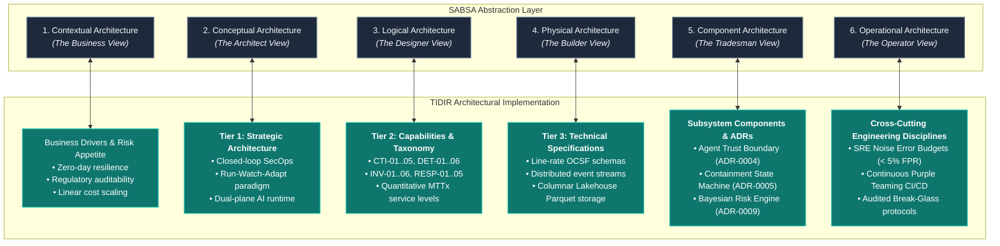
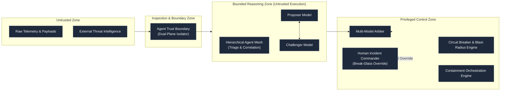

# 0010. Aligning TIDIR with the SABSA Framework and Business Attribute Profiling

* Status: accepted
* Deciders: Architecture Team / Harry
* Date: 2026-09-15

Technical Story: [SABSA Alignment & Business Attribute Profiling]

## Context and Problem Statement

Enterprise Architecture Review Boards (EARBs), chief risk officers, and regulatory compliance authorities require rigorous traceability proving that security technical investments directly satisfy enterprise business requirements and manage articulated operational risks. In contrast, technical security architectures frequently focus exclusively on engineering mechanics—such as event streaming throughput, query performance, and detection rules—without formalising bi-directional traceability to business goals.

Furthermore, as autonomous agentic triage and automated containment become central to modern security operations, traditional governance frameworks struggle to assess automated risk thresholds and trust boundaries.

How should TIDIR bridge the gap between business risk appetite and deep technical engineering, establishing formal, bi-directional traceability without degenerating into bureaucratic shelfware?

## Decision Drivers

* **Enterprise Defensibility & Governance:** Ensuring TIDIR can be evaluated, approved, and audited by enterprise architecture review boards using industry-standard enterprise frameworks (such as TOGAF and SABSA).
* **Business-to-Technology Traceability:** Guaranteeing every technical component, data contract, and protocol choice directly justifies its cost by serving an articulated business driver.
* **Measurable Quality Attributes:** Defining clear, quantitative metrics for non-functional requirements (e.g. timeliness, defensibility, reliability, controllability) that matter to executive leadership.
* **Anti-Bureaucracy / High Engineering Velocity:** Avoiding the anti-pattern of populating exhaustive, static 36-cell matrices that become obsolete and disconnect from running code.

## Considered Options

1. **Adopt a Full 36-Cell SABSA Matrix**: Document every intersection of the six SABSA horizontal abstraction layers against the six Zachman interrogatives (What, Why, How, Who, Where, When).
2. **Pure Engineering Specifications Only**: Reject enterprise architecture frameworks entirely and document only technical contracts (OCSF, Sigma, Kafka, SQL).
3. **Pragmatic SABSA Overlay with Business Attribute Profiling (BAP) (Selected)**: Map the vertical abstraction layers directly to TIDIR's 3-Tier architecture and formalise a quantitative Business Attributes Profile linked to capabilities and ADRs.

## Decision Outcome

Chosen option: **Pragmatic SABSA Overlay with Business Attribute Profiling (BAP)**, because:
* It establishes formal bi-directional vertical traceability from contextual business goals down to component-level data schemas and operational SRE budgets.
* It leverages SABSA's most powerful instrument—the **Business Attributes Profile (BAP)**—to translate engineering metrics (such as MTTD, MTTC, and false positive rates) into executive-level risk language.
* It strictly avoids bureaucratic paralysis by keeping the mapping concise, living, and directly linked to automated verification suites and ADRs.

---

## Architectural Specification: The TIDIR SABSA Overlay

### 1. Vertical Layer Alignment

---

### 2. Business Attributes Profile (BAP) Matrix

The Business Attributes Profile translates executive risk appetite into concrete engineering thresholds and assigns them to specific TIDIR architectural components:

| Business Attribute | Definition & Business Value | Primary Metric & Service Level Target | Supporting TIDIR Capability | Concrete Architectural Mechanism |
| :--- | :--- | :--- | :--- | :--- |
| **Timely** | Threats are detected and contained before adversary objectives or data exfiltration occur. | Streaming MTTD $\lt 5\,\text{s}$ Automated MTTC $\lt 15\,\text{s}$ | `DET-01` `RESP-01` | In-memory stream pattern detection and low-latency containment playbooks ([ADR-0005](/adr/0005-saga-pattern-containment-and-break-glass-protocol)). |
| **Defensible** | Investigation evidence and incident timelines withstand regulatory scrutiny and court proceedings. | Evidence integrity verification: $100\%$ tamper-evident | `INV-04` `CTI-05` | Cryptographically signed evidence lockers, immutable append-only storage, and 30-day historical replay ([ADR-0007](/adr/0007-continuous-automated-purple-teaming-and-multi-model-consensus)). |
| **Controllable** | Automated containment operates with strictly bounded blast radius and human-in-the-loop governance. | Runaway automation incidents: $0$ Break-glass response latency $\lt 5\,\text{m}$ | `RESP-04` `AIGOV-01` | Agent Trust Boundary ([ADR-0004](/adr/0004-defensive-ai-runtime-and-prompt-injection-firewall)), connector circuit breakers, and audited Break-Glass overrides. |
| **Cost-Efficient** | Infrastructure expenditure scales sub-linearly with telemetry volume growth. | Storage cost reduction $\ge 70\%$ vs traditional hot indexing | `DATA-01` `DATA-04` | Decoupled lakehouse architecture routing raw telemetry to low-cost columnar storage (Parquet) and rejecting restrictive log filtering. |
| **Reliable** | Detection engineering maintains low operational friction and prevents analyst burnout. | Alert false-positive rate $\le 5\%$ Error budget burn $\lt 100\%$ | `DET-06` `DET-05` | SRE Alert Noise Error Budgets ([ADR-0008](/adr/0008-secops-error-budgets-and-chaos-security-engineering.md)) and Bayesian multi-signal compounding ([ADR-0009](/adr/0009-bayesian-multi-signal-risk-scoring.md)). |
| **Auditable** | Autonomous agentic reasoning and decision pathways can be independently reconstructed and validated. | Agent grounding fidelity $\ge 95\%$ Prompt regression rate: $0\%$ | `AIGOV-02` `INV-05` | Automated Evals-as-Code CI/CD harness executing against versioned Golden Incident Benchmarks ([ADR-0006](/adr/0006-agent-evaluation-harness-evals-as-code.md)). |

---

### 3. Operational Trust Model for Autonomous Agents

Applying SABSA's operational and logical trust separation, autonomous agents are governed by a multi-tiered trust framework:

1. **Untrusted Zone:** External events, email bodies, HTTP headers, and third-party threat feeds are classified as untrusted data inputs.
2. **Inspection Zone:** The Agent Trust Boundary isolates unformatted text, checks tokens for structural delimiters, and parses raw text into strongly typed schema parameters before model invocation ([ADR-0004](/adr/0004-defensive-ai-runtime-and-prompt-injection-firewall)).
3. **Bounded Reasoning Zone:** Agents operate with read-only query capabilities across the data fabric. Autonomous agents possess zero direct execution credentials for mutating enterprise infrastructure.
4. **Privileged Control Zone:** Response actions are generated as formal containment intent requests. Actions must pass deterministic circuit breakers, automated blast-radius scoring, and dual-model consensus before the containment orchestrator or on-duty commander dispatches mutating API calls ([ADR-0005](/adr/0005-saga-pattern-containment-and-break-glass-protocol)).

---

## Positive Consequences

* **Executive Defensibility:** Provides enterprise architecture review boards (EARBs), CISOs, and risk committees with clear, bi-directional traceability from high-level business goals to technical engineering decisions.
* **Objective Investment Justification:** Non-functional requirements (such as data lakehouse retention or agent trust boundaries) are defended in terms of concrete business attributes (*Cost-Efficient*, *Defensible*, *Controllable*).
* **Clear Autonomous Boundaries:** Solves the AI governance challenge by integrating SABSA trust boundaries with the Agent Trust Boundary and monotonic containment state machines.
* **Audit Readiness:** Directly prepares modern security operations for regulatory audits (such as NIS2, DORA, and ISO/IEC 27001) that mandate documented risk-to-control traceability.

## Negative Consequences

* **Maintenance Overhead:** Any future changes to core capabilities or technical storage tiers must be reviewed against the Business Attributes Profile matrix to maintain traceability.
* **Education Requirement:** Security engineers and detection authors must understand how operational metrics (e.g. SRE noise budgets) map upward into SABSA business attributes.
