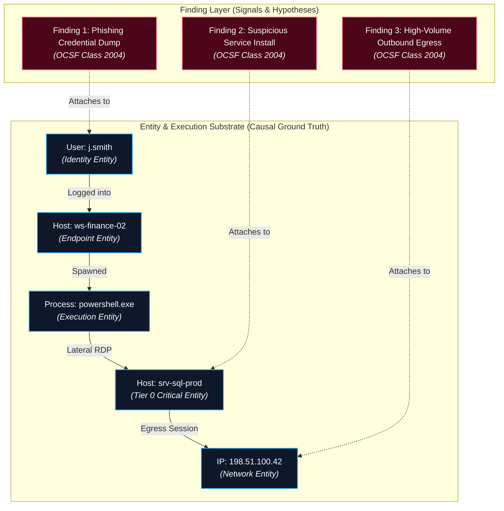

# 0011. Bipartite Entity-Finding Graph Consolidation (Rejecting Alert-to-Alert Graphs)

* Status: accepted
* Deciders: Architecture Team / Harry
* Date: 2026-09-15

Technical Story: [Finding & Alert Consolidation Architecture]

## Context and Problem Statement

Modern enterprise security operations face an overwhelming volume of disparate findings. A single intrusion campaign (e.g. credential harvesting followed by lateral SMB movement, data staging, and external C2 communication) triggers dozens of individual detection rules across hours or days. 

If alerts are presented as isolated tickets, analysts suffer severe cognitive fatigue. Conversely, simple rule-based grouping (e.g. grouping by `host.id` or `user.id` within a 15-minute window) fails to correlate multi-stage attacks that transition across host boundaries, cloud roles, or identity pivots.

To consolidate findings into coherent incident dossiers, should the architecture construct an **Alert-to-Alert Graph** (linking detections directly to other detections) or project findings onto an underlying **Entity-Centred Execution Substrate** (a Bipartite Entity-Finding Graph)?

## Decision Drivers

* **Evidentiary Ground Truth & Causality:** Avoiding synthetic or heuristic relationships; every edge must represent an observable physical or logical interaction.
* **Resilience to Detection Gaps:** Ensuring that if an intermediate adversary action produces no detection alert, the overall campaign chain does not fracture into disconnected islands.
* **Algorithmic Defensibility:** Enabling mathematically grounded clustering (community detection, connected components) that scales cleanly under enterprise telemetry loads.
* **Combinatorial Bounding:** Preventing high-degree entities (e.g. NAT gateways, recursive DNS resolvers) from collapsing unrelated company-wide events into single unmanageable clusters.

## Considered Options

1. **Flat Attribute Grouping**: Group findings by identical static fields (`host.hostname`, `user.name`) within fixed time windows.
2. **Alert-to-Alert Graph (Heuristic Correlation)**: Construct a graph where vertices are alerts, and edges represent inferred relationships based on shared attributes, MITRE ATT&CK stage progression, or statistical co-occurrence.
3. **Bipartite Entity-Finding Graph with Community Detection (Selected)**: Construct a foundational execution graph where vertices are physical/logical entities and edges represent causal telemetry facts. Findings attach as temporal properties/annotations, and incident clusters coalesce via graph reachability.

## Decision Outcome

Chosen option: **Bipartite Entity-Finding Graph with Community Detection**, because:

### 1. Rejection of the Alert-to-Alert Anti-Pattern
Alerts are sparse epiphenomena—secondary observations that occur only when an adversary triggers a specific detection rule. Adversaries spend the vast majority of their dwell time executing actions that generate zero alerts (living off the land, passive reconnaissance, sleep intervals). 

In an Alert-to-Alert graph, missing a single detection breaks the graph into disconnected components. Drawing direct edges between disparate alerts (e.g. connecting a port scan to an account modification two hours later) introduces fragile, subjective heuristics.

### 2. The Entity-Finding Architectural Model
Instead of linking alerts to alerts, the architecture establishes a two-layer bipartite model:
* **The Entity Substrate (Causal Ground Truth):** Vertices represent concrete system entities: `User Account`, `Host / Workstation`, `Process GUID`, `IP Address / Domain`, `Cloud IAM Role`. Edges represent verified OCSF telemetry facts: `SPAWNED`, `AUTHENTICATED_TO`, `CONNECTED_TO`, `WROTE_FILE`.
* **The Finding Layer (Signals & Hypotheses):** When a detection engine emits a finding (OCSF Class 2004 or STIX observable), it does not generate an isolated ticket. It attaches as a temporal property to its corresponding entity vertex.

### 3. Graph Community Detection & Clustering
Incident consolidation operates directly on the entity substrate:
1. **Reachability Across Gaps:** Even if no alert fired during the lateral movement step, the physical process and network edges (`powershell.exe ➔ Lateral RDP ➔ srv-sql-prod`) connect the initial access finding ($F_1$) to the exfiltration finding ($F_3$).
2. **Community Detection Algorithms:** The engine executes connected-component analysis (or Leiden/Louvain community detection) across sliding temporal windows ($\Delta t = 15\text{m} \dots 2\text{h}$). Findings that attach to entities within the same connected cluster are consolidated into a single **Incident Dossier**.
3. **Compound Risk Scoring:** The consolidated dossier is scored using the Bayesian Multi-Signal Risk Lens ([ADR-0009](/adr/0009-bayesian-multi-signal-risk-scoring)), suppressing isolated weak signals while elevating multi-entity campaigns to human triage.

---

## Positive Consequences

* **Robustness Against Detection Gaps:** Multi-stage campaigns remain unified even when intermediate adversary actions evade detection rules.
* **Objective Causality:** All connections reflect verified system telemetry (process lineage, network flows, authentication tokens) rather than synthetic correlation guesses.
* **Analyst Cognitive Relief:** Replaces hundreds of fragmented alert notifications with a unified, graph-anchored incident narrative.
* **Seamless Investigation Handoff:** When a consolidated incident elevates to Layer 4, the autonomous agent mesh immediately inherits the hydrated entity subgraph.

## Negative Consequences

* **Graph Computation Overhead:** Maintaining an in-memory entity graph requires disciplined state management and garbage collection.
* **Supernode Vulnerability:** High-degree infrastructure nodes (DNS resolvers, NAT gateways, deployment service accounts) can bridge unrelated events if not strictly mitigated via **Supernode Centrality Dampening** ([ADR-0003](/adr/0003-graph-supernode-pruning-and-clustering-boundaries)) and **Exponential Edge Weight Decay**.
