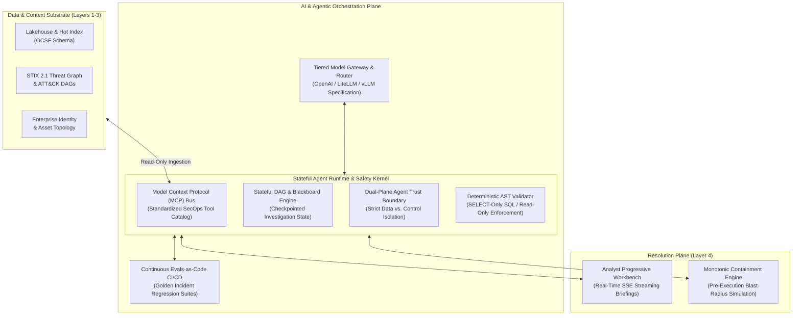

# 0012. AI & Agentic Orchestration Plane: Runtime Architecture, Model Context Protocol (MCP), and MVP Implementation Roadmap

* Status: accepted
* Deciders: Architecture Team / Harry
* Date: 2026-09-15

Technical Story: [AI & Agentic Orchestration Architecture]

## Context and Problem Statement

As Artificial Intelligence transitions from isolated natural language interfaces into autonomous agentic systems capable of querying lakehouses, correlating multi-hop attack graphs, and dispatching containment playbooks, enterprise Security Operations Centers (SOCs) face a critical architectural challenge:

**How do we integrate autonomous AI reasoning across security operations without creating brittle, unmaintainable prompt scaffolding, introducing devastating prompt injection vulnerabilities, or causing operational outages through uncalibrated actions?**

TIDIR requires an architectural standard that governs how AI models interact with enterprise security data, how multi-agent teams coordinate complex investigations, and how organizations navigate a realistic, risk-managed evolution from initial copilot pilots to autonomous closed-loop defense.

## Decision Drivers

* **The Utility Imperative:** Demanding measurable operational impact (compressing MTTI from 45m to <2m, reducing analyst tool pivots by 75%) with clear Day-2 operationalization pathways.
* **The Trust & Verification Boundary:** Reducing unsupported recommendations via evidence grounding, rigorous testing modalities (golden datasets, deterministic firewalls, LLM-as-a-judge, shadow execution), and cryptographic auditability (RFC 3161).
* **Cost & Economic Sustainability:** Balancing usage vs. consumption and subscription models via a hybrid offload strategy (Tier 0 local SLMs absorbing 70%+ of volume at $0.00 marginal cloud cost).
* **Protocol Standardization:** Decoupling agent tools and forensic capabilities from proprietary model APIs using the Model Context Protocol (MCP).
* **Incremental Risk Realization:** Establishing a 3-phase MVP-to-maturity roadmap with strict verification gates at each milestone.

## Considered Options

1. **Monolithic Vendor-Embedded Copilots:** Rely exclusively on proprietary SIEM/XDR embedded assistants.
2. **Ad-Hoc Scripted Point Prompts:** Write custom Python/TypeScript scripts wrapping LLM APIs with hardcoded prompt strings and bespoke tool wrappers.
3. **Dedicated AI Orchestration Plane with MCP, Tiered Routing, and the Utility-Trust-Cost Governance Triad (Selected):** Establish an open, vendor-neutral orchestration runtime utilizing MCP for tool contracts, tiered model gateways, stateful DAG/blackboard runtimes, and continuous evaluation across the Utility-Trust-Cost triad.

## Decision Outcome

Chosen option: **Dedicated AI Orchestration Plane with MCP and Tiered Routing**, organized around the following architectural foundations:

---

### 1. Architectural Topology: The AI Orchestration Plane

The AI Orchestration Plane sits horizontally between the foundational Data & Context Fabric (Layers 1–3) and the Human Resolution Workbench (Layer 4):

---

### 2. Core Operational Pillars

#### A. Model Context Protocol (MCP) as the Universal SecOps Tool Interface
Rather than developing proprietary tool calling bindings for every new LLM release, all TIDIR analysis capabilities are packaged as **MCP Servers**:
- `mcp-lakehouse-query`: Exposes parameterized analytical queries against Layer 2 lakehouse tables.
- `mcp-process-lineage`: Traverses process creation trees and parent-child GUID hops.
- `mcp-threat-graph`: Resolves entity relationships and ATT&CK tactic mappings in Layer 3.
- `mcp-blast-radius`: Queries CMDB and network session state to simulate containment blast radius.

Every tool parameter is strictly defined via JSON Schema. Agents never execute arbitrary shell commands or raw string concatenation.

#### B. Tiered Inference Routing (Tier 0 SLM vs. Tier 1/2 Frontier)
To optimize compute economics and latency, the Gateway routes prompts dynamically based on task classification:
- **Tier 0 (Local Small Language Models / Edge):** High-throughput, low-latency tasks (< 200ms) running on local enterprise hardware (e.g. 8B–14B parameter models like Qwen 2.5 or Llama 3.1). Handles log classification, raw JSON parsing, regex drafting, and PII anonymization. Zero external API cost and zero customer data egress.
- **Tier 1 (High-Velocity Cloud Models):** Mid-tier conversational and query generation models. Handles natural language to OCSF SQL translation, single-turn threat advisory summarization, and triage dossier drafting.
- **Tier 2 (Cloud Frontier Reasoning Models):** Multi-hop reasoning models with extended thinking capabilities. Reserved for lead orchestrator planning, novel adversary campaign correlation across disparate entity graphs, and root-cause hypothesis debate.

#### C. Deterministic Safety Kernel & OWASP API Security Compliance
- **Agent Trust Boundary (Dual-Plane Isolation):** Treats all telemetry payloads, email bodies, file paths, and external CTI as untrusted data planes. Instructions come exclusively from versioned, cryptographically hashed control prompts. Prompt injection is assumed possible; the architecture prevents successful injection from becoming unauthorized authority.
- **Deterministic AST Validator:** Every SQL or streaming query synthesized by an LLM is parsed into an Abstract Syntax Tree (AST) before database execution. Any query containing mutating keywords (`DROP`, `DELETE`, `UPDATE`, `INSERT`, `ALTER`) or missing mandatory partition bounds is rejected deterministically.
- **OWASP API Security Top 10 (2023) Compliance for MCP:** MCP tool interfaces enforce strict typed schemas (Zod/Pydantic) countering `API1:2023` (Broken Object Level Authorization) via tenant-scoped SVIDs, `API2:2023` (Broken Authentication) via mTLS attestation, and `API4:2023` (Unrestricted Resource Consumption) via deterministic hop and cost circuit breakers ([ADR-0015](/adr/0015-sandboxed-agent-execution-otlp-convergence-and-ephemeral-identity)).

---

### 3. The AI Evaluation Triad: Utility, Trust & Cost

Every AI opportunity introduced into TIDIR must be justified and governed across three interdependent axes:

1. **Trust & Verification Modalities**:
   - *Golden Benchmark Datasets*: Deterministic CI/CD regression tests gating prompt updates.
   - *Deterministic Guardrails*: Dual-plane firewalls and AST validators providing 100% mathematical syntax safety.
   - *Multi-Model Consensus (LLM-as-a-Judge)*: Automated semantic grading of grounding fidelity ($\ge 95\%$).
   - *Statistical Sampling*: Asynchronous shadow mode evaluation against 5–10% of live telemetry.
   - *Cryptographic Auditability*: RFC 3161 timestamps logging prompt versions, tool inputs, and model outputs.
2. **Utility & Operational Metrics**:
   - Target SLAs: Triage comprehension < 60s, investigation scoping < 2 min, first-time query syntax accuracy $\ge 98\%$.
   - Progressive rollout: Shadow mode ➔ Copilot / Assisted ➔ Supervised Mesh ➔ Autonomous Tier 1.
3. **Cost Economics & Hybrid Offload**:
   - Combining fixed compute (Tier 0 local SLMs absorbing 70–80% of volume) with elastic cloud burst (Tier 1/2).
   - Hard token ceilings ($2.50 per investigation limit) preventing runaways during incident floods.

---

### 4. The 3-Phase MVP Implementation Roadmap (Crawl ➔ Walk ➔ Run)

To guarantee immediate operational return on investment without exposing enterprise infrastructure to catastrophic autonomous failures, TIDIR mandates a phased progression:

| Evolution Phase | Primary Objective | Architecture & Capabilities | Safety Gates & Verification |
| :--- | :--- | :--- | :--- |
| **Phase 1: MVP (Assisted Copilot)** *(Crawl: Weeks 1–8)* | **Analyst Investigation Acceleration** | • Natural Language to OCSF SQL query synthesis. • Automated CTI bulletin summarization & ATT&CK DAG extraction. • Standardized Incident Briefing Dossier generation. • Single-agent execution with stateless tool calls. | • 100% Read-Only execution. • Deterministic AST query validator. • 100% human-in-the-loop review. • Golden benchmark suite for query syntax validity ($\ge 98\%$). |
| **Phase 2: Supervised Agent Mesh** *(Walk: Months 3–6)* | **Fatigue Elimination & Deep Correlation** | • Lead Triage Orchestrator coordinates specialized subagents (Host, Identity, Network). • Stateful incident blackboard with durable execution checkpoints. • Automated pre-execution blast-radius simulation. • Streaming SSE updates to progressive analyst workbench. | • Agent Trust Boundary (Dual-Plane Isolator) active. • Continuous CI/CD Evals-as-Code gating model/prompt pull requests. • Human authorization mandatory for all containment actions. • Grounding fidelity $\ge 95\%$ on golden incident sets. |
| **Phase 3: Autonomous Closed-Loop** *(Run: Months 6+)* | **Sub-Minute Mitigation & Continuous Hardening** | • Autonomous execution of Tier 1 containment playbooks via monotonic state machine. • Automated continuous purple teaming & multi-model consensus. • Closed-loop attribution feedback refining Layer 3 detection models. | • Dual-authorization multi-signature consensus on all Tier 2 actions. • Audited cryptographic Break-Glass emergency protocol. • Continuous SecOps error budget tracking. |

---

## Consequences

### Positive Consequences
* **Vendor Neutrality:** Standardizing on MCP and an OpenAI-compatible Gateway allows hot-swapping underlying LLMs (open weights vs. commercial frontier) without rewriting security tools.
* **Elimination of Data Mutation Risks:** The AST validator provides mathematical certainty that generative query tools cannot inadvertently truncate or corrupt forensic telemetry.
* **Economic Sustainability:** Tiered routing offloads over 70% of repetitive inference volume to low-cost local SLMs, shielding security budgets from runaway token consumption.
* **Clear Executive Value Pathway:** The 3-phase roadmap provides CISOs and SecOps leads with measurable KPIs and exit criteria before granting autonomous execution authority.

### Negative Consequences
* **Operational Complexity:** Operating an inference gateway and local SLM inference infrastructure requires specialized platform engineering expertise.
* **Tool Schema Maintenance:** Changes to underlying lakehouse schemas or CMDB endpoints require synchronized updates and backward-compatibility validation in MCP server definitions.
