# 0013. Ambient Deception Fabric: Honeytoken Anchors for Bayesian Detection and Autonomous Containment

* Status: accepted
* Deciders: Architecture Team / Harry
* Date: 2026-09-15

Technical Story: [Deception & Canary Architecture]

## Context and Problem Statement

A central failure mode of enterprise detection engineering is the **Base Rate Fallacy**: in an environment processing billions of benign events daily, even detection rules with high statistical specificity (e.g. 99.9%) inevitably generate overwhelming volumes of false-positive alerts. Furthermore, fear of false positives cripples response automation; security leadership hesitates to authorize autonomous host isolation or session revocation when an alert might stem from a legitimate administrative script or developer utility.

Traditional deception solutions attempted to solve this by deploying complex, high-maintenance honeynet subnets or dedicated virtual appliances. These systems suffer from heavy operational overhead, distinct network footprints easily fingerprinted and bypassed by sophisticated adversaries, and poor integration into mainstream SecOps pipelines.

How should cyber deception factor into the TIDIR reference architecture to provide mathematical certainty without introducing heavy infrastructure sprawl?

## Decision Drivers

* **Mathematical Precision over Volumetric Guessing:** Injecting observables into the detection fabric whose empirical benign base rate is virtually zero ($P(\text{Benign} \mid \text{Trigger}) \to 0$).
* **Frictionless Autonomous Response:** Establishing an unambiguous trigger class that licenses instantaneous Tier 1 containment without human hesitation.
* **Minimal Infrastructure Footprint:** Avoiding heavy, easily fingerprinted honeynet servers in favor of ambient, lightweight canaries embedded directly within production endpoints and cloud environments.
* **Canonical Schema Compatibility:** Ensuring all deception telemetry adheres strictly to Open Cybersecurity Schema Framework (OCSF) conventions.

## Considered Options

1. **Heavyweight Virtual Honeynets:** Deploy dedicated subnets of decoy Windows/Linux servers and synthetic IoT devices.
2. **Proprietary Deception Point Platform:** Integrate a third-party commercial deception appliance operating as a disconnected console.
3. **Ambient Deception Fabric & Canary Anchors (Selected):** Embed lightweight, ubiquitous canary tokens, decoy SPNs, and filesystem lures across standard production infrastructure, tagging events directly into the OCSF ingestion stream (`metadata.is_canary: true`).

## Decision Outcome

Chosen option: **Ambient Deception Fabric & Canary Anchors**, organized around three architectural integrations:

---

### 1. Ingestion & Surface Model (Layer 1 & Layer 2)

Rather than maintaining dedicated honeypot servers, TIDIR injects ambient deception primitives directly into production workflows:

```mermaid
flowchart LR
  classDef decoy fill:#1e1b4b,stroke:#818cf8,stroke-width:2px,color:#f8fafc;
  classDef ocsf fill:#0f172a,stroke:#38bdf8,stroke-width:1.5px,color:#f8fafc;
  classDef action fill:#064e3b,stroke:#34d399,stroke-width:2px,color:#f8fafc;

  subgraph DECOYS ["Ambient Deception Primitives (Layer 1)"]
    D1["<b>Cloud Honeytokens</b><br>Decoy AWS/Azure keys in fake configs"]:::decoy
    D2["<b>Filesystem Canaries</b><br>Decoy files in shares (ransomware bait)"]:::decoy
    D3["<b>Active Directory Lures</b><br>Bogus SPNs & unconstrained Kerberos users"]:::decoy
    D4["<b>Memory Injections</b><br>Decoy passwords in LSASS memory"]:::decoy
  end

  subgraph PIPELINE ["Telemetry Normalization (Layer 2)"]
    OCSF["<b>OCSF Canonical Mapping</b><br>Tagged with metadata.is_canary: true"]:::ocsf
    HOT["<b>Priority Hot Index Lane</b><br>Zero downsampling • Immediate dispatch"]:::ocsf
  end

  subgraph RESOLUTION ["Decisive Operational Impact (Layers 3 & 4)"]
    BAYES["<b>Bayesian Anchor Vertex</b><br>P(Malicious) = 1.0 • Immediate Graph Promotion"]:::action
    CONTAIN["<b>Instantaneous Tier 1 Containment</b><br>Automated host isolation & token kill"]:::action
  end

  DECOYS -->|Emits Interaction| OCSF
  OCSF --> HOT
  HOT --> BAYES
  BAYES --> CONTAIN
```

* **Cloud & Secret Honeytokens:** Non-operational AWS/Azure IAM access keys committed to mock configuration files (`~/.aws/credentials`) or developer wiki pages. Any API call using these keys is instantaneously malicious.
* **Filesystem Canaries:** Monitored document bait (`annual_financial_report_draft.xlsx`) placed in enterprise file shares; serves as an immediate sub-second tripwire for bulk ransomware encryption routines.
* **Active Directory Decoys:** High-privilege domain user accounts configured with Service Principal Names (SPNs) but no legitimate operational purpose. Any Kerberos TGS request for these accounts indicates active Kerberoasting.
* **LSASS Memory Lures:** Bogus plaintext passwords injected into local memory by security daemons, designed to detonate when Mimikatz or credential-dumping tools scrape process memory.

---

### 2. Bayesian Anchor in Layer 3 Detection

In the Layer 3 Risk Lens (ADR 0009) and Bipartite Entity-Finding Graph (ADR 0011):
- **Base Rate Elimination:** Because legitimate business processes never access canary assets, the prior probability of malicious intent is absolute ($P(\text{Malicious} \mid \text{Canary Event}) \ge 0.999$).
- **Graph Clustering Anchor:** When a canary event fires, it anchors the graph. Graph traversal algorithms immediately walk backward along causal edges (`SPAWNED_BY`, `LOGGED_IN_FROM`, `NETWORK_CONNECTION`) to pinpoint the adversary's true entry vector and compromised host with zero noise.

---

### 3. Unlocking Autonomous Tier 1 Containment with Crown-Jewel Anti-Inversion Safeguards

The operational bottleneck to automated response is the fear of isolating a legitimate production server. Canary triggers eliminate this ambiguity, but introduce an acute adversarial hazard: **Canary Inversion Attacks**, where adversaries deliberately plant or induce canaries via core servers to trigger automated self-DoS.

- **Zero-Hesitation Autonomous Containment (Standard Workloads):** Interaction with a high-fidelity canary immediately licenses automated Tier 1 containment playbooks (host network isolation, credential revocation, firewall IP blocking) for standard endpoints and non-critical workloads.
- **The Crown-Jewel Canary Exemption Matrix (Anti-Inversion Filter):** 
  - If the entity interacting with a canary primitive carries a **Critical Asset Tier** (Tier 0 infrastructure in CMDB/posture: Domain Controllers, identity federation servers, root certificate authorities, production database clusters, or core Kubernetes control planes), **zero-hesitation autonomous isolation is strictly prohibited**.
  - Instead, the event is routed to an **Immediate Escalation Lane** that triggers an instantaneous high-priority page to the on-duty Incident Commander with a mandatory $\lt 60$-second confirmation SLA. The system executes a non-destructive session freeze rather than hard network decapitation.
- **Adversary Entanglement:** For sophisticated multi-stage intrusions, the orchestrator can transparently redirect the adversary's network sessions into a sandboxed deception environment, allowing AI agent harnesses to observe tradecraft, log novel TTPs, and extract CTI in real time.

---

### 4. MITRE ENGAGE & D3FEND Framework Alignment

TIDIR's Ambient Deception Fabric aligns directly with [MITRE ENGAGE](https://engage.mitre.org/) for active cyber defense and [MITRE D3FEND](https://d3fend.mitre.org/):

| MITRE ENGAGE Strategic Goal | Tactical Engagement Activity | MITRE D3FEND Countermeasure | TIDIR Implementation Primitive |
| :--- | :--- | :--- | :--- |
| **Expose (`EAC-1`)** | Lures & Canary Files | [`d3f:DecoyFile`](https://d3fend.mitre.org/technique/d3f:DecoyFile/) | Filesystem lures (`draft_financials.xlsx`) in file shares acting as anti-ransomware tripwires. |
| **Affect (`EAC-2`)** | Honeytokens & Fake Accounts | [`d3f:DecoyUserCredential`](https://d3fend.mitre.org/technique/d3f:DecoyUserCredential/) | Canary AWS/Azure access keys and bogus Active Directory SPNs that trigger immediate containment. |
| **Elicit (`EAC-3`)** | Interactive Decoy Environments | [`d3f:DecoyEnvironment`](https://d3fend.mitre.org/technique/d3f:DecoyEnvironment/) | Transparent session redirection to sandboxed microVMs logging adversary lateral movement toolchains. |
| **Understand (`EAC-4`)** | Forensic Correlation | [`d3f:UserBehaviorAnalysis`](https://d3fend.mitre.org/technique/d3f:UserBehaviorAnalysis/) | Correlation of decoy interactions into the Incident Decision DAG with zero benign operational noise. |

---

## Consequences

### Positive Consequences
* **Extreme Signal-to-Noise Ratio:** Zero false-positive noise in production queues; every canary alert represents an authentic security incident or policy violation.
* **High ROI on Response Automation:** Enables true sub-15-second Mean Time to Contain (MTTC) by removing human authorization gates on verified canary hits.
* **Zero Disruption to Business Infrastructure:** Ambient decoys require negligible storage and compute overhead compared to legacy honeynets.

### Negative Consequences
* **Canary Maintenance & Rotation:** Honeytokens and canary credentials must be audited and rotated periodically to prevent accidental leakage into public datasets.
* **Whitelisting Internal Scanners:** Authorized internal security scanning tools (e.g. vulnerability scanners) must be carefully accounted for to prevent inadvertent containment triggers during scheduled scans.
