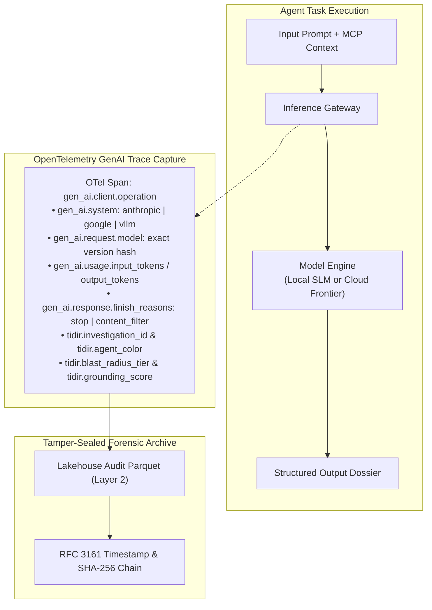

# 0014. AI Observability, Continuous Self-Learning Loops, and SLM-Powered Judges

* Status: accepted
* Deciders: Architecture Team / Harry
* Date: 2026-09-15

Technical Story: [AI Observability & Continuous Improvement]

## Context and Problem Statement

As autonomous AI agents, specialist meshes, and natural language query synthesizers assume critical responsibilities across the TIDIR platform, two acute architectural challenges emerge:

1. **The AI Observability & Auditability Deficit**: High-stakes triage verdicts and automated containment proposals cannot exist as opaque, non-reproducible black boxes. Regulatory standards (EU AI Act, SOC 2, ISO 27001) and incident post-mortems require unambiguous traceability: Which exact model checkpoint generated the hypothesis? Which prompt context was supplied? Did safety filters trip? What was the precise token cost? Without deterministic, standardized trace logging, AI-led incident response lacks defensibility.
2. **Evaluation Scalability & Cold-Model Obsolescence**: Relying solely on commercial frontier models for continuous evaluation (LLM-as-a-Judge) introduces crippling token costs, external API rate limits, and latency bottlenecks when evaluating high-volume triage streams. Simultaneously, static prompts and unadapted models suffer from domain drift as enterprise TTPs and telemetry distributions evolve.

How does TIDIR provide comprehensive, forensic-grade AI trace observability, cost-effective line-rate evaluation, and systematic self-learning without compromising data sovereignty?

## Decision Drivers

* **Cryptographic & Regulatory Defensibility:** Full forensic traceability down to exact model versions, raw prompt contexts, and tool execution traces.
* **Line-Rate Local Evaluation:** Sub-100ms output verification with $0.00 incremental cloud API cost.
* **Continuous Self-Improvement:** Closed-loop harvesting of human-ratified incident resolutions into few-shot libraries and local fine-tuning sets.
* **Standardized Observability:** Universal alignment with vendor-neutral telemetry specifications (OpenTelemetry GenAI conventions).

## Considered Options

1. **Ad-Hoc Custom Logging & Cloud-Only Judges:** Log prompt strings into application debug files and invoke cloud frontier models for all evaluation tasks.
2. **Vendor-Locked Observability SaaS:** Adopt a closed proprietary AI evaluation and monitoring platform.
3. **OpenTelemetry GenAI Tracing, Two-Tier SLM Judges, and Sovereign Self-Learning Loops (Selected):** Implement standardized OpenTelemetry GenAI semantic spans, local on-prem Small Language Model (SLM) judges with frontier escalation, and automated ground-truth harvesting loops.

## Decision Outcome

Chosen option: **OpenTelemetry GenAI Tracing, Two-Tier SLM Judges, and Sovereign Self-Learning Loops**, structured across three architectural pillars:

---

### 1. OpenTelemetry GenAI Observability & Trace Auditing

All AI interactions across the AI Orchestration Plane emit standardized OpenTelemetry distributed tracing spans conforming to the **OpenTelemetry GenAI Semantic Conventions**:

- **Trace Attributes**: Every span records model checkpoint hashes, temperature parameters, input/output token counts, completion finish reasons, and custom TIDIR metadata (`tidir.investigation_id`, `tidir.agent_color`, `tidir.grounding_score`).
- **Cryptographic Sealing**: Prompts and completions for all automated containment proposals are committed to the Layer 2 Security Lakehouse and sealed with RFC 3161 timestamps and SHA-256 hash chains, guaranteeing non-repudiation.

---

### 2. Two-Tier Model-as-a-Judge (Local SLM + Frontier Escalation)

Rather than routing every evaluation task to expensive cloud frontier APIs, TIDIR deploys a **tiered evaluation funnel**:

1. **Tier 0 Local SLM Judges (Line-Rate Guardrails)**:
   - Compact open-weight models (e.g. Microsoft Phi-4 14B, Google Gemma 3 4B/12B, Qwen 2.5 3B/7B) run on local inference runtimes (vLLM/Triton).
   - Evaluates line-rate output syntax, OCSF schema compliance, entity reference extraction, and citation presence in under 100ms with zero cloud egress cost.
2. **Tier 2 Frontier Model Escalation (Adversarial Arbitration)**:
   - When the local SLM judge detects semantic ambiguity (confidence 70–85%) or when an incident involves Tier 1/2 containment, the evaluation escalates to cloud frontier models for adversarial multi-model consensus (Proposer vs. Challenger).
3. **Periodic Calibration Loops**:
   - Golden benchmark suites continuously test alignment between the local SLM judge and cloud frontier verdicts. Disagreement $\gt 8\%$ automatically schedules an SLM realignment fine-tuning run.

---

### 3. Closed-Loop Self-Learning & Continuous Improvement

TIDIR establishes automated feedback loops connecting operational incident outcomes back into platform intelligence:

1. **Resolved Incident Ground-Truth Harvesting**: Verified incidents ratified by human analysts are automatically indexed into the **Resolved Incident Knowledge Base** as structured problem-solution pairs.
2. **Dynamic Few-Shot Exemplar Injection**: During active triage, the AI Gateway semantically retrieves the top 2–3 most relevant historical incident resolutions and injects them as few-shot exemplars into specialist agent prompts.
3. **Quarterly Sovereign SLM Fine-Tuning**: On-premises triage and judging models undergo parameter-efficient fine-tuning (LoRA/QLoRA) on the internal incident corpus, enhancing domain accuracy without data leakage.
4. **Detection Effectiveness Feedback**: True-positive rates from resolved cases dynamically calibrate Layer 3 Detection Opportunity scores, while false positives trigger Green Agent noise-budget tuning pull requests.
5. **Statistical Drift Circuit Breakers**: A $\gt 2\sigma$ performance degradation over a rolling 7-day window triggers engineering alerts and temporarily reverts agents to supervised copilot mode.

---

## Pros and Cons of the Options

### Option 1: Ad-Hoc Custom Logging & Cloud-Only Judges

* Good, because it requires minimal upfront engineering and leverages out-of-the-box cloud APIs.
* Bad, because cloud token costs scale unsustainably with event volume ($2\times$–$3\times$ multiplier).
* Bad, because non-standard logging formats prevent unified observability across SIEM/SOAR/Lakehouse boundaries.
* Bad, because external cloud dependencies break under network partitions or WAN isolation.

### Option 2: Vendor-Locked Observability SaaS

* Good, because turnkey SaaS platforms provide polished out-of-the-box dashboards and eval tracking.
* Bad, because sensitive security telemetry and proprietary incident details must egress to third-party SaaS vendors.
* Bad, because closed proprietary metrics cannot easily integrate into GitOps Detection-as-Code pipelines.

### Option 3: OpenTelemetry GenAI Tracing, Two-Tier SLM Judges, and Sovereign Self-Learning Loops (Selected)

* Good, because OpenTelemetry GenAI semantic conventions guarantee vendor-neutral, future-proof trace compatibility.
* Good, because local SLM judges absorb 70–80% of evaluation workloads at $0.00 marginal API cost and sub-100ms latency.
* Good, because closed-loop harvesting ensures the AI system systematically learns and adapts from operational outcomes.
* Good, because cryptographic sealing satisfies strict regulatory compliance and forensic auditability standards.
* Bad, because hosting local SLM judges requires dedicated GPU infrastructure within the enterprise perimeter.
* Bad, because managing fine-tuning pipelines and drift monitors introduces operational maintenance overhead for the SecOps engineering team.

---

## Consequences

### Positive Consequences

* Delivers complete, legally defensible auditability for all AI-led security operations.
* Slashes continuous evaluation costs by up to 80% through local SLM judge offload.
* Enables autonomous adaptation to enterprise-specific TTPs via closed-loop ground-truth harvesting.
* Operates resiliently under air-gapped or WAN-severed disaster recovery conditions.

### Negative Consequences

* Requires provisioning and monitoring dedicated local GPU nodes for the Tier 0 SLM cluster.
* Demands governance discipline to prevent contaminated or malicious incident resolutions from entering the few-shot knowledge base (mitigated by mandatory human analyst sign-off before harvesting).

### Scientific & Literature Grounding

* **Adversarial Machine Learning & Data Poisoning**: [Carlini et al. (2023)](https://doi.org/10.48550/arXiv.2304.14897), *Poisoning Language Models During Pre-training*; [FND-18](/architecture/foundational-research#fnd-18).
* **Autonomous Pipeline Integrity & Verification**: [Anthropic (2026)](/architecture/foundational-research#fnd-17), *Claude Mythos System Card & Project Glasswing*; [FND-17](/architecture/foundational-research#fnd-17).
* **Empirical Grounding in Autonomous Reasoning**: [UK AI Security Institute [AISI] (2026)](/architecture/foundational-research#fnd-17), *Empirical Evaluations of Frontier Autonomous Cyber Capabilities*; [FND-17](/architecture/foundational-research#fnd-17).
