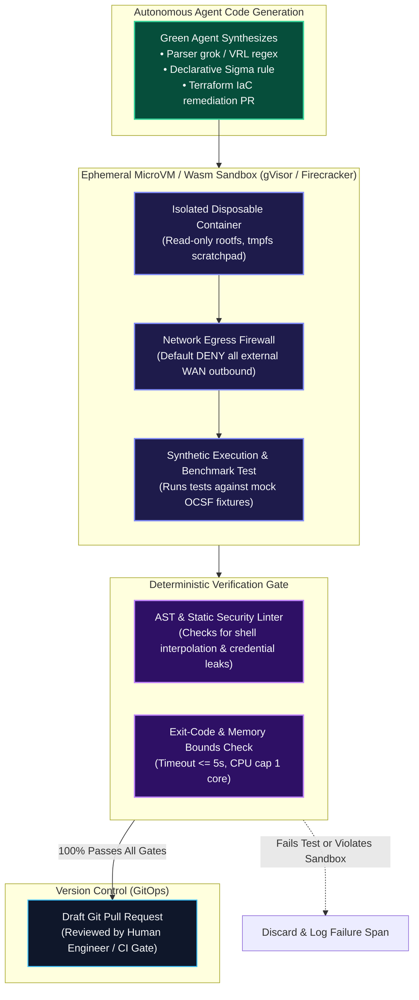
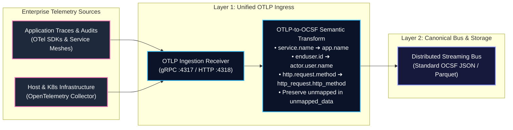

# 0015. Sandboxed Agent Execution, OpenTelemetry (OTLP) Ingress Convergence, and Ephemeral Identity Anchoring

* Status: accepted
* Deciders: Architecture Team / Harry
* Date: 2026-09-16

Technical Story: [Securing Agent Execution, Modern Ingress Convergence & Container Graph Integrity]

## Context and Problem Statement

Modern security operations architectures face three critical frontiers driven by rapid advancements in autonomous AI agents and cloud-native infrastructure:

1. **The "Vibe Coding" & Uncontrolled Agent Execution Risk**: Autonomous self-healing agents (such as Green Agents synthesizing Detection-as-Code rules, grok parsing regexes, or Terraform IaC remediations) cannot run or test generated code directly on the host or inside production clusters. If an agent ingests poisoned threat intelligence or manipulated telemetry, an indirect prompt injection or hallucination could cause it to execute malicious shellcode, exfiltrate credentials, or break infrastructure.
2. **Telemetry Ingress Fragmentation (OTel vs. OCSF)**: OpenTelemetry (OTel) has rapidly expanded beyond application performance monitoring to become an enterprise telemetry standard through the OTel Security SIG. Enterprises stream vast quantities of audit, runtime, and network data using the OpenTelemetry Protocol (OTLP). Forcing separate pipelines for APM and security creates redundant collector infrastructure and operational overhead.
3. **Graph Pollution from Cloud-Native Ephemerality**: In Kubernetes and serverless architectures, short-lived containers, dynamic IP allocations, and ephemeral pods churn thousands of times per hour. If the Bipartite Entity-Finding Graph ([ADR-0011](/adr/0011-bipartite-entity-finding-graph-consolidation)) anchors vertices to volatile IP addresses or ephemeral hostnames, the graph suffers combinatorial explosion and false identity collisions across tenants.

How does TIDIR provide secure, isolated execution environments for autonomous coding agents, converge standard OpenTelemetry (OTLP) pipelines into OCSF, and anchor cloud-native entities to immutable cryptographic identities?

## Decision Drivers

* **Execution Containment & Zero-Trust Agent Sandboxing:** Ensuring that autonomous agent scripts, parsers, and code fixes execute within mathematically bounded, hardware-isolated sandboxes with zero host access and default-deny network egress.
* **Unified Telemetry Ingress:** Ingesting native OpenTelemetry Protocol (OTLP over gRPC/HTTP) streams seamlessly alongside syslog and eBPF, mapping OTel semantic attributes directly into OCSF classes at the collector edge.
* **Cryptographic Identity Grounding:** Eliminating graph fragmentation and attribution collisions caused by ephemeral IP recycling in containerized environments.
* **Performance & Low Latency:** Sub-millisecond schema mapping at ingress and sub-second container sandbox spin-up.

## Considered Options

1. **Ad-Hoc Host Script Execution & Ephemeral IP Heuristics:** Allow agents to run test scripts inside local Docker containers on the host machine; map OTel separately into proprietary tables; correlate container IP addresses using time-windowed ARP/DHCP lookups.
2. **MicroVM/WASM Sandboxing, Native OTLP-to-OCSF Edge Translation, and SPIFFE/OIDC Identity Anchoring (Selected):** Mandate hardware-isolated microVMs (e.g. gVisor / Firecracker) or WebAssembly (Wasm) runtimes for all agent-generated code; establish native OTLP receivers in Layer 1 with declarative OCSF mapping; anchor cloud-native entity vertices to cryptographic SPIFFE IDs, OIDC tokens, and Kubernetes Pod UIDs.

## Decision Outcome

Chosen option: **MicroVM/WASM Sandboxing, Native OTLP-to-OCSF Edge Translation, and SPIFFE/OIDC Identity Anchoring**, implemented across three core architectural components:

---

### 1. Sandboxed Subprocess Execution Plane for Autonomous Agents

All autonomous code generation, script evaluation, and rule testing executed by **Green Self-Healing Agents** or **Red Emulation Agents** run inside ephemeral, strictly isolated sandboxes:

1. **Hardware-Isolated Ephemeral Sandboxes**:
   - Agent code execution takes place within lightweight microVMs (Firecracker) or kernel-isolated runtimes (gVisor `runsc`) with an ephemeral lifespan capped at 60 seconds.
   - Root filesystems are strictly read-only; mutations occur only on an in-memory `tmpfs` scratchpad that is zeroed immediately upon container termination.
2. **Default-Deny Network Egress**:
   - Sandboxes operate with zero external WAN connectivity. Any attempt by generated code or tool scripts to initiate outbound network sockets (e.g. attempting to reach an external C2 or webhook) throws an immediate security fault, terminating the process and alerting the SOC.
3. **Resource & Compute Ceilings**:
   - Strict Linux cgroup constraints cap sandbox compute: max 1 vCPU, 512MB RAM, and execution timeout $\le 5$ seconds.
4. **Zero Production Mutation**:
   - Agents never commit directly to production configurations or execute un-sandboxed shell commands on host nodes. Output is strictly formatted as a Git Pull Request containing the code artifact and the deterministic sandbox execution receipt.

---

### 2. OpenTelemetry (OTLP) Ingress Convergence & Line-Rate OCSF Mapping

Layer 1 and Layer 2 natively accept standard **OpenTelemetry Protocol (OTLP/gRPC and OTLP/HTTP)** telemetry alongside OS logs and kernel hooks:

1. **Native OTLP Collectors**:
   - Layer 1 exposes standardized OTLP endpoints (`:4317` gRPC and `:4318` HTTP) accepting Protobuf and JSON event payloads.
2. **Deterministic OTLP-to-OCSF Semantic Transpiler**:
   - Translates OpenTelemetry Resource, Scope, and Attribute conventions directly into OCSF classes at line rate:
     - `db.system`, `db.statement` $\to$ OCSF Database Activity (Class 1003).
     - `http.route`, `http.response.status_code` $\to$ OCSF HTTP Activity (Class 4002).
     - `net.peer.name`, `net.sock.peer.addr` $\to$ OCSF Network Activity (Class 4001).
   - Any proprietary OpenTelemetry span or log attribute lacking a direct canonical OCSF field mapping is preserved inside `unmapped_data`, honoring ADR-0002.

---

### 3. Ephemeral Workload Identity Anchoring (SPIFFE / OIDC / Pod UID)

To prevent container churn and dynamic IP recycling from destabilizing the Bipartite Entity-Finding Graph ([ADR-0011](/adr/0011-bipartite-entity-finding-graph-consolidation)):

1. **Cryptographic Identity as the Primary Vertex Pivot**:
   - In containerized and cloud-native environments, vertices in the Entity Substrate ($V_E$) are anchored to **immutable cryptographic workload identities** rather than transient network addresses:
     - **Kubernetes**: `k8s.pod.uid` and `k8s.namespace` + `k8s.service_account.name`.
     - **Service Mesh / Zero Trust**: Standard SPIFFE ID (e.g. `spiffe://cluster.local/ns/prod/sa/payment-service`).
     - **Cloud Workloads**: Cloud provider IAM Role ARN and Instance ID.
2. **Dynamic IP-to-Workload Temporal Binding**:
   - IP addresses and network socket edges are treated as child properties of the workload identity bounded by explicit start and end timestamps ($\left[t_{\text{bound}}, t_{\text{released}}\right]$).
   - When a container terminates and its IP is reassigned to another pod 30 seconds later, the graph correlation engine splits the entity scope based on the container lifecycle events, preventing cross-tenant cluster fusion.

---

## Pros and Cons of the Options

### Option 1: Ad-Hoc Host Script Execution & Ephemeral IP Heuristics

* Good, because it requires no specialized microVM sandboxes or SPIFFE infrastructure.
* Bad, because autonomous agent execution on host runtimes creates catastrophic remote code execution and lateral movement vulnerabilities if prompts are injected.
* Bad, because ephemeral IP recycling causes frequent false-positive entity mergers during incident correlation.
* Bad, because maintaining separate silos for OpenTelemetry and security logs increases cloud compute and licensing costs.

### Option 2: MicroVM/WASM Sandboxing, Native OTLP-to-OCSF Edge Translation, and SPIFFE/OIDC Identity Anchoring (Selected)

* Good, because hardware-level sandbox isolation guarantees that buggy or manipulated agent scripts cannot compromise host systems or exfiltrate secrets.
* Good, because native OTLP ingestion eliminates redundant log pipelines, unifying observability and security onto a single open standard.
* Good, because cryptographic identity anchoring makes graph correlation impervious to cloud container churn and IP reuse.
* Bad, because managing gVisor/Firecracker sandbox pools requires compute allocation and lightweight container management orchestration.
* Bad, because OTLP-to-OCSF semantic mapping requires maintaining translation rules as the OTel and OCSF specifications evolve.

---

## Consequences

### Positive Consequences

* Unlocks safe, fully autonomous self-healing capabilities for Green and Red agents with zero risk to production hosts.
* Establishes TIDIR as a first-class citizen in modern cloud-native observability stacks through native OpenTelemetry support.
* Solves the container churn problem in graph-based detection, ensuring rock-solid incident entity resolution in Kubernetes and serverless architectures.

### Negative Consequences

* Introduces microVM runtime dependencies (`gVisor` / `runsc` / container runtime configurations) into agent execution nodes.
* Demands that enterprise Kubernetes clusters emit pod lifecycle and identity metadata to sustain the SPIFFE/UID entity mapping.

### Scientific & Literature Grounding

* **Workload Attestation & Ephemeral Identity**: [CNCF (2020)](https://spiffe.io/), *Secure Production Identity Framework for Everyone (SPIFFE)*; [FND-06](/architecture/foundational-research#fnd-06).
* **Zero Trust Architecture & Least Privilege**: [NIST SP 800-207 (2020)](https://doi.org/10.6028/NIST.SP.800-207); [Saltzer & Schroeder (1975)](https://doi.org/10.1109/PROC.1975.9939); [FND-02](/architecture/foundational-research#fnd-02), [FND-03](/architecture/foundational-research#fnd-03).
* **Ambient Cloud Credential Theft & Multi-Stage Agent Traversal**: [Hugging Face & Cloud Security Alliance [CSA] (2026)](/architecture/foundational-research#deep-dive-1-ai-risks-adversary-capabilities-the-reality-vs-the-hype), *Incident Post-Mortem: Autonomous Agent Infrastructure Intrusion*; [FND-17](/architecture/foundational-research#fnd-17).
* **Autonomous Cyber Capability Isolation & Execution Bounds**: [UK AI Security Institute [AISI] (2026)](/architecture/foundational-research#fnd-17), *Empirical Evaluations of Frontier Autonomous Cyber Capabilities*; [FND-17](/architecture/foundational-research#fnd-17).
