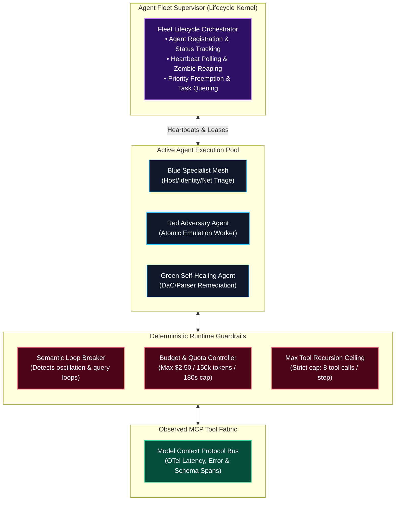

# 0017. Agent Fleet Control Plane, Runtime Loop Breakers, and Tool Fabric Observability

* Status: accepted
* Deciders: Architecture Team / Harry
* Date: 2026-09-16

Technical Story: [AI Agent Fleet Management & Runtime Guardrails]

## Context and Problem Statement

As security architectures transition from single-turn conversational helpers to autonomous, multi-agent systems (Tri-Color Red, Blue, and Green agents executing concurrent forensic scoping, rule tuning, and containment drafting), operating these agents without a formalized **Agent Control Plane** introduces critical operational and systemic vulnerabilities:

1. **The Recursive Loop & Hallucinated Deadlock Hazard**: Agents given goal-oriented tasks can become trapped in circular reasoning or repetitive query oscillations (e.g. querying the lakehouse with subtly varied parameters, receiving empty sets, and retrying indefinitely). Without deterministic loop breakers, a single rogue agent can exhaust API rate limits, spike cloud invoices by thousands of dollars, and tie up compute worker threads during high-severity incidents.
2. **Zombie Agents & Unmanaged Concurrency**: In high-volume security environments with hundreds of elevated alerts daily, background agent sub-tasks frequently become orphaned when investigations are manually closed or prioritized by human operators. Unmanaged background tasks continue executing expensive multi-hop queries against storage backends, creating severe compute contention.
3. **The Tool/MCP Fabric Observability Deficit**: Model Context Protocol (MCP) servers and tools are the operational hands of AI agents. If an MCP server suffers from network latency, database connection exhaustion, or schema drift (e.g., parameter type mismatches), agent reasoning stalls or yields degraded hallucinations. Without dedicated telemetry monitoring the health, latency, and error rates of the tool fabric itself, diagnosing agent failures becomes impossible.

How does TIDIR provide robust, enterprise-grade lifecycle management for its autonomous agent fleet, enforce deterministic recursive circuit breakers, and monitor the operational health of its tool calling bus?

## Decision Drivers

* **Deterministic Runtime Bounding:** Mathematical turn, time, and financial ceilings per investigation, terminating runaway recursive loops before they cause resource or budget exhaustion.
* **Proactive Agent Fleet Governance:** Centralized tracking of agent liveness, state transitions, task queues, and automated reaping of orphaned or zombie agent tasks.
* **Tool Fabric Observability:** End-to-end telemetry (latency, error rates, throughput, schema validity) across all Model Context Protocol (MCP) servers and tool execution interfaces.
* **Preemption & Prioritization:** The ability to cancel, pause, or reprioritize running subagent meshes when human incident commanders declare higher-priority Sev-1 emergencies.

## Considered Options

1. **Ad-Hoc Agent Execution:** Allow agents to run as unmonitored async background threads; rely on standard LLM provider API token limits.
2. **Proprietary Agent SaaS Platform:** Adopt an external closed-source multi-agent orchestration SaaS platform.
3. **Formalized Agent Fleet Control Plane with Deterministic Circuit Breakers & MCP Observability (Selected):** Implement an event-driven agent supervisor kernel providing active lifecycle management, semantic loop breakers, token/cost quotas, and OpenTelemetry-instrumented MCP tool bus monitoring.

## Decision Outcome

Chosen option: **Formalized Agent Fleet Control Plane with Deterministic Circuit Breakers & MCP Observability**, structured across three architectural pillars:

---

### 1. The Agent Fleet Supervisor & Lifecycle Kernel

All agent instantiations across the Tri-Color fleet (Red, Blue, Green) are managed by an authoritative **Agent Fleet Supervisor**:

1. **Stateful Agent Leases & Heartbeats**:
   - Every active subagent registers with the supervisor, obtaining a short-lived **Execution Lease** renewed via 5-second heartbeats.
   - If an agent worker process stalls or encounters unhandled runtime exceptions, the supervisor revokes the lease, reaps the orphaned worker, and cleans up in-memory blackboard locks.
2. **Priority Preemption & Cancellation Cascades**:
   - When a Tier-1 incident is escalated to active Sev-1 containment, the supervisor issues a **Cancellation Cascade** across background routine maintenance tasks (e.g. Green Agent noise-budget PR generation or Red Agent emulation replays), liberating GPU/CPU capacity and cloud rate limits for active incident response.
3. **Queue Backpressure & Concurrency Limits**:
   - Limits concurrent active specialist investigations per cluster node to prevent inference gateway connection pool exhaustion.

---

### 2. Runtime Guardrails: Loop Breakers & Cost Circuit Breakers

To protect infrastructure and budgets from runaway recursive reasoning:

1. **Semantic Loop & Oscillation Detection**:
   - The supervisor monitors the sequence of MCP tool invocations per investigation. If an agent executes two semantically identical tool queries (e.g. repeated SQL queries on the same table with minor string perturbations) yielding identical or empty outputs, the supervisor **trips the Loop Breaker**, halting autonomous execution and prompting the investigator with an explicit dead-end summary.
2. **Hard Recursion Depth Ceilings**:
   - Agent task plans enforce a strict recursion depth limit: **maximum 8 sequential tool calls per single investigative hypothesis step**. If a subagent cannot resolve a hypothesis within 8 tool invocations, it must checkpoint its findings to the blackboard and yield control back to the Lead Orchestrator.
3. **Financial & Token Budget Ceilings**:
   - Every investigation is bounded by hard resource caps:
     - Maximum cloud token consumption: **150,000 tokens**.
     - Maximum wall-clock execution time: **180 seconds**.
     - Maximum financial compute cost: **$2.50 per investigation**.
   - Exceeding any threshold automatically halts cloud frontier reasoning and falls back to deterministic rule synthesis or human operator escalation.

---

### 3. Model Context Protocol (MCP) Tool Fabric Observability

The tools exposed to agents are treated as production microservices governed by continuous telemetry:

1. **OpenTelemetry Tool Bus Telemetry**:
   - Every MCP server emits standardized distributed tracing spans for each tool invocation:
     - `rpc.service`: The MCP server name (e.g. `mcp-lakehouse-query`, `mcp-blast-radius`).
     - `rpc.method`: The specific tool name invoked.
     - `rpc.duration_ms`: Execution latency.
     - `rpc.status_code`: Tool success, timeout, or schema failure.
     - `rpc.error_message`: Structured diagnostic detail.
2. **Schema Drift & Deprecation Monitoring**:
   - Compares tool arguments passed by LLMs against the authoritative JSON Schema definitions published in the MCP catalog. If an agent repeatedly calls a tool with deprecated or malformed parameters, an alert is dispatched to the AI Engineering harness.
3. **Automated Tool Circuit Breakers**:
   - If an MCP tool (e.g. the Lakehouse query connector) exceeds a 5% error rate or P95 latency crosses 5,000ms, the tool bus temporarily trips into a degraded state, providing cached or summarized responses rather than blocking the agent.

---

## Pros and Cons of the Options

### Option 1: Ad-Hoc Agent Execution

* Good, because it requires zero control-plane infrastructure and runs easily in local developer scripts.
* Bad, because runaway agent loops can incur catastrophic cloud billing surprises within hours.
* Bad, because orphaned zombie tasks silently consume compute and lakehouse query capacity.
* Bad, because there is zero visibility into why an agent tool call failed or stalled.

### Option 2: Proprietary Agent SaaS Platform

* Good, because SaaS vendors provide pre-built UIs for agent monitoring.
* Bad, because internal security queries, prompts, and tool parameters must egress to a third-party platform.
* Bad, because closed platforms cannot enforce custom kernel-level sandboxing or on-premises SLM routing.

### Option 3: Formalized Agent Fleet Control Plane (Selected)

* Good, because deterministic loop breakers and budget ceilings eliminate financial and operational runaway risks.
* Good, because priority preemption ensures active cyber crises always take precedence over background maintenance tasks.
* Good, because deep OpenTelemetry instrumentation across the MCP tool fabric allows instant diagnosis of degraded integrations.
* Bad, because building and maintaining a stateful agent supervisor requires distributed systems engineering effort.

---

## Consequences

### Positive Consequences

* Transforms experimental agent scripts into dependable, production-grade enterprise SecOps infrastructure.
* Eliminates runaway cloud token costs and GPU worker starvation through deterministic hard limits.
* Provides end-to-end visibility into agent-to-tool performance, latency, and reliability.

### Negative Consequences

* Introduces an additional orchestration component (the Agent Fleet Supervisor) that must be monitored and maintained by the SecOps Platform SRE team.
* In complex multi-stage attacks, strict tool recursion limits (8 calls) may occasionally require human approval to extend the investigation depth.

### Scientific & Literature Grounding

* **Distributed Stability Patterns & Circuit Breakers**: [Nygard (2007)](https://pragprog.com/titles/mnee2/release-it-second-edition/), *Release It! Design and Deploy Production-Ready Software*; [FND-09](/architecture/foundational-research#fnd-09).
* **Empirical Limits of Autonomous Agent Loops & Tool Execution**: [UK AI Security Institute [AISI] (2026)](/architecture/foundational-research#fnd-17), *Empirical Evaluations of Frontier Autonomous Cyber Capabilities*; [FND-17](/architecture/foundational-research#fnd-17).
* **Unconstrained Agent Loops & Credential Harvesting Post-Mortem**: [Hugging Face & Cloud Security Alliance [CSA] (2026)](/architecture/foundational-research#deep-dive-1-ai-risks-adversary-capabilities-the-reality-vs-the-hype), *Incident Post-Mortem: Autonomous Agent Infrastructure Intrusion*; [FND-17](/architecture/foundational-research#fnd-17).
