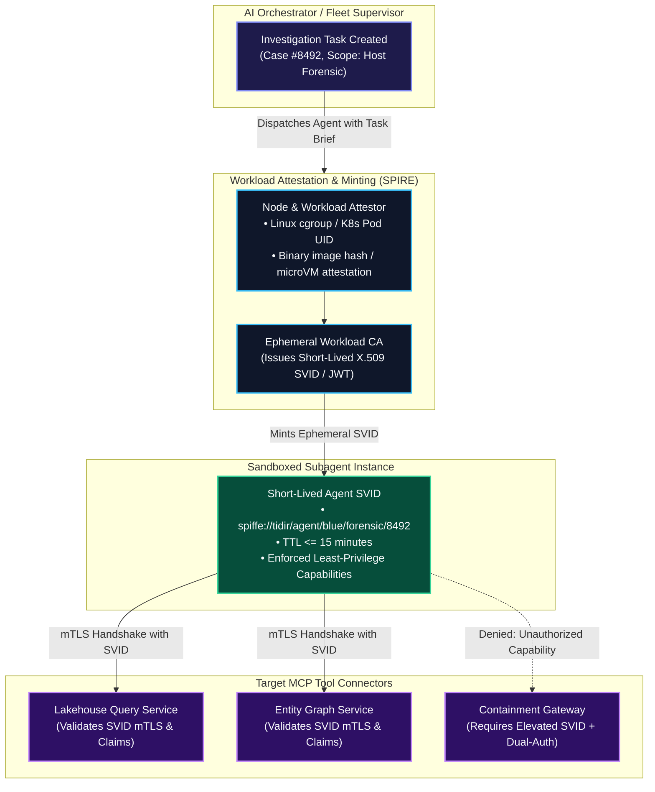
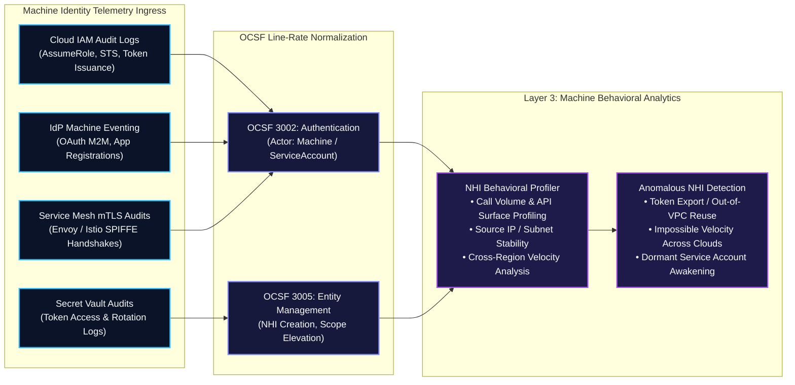

# 0018. Non-Human Identity (NHI) Lifecycle, Ephemeral Agent SVIDs, and Machine Identity Fabric

* Status: accepted
* Deciders: Architecture Team / Harry
* Date: 2026-09-16

Technical Story: [Governing Non-Human Identities, Ephemeral Agent Workload Attestation & Machine Identity Security]

## Context and Problem Statement

Non-Human Identities (NHIs)—including service accounts, API keys, OAuth tokens, workload identities, CI/CD runners, and autonomous AI agents—now outnumber human identities in modern enterprise environments by over 10:1. In security operations architectures, this shift creates acute vulnerabilities:

1. **Static Machine Credential Sprawl & Shadow NHIs**:
   - Automated integrations across SIEMs, SOAR playbooks, cloud APIs, and database connectors routinely rely on long-lived, high-privilege API tokens or service account keys stored in static config files or secret managers without rotation. When compromised, these credentials bypass interactive MFA and provide persistent adversary footholds.
2. **Autonomous Agent Identity Impersonation & Elevation**:
   - As autonomous agents (Red, Blue, Green) execute multi-stage triage, lakehouse queries, and containment playbooks, they require access to downstream systems. Treating an agent mesh as a single shared monolithic service account violates least-privilege, conceals lateral movement, and prevents forensic non-repudiation.
3. **Telemetry & Detection Blindspots for Machine Behaviors**:
   - Traditional detection engineering centers on human interactive behaviors (working hours, keyboard dynamics, interactive login anomalies). Machine identities execute non-interactively at extreme line rates, making credential abuse indistinguishable from normal API traffic without dedicated NHI behavioral profiling and token lineage tracking.

How does TIDIR provide an end-to-end Non-Human Identity (NHI) architecture that governs machine identities, binds autonomous AI agents to short-lived cryptographic credentials, and detects machine credential compromise at line rate?

## Decision Drivers

* **Zero Long-Lived Static Secrets:** Eliminating long-lived machine API keys and static secrets across all TIDIR connectors, databases, and microservices in favor of dynamic, short-lived cryptographic tokens.
* **Cryptographic Agent Attestation (Per-Task Least Privilege):** Ensuring every autonomous agent invocation receives an ephemeral, cryptographically attested identity scoped strictly to its specific task, with automated expiration and revocation.
* **Line-Rate Machine Identity Profiling:** Establishing behavioral baselines and token lineage tracking for non-human identities across cloud, identity, and application planes.
* **Forensic Non-Repudiation:** Guaranteeing that every machine action is inextricably bound to an immutable cryptographic audit trail indicating the initiating principal, parent task, and runtime environment.

## Considered Options

1. **Centralized Vault with Static Secret Rotation:** Store static API keys and service account credentials in an enterprise secret manager (e.g. HashiCorp Vault); rotate credentials on a 30-day or 90-day schedule; issue static service accounts to AI agents.
2. **Ephemeral SPIFFE/SPIRE Workload Attestation, OIDC Federation, and Dynamic Token Minting (Selected):** Mandate SPIFFE/SPIRE for cryptographic workload attestation; replace static API keys with short-lived X.509 SVIDs and federated OIDC tokens; deploy dynamic Just-in-Time (JIT) token minting for autonomous agents with per-task capability scoping and continuous machine behavioral profiling.

## Decision Outcome

Chosen option: **Ephemeral SPIFFE/SPIRE Workload Attestation, OIDC Federation, and Dynamic Token Minting**, implemented across four core architectural pillars:

---

### 1. Ephemeral Agent Identity & Cryptographic Attestation Architecture

Autonomous agents never share generic credentials. Every agent process or container is attested at boot time and receives a short-lived, task-scoped cryptographic identity:

1. **Hardware & Workload Attestation**:
   - Before an agent can issue queries or invoke tools, the underlying container or microVM must attest its runtime integrity to the SPIRE agent.
   - Attestation validates: the container image cryptographic digest, Kubernetes Pod UID and namespace, and sandboxed hypervisor boundary.
2. **Ephemeral SVIDs & Task-Bounded TTL**:
   - Successfully attested agents receive an X.509 SPIFFE Verifiable Identity Document (SVID) or short-lived JWT SVID with a maximum **Time-To-Live (TTL) of 15 minutes**.
   - The SVID URI encodes the role, task ID, and agent color: `spiffe://tidir.local/agent/{color}/{specialist_type}/{case_id}`.
3. **Automated Eviction & Certificate Revocation**:
   - When an investigation concludes, times out, or triggers a circuit breaker, the SVID is immediately revoked. Compromise of an agent process yields credentials that are inert within minutes.

---

### 2. Machine Identity Ingestion & Behavioral Telemetry Fabric

To detect stolen service account keys and rogue machine workloads, Layer 1 and Layer 2 ingest dedicated NHI telemetry across all enterprise environments:

1. **Canonical OCSF Machine Identity Mapping**:
   - Machine authentication transactions map to OCSF Class 3002 (`Authentication`), explicitly flagging `actor.user.type = "Service"` or `"Machine"`.
   - Workload identity creations, credential assignments, and permission grants map to OCSF Class 3005 (`Entity Management`).
2. **Non-Human Identity Behavioral Profiling & Agentic UEBA**:
   - Traditional User and Entity Behaviour Analytics (UEBA) was engineered for human operators. It relies heavily on human-centric baselines: circadian rhythms, office shift hours, interactive keyboard or mouse dynamics, and geographical travel anomalies.
   - Autonomous AI agents and machine workloads execute non-interactively at wire speed across ephemeral cloud clusters. Applying human circadian heuristics to autonomous agent meshes results in intolerable false-positive rates or total detection blindness.
   - The Layer 3 analytics engine constructs rolling behavioral profiles across two operational classes:
     - **Cloud Service Accounts & Workload Identities**:
       - *API Surface Profiling*: Alerts on service accounts invoking rarely accessed administration endpoints (such as `iam:CreateAccessKey` or `sts:GetFederationToken`).
       - *Origin Geolocation & VPC Deviation*: Flags machine tokens minted in internal cloud Virtual Private Clouds (VPCs) that are suddenly replayed from external public IP ranges or unapproved cloud regions (indicating stolen token replay).
       - *Dormancy Awakening*: Alerts when a service account inactive for $\gt 30\text{ days}$ (more than 30 days) suddenly generates high-velocity read or export queries.
     - **Autonomous AI Agents & Execution Meshes (Agentic UEBA)**:
       - *Tool-Call Entropy*: Evaluates mathematical variance across the sequence, diversity, and argument schemas of Model Context Protocol (MCP) tool invocations. A blue triage agent tasked with network log analysis that suddenly begins invoking IAM key-generation tools exhibits anomalous tool-call entropy, indicating prompt injection or subversion.
       - *Iteration Frequency & Burst Ratios*: Measures rapid spikes in turn cadence and tool-call velocity. This distinguishes normal step-wise investigations from runaway recursive loops, resource-exhaustion attacks, or adversary-driven automated data exfiltration.
       - *Token Distribution Variance*: Tracks shifts in input-to-output token ratios ($\text{Tokens}_{\text{in}} / \text{Tokens}_{\text{out}}$). Sudden token inflation or deflation signals context stuffing, data leakage, prompt extraction, or unconstrained model babbling.
       - *Graph Recursion & Branching Factor*: Monitors divergence from standard specialist investigation Directed Acyclic Graph (DAG) templates. Alerts fire when an agent exceeds expected sub-task fan-out bounds before reaching a triage hypothesis.

---

### 3. Just-in-Time (JIT) Dynamic Token Minting & Token Lineage

To prevent credential leakage during incident containment or automated remediation:

1. **Zero Standing Privileges for SOAR and Playbooks**:
   - Response connectors (AWS, Azure, Okta, CrowdStrike) do not store permanent administrative API keys.
   - When a containment playbook or automated workflow executes, the orchestration engine negotiates an ephemeral token via OpenID Connect (OIDC) federation or Cloud STS AssumeRole with a 5-minute lifespan.
2. **Cryptographic Token Lineage Tracking**:
   - When an ephemeral token is minted for an automated action, its metadata carries an immutable parentage chain:
     - `parent_incident_id`: The verified incident driving the action.
     - `originating_actor`: The analyst or attested autonomous agent recommending the action.
     - `authorizing_signatures`: The cryptographic signatures validating the policy or break-glass override.
   - Downstream audit logs record this lineage, preventing repudiation and enabling instant attribution of all automated machine mutations.

---

## Consequences

### Positive Consequences

* **Attack Surface Eradication:** Completely eliminates the largest attack surface in modern cloud infrastructure—unrotated, over-privileged static API keys and service account credentials.
* **Agent Non-Repudiation:** Every query, tool call, and playbook proposal is cryptographically bound to a unique, short-lived agent SVID and incident ID.
* **High-Fidelity Compromise Detection:** Machine behavior baselining catches stolen machine tokens within minutes through origin deviation and API anomaly detection.

### Negative Consequences & Mitigations

* **Infrastructure Complexity:** Requires deploying and maintaining a robust SPIFFE/SPIRE workload attestation fabric and OIDC federation broker.
  - *Mitigation:* Integrate with native cloud provider workload identity federation (AWS IAM Roles Anywhere, GCP Workload Identity Federation, Azure Managed Identities) for external endpoints.
* **Attestation Latency:** Generating dynamic tokens introduces 50–150ms of cryptographic handshake overhead.
  - *Mitigation:* Use local SPIRE agent socket caching to ensure sub-millisecond local SVID verification.
