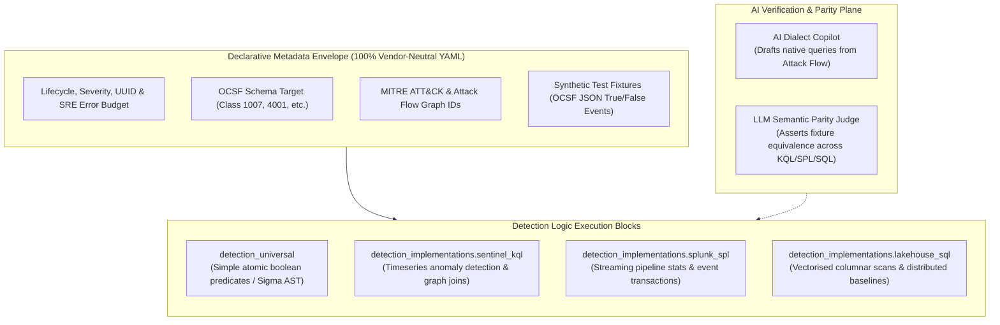

# Polyglot Detection-as-Code & Target-Optimized Engine Adaptation

* Status: accepted
* Deciders: Architecture Team, Detection Engineering Leads, Harry
* Date: 2026-09-17

Technical Story: RFC-0019 / Layer 3 Detection Architecture Review

---

## Context and Problem Statement

Early Detection-as-Code (DaC) proposals advocated for a "100% vendor-neutral declarative YAML" model, where all detection queries would be authored once in a generic schema (such as Sigma) and transpiled automatically into target backends (Splunk, Microsoft Sentinel, Snowflake, ClickHouse, Flink).

In enterprise production environments, this abstraction introduces the **Lowest Common Denominator Trap**:
1. **Expressive Asymmetry**: Advanced detection relies on engine-native capabilities—such as KQL timeseries decomposition (`make-series`, `series_decompose_anomalies()`), Splunk streaming statistics (`streamstats`, `transaction`), Lakehouse SQL window partitions (`QUALIFY`, `PARTITION BY`), or Flink stateful event-time watermarking. A generic YAML DSL cannot express these primitives without inventing a bespoke, unmaintainable programming language within YAML.
2. **Performance & Index Impedance**: Universal AST transpilers generate naive queries that fail to use table clustering keys, partition pruning, Bloom filters, or materialized projections, causing massive scan overhead and cloud compute costs.
3. **The Role of AI**: Generative AI models and LLM judges have fundamentally matured. Transpilation is no longer confined to brittle regex token rewriters; AI agents can synthesize and optimize dialect-native queries directly while validating semantic parity.

How should TIDIR structure Detection-as-Code to preserve vendor-neutral governance and portability without crippling detection engineers or sacrificing query execution efficiency?

---

## Decision Drivers

* **Expressive Freedom**: Detection engineers must be able to exploit the full analytical depth of specialized engines (KQL, SPL, ClickHouse/Snowflake SQL, Flink SQL).
* **Vendor-Neutral Governance**: Lifecycles, OCSF class bindings, MITRE ATT&CK taxonomies, SRE noise budgets, and triage playbooks must remain 100% vendor-neutral and portable.
* **Deterministic Verification**: Detections must be testable via synthetic test fixtures and adversary emulation before reaching production runtimes.
* **Continuous Detection Engineering**: Architecture uses agentic assistance to draft native query implementations from Attack Flows, with deterministic CI fixtures and human peer review enforcing cross-platform semantic parity.

---

## Considered Options

* **Option 1: Strict Vendor-Neutral YAML Only (Sigma/Pure DSL)**: Enforce that all logic must be written in generic YAML, banning native query syntax.
* **Option 2: Unmanaged Target Code Repositories**: Abandon vendor-neutrality entirely and maintain separate disjoint Git repositories for Splunk SPL, Sentinel KQL, and Lakehouse SQL.
* **Option 3: Polyglot Detection-as-Code (Vendor-Neutral Envelope + Target-Optimized Engines)** (Chosen): Enforce a 100% vendor-neutral metadata envelope in YAML that encapsulates lifecycle, OCSF bindings, threat framework mappings, and synthetic test fixtures, while housing target-specific native query execution blocks (`detection_implementations`) alongside optional universal AST predicates (`detection_universal`).

---

## Decision Outcome

Chosen option: **Option 3: Polyglot Detection-as-Code (Vendor-Neutral Envelope + Target-Optimized Engines)**.

This approach delivers the optimal balance: strict architectural decoupling for governance, schemas, and verification, combined with uncompromised execution efficiency in production.



---

### Architectural Specification & Schema Contract

Every detection rule file (`.tidir.yaml` or `.yaml`) is structured into distinct operational tiers:

```yaml
id: "8e7c156a-2d44-48e2-b7e1-8899fa1b0201"
name: "Process Masquerading via Unsigned System Binary Hollow"
version: 2
status: "production"
author: "Detection Engineering"
date: "2026-09-17"

# 1. 100% Vendor-Neutral Governance & Taxonomy
threat_intel:
  mitre_attack:
    tactics: ["TA0005"]
    techniques: ["T1055.012", "T1036.005"]
  mitre_d3fend:
    countermeasures: ["D3-PSA", "D3-EOP"]
    acf_family: "symbolic_logic" # MITRE D3FEND Analytic Characterization Framework
  mitre_car:
    analytics: ["CAR-2013-05-002"] # MITRE Cyber Analytics Repository
  evasion_resilience: "functional" # Empirical rating derived from CI mutation testing: tactical | operational | functional
  attack_flow_ref: "af-2026-proc-hollow-v1"

data_requirements:
  ocsf_version: "1.1.0"
  telemetry_dependencies:
    required:
      - class: 1007 # Process Activity
        authority: "endpoint_edr" # e.g. defender_for_endpoint, crowdstrike_falcon
        fields:
          - "process.file.name"
          - "process.file.signature.is_signed"
          - "process.parent_process.file.name"
        max_delivery_latency: "30s"
    optional:
      - class: 4001 # Network Connection Activity
        authority: "network_ndr" # e.g. zeek_ndr, corelight
        fields:
          - "connection_info.direction"
          - "dst_endpoint.ip"
  context_dependencies:
    - entity_type: "device"
      required_attributes: ["criticality_tier", "owner_team"]
    - entity_type: "user"
      required_attributes: ["privilege_level"]
  health_policy:
    missing_required: "offline" # Marks rule inactive if endpoint_edr stream fails
    missing_optional: "degraded" # Marks rule degraded; reduces alert confidence

operational:
  intent: "finding" # Typed egress: finding | risk_increment | signal | telemetry_elevation_trigger
  severity: "high"
  noise_budget_fpr: 0.02
  quiet_window: "15m"
  triage_playbook: "docs/playbooks/pb-t1055-investigation.md"

# 2. Portable Predicates (Optional - For Simple Atomic Stream Filters)
detection_universal:
  selection:
    process.file.name|endswith: ".exe"
    process.file.signature.is_signed: false
    process.parent_process.file.name: "svchost.exe"

# 3. Target-Optimised Native Implementation Blocks
detection_implementations:
  sentinel_kql: |
    SecurityEvent
    | where EventID == 4688
    | where ProcessName endswith ".exe" and SignatureStatus != "Valid"
    | where ParentProcessName has "svchost.exe"
    | summarize FirstSeen=min(TimeGenerated), LastSeen=max(TimeGenerated) by Computer, Account, ProcessCommandLine
  splunk_spl: |
    index=edr event_id=4688 is_signed=false process_name="*.exe" parent_process_name="*svchost.exe"
    | streamstats count by host, user, process_name window=5m
    | where count > 1
  lakehouse_sql: |
    SELECT 
      actor.user.name,
      device.hostname,
      process.cmd_line,
      count(*) OVER (PARTITION BY device.hostname, actor.user.name ORDER BY time RANGE BETWEEN INTERVAL 10 MINUTE PRECEDING AND CURRENT ROW) as frequency
    FROM ocsf_process_activity
    WHERE process.file.signature.is_signed = false
      AND lower(process.parent_process.file.name) = 'svchost.exe'
    QUALIFY frequency > 1;

# 4. Deterministic Verification Fixtures
tests:
  unit_fixtures:
    - name: "Valid unsigned hollowing attempt"
      expected_result: true
      event:
        class_uid: 1007
        process:
          file: { name: "svchost.exe", signature: { is_signed: false } }
          parent_process: { file: { name: "svchost.exe" } }
    - name: "Benign signed Windows binary"
      expected_result: false
      event:
        class_uid: 1007
        process:
          file: { name: "svchost.exe", signature: { is_signed: true } }
          parent_process: { file: { name: "services.exe" } }
```

### Typed Detection Egress, Empirical Evasion Resilience & Inverted Dependencies

The Polyglot DaC envelope formalises three critical operational properties:
1. **Typed Egress Intent (`operational.intent`)**: Decouples detection matching from alert generation. Rules explicitly declare whether a match emits an actionable security `finding` (OCSF 2001/2004), increments an entity's `risk_increment` in the Bayesian Multi-Signal Risk Lens ([ADR-0009](0009-bayesian-multi-signal-risk-scoring.md)), tags raw events as an informational `signal` for retro-hunting, or fires a `telemetry_elevation_trigger` commanding Just-in-Time (JIT) ephemeral sensor verbosity ([ADR-0016](0016-just-in-time-telemetry-elevation-and-ephemeral-forensics.md)).
2. **Empirical Evasion Resilience (`threat_intel.evasion_resilience`)**: Rather than relying on self-declared coverage checklists ("ATT&CK Bingo"), rules undergo automated mutation testing in CI ([ADR-0007](0007-continuous-automated-purple-teaming-and-multi-model-consensus.md)). Detections that withstand syntactic and procedural variations are classified as `functional`, intermediate sequences as `operational`, and brittle syntax matches as `tactical`.
3. **Inverted Telemetry Dependencies (`data_requirements.telemetry_dependencies`)**: Traditional pipelines push raw data blindly toward detection engines. Polyglot DaC inverts this relationship: rules declare exactly which OCSF event classes, authority sources, and fields they require versus which are optional. If a supporting telemetry stream (e.g. NDR network flow) degrades or stalls, the detection runtime automatically marks the rule's operational status as `DEGRADED`, discounting the resulting finding's confidence ceiling and alerting SecOps pipeline engineering (e.g. in Cribl or Vector) to restore signal health.

---

## Positive Consequences

* **Zero Expressive Bottlenecks**: Detection engineers can author complex analytical logic, windowed aggregations, and graph correlations using the full power of native query engines.
* **Engine Optimization**: Queries directly use native partitioning, clustering indexes, streaming window states, and cost-efficient execution plans.
* **Uncompromised Governance**: Life-cycle states, threat taxonomy mappings, SRE noise budgets, and unit fixtures remain fully decoupled and vendor-neutral.
* **AI-Driven Cross-Compilation & Parity**: Detection rule copilots can synthesize dialect-specific implementations from universal attack flows and verify them against shared OCSF test fixtures in CI/CD.

## Negative Consequences & Mitigations

* **Dialect Maintenance Overhead**: High-complexity rules may require maintaining multiple engine blocks if an organization operates a multi-SIEM or hybrid Lakehouse environment.
  - *Mitigation*: Simple atomic rules use `detection_universal` with automated transpilation. Native blocks are reserved for complex queries where specialized features are strictly necessary. AI copilots assist in generating and updating dialect equivalents.
* **Semantic Divergence Risk**: Divergence where the KQL rule detects slightly different activity than the SQL rule.
  - *Mitigation*: CI/CD test runners execute synthetic OCSF unit fixtures against all declared implementation engines to assert identical matching behavior before promotion.

---

## Pros and Cons of the Options

### Option 1: Strict Vendor-Neutral YAML Only (Pure Sigma DSL)

* Good, because maximum cross-platform portability is maintained in theory.
* Bad, because it forces the lowest common denominator, stripping away windowed aggregations, graph lookups, timeseries algorithms, and streaming state.
* Bad, because transpiler-generated queries are frequently unoptimized, driving up cloud query costs and search latency.

### Option 2: Unmanaged Target Code Repositories

* Good, because engineers write pure KQL or SPL with complete platform freedom.
* Bad, because threat intelligence mappings, testing fixtures, and governance metadata fragment across disparate systems.
* Bad, because rule lifecycle tracking, OCSF compatibility, and enterprise-wide detection coverage matrices become impossible to maintain centrally.

### Option 3: Polyglot Detection-as-Code (Vendor-Neutral Envelope + Target-Optimized Engines)

* Good, because it pairs standard OCSF/ATT&CK governance with maximum runtime execution performance.
* Good, because synthetic testing fixtures guarantee semantic parity regardless of the underlying execution syntax.
* Good, because it enables AI agent copilots to bridge dialects while human engineers retain full control over query performance.
* Bad, because multi-engine estates require maintaining more than one query string for non-atomic detections.
