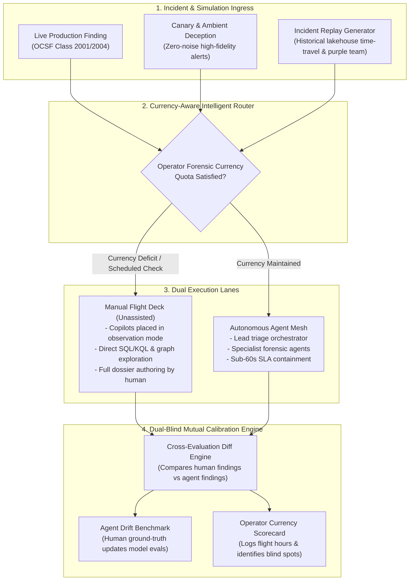

# Operator Skill Retention, Automation Dependency & Incident Replay Simulators

* Status: accepted
* Deciders: Architecture Team, SecOps Leads, AI Platform, Harry
* Date: 2026-09-18

Technical Story: RFC-0020 / SecOps Cognitive Ergonomics & Human-Agent Synergy

---

## Context and Problem Statement

As security operations transition toward autonomous agent meshes capable of line-rate alert correlation, bipartite graph exploration, and blast-radius-gated containment, the platform encounters **Bainbridge’s Ironies of Automation (1983)**:

> *The more automated a system becomes, the more crucial the human contribution is when that automation encounters edge cases—yet because the automation handles all routine operations, the human operator is deprived of the practice needed to maintain essential skills.*

In modern autonomous SecOps, if specialist agents autonomously resolve 95%+ of operational findings, human analysts suffer catastrophic **cognitive and forensic atrophy**:
1. **Loss of Investigative Intuition**: Analysts lose the visceral, hands-on muscle memory required to inspect raw event logs, reconstruct process execution lineages, trace network pivots, and query columnar lakehouse archives under high stress.
2. **The Automation Dependency Paradox**: When an out-of-distribution attack, adversarial prompt injection, or model poisoning bypasses the AI plane, the incident escalates to a human operator who has spent months acting merely as an approval stamper. Expecting an unpracticed operator to instantly decipher complex novel attacks guarantees operational paralysis.
3. **Model Evaluation Echo Chambers**: If AI agents generate forensic timelines and SLM judges evaluate those agents against synthetic evals alone, the system creates an ungrounded feedback loop vulnerable to undetected model drift.

How can TIDIR systematically eliminate operator skill atrophy, preserve human forensic craftsmanship, and maintain operational flight-readiness without sacrificing the sub-minute containment velocity of the autonomous agent plane?

---

## Decision Drivers

* **Skill Retention & Muscle Memory**: Human operators must maintain continuous, hands-on investigative competence across endpoint, identity, network, and cloud domains.
* **Deterministic Flight-Readiness Standards**: The platform must track operator currency objectively using measurable quotas rather than subjective assessments.
* **Zero Production Latency Compromise**: Routine high-risk incidents must still be contained within sub-minute SLAs by the autonomous agent mesh.
* **High-Fidelity Simulation Runtime**: The system must support replaying historical telemetry and purple-team attack scenarios into isolated sandbox workbenches.
* **Mutual Human-Agent Ground Truth**: Human manual investigations must serve as high-veracity calibration datasets to benchmark and ground AI agent performance.

---

## Considered Options

* **Option 1: Complete Autonomous Delegation**: Route all eligible incidents through the autonomous agent mesh, engaging humans strictly as post-hoc escalation targets or break-glass approvers.
* **Option 2: Mandatory Step-by-Step Human Gates (Artificial Bottlenecks)**: Force human intervention on every incident investigation (e.g. requiring humans to manually validate each graph node), artificially degrading MTTR.
* **Option 3: Forensic Currency Quotas, Intelligent Workload Throttling, and Incident Replay Simulators** (Chosen): Combine mandatory manual investigation quotas ("flight hours") with an automated Incident Replay Simulator and a dual-blind mutual calibration harness.

---

## Decision Outcome

Chosen option: **Option 3: Forensic Currency Quotas, Intelligent Workload Throttling, and Incident Replay Simulators**.

TIDIR treats human forensic skill as a mission-critical operational asset that requires continuous, programmatic maintenance. Drawing from commercial aviation's flight-currency mandates and recurring emergency simulator check-rides, TIDIR institutionalizes:

---

### Architectural Components & Operational Specifications

#### 1. Forensic Currency Quotas ("The Flight Hours Standard")
- **Operational Currency Standard**: Much like instrument-rated pilots must log 6 instrument approaches and emergency procedures every 6 months to maintain flight legality, TIDIR operators must satisfy a recurring **Forensic Currency Profile**:
  - *Monthly Quota*: Minimum 4 unassisted manual investigations per analyst per month.
  - *Domain Distribution*: At least 1 endpoint process execution/memory investigation, 1 cloud IAM/identity privilege escalation, 1 network command-and-control pivot, and 1 detection logic triage.
- **Intelligent Workload Throttling**: The incident allocation engine monitors operator currency scores. When an analyst’s domain recency drops below defined thresholds, the router automatically diverts eligible medium-severity live findings or high-fidelity synthetic canary incidents directly to their **Manual Flight Deck**.
- **The Manual Flight Deck**: In this mode, AI agent copilots are placed in passive observation mode. The analyst directly formulates queries against Layer 2 lakehouse partitions, inspects raw telemetry, performs entity resolution, and constructs the timeline dossier manually.

#### 2. Incident Replay Simulator ("The SecOps Flight Simulator")
- **Lakehouse Time-Travel Hydration**: Using Layer 2 open table format snapshots (Delta/Iceberg/Hudi), the simulator can capture the complete 72-hour telemetry state surrounding historical incidents and hydrate it into an isolated, ephemeral staging sandbox.
- **Controlled Adversary Injects**: Replays are synthesized by the Layer 3 continuous purple-teaming engine (ADR-0007), embedding real-world attacker techniques into historical baseline telemetry.
- **Blind Simulation Execution**: Simulations are presented to operators identically to live production findings. The operator does not know whether they are investigating a live outbreak or a high-fidelity synthetic replay until the investigation dossier is cryptographically sealed.

#### 3. Dual-Blind Mutual Calibration & AI Drift Grounding
- **Cross-Evaluation Engine**: When an incident is routed to the Manual Flight Deck, the autonomous agent mesh runs concurrently in a **shadow container**.
- **Bidirectional Scoring**:
  - *Human Operator Feedback*: The diff engine compares the human's timeline and root-cause findings against the agent mesh. If the human missed a lateral movement pivot captured by the agent, the platform flags it as a personalized training opportunity.
  - *AI Agent Drift Benchmark*: If the human discovers a novel attacker evasion or nuance that the agent mesh missed (or hallucinated), the sealed human dossier is automatically promoted as a **Golden Ground-Truth Artifact** into the Agent Evaluation Harness (ADR-0006) and SLM Judge registry (ADR-0014).

---

## Positive Consequences

* **Permanent Elimination of Skill Atrophy**: SecOps analysts maintain continuous, battle-tested muscle memory across raw telemetry queries, graph navigation, and root-cause analysis.
* **Resilience to Automation Failures**: When zero-day threats bypass AI models or prompt injection attacks disable specialist agents, human operators step into the command seat with active, verified proficiency.
* **High-Veracity AI Evaluation Data**: Solves the AI self-evaluation echo chamber by producing ongoing human-curated golden evaluation datasets directly from operational practice.
* **Operator Engagement & Craftsmanship**: Prevents analyst burnout and disengagement caused by routine button-stamping, elevating tier-2/tier-3 personnel into continuous masters of their trade.

## Negative Consequences & Mitigations

* **Operational Capacity Overhead**: Diverting a subset of incidents to manual investigation consumes human analyst hours that could otherwise be automated.
  - *Mitigation*: Currency quotas are restricted to low-to-medium risk findings, simulated canary replays, and non-time-critical investigations. High-velocity severe outbreaks (e.g. active ransomware execution) always execute through the autonomous agent mesh for sub-60-second containment.
* **Simulation Telemetry Storage**: Maintaining replayable lakehouse partition snapshots consumes object storage capacity.
  - *Mitigation*: Replay snapshots are capped to 72-hour bounded temporal partitions and compressed using Zstandard columnar encodings, sharing storage with Layer 2 historical archives.

---

## Pros and Cons of the Options

### Option 1: Complete Autonomous Delegation

* Good, because it maximizes operational throughput and minimizes human labor costs on routine alerts.
* Bad, because human analysts rapidly suffer cognitive and forensic atrophy.
* Bad, because when automation fails or novel attacks emerge, operators lack the skills to intervene effectively.

### Option 2: Mandatory Step-by-Step Human Gates

* Good, because humans are forced into the loop on every incident.
* Bad, because it destroys MTTR and cripples containment speed, recreating alert fatigue and human bottlenecks.

### Option 3: Forensic Currency Quotas & Incident Replay Simulators

* Good, because it preserves autonomous speed for 95%+ of operations while systematically guaranteeing human operational readiness.
* Good, because incident simulationcheck-rides provide safe, realistic exposure to rare, high-consequence attack techniques.
* Good, because human manual dossiers continually generate golden ground truth to detect AI model drift.
* Bad, because it requires maintaining a simulation replay runtime and tracking operator currency metrics.
