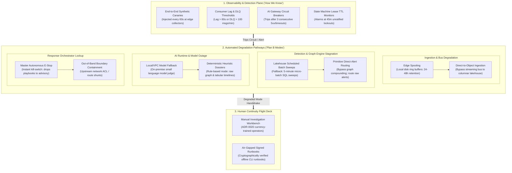

# 0021. Graceful Degradation, Automated Fallback Modes, and Continuity Plan B

* Status: accepted
* Deciders: Architecture Team, SecOps Leads, Data Engineering Leads, SRE, Harry
* Date: 2026-09-18

Technical Story: RFC-0021 / Enterprise Resilience, Degradation Tiers & Operational Continuity

---

## Context and Problem Statement

Modern autonomous security operations rely upon tightly integrated, multi-tiered subsystems: streaming ingest buses, schema registries, real-time bipartite graph correlators, dual-plane AI agent runtimes, and automated response state machines. 

However, enterprise infrastructure experiences distributed failures:
1. **Upstream Streaming Ingestion Failures**: Message buses can experience cluster degradation, network partitions, or consumer group stall, threatening to drop high-velocity forensic telemetry.
2. **Detection & Graph Engine Stagnation**: In-memory graph clustering, centrality dampening, and Bayesian compounding services can experience memory exhaustion, deadlock, or processing stalls, blinding real-time detection.
3. **AI Provider & Model Runtime Outages**: Commercial cloud LLM endpoints experience latency spikes, provider outages, or quota exhaustion, threatening autonomous triage dossiers.
4. **Response Orchestration & Control-Plane API Lockups**: Downstream enforcement APIs (EDR agents, cloud IAM, perimeter firewalls) can timeout or fail mid-execution, risking runaway automation, cascading deadlocks, or containment paralysis.

When components in an autonomous architecture fail, how does the platform detect degradation, preserve telemetry integrity, maintain continuous detection, and execute an orderly, deterministic **Continuity Plan B** without relying on proprietary vendor workarounds?

---

## Decision Drivers

* **Vendor-Neutral & Capability-Driven**: Continuity patterns must rely strictly on open architectural capabilities (decoupled object storage, local ring buffers, scheduled analytical batch queries, deterministic rule fallbacks) rather than proprietary cloud failover products.
* **Deterministic Observability ("How We Know")**: Every component must have explicit, active telemetry probes and canary monitors to detect operational degradation within seconds.
* **Zero Telemetry Loss Invariant**: Ephemeral network partitions or streaming bus outages must never result in discarded forensic event data.
* **Continuous Threat Visibility**: Failure of real-time streaming engines or AI agent runtimes must gracefully degrade to batch execution or deterministic triage rather than completely blinding the SOC.
* **Fail-Secure Operational Containment**: Automation failures must halt safely, prevent cascading deadlocks via bounded leases, and provide clear, out-of-band manual override flight decks for human incident commanders.

---

## Considered Options

* **Option 1: Complete Pipeline Coupling (Fail-Stop)**: When any ingestion or detection subsystem fails, halt upstream ingestion or alert processing until manual platform restoration.
* **Option 2: Silent Drop & Best-Effort Bypass**: Continue pipeline execution by dropping lagging event streams or skipping unanalyzed dossiers without structured operator alerting.
* **Option 3: Four-Tier Graceful Degradation Architecture & Operational Plan B (Selected)**: Implement explicit, capabilities-based degradation tiers across Ingestion, Detection, AI Orchestration, and Response, paired with independent blackbox sentinel probes and emergency manual flight decks.

---

## Decision Outcome

Chosen option: **Option 3: Four-Tier Graceful Degradation Architecture & Operational Plan B**.

TIDIR codifies an end-to-end resilience architecture that decouples dependencies, provides deterministic observability for failure detection, and enforces autonomous fallback pathways across all four layers.

---

### Layer-by-Layer Failure Modes, Telemetry & Plan B Mitigations

#### 1. Ingestion & Data Fabric (Layer 1 & Layer 2)
* **Failure Mode**: Streaming event bus partition, consumer group freeze, or schema registry corruption.
* **How We Know**:
  * Synthetic telemetry canaries injected at edge sensors fail to arrive in Layer 2 storage within 60 seconds.
  * Ingestion buffer consumer lag exceeds 60 seconds, or the Dead-Letter Queue (DLQ) ingestion rate exceeds 100 events/min.
* **Continuity Plan B (Decoupled Buffering & Direct-to-Object Ingestion)**:
  1. *Edge Spooling*: Edge forwarders automatically transition to local NVMe ring buffers, capable of spooling 24–48 hours of compressed OCSF events without data loss.
  2. *Direct-to-Object Bypass*: If the streaming bus remains partitioned, forwarders activate a direct-to-object storage fallback mode, writing compressed Parquet micro-batches directly to the columnar lakehouse, preserving historical forensic integrity while bypassing the streaming transport entirely.

#### 2. Threat Intelligence & Detection Engineering (Layer 3)
* **Failure Mode**: In-memory graph correlation cluster runs out of memory, centrality dampening locks up, or the Bayesian Risk Lens engine stalls.
* **How We Know**:
  * Time-to-Detection (TTD) delta between event collection timestamp and finding publication timestamp crosses $\gt 15\,\text{seconds}$.
  * Graph edge/node mutation rates drop to zero despite normal upstream ingestion volume.
  * Harmless canary trigger invariants injected in staging/production fail to emit an alert within 30 seconds.
* **Continuity Plan B (Scheduled Lakehouse Batch Sweeps & Raw Alert Routing)**:
  1. *Stream-to-Batch Failover*: Scheduled columnar lakehouse analytical queries immediately take over streaming detection rules. Query intervals drop to 5-minute micro-batches. While detection latency degrades from $\lt 5\text{s}$ to $5\text{m}$, total threat coverage remains active.
  2. *Primitive Direct-Alert Routing*: In the event of complete graph engine stall, the platform bypasses bipartite graph clustering and Bayesian compounding. Sensor alerts from endpoint, cloud, and network perimeter layers route directly to analyst queues as unclustered, high-priority findings.

#### 3. AI Orchestration & Investigation (Layer 4)
* **Failure Mode**: Commercial cloud LLM APIs experience regional outages, provider quota exhaustion, or request timeouts exceeding 30 seconds.
* **How We Know**:
  * AI Gateway circuit breakers record $\gt 3$ consecutive HTTP 5xx errors or connection timeouts.
  * Incident dossier hydration queue dwell time crosses $\gt 60\,\text{seconds}$.
* **Continuity Plan B (Hierarchical Model Graceful Degradation & Rule-Based Non-AI Mode)**:
  1. *Local SLM Fallback*: The AI orchestration gateway automatically shifts inference workloads from cloud frontier models to locally hosted or VPC-contained Small Language Models (SLMs, e.g. on-premise 8B parameter models).
  2. *Deterministic Rule-Based Non-AI Mode*: If local SLMs are also offline, the system drops AI summarization entirely. The analyst workbench renders structured, deterministic dossiers: raw bipartite entity relationships, tabular chronological timelines, and rule-based blast-radius preview cards.
  3. *Manual Flight Deck Activation*: Human operators trained under [ADR-0020](0020-operator-skill-retention-and-incident-replay-simulators.md) assume manual investigative control, applying established procedural practice to query the lakehouse directly.

#### 4. Response Automation & State Machines (Layer 4)
* **Failure Mode**: Downstream host EDR or IAM directory APIs become unresponsive; forward-recovery state machines freeze in partial containment, risking distributed deadlocks.
* **How We Know**:
  * Containment action dispatch attempts exceed retry ceilings ($\gt 3$ attempts with exponential backoff).
  * State machines held in forward-recovery approach their 45-minute Idempotent Isolation Lease TTL.
  * Enterprise-wide containment velocity exceeds the runaway safety threshold (e.g. $\gt 10$ hosts isolated per minute).
* **Continuity Plan B (Master Emergency Stop & Out-of-Band Boundary Containment)**:
  1. *Autonomous Master Emergency Stop*: An authenticated cryptographic emergency stop in the SecOps console instantly revokes automated execution permissions across all response workers, downgrading all active and pending playbooks to advisory-only mode.
  2. *Isolation Lease Auto-Fallback*: Stalled isolation leases that hit their 45-minute TTL without operator resolution deterministically trigger an automated safe-fallback: elevating to an out-of-band boundary network quarantine (upstream VPC route shunt or firewall ACL) and paging the Incident Commander.
  3. *Air-Gapped Signed Runbooks*: For catastrophic control-plane collapse, operators deploy cryptographically signed, air-gapped CLI containment scripts directly against network and cloud infrastructure outside the TIDIR runtime.

---

## Positive Consequences

* Designed to prevent forensic data loss during streaming bus outages via edge spooling and direct-to-object ingestion bypass.
* Prevents total SOC blindness by establishing automated failover from streaming detection to lakehouse batch sweeps.
* Guards against operational deadlocks and runaway automation through isolation lease TTLs, velocity brakes, and master E-Stops.
* Preserves cognitive readiness by providing deterministic rule-based investigation workbenches and manual runbooks.

---

## Negative Consequences

* Failover to lakehouse batch sweeps increases detection latency from seconds to minutes ($\lt 5\,\text{min}$).
* Degrading to rule-based non-AI mode increases cognitive triage load on human analysts, requiring higher active staffing during extended cloud AI outages.
* Local edge spooling requires dedicated NVMe storage allocations on forwarder hosts.
