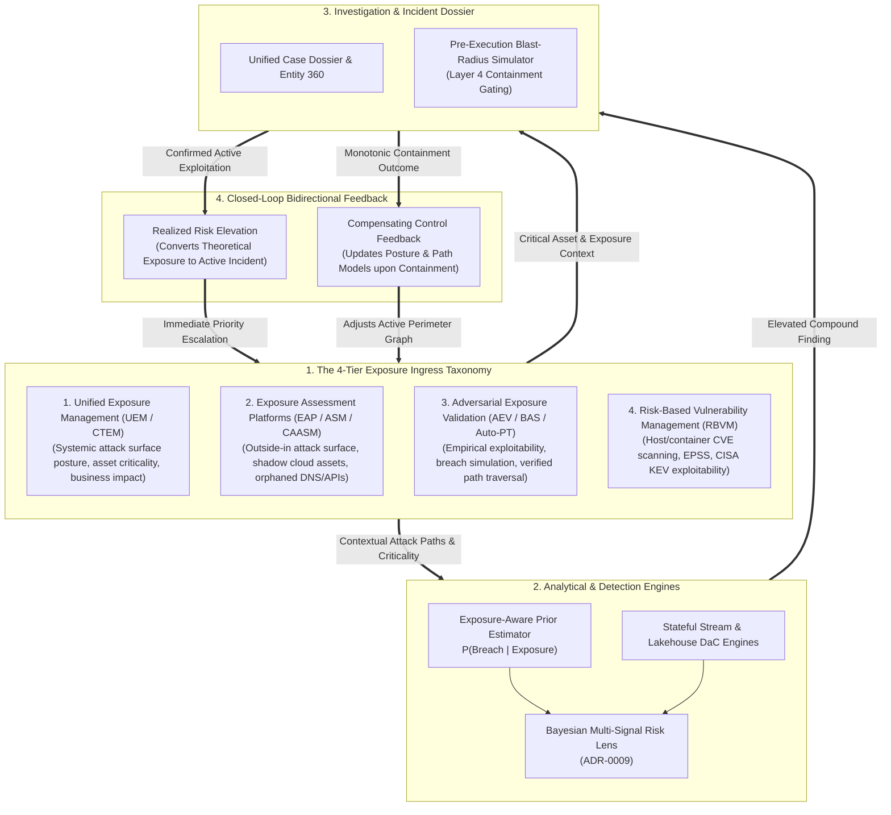

# 0022. Exposure Management & Continuous Threat Exposure Integration

* Status: accepted
* Deciders: Architecture Team, Threat Intelligence Leads, Detection Leads, Harry
* Date: 2026-09-22

Technical Story: RFC-0022 / Exposure Intelligence, CTEM Integration & Bidirectional Risk Feedback

---

## Context and Problem Statement

Security operations pipelines typically run as unidirectional, reactive-to-preventative loops:
$$\text{Telemetry} \longrightarrow \text{Detection} \longrightarrow \text{Investigation} \longrightarrow \text{Response} \longrightarrow \text{Green Team}$$

This creates an operational disconnect from **Continuous Threat Exposure Management (CTEM)**:
1. **Detection and Triage Operate Blind to Asset Exposure**: An identical detection signal (such as an administrative script or anomalous network egress) receives identical urgency regardless of whether the affected host is an isolated development VM or an internet-facing production server with known exploitable vulnerabilities on an attack path to critical database tiers.
2. **Exposure Programs Lack Realized Risk Signals**: Exposure management platforms prioritize vulnerabilities, misconfigurations, and external attack surfaces based on static Common Vulnerability Scoring System (CVSS) metrics or broad threat chatter, without visibility into which assets are actively being probed or exploited within the enterprise estate.
3. **The Proactivity Gap**: Does TIDIR understand what is likely to matter before something becomes an alert?

How should TIDIR integrate Exposure Management as a first-class architectural capability—unifying proactive attack surface intelligence with reactive detection and closed-loop response without creating a redundant asset database?

---

## Decision Drivers

* **Bidirectional Risk Convergence**: Exposure posture must inform detection and investigation prior probabilities, while observed detection findings and containment actions must continuously update exposure models to convert theoretical risk into realized risk.
* **Preservation of Constitutional Invariants**: Decoupling belief from action (**Invariant 4: Authority Separation**) must be upheld; high asset criticality or exposure posture cannot grant self-authorizing automated destructive containment.
* **Lean Architectural Synthesis**: Avoid building a secondary massive data store; expose asset criticality, attack path reachability, exploitability, and control effectiveness as dynamic graph attributes accessible to stream correlators and AI specialist agents.
* **Noise Reduction via Bayesian Priors**: Use empirical exposure state as the prior probability in the Bayesian Multi-Signal Risk Lens ([ADR-0009](0009-bayesian-multi-signal-risk-scoring.md)), mitigating the Base Rate Fallacy without suppressing unmapped edge anomalies.

---

## Considered Options

* **Option 1: Isolated Tool Integration (Manual Analyst Swivel-Chair)**: Maintain exposure tools (EASM, vulnerability scanners, posture management) as external consoles. Analysts manually look up asset exposure during investigation.
* **Option 2: Monolithic Central Data Lake Ingestion**: Dump all vulnerability scan outputs, posture logs, and asset databases into the central telemetry streaming bus, bloating lakehouse tables and forcing detection rules to join multi-gigabyte tables in real-time.
* **Option 3: Exposure Intelligence Fabric with Bidirectional Control Loops (Selected)**: Establish Exposure Intelligence as a first-class architectural service within Layer 1 and Layer 3. Ingest normalized exposure context (asset criticality, attack paths, exploitability, control status, accepted risk) to parameterize Bayesian prior probabilities, while routing confirmed incident findings and containment discoveries back into exposure prioritization.

---

## Decision Outcome

Chosen option: **Option 3: Exposure Intelligence Fabric with Bidirectional Control Loops**.

TIDIR expands its operational progression from a unidirectional pipeline into a closed-loop bidirectional cyber defense control cycle:

$$\text{Exposure} \longleftrightarrow \text{Observe} \longrightarrow \text{Normalise} \longrightarrow \text{Infer} \longrightarrow \text{Investigate} \longrightarrow \text{Decide} \longrightarrow \text{Actuate} \longrightarrow \text{Learn} \longleftrightarrow \text{Exposure}$$

### The 4-Tier Exposure Ingress Taxonomy

To avoid building redundant asset databases while capturing the full spectrum of exposure telemetry, TIDIR classifies exposure inputs into four distinct functional tiers:

1. **Unified Exposure Management (UEM / CTEM)**:
   - Aggregates top-level enterprise risk context, integrating business impact weighting, cross-domain asset criticality, and global threat landscape convergence into unified attack path graphs.
2. **Exposure Assessment Platforms (EAP / ASM / CAASM)**:
   - Performs continuous outside-in asset discovery, enumerating unmanaged cloud resources, forgotten subdomains, shadow APIs, expired certificates, and open perimeter services.
3. **Adversarial Exposure Validation (AEV / BAS / Automated Pen-Testing)**:
   - *Provides empirical validation of theoretical exposure.* Rather than assuming an unpatched CVE represents an active breach path, AEV simulates adversary techniques (e.g. lateral credential dumping, network pivoting) to verify whether current perimeter and endpoint controls actively block or permit path traversal.
4. **Risk-Based Vulnerability Management (RBVM)**:
   - Ingests granular host, container, and software package vulnerability scans, contextualized dynamically by the Exploit Prediction Scoring System (EPSS) and CISA Known Exploited Vulnerabilities (KEV) catalogs.

### Key Architectural Invariants & Mechanisms

1. **Exposure as Bayesian Prior Probability ($P(\text{Breach})$) & The Non-Zero Exposure Floor ($\epsilon \gt 0$)**:
   In the Bayesian Multi-Signal Risk Lens ([ADR-0009](0009-bayesian-multi-signal-risk-scoring.md)), calculating the posterior probability of a genuine breach $P(\text{Breach} \mid E_1, \dots, E_n)$ requires an honest prior $P(\text{Breach})$.
   Instead of a static baseline, Exposure Intelligence calculates a dynamic prior based on:
   - External reachability (internet-facing vs. air-gapped).
   - Exploitability score (e.g. Known Exploited Vulnerability / CISA KEV match, high EPSS rating).
   - Attack path centrality (distance to Tier 0 critical business assets).
   - Active control effectiveness (e.g. EDR running in enforcement mode vs. degraded).
   
   **The Exposure Floor ($\epsilon \gt 0$) & Invariant Fast-Path**:
   To prevent base-rate blindness where novel zero-day attacks or lateral pivots via unmapped shadow IT are deprioritized by an artificially low prior, the architecture enforces two strict constraints:
   - *Non-Zero Exposure Floor*: $P(\text{Breach}) \ge \epsilon$ (where $\epsilon \approx 0.05$, adapting standard prior probability smoothing to prevent zero-frequency suppression). No asset, however isolated or hardened, is assigned zero breach likelihood.
   - *Deterministic Invariant Bypass*: Deterministic security violations (such as canary/honeytoken triggers, kernel-level BYOVD driver load attempts, or cryptographic token tampering) bypass Bayesian prior dampening entirely and elevate with instantaneous priority regardless of asset exposure state.

2. **Realized Risk Feedback Loop & Oscillation Dampening**:
   When an investigation validates active exploitation or reconnaissance against an internal asset, TIDIR emits a structured `ExposureElevationOrder`. The CTEM subsystem updates the asset's risk classification:
   $$\text{Theoretical Risk} \longrightarrow \text{Realized Exploitation}$$
   This automatically shifts enterprise remediation priorities from theoretical patching schedules to emergency mitigation, re-allocating vulnerability management and engineering focus based on real adversary dwell time.
   
   **Feedback Loop Dampening & Temporal Decay**:
   To prevent runaway positive feedback cascades—where an elevated exposure score increases subsequent alert scoring, which further inflates exposure in an unbounded loop—TIDIR enforces:
   - *Bounded Escalation Step*: $\Delta \text{score}_{\text{exposure}} \le \alpha_{\max}$ per incident cycle.
   - *Exponential Realized Risk Decay*: If no corroborating adversary dwell activity is observed within time $\tau$ (e.g. 72 hours post-containment), the realized risk elevation decays back to baseline environmental posture according to:
     $$\text{Exposure}(t) = \text{Baseline} + (\text{Elevated} - \text{Baseline}) \times e^{-\lambda_{\text{expo}} t}$$

3. **Blast-Radius Containment Alignment**:
   Exposure Intelligence informs the Pre-Execution Blast-Radius Simulator in Layer 4 ([ADR-0005](0005-saga-pattern-containment-and-break-glass-protocol.md)). Knowing which systems provide downstream dependencies or host critical business workloads ensures that automated containment actions strictly honor business criticality limits and fail-secure reachability constraints.

---

### Positive Consequences

* **Proactive and Reactive Symmetry**: TIDIR bridges proactive security engineering with reactive incident response, making exposure context available before an alert fires and using incident reality to drive exposure remediation.
* **Targeted Alert Scoring**: The Bayesian Risk Lens discounts noisy administrative activity on low-criticality, non-exposed nodes while prioritizing weak signals on vulnerable choke points.
* **Cross-Team Operational Alignment**: Connects detection triage and vulnerability management around shared attack paths and empirical exploit telemetry, reducing conflicting priority rankings between teams.

### Negative Consequences

* **Context Dependency**: If exposure feeds or CMDB graph synchronizations lag, detection engines might temporarily underestimate prior probabilities on newly exposed infrastructure. Mitigation: Fall back to conservative baseline priors when exposure context is stale or unverified.
* **Schema Mapping Overhead**: Normalizing vulnerability findings, asset graph edges, and attack path metrics into vendor-neutral OCSF structures requires schema maintenance.

---

### Architectural Invariant Mapping

* **Preserves Invariant 2 (Evidence Traceability)**: Every exposure score injected into the Risk Lens must cite verifiable observation IDs (e.g. vulnerability scanner assessment UUID, asset tag version).
* **Preserves Invariant 3 (Evidential Independence)**: An exposure vulnerability and a detection alert sharing the same root cause (e.g. an unpatched service logging an exploit attempt) are recognized as structurally related, preventing artificial Bayesian probability inflation.
* **Preserves Invariant 4 (Authority Separation)**: High exposure scores never grant autonomous mutation authority; they only inform advisory triage and blast-radius simulation.
* **Preserves Invariant 7 (Reachability Monotonicity)**: Closed-loop exposure feedback informs the containment state machine's topological model $\mathcal{M}_t$, ensuring forward containment calculations reflect live network reachability.

---

## Pros and Cons of the Options

### Option 1: Isolated Tool Integration

* Good: Zero engineering work required inside TIDIR.
* Bad: Analysts suffer cognitive overload and pivot fatigue across consoles.
* Bad: Detection engine remains blind to asset exposure, exacerbating the Base Rate Fallacy.

### Option 2: Monolithic Central Data Lake Ingestion

* Good: All data resides in one physical location.
* Bad: Extreme storage bloat and unnecessary compute costs scanning static vulnerability reports.
* Bad: Lacks real-time graph traversal and feedback loops back to exposure management.

### Option 3: Exposure Intelligence Fabric with Bidirectional Control Loops (Selected)

* Good: Minimal storage footprint through structured graph attributes and on-demand context queries.
* Good: Refines detection precision by providing dynamic Bayesian priors.
* Good: Links reactive incident triage directly to vulnerability remediation.
* Bad: Requires standardized API contracts and graph integration across vulnerability and posture tooling.
