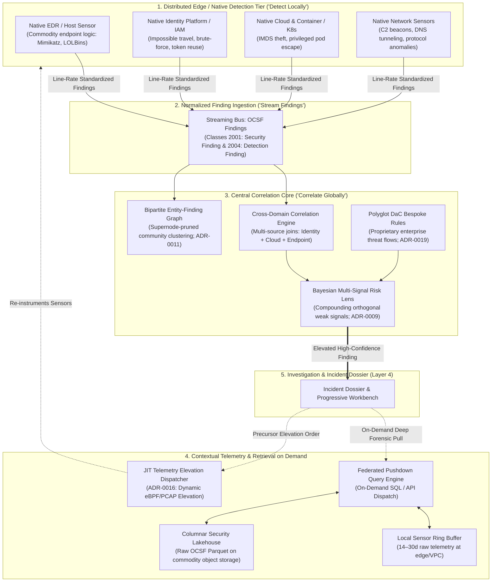

# 0023. Distributed Detection & Edge-to-Center Correlation

* Status: accepted
* Deciders: Architecture Team, Detection Engineering Leads, SecOps Leads, Harry
* Date: 2026-09-22

Technical Story: RFC-0023 / Distributed Detection Architecture & Telemetry Retention on Demand

---

## Context and Problem Statement

A naive reading of centralized security architectures can lead to the "Central Ingestion Anti-Pattern":
$$\text{Raw Telemetry} \longrightarrow \text{Central Data Plane} \longrightarrow \text{Central Detection Engine}$$

In large-scale enterprise environments, attempting to stream, normalize, and evaluate every commodity telemetry event (every routine process execution, DNS lookup, and flow record) within a single central detection cluster introduces severe architectural dysfunctions:
1. **Bandwidth and Ingestion Inefficiencies**: Streaming petabytes of commodity endpoint, identity, and cloud logs to a central cluster incurs unsustainable transit and cloud ingestion costs, recreating the legacy SIEM billing bottleneck.
2. **Duplicative Compute**: Specialized native security controls—such as Endpoint Detection and Response (EDR), Network Detection and Response (NDR), Cloud Native Application Protection Platforms (CNAPP), and Identity Providers (IdPs)—already maintain deep in-memory semantic state, kernel hooks, and specialized commodity detection logic optimized for their specific domain.
3. **The "Alerts-Only" Threat**: Conversely, swinging to the opposite extreme of ingesting *only* alerts without context blinds security operations, leaving investigators unable to reconstruct timelines or perform retroactive threat hunting.

How should TIDIR distribute detection authority across native edge controls and the central correlation core without incurring unsustainable ingestion costs or regressing into an alerts-only silo?

---

## Decision Drivers

* **First-Class Architectural Maxim**: *"Detect as close to the authoritative signal as practical; correlate as centrally as necessary."*
* **Preservation of Telemetry Preservation (Invariant 1)**: Raw telemetry must remain queryable and forensically reconstructable; native detection must not be used as an excuse to discard investigative evidence.
* **Separation of Commodity vs. Cross-Domain Detection**: Allow native domain controls (EDR, NDR, CNAPP, IdP) to own commodity detection primitives, while TIDIR central engines focus on high-order cross-domain correlation, entity graphs, and bespoke enterprise business logic.
* **Economic & Scalable Query Topology**: Retain high-volume raw telemetry cheaply at the edge or in decoupled columnar lakehouse storage, relying on dynamic on-demand retrieval and Just-in-Time (JIT) sensor elevation for investigations.

---

## Considered Options

* **Option 1: Monolithic Central Detection (Centralize-to-Detect)**: Ingest all raw logs into a central stream processor; run all rules (from commodity string matches to complex multi-source joins) centrally.
* **Option 2: Alerts-Only Integration (Alerts Aggregator)**: Ingest only alerts emitted by third-party vendor consoles; discard or ignore raw telemetry.
* **Option 3: Distributed Detection with Central Correlation & Context on Demand (Selected)**: Enforce a distributed detection hierarchy where native domain controls execute local commodity detections and emit normalized OCSF Finding records (Class 2001/2004), while TIDIR's central engine executes cross-domain graph correlation and scheduled lakehouse analytics. Raw contextual telemetry is retained locally/cheaply and retrieved dynamically via federated pushdown and JIT elevation ([ADR-0016](0016-just-in-time-telemetry-elevation-and-ephemeral-forensics.md)).

---

## Decision Outcome

Chosen option: **Option 3: Distributed Detection with Central Correlation & Context on Demand**.

TIDIR codifies a multi-tier detection topology that maximizes local sensor authority while maintaining central epistemic synthesis:

### The Detection Placement Policy Matrix

TIDIR rejects the concept of a monolithic "Detection Engine." Real-world enterprise defense distributes detection logic across specialized runtimes based on explicit engineering criteria:

| Detection Tier | Typical Runtimes | Primary Responsibilities & Detection Classes | Placement Criteria & Constraints |
| :--- | :--- | :--- | :--- |
| **1. Specialized Edge Controls** | EDR (Defender for Endpoint, CrowdStrike Falcon), CNAPP (Wiz, Prisma, Defender for Cloud), IdP/ITDR (Entra ID, Okta, Defender for Identity), NDR (Zeek, Corelight) | Known exploit signatures, memory tampering, LOLBin abuse, privileged container escape, impossible travel, and line-rate protocol anomalies. | **Latency**: $\lt 1\text{s}$. **Scope**: Local host, container, or single protocol stream. **Action**: Direct pre-execution block or local quarantine. |
| **2. High-Throughput Streaming** | Flink, Vector, Cribl, Kafka Streams | Event-time windowed aggregations, sliding rate thresholds (e.g. $\gt 100$ failed logins in 60s), and continuous stateless filtering. | **Latency**: $\lt 5\text{s}$. **Scope**: Ephemeral event stream across identical classes. **Depth**: In-memory sliding windows ($\le 15\text{m}$). |
| **3. Central SIEM / Correlation Core** | Microsoft Sentinel, Splunk, Elastic | Cross-cloud and multi-source event correlation, standard operational triage playbooks, and enterprise rule lifecycles. | **Latency**: $\lt 60\text{s}$. **Scope**: Multi-vendor audit logs, IAM events, and aggregated edge findings. **Depth**: 7–30 days hot index. |
| **4. Security Lakehouse Analytics** | Databricks, Snowflake, ClickHouse, Apache Iceberg | Complex timeseries baseline deviations, rare-event clustering, 30–90 day historical retro-hunting, and heavy graph analysis. | **Latency**: 5–60 minutes (Scheduled batch / micro-batch). **Scope**: Petabyte-scale enterprise historical data. **Depth**: 30–365+ days columnar storage. |
| **5. Cross-Domain Orchestrator** | TIDIR Orchestration Plane | Multi-control finding synthesis, Bipartite Entity-Finding Graph community clustering, Bayesian risk score compounding, and closed-loop containment gating. | **Latency**: Event-driven on elevated finding ingress. **Scope**: Enterprise-wide cross-domain state of record. **Depth**: Active incident lifecycle. |

### Three First-Class Interface Types via OCSF

To avoid the anti-pattern of indiscriminately shipping all raw telemetry into a single monolithic repository, TIDIR formally distinguishes three interface types grounded in OCSF:

1. **Telemetry (Observations)**: Raw factual records emitted by endpoints, networks, cloud providers, and applications. Mapped to **OCSF Categories 1, 3, 4, and 6** (e.g. `1007: Process Activity`, `3001: Authentication`, `4001: Network Connection`). Telemetry is retained in cost-effective columnar lakehouses or edge ring buffers and queried on demand.
2. **Findings (Evaluative Intelligence)**: Evaluative outputs produced by specialized detection engines and controls. Mapped strictly to **OCSF Category 2 (Class 2001: Security Finding and Class 2004: Detection Finding)**. Findings carry threat framework mappings (MITRE ATT&CK), analytic identifiers, and pointers to triggering evidence. Native domain controls stream findings into TIDIR at line rate.
3. **Context (Security Knowledge)**: Ground-truth reference information used to interpret observations and findings. Mapped to **OCSF Standard Objects** (`Device`, `User`, `Account`, `Process`, `Cloud`, `Digital Signature`) and organized into the **Bipartite Entity-Finding Graph ([ADR-0011](0011-bipartite-entity-finding-graph-consolidation.md))**. Context tracks identity resolution, asset criticality tiers, exposure paths, and governing controls.

### Overcoming the "Alerts-Only" Vulnerability
 
TIDIR explicitly rejects the alerts-only model. When an investigation or triage agent requires deeper evidence, the platform uses three deterministic mechanisms:
1. **Federated Context Pushdown**: The central query engine pushes targeted queries down to edge ring buffers or low-cost columnar lakehouses without requiring continuous bulk streaming.
2. **Pre-Trigger Ring Buffering & Just-in-Time (JIT) Elevation ([ADR-0016](0016-just-in-time-telemetry-elevation-and-ephemeral-forensics.md))**:
   - *The Inception Gap Countermeasure*: Attackers execute in memory seconds before an alert fires; elevated collection requested post-trigger misses the initial execution artifact. TIDIR edge forwarders maintain a rolling local in-memory/NVMe ring buffer of high-resolution kernel and network events (preceding 30–60 minutes).
   - *Elevation Order Execution*: When a precursor alert or JIT elevation order is received, the agent captures the historical pre-trigger buffer alongside the forward elevated window ($\le 30\,\text{min}$), guaranteeing capture of the initial exploit vector.
3. **Vendor Context Preservation in `unmapped_data`**:
   - To prevent losing high-value vendor proprietary forensics when translating disparate native alerts (e.g. CrowdStrike Falcon IOAs, Microsoft Defender DeviceEvents, AWS GuardDuty anomalous API call trees) into generic OCSF Class 2001/2004 records, the normalization engine encapsulates the complete native vendor payload inside the OCSF `unmapped_data` dictionary ([ADR-0002](0002-preserve-unmapped-telemetry-in-ocsf.md)), strictly upholding Invariants 1 and 2.

---

### Positive Consequences

* **Predictable Ingestion and Bandwidth Scaling**: Eliminates the requirement to continuously stream every routine OS event to a centralized cluster; raw telemetry is normalized and retained in tiered columnar storage or edge buffers.
* **Direct Use of Domain-Specific Native Controls**: Uses detection capabilities already running inside specialized EDR, NDR, and cloud platforms rather than re-evaluating commodity signatures centrally.
* **High-Fidelity Central Triage**: The central correlation engine focuses compute budget on what actually requires cross-domain synthesis: multi-hop entity graphs, Bayesian evidence compounding, and automated case dossiers.

### Negative Consequences

* **Heterogeneous Finding Normalization**: Native alerts arrive in vendor-specific formats (e.g. Defender alerts, CrowdStrike detections, AWS GuardDuty findings). They must be continuously normalized into canonical OCSF Class 2001 (Security Finding) and Class 2004 (Detection Finding) schemas.
* **Federated Query Latency**: Pulling contextual telemetry on demand across remote VPCs or edge buffers has higher latency (1–5 seconds) than querying a local in-memory hot index. Mitigation: The progressive disclosure workbench presents finding summaries immediately while background workers retrieve deep forensic context asynchronously.

---

### Architectural Invariant Mapping

* **Preserves Invariant 1 (Telemetry Preservation)**: Raw telemetry is not destroyed; it is retained in cost-effective columnar lakehouses or edge buffers, fully queryable via federated pushdown.
* **Preserves Invariant 2 (Evidence Traceability)**: Native findings must carry explicit pointers to their source observation records, ensuring the Incident Decision DAG maintains unbroken provenance back to underlying raw events.
* **Preserves Invariant 3 (Evidential Independence)**: When an edge EDR finding and an NDR finding are generated from the same network packet or process execution, the central correlator discounts their shared ancestry rather than double-counting them.
* **Preserves Invariant 8 (Graceful Defensive Degradation)**: If central correlation engines become degraded, edge controls continue autonomous local detection and containment without total operational failure.
* **Preserves Invariant 11 (Operational Portability)**: Standardizing edge findings on OCSF Classes 2001/2004 prevents vendor lock-in to proprietary alert ecosystems.

---

## Pros and Cons of the Options

### Option 1: Monolithic Central Detection

* Good: Single query interface for all data; uniform rule syntax across all events.
* Bad: High cloud ingestion, streaming, and compute costs.
* Bad: Re-implements commodity EDR/NDR logic centrally with high latency.

### Option 2: Alerts-Only Integration

* Good: Cheap and lightweight central console.
* Bad: Complete forensic blindness; impossible to reconstruct incident timelines or discover novel lateral movement.
* Bad: Violates Invariant 1 (Telemetry Preservation).

### Option 3: Distributed Detection with Central Correlation & Context on Demand (Selected)

* Good: Optimal balance of edge processing efficiency and central cross-domain correlation.
* Good: Substantially reduces cloud egress and ingestion bills while preserving full forensic reconstructability.
* Good: Enforces vendor-neutral OCSF schemas at the boundary while letting native platforms handle domain-specific execution.
* Bad: Requires reliable federated query pushdown and OCSF finding normalization workers.
