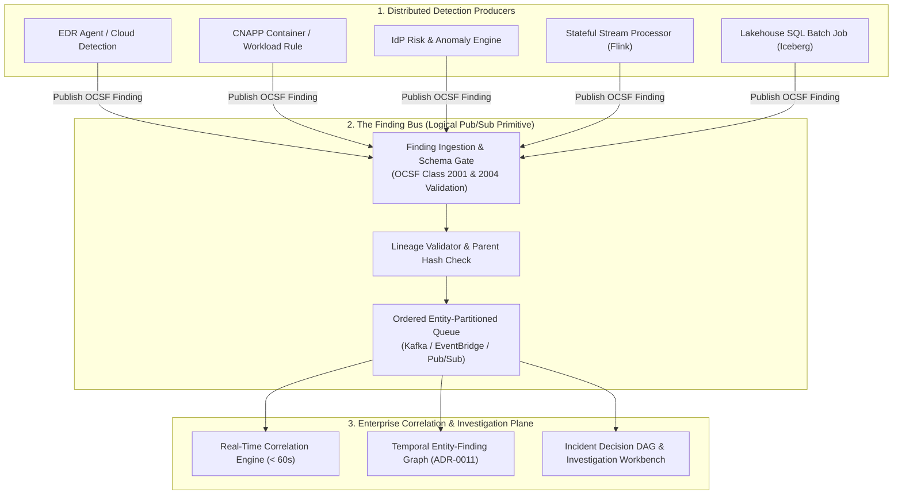

# 0024. Finding Bus Architecture, Lineage & OCSF Finding Contract

* Status: accepted
* Deciders: Architecture Team, Detection Engineering Leads, SecOps Leads, Harry
* Date: 2026-09-23

Technical Story: RFC-0024 / Finding Bus Architecture & Vendor-Neutral Finding Contract

---

## Context and Problem Statement

As established in [ADR-0023](0023-distributed-detection-and-edge-to-center-correlation.md) and the [Strategic Position Paper](../architecture/distributed-detection-and-the-finding-bus.md), enterprise security operations inherently operate across distributed detection engines: Endpoint Detection and Response (EDR), Cloud-Native Application Protection Platforms (CNAPP), Identity Providers (IdP), stateful streaming engines, and lakehouse batch analytics.

However, distributing detection creates two severe architectural failure modes:

1. **The Integration N-to-M Coupling Bottleneck**: Without a standardized architectural boundary, every detection engine must be integrated individually into case management, SIEM, or SOAR platforms using proprietary vendor application programming interfaces (APIs) and JSON formats.
2. **Corroboration Inflation (Violation of Invariant 3)**: When an endpoint sensor detects memory injection, it emits an alert. A cloud XDR platform ingests this alert, enriches it, and produces an XDR incident. A SIEM subsequently ingests the XDR incident and generates an alert. If a downstream correlation engine treats these three events as independent corroborating observations, it artificially inflates incident confidence:
   $$\text{Confidence}_{\text{inflated}} = 1 - \prod_{i=1}^{n} (1 - P(E_i)) \gg P(\text{Root Observation})$$
   *Treating co-derived alerts as independent evidence artificially drives Bayesian confidence towards certainty, leading to alert fatigue and erroneous automated containment.*

How can TIDIR provide an open, vendor-neutral publish-subscribe boundary that decouples distributed detection producers from correlation consumers while strictly preserving evidence lineage and preventing corroboration inflation?

---

## Decision Drivers

* **Invariant 1 (Telemetry Preservation) & Invariant 2 (Evidence Traceability)**: A finding must be an evidence-backed assertion pointing immutably back to its underlying raw telemetry; it must never be an ungrounded or synthetic claim.
* **Invariant 3 (Dependency-Aware Confidence)**: Co-derived signals sharing common ancestry must be identified and discounted by correlation engines.
* **Invariant 11 (Operational Portability & Exit)**: Finding schemas must be completely open and vendor-neutral, preventing lock-in to proprietary SIEM or XDR alert formats.
* **Zero Custom Schemas (Anti-XKCD-927)**: Ground the architecture in existing industry standards (Open Cybersecurity Schema Framework [OCSF] and OpenTelemetry [OTel]) rather than inventing a bespoke TIDIR schema.
* **Strict Cost/ROI Exclusion**: Frame all architectural trade-offs in terms of distributed systems physics (line-rate bandwidth, stateful window memory, and delivery latency budgets).

---

## Considered Options

* **Option 1: Proprietary Central Alert Table**: Aggregate all vendor alerts into a monolithic relational database or vendor-specific SIEM incident table.
* **Option 2: Raw Telemetry Streaming as Sole Boundary**: Force all distributed detectors to write raw events to a single streaming bus, deferring all detection and correlation to a central engine.
* **Option 3: Logical Finding Bus with OCSF Finding Contract & Graph Lineage (Selected)**: Establish a vendor-neutral publish-subscribe Finding Bus standardized on OCSF Category 2 (Class 2001: Security Finding and Class 2004: Detection Finding). Mandate explicit `root_evidence_ids`, `parent_finding_ids`, and W3C Trace Context in every payload to enable deterministic lineage traversal in the Evidence Directed Acyclic Graph (DAG).

---

## Decision Outcome

Chosen option: **Option 3: Logical Finding Bus with OCSF Finding Contract & Graph Lineage**.

TIDIR codifies the **Finding Bus** as a first-class architectural primitive positioned between distributed detection producers and the multi-plane correlation core:

### 1. The OCSF Finding Contract Specification

Producers on the Finding Bus MUST emit payloads complying with **OCSF Class 2004 (Detection Finding)** or **Class 2001 (Security Finding)**. Payloads MUST include the following normative fields:

| Field Name | Type | Normative Requirement | Description |
| :--- | :--- | :--- | :--- |
| `finding_id` | `UUIDv4` | **MUST** | Globally unique identifier for this specific finding assertion. |
| `producer` | `String` | **MUST** | Fully qualified producer name (e.g. `edr.crowdstrike`, `stream.flink.tidir`). |
| `detector.id` | `String` | **MUST** | Machine-readable rule or detector identifier (e.g. `DET-0042`). |
| `detector.version` | `String` | **MUST** | Semantic version string of the detection rule (e.g. `1.4.0`). |
| `detector.type` | `Enum` | **MUST** | `STREAMING`, `SCHEDULED_SQL`, `EDGE_HEURISTIC`, or `ML_ANOMALY`. |
| `finding_type` | `String` | **MUST** | Specific threat or behavior classification (e.g. `CREDENTIAL_ACCESS`). |
| `confidence` | `Float` | **MUST** | Bounded local detector confidence $c \in [0.0, 1.0]$. |
| `severity_id` | `Integer` | **MUST** | OCSF standard severity identifier (1=Informational, 2=Low, 3=Medium, 4=High, 5=Critical). |
| `observed_time` | `String` | **MUST** | RFC 3339 timestamp marking the exact occurrence of the detected activity. |
| `evidence_pointers` | `Array<EvidenceRef>` | **MUST** | URIs, query strings, and SHA-256 hashes referencing the underlying raw telemetry. |
| `lineage.root_evidence_ids` | `Array<UUIDv4>` | **MUST** | Identifiers of the root raw telemetry events that triggered this detection. |
| `lineage.parent_finding_ids` | `Array<UUIDv4>` | **MUST** | Identifiers of any upstream findings consumed to generate this finding (empty if primary). |
| `lineage.trace_context` | `String` | **SHOULD** | W3C `traceparent` header linking distributed telemetry processing. |

### 2. Lineage De-Duplication & Bayesian Discounting

When a correlation engine processes findings from the Finding Bus, it evaluates signal independence using graph ancestry:

$$\text{Ancestry}(F_k) = \{ \text{root\_evidence\_ids}(F_k) \} \cup \bigcup_{P \in \text{parent\_findings}(F_k)} \text{Ancestry}(P)$$

If two findings $F_A$ and $F_B$ arrive such that:
$$\text{Ancestry}(F_A) \cap \text{Ancestry}(F_B) \neq \emptyset$$

The correlation engine MUST recognize that $F_A$ and $F_B$ are co-derived signals. The joint probability cannot be calculated assuming statistical independence ($P(A \cap B) \neq P(A) \cdot P(B)$). Instead, the engine discounts the secondary finding:

$$P(\text{Incident} \mid F_A, F_B) = P(\text{Incident} \mid F_A) + (1 - \text{OverlapRatio}) \cdot P(F_B \mid \neg F_A)$$
*This equation ensures that when signals share underlying raw observations, the correlation engine discounts the overlapping portion, preventing artificial amplification of incident severity.*

---

## Positive Consequences

* **Decoupled Architecture**: Distributed detectors (EDR, CNAPP, cloud SQL, stream processors) publish to a single logical contract without needing point-to-point integrations with case management tools.
* **Corroboration Integrity**: Explicit ancestry tracking eliminates artificial confidence inflation from cascaded vendor alerts.
* **Bandwidth & Compute Optimization**: Real-time correlation engines process high-value findings at $O(\text{thousands}/\text{second})$ rather than raw line-rate telemetry at $O(\text{billions}/\text{day})$.
* **Open Standard Portability**: Anchoring strictly in OCSF Category 2 ensures enterprise portability across any underlying message broker (Apache Kafka, Redpanda, AWS EventBridge, Azure Event Hubs, Google Pub/Sub).

---

## Negative Consequences & Trade-offs

* **Adapter Development Overhead**: Proprietary third-party controls that do not natively emit OCSF Class 2004 findings require lightweight ingest transform workers to map vendor alerts into the contract envelope.
* **Clock Skew Sensitivity**: Distributed detectors emitting findings with unsynchronized system clocks can disrupt time-windowed stream correlation; all producers must enforce Network Time Protocol (NTP) synchronization within $\pm 100\text{ms}$.

---

## Architectural Invariant Mapping

* **Preserves Invariant 1 (Telemetry Preservation)**: Findings never replace raw telemetry; every finding embeds `evidence_pointers` referencing preserved raw records in the lakehouse or hot index.
* **Preserves Invariant 2 (Evidence Traceability)**: Full lineage from raw telemetry UUIDs through intermediate findings is permanently preserved.
* **Preserves Invariant 3 (Dependency-Aware Confidence)**: Ancestry graph intersection prevents co-derived alerts from falsely multiplying confidence.
* **Preserves Invariant 11 (Operational Portability & Exit)**: Pure OCSF schema guarantees that security conclusions are readable by any conforming technology stack.

---

## Empirical Validation Strategy

1. **Schema Compliance Synthetic Tests**: CI pipelines execute automated schema validation testing against all detection rule outputs using the OCSF 1.3+ JSON Schema validator.
2. **Corroboration Inflation Chaos Test**: Introduce synthetic chained alerts (EDR alert $\to$ XDR finding $\to$ SIEM incident) referencing identical root event UUIDs; verify that the Bayesian correlation engine outputs a confidence score equal to a single observation rather than a compound score.
3. **Partition & Backpressure Replay Test**: Simulate a 1-hour correlation engine outage; verify that the Finding Bus retains findings without message loss and supports deterministic catch-up replay.
