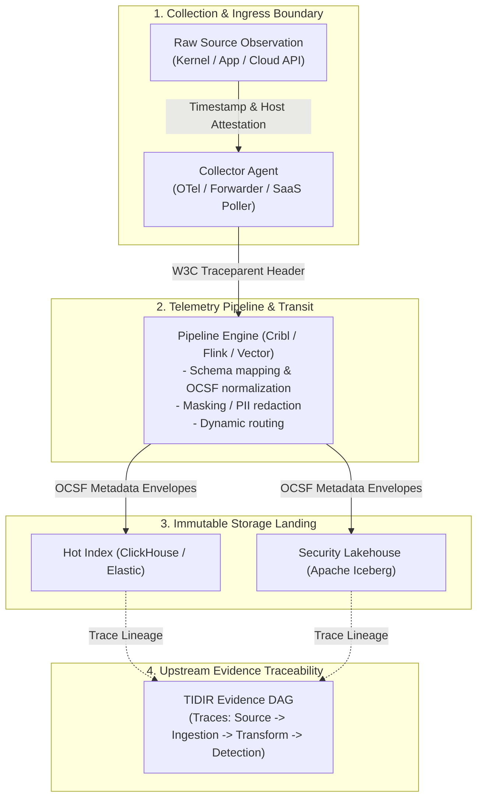

# 0025. Pre-Detection Telemetry Provenance, Pipeline Lineage & Loss Semantics

* Status: accepted
* Deciders: Architecture Team, Data Engineering Leads, SecOps Leads, Harry
* Date: 2026-09-23

Technical Story: RFC-0025 / Telemetry Ingestion Lineage & Upstream Forensics

---

## Context and Problem Statement

The TIDIR Evidence Directed Acyclic Graph (DAG) (introduced in [ADR-0004](0004-defensive-ai-runtime-and-prompt-injection-firewall.md)) provides rigorous cryptographic proof for decisions made during an investigation. However, in enterprise environments operating blended multi-inlet telemetry fabrics—combining OpenTelemetry (OTel) collectors, telemetry pipelines (e.g. Cribl Stream, Apache NiFi, Vector), streaming buses (Apache Kafka, Redpanda), and dual-tier storage (hot indexes and Apache Iceberg lakehouses)—telemetry undergoes significant transformation *before* detection engines or analysts ever evaluate it:

1. **The Ingestion Blind Spot**: Events are filtered, masked, sampled, and schema-transformed across intermediate hops. When a detection fails to trigger, engineers cannot deterministically determine whether the detection logic was flawed, or whether the required telemetry fields were dropped or corrupted upstream in transit.
2. **Ambiguous Loss Semantics**: High-throughput pipelines often drop packets under burst conditions or apply probabilistic sampling (e.g. dropping 90% of routine NetFlow or DNS queries). Without explicit loss metadata, downstream analytics cannot differentiate between legitimate zero-activity periods and network transmission drops:
   $$\text{Observed Rate} = 0 \implies (\text{No Adversary Activity}) \lor (\text{Collector Buffer Overflow Drop})$$
   *Failing to distinguish true absence from packet loss invalidates baselines and creates silent detection blind spots.*
3. **Forensic Chain-of-Custody Gaps**: In high-stakes regulatory or legal proceedings, security teams must prove that security logs were not altered, truncated, or tampered with between collection and long-term storage.

How should TIDIR extend evidence provenance backwards into the ingestion pipeline, across both open observability fleets and proprietary vendor inlets, without imposing prohibitive performance overhead?

---

## Decision Drivers

* **Invariant 1 (Telemetry Preservation) & Invariant 2 (Evidence Traceability)**: Every piece of evidence admitted to an investigation must have a verifiable lineage tracking back to its initial collection source.
* **The Blended Enterprise Reality**: Ingestion pipelines are heterogeneous. The architecture must accommodate open, white-box collectors (OTel, Fluentbit) where deep byte-level lineage is available, as well as proprietary, black-box vendor controls (EDR SaaS, CloudTrail) where provenance can only be attested at the ingestion boundary.
* **Open Standards First**: Adopt the W3C Trace Context specification (`traceparent`, `tracestate`) and Open Cybersecurity Schema Framework (OCSF) standard metadata objects rather than inventing proprietary headers.
* **Computational Overhead Bounds**: Lineage tracking must not introduce heavy cryptographic hashing on line-rate streaming events; it must scale efficiently to millions of events per second ($10^6\,\text{EPS}$).

---

## Considered Options

* **Option 1: Complete Event Hashing (Every Hop Hash)**: Calculate SHA-256 hashes of every individual telemetry event at every pipeline hop and record them in an append-only ledger.
* **Option 2: No Upstream Provenance (Rely on Storage Immutability)**: Assume telemetry pipelines are trusted black boxes; begin evidence tracking only when an event lands in the hot index or lakehouse.
* **Option 3: W3C Trace Context Propagation with Micro-Batch Transformation Lineage (Selected)**: Propagate W3C `traceparent` headers through streaming buses and micro-batch processors. Pipelines record transformation schemas and loss semantics in OCSF `metadata.transforms` envelopes, while raw event blocks land in immutable object storage with cryptographic block manifests.

---

## Decision Outcome

Chosen option: **Option 3: W3C Trace Context Propagation with Micro-Batch Transformation Lineage**.

TIDIR extends evidence provenance upstream to the initial collection boundary by standardizing pipeline metadata and delivery semantics:



### 1. The OCSF Ingestion Provenance Schema

Telemetry normalized to OCSF MUST populate the `metadata` object with standard provenance and loss fields:

```
metadata (OCSF Extension)
├── version: "1.3.0"
├── log_provider: String ("cribl-stream-prod", "otel-collector-k8s")
├── sequence_number: Int64 (Monotonically increasing collector sequence)
├── collection_time: RFC3339 Timestamp (When agent captured the event)
├── processed_time: RFC3339 Timestamp (When pipeline transformed the event)
├── trace_context:
│   ├── traceparent: "00-4bf92f3577b34da6a3ce929d0e0e4736-00f067aa0ba902b7-01"
│   └── tracestate: "tidir=stage:normalize;loss:at_least_once"
├── loss_semantics: Enum ("AT_LEAST_ONCE", "EXACTLY_ONCE", "SAMPLED_PROBABILISTIC", "BEST_EFFORT_LOSSY")
├── sample_rate: Float (1.0 = 100% full fidelity; 0.1 = 10% sampled)
└── transforms: Array<TransformRecord>
    ├── stage: String ("PII_MASKING", "OCSF_NORMALIZATION")
    ├── engine_version: String ("cribl-4.5.1")
    └── schema_hash: String (SHA-256 of the active transform rule)
```

### 2. Loss Semantics & Mathematical Baseline Correction

When downstream detection engines or behavioral baseline models process sampled or lossy telemetry streams, they MUST inspect the `loss_semantics` and `sample_rate` fields to correct rate calculations:

$$\text{True Estimated Frequency} = \frac{\text{Observed Event Count}}{\text{sample\_rate}}$$

If `loss_semantics` indicates `BEST_EFFORT_LOSSY` and the pipeline reports buffer overflow metrics, the detection engine MUST NOT conclude that absence of events proves absence of threat activity. The detection engine flags the observation interval as `UNRELIABLE_TELEMETRY` (**Invariant 8: Degraded Defence**).

### 3. Black-Box vs. White-Box Inlets

The architecture distinguishes two tiers of upstream visibility:

* **White-Box Inlets (Open Observability Fleets)**: OTel collectors, Fluentbit, and internal forwarders MUST inject W3C trace headers and monotonically increasing sequence numbers per agent session. Packet drops at the collector buffer are logged as explicit dropped-packet telemetry metrics.
* **Black-Box Inlets (Proprietary SaaS Controls)**: For controls like Defender, Falcon, or AWS GuardDuty where internal pipelines cannot be instrumented, the TIDIR API ingestion worker acts as the attestation authority, recording the SaaS export timestamp, API query parameters, and payload SHA-256 hash at the boundary.

---

## Positive Consequences

* **Elimination of Pipeline Blind Spots**: Detection engineers can trace failed detections directly to upstream pipeline filters or schema transformations.
* **Forensic Non-Repudiation**: Evidence admitted to cases carries cryptographic and schema-level proof of how it was processed, satisfying stringent audit and regulatory requirements.
* **Accurate Behavioral Baselines**: Explicit sampling and loss metadata prevents algorithms from confusing network transmission drops with peaceful baselines.
* **Standard-Based Interoperability**: Grounding in W3C Trace Context and OCSF metadata ensures zero vendor lock-in to proprietary pipeline formats.

---

## Negative Consequences & Trade-offs

* **Ingress Payload Size Expansion**: Adding `metadata.trace_context` and `transforms` adds approximately 150 to 250 bytes per event envelope. In high-volume environments, this is mitigated by compressing intermediate transport blocks and storing shared pipeline hashes at the Parquet file-metadata level rather than repeating full strings per row.
* **Pipeline Configuration Governance**: Telemetry pipelines (Cribl, Vector) must be governed via GitOps to ensure that transform hashes remain auditable against version-controlled configuration repositories.

---

## Architectural Invariant Mapping

* **Preserves Invariant 1 (Telemetry Preservation)**: Ensures that sampling and filtering decisions are recorded explicitly; prevents silent, unmonitored telemetry drops.
* **Preserves Invariant 2 (Evidence Traceability)**: Extends the forensic chain of custody from the analyst case workbench back to the host operating system kernel.
* **Preserves Invariant 7 (Fail-Secure Posture)**: Pipeline drops or buffer overflows degrade detection confidence rather than silently generating false negatives.
* **Preserves Invariant 10 (Reconstructability)**: Incident Decision DAGs can deterministically reconstruct the exact state and format of telemetry at the time a decision was taken.

---

## Empirical Validation Strategy

1. **Pipeline Mutation & Trace Assertion**: Inject synthetic events with W3C `traceparent` headers into a staging telemetry pipeline; verify that after schema normalization and PII masking, downstream Iceberg tables preserve the identical `traceparent` and append a valid `transforms` hash.
2. **Buffer Overflow Loss Canary**: Stress-test a collector agent with synthetic traffic bursts exceeding buffer limits; verify that the collector emits an explicit `BEST_EFFORT_LOSSY` alert and that downstream detection engines enter a `DEGRADED` confidence state.
3. **Cold Storage Parquet Audit**: Run automated queries against 30 days of cold lakehouse storage verifying that 100% of rows contain valid `collection_time` and `loss_semantics` metadata.
