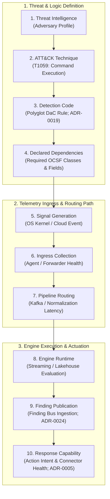
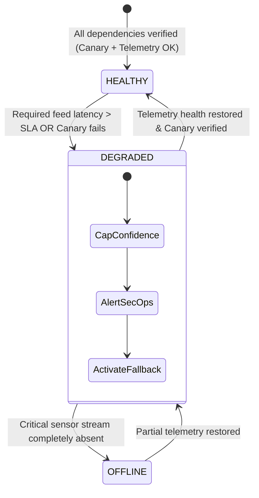

# 0026. End-to-End Coverage Assurance & Degradation Circuit Breakers

* Status: accepted
* Deciders: Architecture Team, Detection Engineering Leads, Purple Team Leads, Harry
* Date: 2026-09-23

Technical Story: RFC-0026 / End-to-End Operational Coverage & Defensive Circuit Breakers

---

## Context and Problem Statement

Security operations centers (SOCs) frequently track defensive capability using static metric dashboards, such as claiming "85% MITRE ATT&CK coverage" because detection rules with matching technique tags are marked as "enabled" in a SIEM or EDR console.

This static paradigm creates a dangerous operational illusion:

> **"Rule enabled" does not mean "operationally covered."**

A detection rule cannot produce a security finding or enable incident response if any upstream or downstream dependency is broken. In real-world enterprise environments, coverage is routinely severed by:
1. **Silent Sensor Failure**: An endpoint sensor's kernel extension is unloaded or corrupted following an operating system patch.
2. **Pipeline Schema Drift**: A firewall or cloud provider updates its log format, causing the telemetry pipeline to fail parser rules and drop required fields.
3. **Queue Ingestion Lag**: Telemetry buses experience severe consumer lag under burst conditions, delaying detection evaluation past real-time containment windows.
4. **Stale Automation Secrets**: An API token or OAuth credential for an orchestration containment connector expires, leaving automated playbooks unable to isolate compromised hosts.

If an organization relies on static rule counts, these silent failures remain completely invisible until an adversary successfully executes an attack undetected. How should TIDIR define, continuously verify, and operationally govern end-to-end detection coverage?

---

## Decision Drivers

* **Invariant 7 (Fail-Secure Posture)**: A failure in telemetry collection, pipeline routing, or detection evaluation must never silently increase attacker reachability.
* **Invariant 8 (Degraded Defence)**: Loss of an upstream telemetry feed or pipeline component must gracefully degrade detection fidelity rather than causing total, silent visibility loss.
* **Invariant 10 (Reconstructability)**: The historical coverage and degradation state of the defensive posture must be deterministically auditable for any point in time.
* **Automated Closed-Loop Governance**: Coverage must be measured programmatically through active validation (continuous purple-team emulation) and telemetry health telemetry, rather than manual administrative checkboxes.

---

## Considered Options

* **Option 1: Static Configuration Audits**: Inspect detection rules and SIEM configurations daily; declare coverage based on whether rules are enabled.
* **Option 2: Periodic Purple-Team Exercises**: Conduct manual penetration testing or purple-team exercises quarterly to validate detection rules.
* **Option 3: Continuous 10-Step Coverage Assurance with Automated Circuit Breakers (Selected)**: Define operational coverage as an unbroken 10-step chain (*Threat $\to$ Technique $\to$ Rule Code $\to$ Required Signals $\to$ Generation $\to$ Collection $\to$ Routing $\to$ Engine Runtime $\to$ Finding Publication $\to$ Response Action*). Combine active purple-team emulation canaries with real-time telemetry dependency monitoring to trigger automated **Degradation Circuit Breakers** that dynamically downgrade rule status and alert security leadership.

---

## Decision Outcome

Chosen option: **Option 3: Continuous 10-Step Coverage Assurance with Automated Circuit Breakers**.

TIDIR establishes that operational coverage is a dynamic runtime property governed by a 10-step verification chain:

### 1. The Operational Coverage Formulation

A specific threat technique $T$ is defined as operationally covered if and only if every link in its verification chain evaluates to true:

$$\text{Covered}(T) = \prod_{k=1}^{10} \mathbb{I}(\text{Step}_k \text{ is operational})$$
*Where $\mathbb{I}(\cdot)$ is the indicator function evaluating to $1$ if the step is verified healthy, and $0$ if degraded or failed. If any single step fails, coverage drops to zero.*

### 2. Automated Degradation Circuit Breakers

Integrating with the inverted telemetry dependencies codified in [ADR-0019](0019-polyglot-detection-as-code-and-native-engine-adaptation.md), the detection engine continuously evaluates the availability and latency of all declared inputs.

When a dependency experiences failure or latency anomalies, the **Degradation Circuit Breaker** trips, executing three automated responses:

1. **Confidence Ceiling Capping**: If an optional or degraded telemetry feed fails, the detection engine mathematically caps the maximum confidence score the rule can output:
   $$\text{Confidence}_{\text{max}} = \text{Confidence}_{\text{nominal}} \times \left( \frac{\text{Healthy Signals}}{\text{Total Declared Signals}} \right)$$
   *Prevents degraded rules from triggering high-impact automated containment actions on partial or corrupted context.*
2. **SecOps Visibility Alerting**: The circuit breaker publishes an internal operational alert to the SOC workbench and telemetry operations board, explicitly identifying the broken pipeline or dropped sensor.
3. **Automated Fallback Engine Activation**: If a real-time streaming engine suffers severe lag ($\gt 60\text{s}$), the circuit breaker switches the rule to its secondary fallback placement (e.g. scheduled micro-batch lakehouse query; [ADR-0021](0021-graceful-degradation-automated-fallback-and-continuity-plan-b.md)).

### 3. Continuous Validation via Canary Emulation

Operational coverage is validated on an automated, scheduled cadence using the **Continuous Purple-Team Harness** ([ADR-0007](0007-continuous-automated-purple-teaming-and-multi-model-consensus.md)):

* **Canary Injections**: Synthetic, benign adversary emulation events (e.g. an innocuous command execution with a specific test GUID) are injected at Step 5 (Generation).
* **End-to-End Assertion**: The harness watches the Finding Bus (Step 9) and response mock (Step 10). If the synthetic canary does not result in a valid finding within the expected latency budget ($t \le t_{\text{budget}}$), the circuit breaker immediately marks the rule as `DEGRADED`.

---

## Positive Consequences

* **True Operational Grounding**: Eliminates the dangerous gap between theoretical rule configuration and actual operational defensive capability.
* **Proactive Outage Detection**: Security teams detect broken sensors, broken parsers, or expired API tokens *before* an adversary exploits the blind spot.
* **Deterministic Fail-Secure Behavior**: Confidence ceilings prevent corrupted or incomplete telemetry feeds from generating false-positive containment storms.
* **Continuous Compliance Proof**: Provides mathematical, auditable evidence of defensive readiness for regulatory and executive assurance.

---

## Negative Consequences & Trade-offs

* **Canary Noise Management**: Synthetic purple-team canaries must be meticulously tagged with canary markers to prevent them from waking on-call analysts or triggering real-world incident escalation.
* **Dependency Monitoring Infrastructure**: Requires continuous health probes, metrics, and heartbeat daemons monitoring agents, Kafka consumer groups, and pipeline transformation nodes.

---

## Architectural Invariant Mapping

* **Preserves Invariant 7 (Fail-Secure Posture)**: Prevents component degradation from silently expanding adversary reachability.
* **Preserves Invariant 8 (Degraded Defence)**: Gracefully steps down rule sophistication and confidence rather than collapsing visibility entirely.
* **Preserves Invariant 10 (Reconstructability)**: Historical coverage logs allow forensic teams to prove what was, and was not, visible at the time of an intrusion.

---

## Empirical Validation Strategy

1. **Simulated Sensor Severance**: Artificially terminate an endpoint collector process in a staging environment; assert that the Detection-as-Code engine detects telemetry absence within 60 seconds, transitions the corresponding rules to `DEGRADED`, and caps output confidence.
2. **Canary Latency Benchmark**: Execute 1,000 synthetic purple-team canary emulations across diverse network segments; measure end-to-end execution time from injection to Finding Bus publication, asserting $P_{99} \le 15\text{s}$.
3. **Connector Credential Expiration Drill**: Revoke the OAuth token of an automated containment connector in a staging harness; assert that the coverage monitor detects authorization failure and flags Step 10 as `OFFLINE` on the SecOps dashboard.
