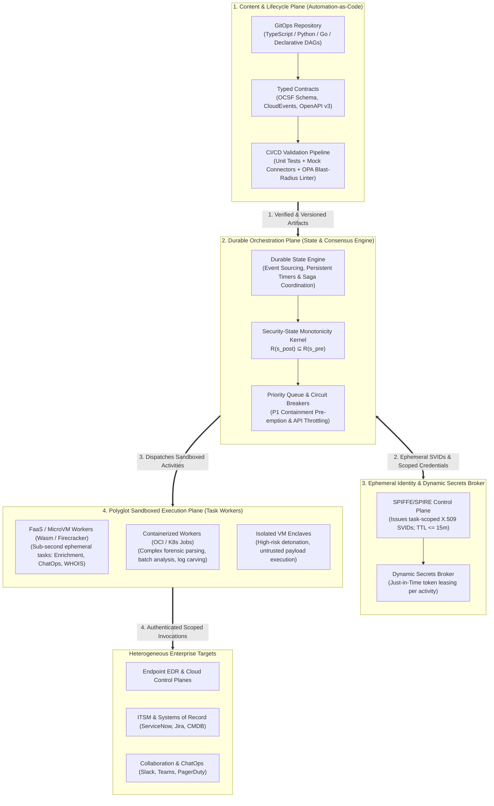

# 0027. First-Principles Workflow Orchestration and Automation-as-Code

* Status: accepted
* Deciders: Architecture Team, SecOps Automation Leads, Platform Engineering, Harry
* Date: 2026-09-23

Technical Story: RFC-0027 / Decoupled Security Workflow Architecture and Polyglot Execution Runtimes

---

## Context and Problem Statement

Security operations teams rely heavily on automation to triage alerts, enrich forensic investigations, coordinate containment, and synchronize status across enterprise systems of record. Historically, organizations addressed this requirement by deploying commercial **Security Orchestration, Automation, and Response (SOAR)** platforms.

However, legacy SOAR platforms suffer from systemic architectural defects that undermine modern software engineering hygiene and introduce operational risks:

1. **The Canvas Trap (Content Without Software Rigor)**: Low-code graphical playbook builders store logic as proprietary, opaque JSON or XML blobs. They lack semantic diffing, native branch testing, automated linting, modular packaging, and headless continuous integration and continuous deployment (CI/CD) test suites. When upstream application programming interfaces (APIs) modify schemas, graphical playbooks break silently in production.
2. **The Ambient Authority Trap (Monolithic Execution & Shared Secrets)**: Legacy SOAR appliances bundle the orchestration engine and script execution runtime into a shared virtual machine. Third-party integrations and custom Python scripts execute with shared operating system memory and ambient network access, drawing static API keys (EDR, Cloud IAM, firewalls, ITSM) from a central vault. A vulnerability or malicious dependency in an enrichment script exposes critical enterprise containment credentials.
3. **The Reactive Silo Trap (Alert-Only Triggering)**: Legacy SOAR treats automation as a terminal webhook executed solely after an alert fires. In reality, modern security automation is a continuous operational mesh that spans streaming ingestion normalization, just-in-time (JIT) telemetry elevation, bipartite entity graph traversal, analyst workbench interaction, blast-radius containment, systems of record synchronization, and closed-loop infrastructure tuning.

How should TIDIR design workflow and automation capabilities from first principles, ensuring code-first development, durable orchestration, sandboxed polyglot execution, and strict least-privilege security?

---

## Decision Drivers

* **Invariant 4 (No Self-Granting Authority)**: Automated workflows may propose state changes or execute deterministic tasks, but authorization gates for high-impact actions must remain verifiable and external to probabilistic reasoning.
* **Invariant 5 (Least Capability)**: Execution workers must operate with task-scoped, ephemeral authority (e.g. SPIFFE SVIDs with $\text{TTL} \le 15\text{m}$) rather than long-lived ambient master credentials.
* **Invariant 7 (Fail-Secure Posture)**: Workflow orchestration must enforce **Security-State Monotonicity** ($R(s_{\text{post}}) \subseteq R(s_{\text{pre}})$); downstream task failures must never roll back established containment controls.
* **Invariant 11 (Operational Portability & Exit)**: Workflow logic, connectors, and schemas must not be locked into a proprietary graphical orchestration appliance.
* **Modern Engineering Hygiene**: Support version-controlled code, unit testing against mock APIs, containerization, virtual machines, and Function-as-a-Service (FaaS) runtimes.

---

## Considered Options

* **Option 1: Centralized Legacy SOAR Appliance**: Deploy an off-the-shelf commercial or open-source low-code SOAR platform with a centralized playbook repository and shared worker nodes.
* **Option 2: Ad-Hoc Serverless Scripts**: Implement automation as disparate cloud functions (e.g. AWS Lambda / Google Cloud Functions) invoked directly by alert webhooks without a unified state machine.
* **Option 3: Decoupled 4-Plane Automation Architecture with Polyglot Sandboxed Compute (Selected)**: Decompose workflow automation into four decoupled layers:
  1. *Content & Lifecycle Plane (Automation-as-Code / AaC)*: Code-first workflows and strongly typed schema contracts versioned in GitOps.
  2. *Durable Orchestration Plane*: A dedicated state engine managing event sourcing, timers, monotonic sagas, circuit breaking, and concurrency scheduling.
  3. *Polyglot Sandboxed Execution Plane*: Ephemeral, multi-substrate compute (MicroVMs, containers, isolated VMs) executing tasks with zero ambient trust.
  4. *Ephemeral Identity & Dynamic Secrets Broker*: Task-scoped SPIFFE/SPIRE workload attestation and Just-in-Time (JIT) secret leasing.

---

## Decision Outcome

Chosen option: **Option 3: Decoupled 4-Plane Automation Architecture with Polyglot Sandboxed Compute**.

TIDIR formally rejects the monolithic SOAR model. Workflow automation is established as an engineering discipline equal in rigor to Detection Engineering (Polyglot DaC; see [ADR-0019](0019-polyglot-detection-as-code-and-native-engine-adaptation.md)).

---

## Detailed Architectural Mechanisms

### 1. Content & Lifecycle Plane: Automation-as-Code (AaC)

* **Code-First Definition**: Workflows and tasks are authored as modular, readable code in standard software languages (e.g. TypeScript, Python, Go) or typed declarative workflow specifications. Visual representations are generated dynamically from code, not authored in proprietary GUI canvases.
* **Typed Input and Output Contracts**: Payloads passed between workflow activities must adhere to explicit schemas:
  * *Telemetry & Findings*: Conforms to the Open Cybersecurity Schema Framework (OCSF; Classes 2001, 2004).
  * *Execution & Workflow Events*: Conforms to CloudEvents specification envelopes.
  * *Identity & Session Control*: Standardizes on the OpenID Shared Signals and Events (SSE) framework utilizing IETF Security Event Tokens (SETs; RFC 8417). Actuation adapters emit Continuous Access Evaluation Profile (CAEP) events (`session-revoked`, `token-claims-change`) for instant cross-SaaS session termination and Risk and Incident Sharing and Collaboration (RISC) events (`account-credential-compromised`) for federated relying-party isolation, complemented by SCIM event profiles (RFC 8935/8936) for directory synchronization.
* **Pre-Deployment CI/CD Testing**: Every workflow pull request is subjected to automated validation:
  1. *Static Analysis & Type Checking*: Enforces parameter closure and catches missing fields before runtime.
  2. *Unit & Mock Testing*: Runs workflows against mocked external API services (e.g., simulated EDR or ITSM endpoints) to test error handling, retry limits, and compensation logic.
  3. *Blast-Radius Policy Evaluation*: Static policy checkers (e.g. Open Policy Agent / Cedar) verify that playbooks declaring high-impact intents (`ISOLATE_HOST`, `REVOKE_SESSION`) include mandatory consensus gating annotations.

### 2. Durable Orchestration Plane

* **Decoupling State from Compute**: The orchestrator is responsible exclusively for durable state transitions, event sourcing, timers, concurrency control, and deterministic replay. It does not execute untrusted business logic within its own memory space.
* **Enforcing Security-State Monotonicity**:
  $$\forall s \in \mathcal{S}, \quad R(s_{\text{post}}) \subseteq R(s_{\text{pre}})$$
  *Adversary reachability after automated execution must be a subset of reachability prior to execution.*
  If a multi-step containment sequence encounters a downstream API timeout (e.g. host isolation succeeds but identity token revocation fails), the orchestrator never executes reverse compensation. Reversing containment actively restores attacker access. The engine executes **Forward Containment Escalation** (freezing the perimeter and shunting upstream network routes) and pages incident responders.
* **Priority-Based Scheduling & Backpressure**: The orchestrator prioritizes critical containment workflows over background enrichment tasks, preventing queue starvation during widespread enterprise security incidents.

### 3. Polyglot Sandboxed Execution Plane

Compute substrates are chosen dynamically based on activity execution requirements:

| Substrate | Characteristics | Typical Security Use Cases |
| :--- | :--- | :--- |
| **MicroVMs / FaaS** (e.g. Firecracker, WebAssembly, Serverless Functions) | Ephemeral, millisecond cold-start, strictly memory-isolated. | Fast read-only enrichments, IP/DNS reputation queries, ChatOps notifications, ticket updates. |
| **Containerized Workers** (e.g. OCI on Kubernetes / Nomad) | Standard runtime dependencies, configurable CPU/memory limits. | Heavy forensic parsing, large PCAP filtering, memory dump analysis, batch threat-feed correlation. |
| **Isolated Virtual Machines** | Hardware-level hypervisor virtualization, air-gapped network enclaves. | Dynamic malware analysis, detonation of suspicious email attachments, untrusted script reverse-engineering. |

### 4. Ephemeral Identity & Dynamic Secrets Broker

* **Zero Long-Lived Static Secrets**: Execution workers do not store static passwords, long-lived API tokens, or SSH keys.
* **Task-Scoped SPIFFE SVIDs**: Workers receive short-lived X.509 certificates attested via SPIFFE/SPIRE ([AIGOV-06](file:///Users/harrymclaren/Projects/TIDIR/docs/architecture/02-capability-model.md#L143)) with a maximum Time-To-Live of 15 minutes ($\text{TTL} \le 15\text{m}$).
* **Dynamic Secret Leasing**: The secrets broker issues Just-In-Time (JIT) credentials restricted exclusively to the target service and operation authorized for that task. A worker querying a Configuration Management Database (CMDB) receives read-only CMDB tokens; it never has access to firewall or identity administrator keys.

---

## Continuous Operational Automation Spectrum

Automation within TIDIR is not confined to post-alert response. It operates as an unbroken operational mesh across six distinct phases:

1. **Line-Rate & Ingestion (DATA)**: Stream-time schema normalization, dead-letter routing, and real-time matching against edge threat caches.
2. **Contextualization & JIT Elevation (INV / Tier 0)**: Read-only entity resolution, CMDB asset criticality lookups, and triggering JIT ephemeral sensor elevation ([ADR-0016](0016-just-in-time-telemetry-elevation-and-ephemeral-forensics.md)) before volatile memory or logs are overwritten.
3. **Investigation & Collaboration (INV)**: Chronological timeline compilation, hypothesis verification queries via Model Context Protocol (MCP) servers, and ChatOps incident channel hydration.
4. **Responsive Containment (RESP / Tier 1 & Tier 2)**: Blast-radius risk-tiered containment execution governed by Security-State Monotonicity and dual-authorization consensus gates ([ADR-0005](0005-saga-pattern-containment-and-break-glass-protocol.md)).
5. **Recovery & Systems of Record (RESP)**: Infrastructure-as-Code (IaC) workload repaving, credential rotation, and bidirectional synchronization with enterprise ticketing (ServiceNow, Jira) and CMDB systems to maintain single-source-of-truth integrity.
6. **Closed-Loop Feedback (CTI / DET / Green Teams)**: Generating automated pull requests to calibrate Detection-as-Code rules, synthesizing IaC hardening patches for cloud infrastructure teams, and re-seeding ambient deception canaries ([ADR-0013](0013-ambient-deception-fabric-and-canary-anchors.md)).

---

## First-Class Failure Modes & Plan B Continuity

| Failure Mode | Observability ("How We Know") | Continuity Plan B Fallback |
| :--- | :--- | :--- |
| **Orchestration Engine Failure** | Orchestrator heartbeat drop ($\gt 15\text{s}$) or queue consumer starvation. | Fall back to local CLI runbooks and direct containment scripts via emergency break-glass credentials. |
| **Downstream Connector Throttling / 5xx Errors** | Connector circuit breaker trips ($\gt 5\%$ 5xx responses or timeouts over 60s). | Divert automated actions to high-priority operator review queues; execute forward perimeter escalation. |
| **Secrets Broker Partition** | JIT token issuance latency spikes ($\gt 2\text{s}$) or returns 503 unavailable. | Utilize pre-distributed, encrypted offline break-glass tokens stored in air-gapped hardware security modules (HSMs). |
| **Worker Subversion / Payload Compromise** | Container/MicroVM unexpected outbound network socket or syscall anomaly. | Ephemeral sandbox auto-terminates on task exit ($\le 15\text{m}$ TTL); zero ambient secrets or host filesystem access available to compromise. |

---

## Architectural Invariant Mapping

* **Preserves Invariant 4 (No Self-Granting Authority)**: Probabilistic models can propose workflow parameters, but deterministic state engines and policy gates control execution.
* **Preserves Invariant 5 (Least Capability)**: Dynamic SVIDs and JIT credential leasing prevent long-lived privilege accumulation across workers.
* **Preserves Invariant 7 (Fail-Secure Posture)**: State machine enforces Security-State Monotonicity ($R(s_{\text{post}}) \subseteq R(s_{\text{pre}})$), eliminating dangerous automated rollback anti-patterns.
* **Preserves Invariant 10 (Reconstructability)**: Durable workflow event sourcing logs all execution attempts, parameters, and results to the immutable Incident Decision Directed Acyclic Graph (DAG).
* **Preserves Invariant 11 (Operational Portability & Exit)**: Code-first workflows written against standard schemas (OCSF, CloudEvents) eliminate dependency on proprietary vendor SOAR engines.

---

## Positive Consequences

* Eliminates brittle drag-and-drop proprietary playbooks in favor of versioned, testable Automation-as-Code.
* Drastically reduces blast radius of compromised integration scripts by isolating compute into ephemeral sandboxes and using JIT secrets.
* Expands automation coverage across the full operational lifecycle rather than confining it to reactive post-alert containment.
* Provides deterministic recovery and forward escalation guarantees during active security crises.

---

## Negative Consequences

* Requires security operations teams to possess baseline software engineering skills (Git, unit testing, TypeScript/Python) rather than relying on no-code GUI builders.
* Demands infrastructure investment in orchestration control planes (e.g. Temporal, Kubernetes, Vault, SPIRE) rather than deploying a single turnkey SOAR appliance.
