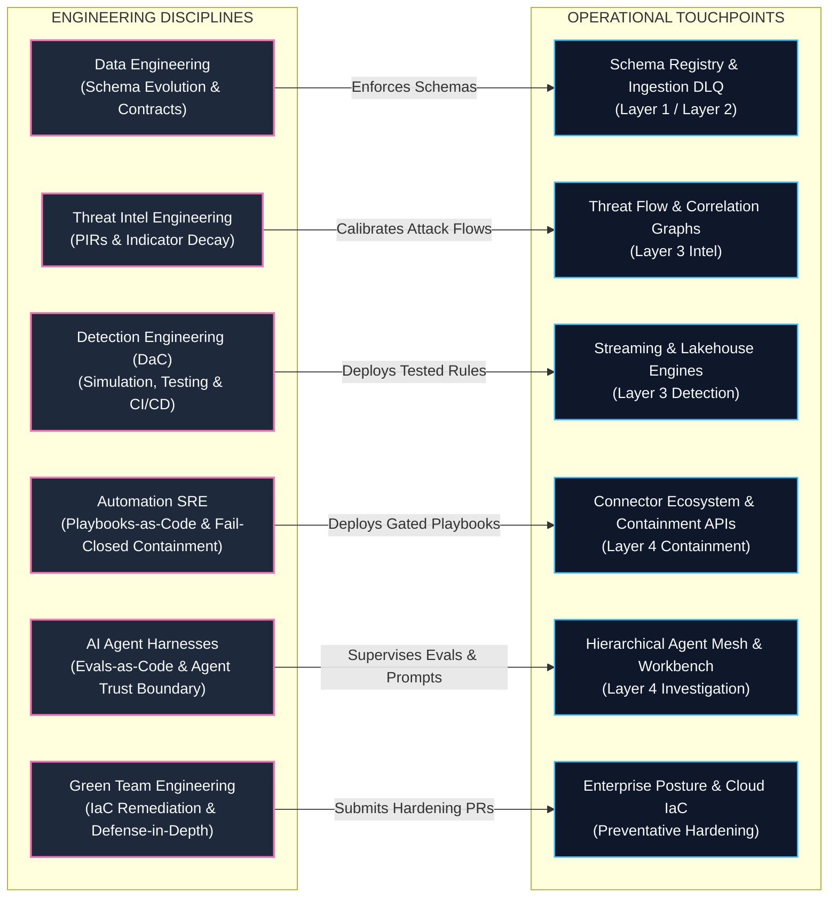

# TIDIR Target System Architecture: Cyber Defence Control System

> **Tier 1: Strategic Architecture** · **Golden Path Step 3 of 5** · **Audience**: Enterprise Architects, SecOps Leaders · **Normative Status**: Normative Architecture  
> **Prerequisites**: [Step 2: Invariants & Constitution](/architecture/00-architectural-invariants) · **Next Step**: [Step 4: Capability Model](/architecture/02-capability-model)

---

This document defines the target component architecture for **TIDIR** (Threat Intelligence, Detection, Investigation & Response). TIDIR is architected as a closed-loop **Cyber Defence Control System** that governs the operational progression:

$$\text{Observe} \longrightarrow \text{Normalise} \longrightarrow \text{Infer} \longrightarrow \text{Investigate} \longrightarrow \text{Decide} \longrightarrow \text{Actuate} \longrightarrow \text{Learn}$$

with deterministic controls wrapped around all probabilistic stages:
* **Observation**: Telemetry & Data Fabric (Layer 1 & 2) collecting raw environmental events.
* **Normalisation**: Open Cybersecurity Schema Framework (OCSF) validation and schema registry mapping.
* **Inference & Threat Estimation**: Stateful streaming detection and dependency-aware Bayesian risk compounding (Layer 3).
* **Investigation**: Bounded hierarchical agent mesh with evidence grounding across entity-finding graphs (Layer 4).
* **Decision**: Universal Incident Decision Directed Acyclic Graph (DAG) recording causal provenance.
* **Actuation & Control**: Monotonic fail-closed containment state machines governed by reachability invariants.
* **Feedback & Learning**: Continuous Red, Blue, and Green Team prevention calibration loops.
* **Resilience**: Four-tier graceful degradation, local NVMe spooling, and air-gapped continuity modes.

---

## Strategic Context: The Four Generations & The Shadow Risk Register

### The Four Generations of Cyber Engineering
To understand why TIDIR is architected as an integrated Cyber Defence Control System rather than an unbundled collection of discrete security tools, consider the historical evolution of the cyber engineering discipline across four distinct archetypes:

1. **Generation 1: The Gatekeeper (Pre-2010)**: Focused on static perimeter defence, network access control lists (ACLs), stateful firewalls, and manual host patching. Control was maintained through physical and logical network boundaries—an operating model that dissolved with the advent of distributed cloud infrastructure, microservices, and dynamic ephemeral APIs.
2. **Generation 2: The Integrator (2010–2020)**: Characterized by the explosion of point solutions, Software-as-a-Service (SaaS), and best-of-breed product acquisition. Security engineers lived inside vendor graphical user interfaces ("ClickOps"), acting as human routers manually copying data between unintegrated consoles ("swivel-chair security").
3. **Generation 3: The Builder (2020–Present)**: Recognizing that security is fundamentally a software and systems problem, Gen 3 adopted software engineering discipline: Infrastructure-as-Code (IaC), GitOps, version-controlled Detection-as-Code (DaC), and automated Continuous Integration and Continuous Delivery (CI/CD) pipelines.
4. **Generation 4: The Optimiser (TIDIR Target Architecture, 2023+)**: Resolves the scalability, cost, and cognitive crisis of Gen 3. Ingesting every log into monolithic indices is financially unsustainable; running thousands of uncalibrated rules creates crushing alert fatigue. Gen 4 engineering treats security operations as an optimized distributed data systems and bounded artificial intelligence (AI) problem: combining line-rate schema validation (OCSF), unbundled query engines on columnar lakehouses, and autonomous agent orchestration governed by deterministic safety boundaries.

### The Shadow Risk Register: Engineering Constraints as Business Risk Acceptance
In conventional Security Operations Centers (SOCs), operational compromises are routinely justified as mere engineering constraints, storage quotas, or performance tuning. In practice, **every engineering constraint functions as an unacknowledged proxy for business risk acceptance**—creating an invisible **Shadow Risk Register**:

* **Telemetry Sampling & Sensor Dropping**: When an engineering team deploys lightweight endpoint sensors or truncates telemetry streams to save bandwidth or central processing unit (CPU) cycles, they implicitly accept the business risk of **data blindness** to novel zero-day memory injections and living-off-the-land techniques.
* **Alert Tuning for False Positives**: When detection engineers tune out noisy rules to protect analysts from alert fatigue, they prioritize precision over recall—implicitly accepting the business risk of **silent false negatives**, where slight adversary mutations evade overly restrictive detection queries.
* **Superficial Queue Speed-Running**: When human analysts are overwhelmed by alert volume and forced to speed-run ticket queues to satisfy Mean Time to Respond (MTTR) Service Level Agreements (SLAs), the organisation implicitly accepts the risk of **shallow investigations**, sacrificing proactive threat hunting for reactive queue clearing.
* **Hesitant or Partial Containment**: When automated response is restricted to single-host isolation out of fear of disrupting business operations, the organisation implicitly accepts the risk of **unmitigated lateral movement** and rapid enterprise-wide compromise.

**TIDIR's Mission**: The 11 Architectural Invariants of TIDIR systematically eliminate the Shadow Risk Register. By decoupling storage into cost-effective lakehouses (preserving unmapped raw telemetry), applying dependency-aware Bayesian risk compounding (surfacing weak, correlated signals without alert flooding), and enforcing mathematically monotonic containment state machines, TIDIR converts hidden operational compromises into transparent, governed, and verifiable architectural guarantees.

---

## 1. System Topology & Control Loop

The architecture operates across two orthogonal dimensions:
1. **The Operational Runtime Plane**: Four horizontal layers governing event ingestion, computation, detection, and mitigation.
2. **The Engineering Lifecycle Plane**: Six vertical disciplines governing schemas, intelligence curation, Detection-as-Code (DaC), systems automation, Artificial Intelligence (AI) harnesses, and Green Team preventative engineering.

### 1.1 Operational Runtime Pipeline

The operational pipeline processes security events in a strict directional flow from point-of-origin generation to automated mitigation, with an outer perimeter feedback channel for attributed threat intelligence and visibility calibration.

Layer 1 anchors ingestion in the **SOC Visibility Quad**—incorporating machine-readable Logs, Endpoint events, Network metadata, and Application / Cloud / Artificial Intelligence (AI) execution traces—supplemented by enterprise asset context and Cyber Threat Intelligence (CTI):

```mermaid
flowchart TB
  %% Styling Classes
  classDef layer1 fill:#0b1329,stroke:#38bdf8,stroke-width:2px,color:#f8fafc;
  classDef layer2 fill:#16193b,stroke:#818cf8,stroke-width:2px,color:#f8fafc;
  classDef layer3 fill:#24123f,stroke:#c084fc,stroke-width:2px,color:#f8fafc;
  classDef layer4 fill:#06372b,stroke:#34d399,stroke-width:2px,color:#f8fafc;

  %% Layer 1: Data Sources & Environmental Inputs
  subgraph L1 ["LAYER 1: DATA SOURCES & CONTEXTUAL INGESTION"]
    L1_LOGS["Machine-Readable Logs & OS Events\n(Syslog RFC 5424, JSON/NDJSON, Windows EVTX, journald, cloud audit)"]:::layer1
    L1_TELEM["Runtime Operational Telemetry\n(Kernel hooks, eBPF, audit trails, network flows & identity)"]:::layer1
    L1_CTX["Enterprise Posture & Asset Context\n(CMDB hierarchy, attack surface exposure, control status)"]:::layer1
    L1_CTI["Cyber Threat Intelligence (CTI)\n(STIX 2.1 tactical feeds, CVE weaponization, threat actors)"]:::layer1
  end

  %% Layer 2: Pipeline, Storage & Query Fabric
  subgraph L2 ["LAYER 2: PIPELINE, STORAGE & QUERY FABRIC"]
    L2_INGEST["Line-Rate Ingestion & OCSF Normalization\n(Schema registry, unmapped data catch-all & DLQ)"]:::layer2
    L2_ROUTER["Value-Based Tiering & Stream Router\n(Tier A hot stream, Tier B lakehouse, Tier C filter)"]:::layer2
    L2_STORAGE["Multi-Paradigm Storage & Query Core\n(Hot index, columnar lakehouse, two-tier sketch state Δt)"]:::layer2
  end

  %% Layer 3: Threat Intelligence & Detection Engineering
  subgraph L3 ["LAYER 3: THREAT INTEL & DETECTION ENGINEERING"]
    L3_FLOW["Machine-Readable Threat Models\n(Adversary attack flows, PIRs, graph mapping)"]:::layer3
    L3_DAC["Dual-Lane DaC Engine\n(Fast-lane emergency zero-day + standard 30d lakehouse)"]:::layer3
    L3_RISK["Risk Lens & Finding Synthesis\n(Supernode-dampened graph clustering, OCSF 2001/2004)"]:::layer3
  end

  %% Layer 4: Incident Response & Automation
  subgraph L4 ["LAYER 4: INVESTIGATION, CASE MANAGEMENT & AUTOMATED RESPONSE"]
    L4_DOSSIER["Unified Investigation & Case Dossier\n(Entity 360, progressive disclosure UX, sealed timeline)"]:::layer4
    L4_TRIAGE["Hierarchical Agent Mesh & JIT Elevation\n(Lead orchestrator, host/network/cloud specialists, JIT orders)"]:::layer4
    L4_RESP["Asymmetric Fail-Secure Containment\n(Forward escalation, dual-auth gates, break-glass override)"]:::layer4
  end

  %% Closed-Loop Architectural Feedback
  subgraph FB ["CLOSED-LOOP CONTINUOUS CALIBRATION"]
    FB_INTEL["Attributed Threat Flows & IOCs\n(Re-ingested into L1 CTI & L3 Detection Backlog)"]
    FB_GAPS["Telemetry Blindspot Analysis\n(Re-tunes L1 Sensor Filters & Collection Audits)"]
    FB_JIT["JIT Telemetry Elevation Orders\n(Dynamically re-instruments L1 edge sensors for 15-30m)"]
    FB_RESP["Playbook Execution Efficacy\n(Refines L4 Blast-Radius & Forward Models)"]
    FB_GREEN["Green Team Prevention Triggers\n(IaC Pull Requests & Defense-in-Depth Hardening)"]
  end

  %% Operational Progression (Strict Top-to-Bottom DAG)
  L1 ==>|1. Transport Envelopes & Raw Ingestion| L2
  L2 ==>|2. Normalized Telemetry & Low-Latency State Δt| L3
  L3 ==>|3. Correlated Security & Detection Findings| L4
  L4 ==>|4. Incident Dossiers & Post-Mortem Outcomes| FB
```

### 1.2 Engineering Lifecycle & Closed-Loop Governance Plane

The engineering plane governs the operational pipeline through version-controlled specifications, declarative policy engines, and automated validation gates:

---

## 2. Governing Invariants & Runtime Topological Implications

TIDIR is governed by eleven non-negotiable architectural invariants defined canonically in **[The TIDIR Architectural Constitution](00-architectural-invariants.md)**. Rather than treating invariants as abstract aspirations, the operational runtime topology is directly shaped by their constraints. 

Four invariants in particular dictate the structure of the runtime planes and data contracts:

* **[INV-02: Evidence Traceability](00-architectural-invariants.md#i2--evidence-provenance--traceability)**: Governs the boundary between Detection (Layer 3) and Investigation (Layer 4). Every security finding must cite immutable raw observation identifiers (`source_observation_ids`); ungrounded or floating machine hypotheses are deterministically pruned from the **Incident Decision DAG**.
* **[INV-04: Authority Separation](00-architectural-invariants.md#i4--authority-separation-trust-doctrine-maxim)**: Dictates the **4-Plane Model** and **Agent Trust Boundary**. Probabilistic components (LLMs, neural classifiers, clustering heuristics) operate strictly in a read-only proposal capacity within the Analytical Plane. Execution authority is held exclusively by deterministic policy kernels in the Defence Control Plane.
* **[INV-07: Reachability Monotonicity](00-architectural-invariants.md#i7--fail-secure-containment--reachability-monotonicity)**: Dictates the design of the Actuation Plane. Containment workflows are modeled as fail-secure state machines where partial execution or connector timeouts execute forward perimeter escalation ($s_{n+1} \preceq s_n$) rather than rolling back security barriers.
* **[INV-08: Graceful Defensive Degradation](00-architectural-invariants.md#i8--graceful-defensive-degradation)**: Enforces multi-tier failure survival across the Data and Analytical Planes. If streaming buses, vector stores, or cloud AI endpoints degrade, the runtime automatically falls back to local edge spooling, scheduled batch lakehouse sweeps, and deterministic rule-based tabular timelines without total visibility blindness.

For the complete formal definitions, mathematical state bounds, and compliance criteria across all eleven principles, refer directly to **[The TIDIR Architectural Constitution](00-architectural-invariants.md)**.

---

## 3. The TIDIR Trust Doctrine & Explicit Trust Matrix

In modern security operations, components operate under differing security assumptions. TIDIR enforces an explicit capability-based trust model:

| Component | Assume Compromised? | Authority Level | Boundary & Safety Enforcement |
| :--- | :--- | :--- | :--- |
| **Raw Telemetry & Sensor Feeds** | **Yes** (Attacker-controlled) | Evidence Only | Schema validation, `unmapped_data` dictionary, zero instruction execution. |
| **Cyber Threat Intelligence (CTI)** | **Yes** (Potentially poisoned) | Advisory Evidence | Confidence decay scoring, human peer review on new Priority Intelligence Requirements (PIRs). |
| **Detection Rules (DaC)** | **Potentially** (Flawed/noisy logic) | Finding Generation | CI/CD 30-day lakehouse backtesting, synthetic unit fixtures, noise error budgets (false-positive rate $\le 5\%$). |
| **LLM Reasoning Agents** | **Yes** (Vulnerable to indirect injection) | Proposal Only | Read-only permissions, deterministic AST validation, task-scoped SVIDs ($\le 15\text{m}$, max 15 minutes). |
| **Challenger Models (Audit)** | **Yes** (Adversarial but probabilistic) | Verification Proposal | Independent model lineage, consensus arbitration; cannot execute mutations directly. |
| **MCP Query Tools** | **Potentially** (Tool drift / injection) | Bounded Read-Only Query | Strongly typed JSON schemas, SELECT-only enforcement, parameter array sanitization. |
| **Deterministic Query Safety Boundary** | **Trusted Computing Base (TCB)** | Query & Resource Governance | Syntactic AST validation (SELECT-only), semantic tenant/dataset authorization, query timeout & byte scan limits, and inferential privacy guards. |
| **SPIFFE/SPIRE Identity Authority** | **Trusted Computing Base (TCB)** | Machine Identity Authority | Issues short-lived cryptographic X.509 SVIDs bound to attested workload attributes. |
| **Containment State Machine** | **Highly Trusted** | Policy-Gated Mutation | Monotonic forward state transitions, connector circuit breakers, bounded isolation leases. |
| **Policy Safety Kernel** | **Trusted Computing Base (TCB)** | Deterministic Authorization | Pre-execution blast-radius scoring, hard invariant gating, immutable rule evaluation. |
| **Human Incident Commander (IC)** | **Privileged Authority** | Break-Glass Override | Multi-signature consensus bypass, out-of-band cryptographic audit broadcast. |
| **Audit & Evidence Ledger** | **Integrity Root** | Evidence Integrity | Append-only Merkle hash chains, RFC 3161 cryptographic timestamps, WORM storage. |

> ### 🛡️ The Governing Maxim of TIDIR
> **"Probabilistic components propose. Deterministic components authorize."**
> 
> **"No component receives authority merely because another component believes it is correct."**
>
> In TIDIR, model inference settings (e.g. temperature = 0, seed pinning) are employed to maximize *repeatability*, not determinism. Trustworthiness is not derived from model confidence or repeated inference; it is enforced through evidence grounding, independent multi-model arbitration, and deterministic authorization kernels.

### 3.1 The 4-Plane Model & The Defence Control Plane (DCP)

To answer the fundamental question—*"what governs the systems that govern defence?"*—and to prevent a compromised component from escalating control across the environment, TIDIR divides the architecture into four distinct planes:

1. **The Telemetry Data Plane (Untrusted Inputs)**:
   - *What it does*: Ingests high-throughput event streams, buffers records at the network edge, normalizes raw payloads into OCSF schemas, and writes long-term forensic logs to object storage lakehouses.
   - *Security Posture*: **Untrusted data territory**. Subject to line-rate schema validation and isolated Dead-Letter Queues (DLQs). Telemetry cannot directly trigger state mutations.
2. **The Analytical & Inference Plane (Probabilistic Reasoning)**:
   - *What it does*: Correlates signals across the in-memory execution graph, executes streaming and batch detection rules, synthesizes threat intelligence, and runs specialist AI agent meshes for triage and hypothesis generation.
   - *Security Posture*: **Read-only advisory plane**. Operates inside the Agent Trust Boundary under strict capability constraints with zero mutation authority.
3. **The Defence Control Plane (Deterministic Authority Kernel)**:
   - *What it does*: Evaluates policy invariants, validates proposed containment actions against asset criticality matrices, runs pre-execution blast-radius simulations, mints task-scoped identity certificates (SVIDs), and provides an audited Break-Glass Emergency Flight Deck.
   - *Security Posture*: **Hardened Trusted Computing Base (TCB)**. Operates deterministically using immutable policies compiled via cryptographically signed GitOps workflows. Decoupled from the primary data bus to ensure telemetry flooding cannot paralyze control.
4. **The Response & Actuation Plane (Monotonic Environmental Mutation)**:
   - *What it does*: Dispatches containment actions across infrastructure connectors, EDR agents, cloud IAM APIs, and network firewalls using forward-escalating Saga orchestrators.
   - *Security Posture*: **Task-scoped and monotonic**. Connectors execute actions using short-lived cryptographic identity certificates ($\le 15\text{ minutes}$). If an execution encounters an error, the state machine freezes in place or escalates forward ($s_{n+1} \preceq s_n$); it never rolls back security boundaries.

### 3.2 TCB Minimisation: Logical Authorization Kernel vs. Transitive Implementation TCB

TIDIR achieves system defensibility by strictly bounding its **Trusted Computing Base (TCB)**. Rather than trusting hundreds of complex microservices, external threat feeds, and probabilistic AI models, TIDIR isolates the untrusted analytical ecosystem outside a lean, deterministic core.

Architecturally, TIDIR distinguishes between the **Logical Authorization TCB** and the **Transitive Implementation TCB**:

#### 1. The Logical Authorization TCB
The minimal set of core architectural abstractions required to validate, authorize, and seal every defensive action:

$$\text{TCB}_{\text{logical}} = \{\text{Identity Authority (SPIFFE/SPIRE)}, \text{Declarative Policy Kernel (OPA/Cedar)}, \text{Containment State Machine}, \text{Cryptographic Evidence DAG}\}$$

*Accessible Explanation: At the logical architecture level, exactly four functions authorize environmental mutation: the Identity Authority, the Policy Kernel, the Containment State Machine, and the Evidence DAG. If any component outside this set is compromised or behaves unpredictably, the deterministic logical TCB prevents unauthorized mutations.*

#### 2. The Transitive Implementation TCB
While the logical kernel is intentionally compact, real-world security engineering must acknowledge the **transitive implementation dependencies** that underpin it. A production TIDIR implementation must explicitly enumerate, harden, and audit its physical supply chain:
- **Deployment & Distribution Pipeline**: Cryptographically signed GitOps CI/CD runners, reproducible builds, and hermetic packaging.
- **Hardware & Cryptographic Roots**: Hardware Security Modules (HSMs) and Trusted Platform Modules (TPMs) anchoring signing keys and attestation roots.
- **Runtime Environment**: Hardened Linux microVMs/hypervisors, kernel eBPF verifiers, and memory-safe connector binaries.
- **Temporal & Network Infrastructure**: RFC 3161 timestamping authorities, authenticated NTP daemons, and dedicated out-of-band control networks.

*Rule of Implementation: TIDIR minimizes the logical authorization TCB to four core abstractions; enterprise deployments MUST enumerate and verify the complete transitive implementation TCB supporting them.*

* **Immutable Policy Governance**: Policies governing blast-radius limits, Tier 0 asset immunity, and invariant rules cannot be modified via API calls, prompt instructions, or runtime agents. They are compiled via cryptographically signed GitOps workflows requiring dual human sign-off.
* **Control-Plane Isolation**: The Defence Control Plane maintains an out-of-band communication channel decoupled from the primary telemetry streaming bus. Telemetry floods or denial-of-service attacks cannot paralyze defensive authorization or human E-Stop flight decks.

### 3.3 Epistemic Verification Taxonomy: Precision in Claims

To prevent ambiguous claims of correctness, TIDIR enforces a strict three-tier verification taxonomy:

1. **Specification-Validated / Structurally Verified**: The architecture schemas, invariants, bi-directional traceability graphs, and diagram syntaxes are programmatically asserted and internally consistent across all machine-readable definitions (e.g. via `./verify`).
2. **Empirically Validated**: Operational properties, latency bounds, error budgets, and failure modes are demonstrated via reproducible execution on physical testbeds and attack replays (e.g. the Attack-to-Containment Benchmark Harness).
3. **Formally Verified**: State-machine invariants and reachability contracts are mathematically proven using symbolic verifiers or formal methods.

---

## 4. Layer Definitions & Operational Responsibilities

### Layer 1: Data Sources & Environmental Inputs
- **Generation, Collection & Transport**: Emits raw facts at the point of origin across standard machine-readable logs (Syslog RFC 5424, JSON/NDJSON, Windows EVTX, journald, cloud audit trails), kernel hooks (eBPF, ETW), control plane APIs, and wire taps, buffering at the edge and transporting across network boundaries via secure, compressed streams.
- **Multidimensional Inputs**: Unifies standard machine-readable logs and runtime operational telemetry with external cyber threat intelligence (CTI), organizational context (asset CMDB, directory hierarchies), attack surface exposure (EASM), and security control posture.
- See full spec: [Layer 1 Specification](03-layer-1-data-sources.md).

### Layer 2: Pipeline, Storage & Query Fabric
- **Line-Rate Normalization**: Standardises raw payloads into Open Cybersecurity Schema Framework (OCSF) objects via an authoritative Schema Registry.
- **Value-Based Routing**: Diverts high-value security events to hot indexing and stream engines while streaming bulk forensic telemetry into low-cost columnar lakehouse storage.
- **Multi-Paradigm Querying**: Provides four specialized engines: Real-Time Streaming ($\lt 5\text{s}$), Scheduled Batch SQL (7–90 day baselines), Federated Query-in-Place, and ML Feature Stores.
- See full spec: [Layer 2 Specification](04-layer-2-pipeline-storage-query.md).

### Layer 3: Threat Intelligence & Detection Engineering
- **Dual-Lane Detection Ingress**: Balances a probabilistic, dependency-aware Bayesian compounding lane for correlated weak signals with a deterministic fast-path that immediately elevates zero-tolerance invariants (canary tokens, BYOVD kernel tampering) without graph delay.
- **Machine-Readable Attack Flows**: Codifies multi-stage adversary behaviours into structured graphs, prioritising detection engineering backlogs via threat likelihood and asset exposure.
- **Detection-as-Code (DaC)**: All rules are authored as declarative code using a Polyglot DaC pattern (vendor-neutral YAML metadata envelopes coupled with target-optimized query blocks, see [ADR-0019](../adr/0019-polyglot-detection-as-code-and-native-engine-adaptation.md)), versioned in Git.
- **Empirical Test Harness**: Validates rules through controlled adversary simulation, synthetic unit tests, and 30-day historical lakehouse backtesting.
- **Standardised Findings**: Emits OCSF Class 2001 (Security Finding) and Class 2004 (Detection Finding) objects.
- See full spec: [Layer 3 Specification](06-layer-3-threat-intel-detection.md).

### Layer 4: Incident Response (Investigation, Case Management & Automated Containment)
- **Progressive Disclosure Workbench**: Presents a 3-tier cognitive hierarchy (Situation Summary ➔ Forensic Evidence Table ➔ On-Demand Graph Lineage) to achieve sub-60-second analyst comprehension without visual fatigue.
- **Hierarchical Agent Mesh**: Dispatches specialized autonomous subagents (host forensic, identity, network, cloud) coordinated by a Lead Triage Orchestrator behind an isolated **Agent Trust Boundary**, governed by deterministic schema validation and advisory consensus critique.
- **Tamper-Evident Evidence Dossier**: Records queries, annotations, and artifacts with cryptographic integrity (RFC 3161 timestamps) across the **Incident Decision DAG**.
- **Monotonic Fail-Closed Containment**: Executes containment as state machines governed by **Security-State Monotonicity** (see [ADR-0005](../adr/0005-saga-pattern-containment-and-break-glass-protocol.md)), separating low-risk actions (Tier 1) from disruptive actions (Tier 2) governed by dual-authorisation consensus and an audited **Break-Glass Emergency Protocol**.
- **Closed-Loop Feedback & Green Team Prevention**: While TIDIR intentionally scopes its core engine to threat intelligence, detection, investigation, and incident response (deliberately avoiding duplicating inline prevention appliances), it completes the closed loop by programmatically recommending and triggering **Green Teams** (infrastructure, platform, and cloud security engineering). Post-incident findings, exploited misconfigurations, and lateral movement paths automatically synthesize Infrastructure-as-Code (IaC) pull requests, identity boundary tightenings, and preventative control improvements to permanently eradicate root causes and deepen enterprise defense-in-depth.
- See full spec: [Layer 4 Specification](07-layer-4-incident-response.md) and [AI & Agentic Orchestration Plane](components/06-ai-orchestration.md).

---

## 5. Data Contracts Across the Architecture

| Boundary | Schema Contract | Purpose |
| :--- | :--- | :--- |
| **L1 ➔ L2 Ingress** | Native / Schema Registry Envelope | Bounded transport batch carrying origin metadata and raw event facts. |
| **L2 Normalization** | OCSF (Open Cybersecurity Schema Framework) | Canonical schema across system, identity, network, cloud, and application domains. |
| **L3 Detection Target** | OCSF Classes (1001, 1007, 3002, 4001, etc.) & Target Dialects | Vendor-neutral governance metadata envelope with target-optimized query blocks (KQL, SPL, SQL). |
| **L3 ➔ L4 Handoff** | OCSF Class 2001 & Class 2004 Findings with Evidence Lineage | Standardised security and detection findings carrying evidence lineage, ATT&CK tags, and dependency-discounted risk scores. |
| **L4 Agent Tool Contract** | Model Context Protocol (MCP) & Typed JSON Schema | Parameters for read-only forensic queries; strictly isolates prompts from unformatted raw telemetry. |
| **L4 Monotonic Containment** | Asymmetric Action Specifications | Parameterized forward action ($T_i$) and forward escalation payloads; strictly fail-closed with reachability-bounded forward compensation ($R(s_{\text{post}}) \subseteq R(s_{\text{pre}})$: post-action reachability remains a subset of pre-action reachability). |

---

## 6. The Executive AI & Autonomous Agentic Opportunity Matrix (The CISO Lens)

For executive cybersecurity leaders—including Chief Information Security Officers (CISOs) and Security Operations (SecOps) Directors—integrating Artificial Intelligence (AI) into security operations carries dual imperatives: **maximizing defensive velocity while enforcing deterministic safety boundaries**. 

TIDIR establishes an **AI-First Defence Architecture** that moves beyond single-prompt helpers to an orchestrated agent mesh, while anchoring execution, schema contracts, and disruptive containment behind deterministic engineering gates and evals.

| Architectural Layer | Autonomous AI / Agent Opportunity | Deterministic Safety Gate | Target Outcome / Validation Hypothesis |
| :--- | :--- | :--- | :--- |
| **Layer 1: Data Sources & Ingress** | **Automated Log Parser Synthesis**: Generative models analyze unmapped vendor logs and draft canonical OCSF mapping parsers. | **Schema Registry Validation**: Parsers cannot deploy without passing compiler type-checking and automated regression replay. | **Target Hypothesis: Accelerated Ingestion**: Reduces manual parser drafting from weeks to hours, verified by automated schema test fixtures. |
| **Layer 1: Data Sources & Ingress** | **Synthetic Telemetry Generation**: Generates high-fidelity attack telemetry for dangerous, untestable techniques (e.g. ransomware encryption loops). | **Isolated Test Sandbox**: Generated telemetry executes strictly within non-production environments. | **Target Hypothesis: Safe Efficacy Testing**: Validates detection sensors against catastrophic exploits without running live malware. |
| **Layer 2: Pipeline & Storage Fabric** | **Natural Language Data Exploration**: Translates plain-language analyst questions into optimised SQL/streaming queries. | **Read-Only AST (Abstract Syntax Tree) Validator**: Enforces strict SELECT-only query constraints and compute timeout budgets. | **Target Hypothesis: Sub-Minute Query Turnaround**: Enables multi-table lakehouse investigations via schema-constrained query synthesis. |
| **Layer 3: Detection Engineering** | **Threat Advisory to Attack Flow Synthesis**: Ingests unstructured CTI advisories and bulletins and extracts structured ATT&CK DAG flows. | **Human CTI Peer Review**: Analyst ratifies extracted Priority Intelligence Requirements (PIRs). | **Target Hypothesis: Continuous Codification**: Reduces latency between zero-day public disclosure and backlog prioritization. |
| **Layer 3: Detection Engineering** | **Continuous Evals-as-Code & DaC Quality Judge**: Multi-agent judges and CI benchmark suites audit detection rules and agent prompts against golden incident datasets. | **CI/CD Unit & Regression Suite**: Rules and agent prompts must achieve 100% pass rate on synthetic fixtures and 30-day lakehouse backtests. | **Target Hypothesis: Bounded Noise Ratio**: Enforces alert noise error budget (false-positive rate $\le 5\%$) to suppress brittle rules before production. |
| **Layer 4: Investigation & Cases** | **Hierarchical Agent Mesh (Host/Identity/Network)**: Lead orchestrator dispatches specialist subagents to scope 90-day baselines, process lineages, and lateral movement simultaneously. | **Agent Trust Boundary & Dual-Plane Isolation**: Telemetry strings are treated as untrusted data planes; prompt injection is assumed possible while agents invoke typed tools without executing raw string commands. | **Target Hypothesis: Sub-60s Case Synthesis**: Delivers a fully hydrated case dossier containing complete process lineage and host context upon ticket open. |
| **Layer 4: Incident Response (Automated Containment)** | **Pre-Execution Blast-Radius Simulator & Containment Engine**: Evaluates active network connections, service criticality, and dependency trees; executes monotonic forward containment with forward escalation on error. | **Dual-Authorisation Consensus & Audited Break-Glass**: Tier 2 containment requires multi-signature approval; high-velocity outbreaks support single-commander break-glass with cryptographic broadcast. | **Target Hypothesis: Blast-radius bounded containment with no verified false-positive isolation events**: Validated through shadow-mode canary pre-execution blast-radius simulation, ensuring automated containment does not inadvertently isolate critical services. |

---

## 7. The Detection Engineer's Operational Walkthrough (The Practitioner Lens)

To understand how the TIDIR architecture functions in day-to-day cyber defence, consider how a **Detection Engineer** navigates the lifecycle from a novel threat advisory to a hardened, deployed detection rule:

```mermaid
flowchart LR
  %% Practitioner Steps
  classDef step fill:#0f172a,stroke:#38bdf8,stroke-width:2px,color:#f8fafc;
  classDef gate fill:#2e1065,stroke:#c084fc,stroke-width:2px,color:#f8fafc;
  classDef prod fill:#064e3b,stroke:#34d399,stroke-width:2px,color:#f8fafc;

  S1["1. Threat Advisory\n(Novel Attack Technique)"]:::step
  S2["2. Machine-Readable Flow\n(Layer 3 ATT&CK DAG)"]:::step
  S3["3. DaC Rule Authoring\n(Targets OCSF Class 1007)"]:::step
  S4["4. CI/CD Simulation Gate\n(Synthetic unit & 30d backtest)"]:::gate
  S5["5. Production Deployment\n(Streaming sub-5s & Lakehouse SQL)"]:::prod
  S6["6. Correlated Dossier\n(Risk Lens clusters findings)"]:::prod

  S1 --> S2 --> S3 --> S4 --> S5 --> S6
```

### Step-by-Step Practitioner Journey

1. **Adversary Technique Published**: A threat intelligence alert details a novel DLL Search Order Hijacking technique (*MITRE ATT&CK T1574.002*).
2. **Attack Flow Ingestion**: In **Layer 3**, the intelligence engine parses the advisory into a machine-readable attack flow detailing the prerequisite process execution events, file creations, and command-line arguments.
3. **Telemetry Verification (Layer 1)**: The Detection Engineer confirms that enterprise endpoints emit the required telemetry—verifying that Windows Event Log Channel `Microsoft-Windows-Sysmon/Operational` (Event ID 7: Image Load) and Linux eBPF module loads are actively ingested and mapped to **OCSF Class 1007 (Process Activity)**. Any non-standard fields are verified in `unmapped_data`.
4. **Declarative Rule Authoring (DaC)**: In the Detection-as-Code repository, the engineer authors a Polyglot DaC rule: defining the vendor-neutral metadata envelope targeting OCSF Class 1007 attributes, paired with target-optimized query blocks (e.g., KQL, SPL, and Lakehouse SQL) for production execution.
5. **Automated CI/CD Validation**: Upon opening a Git Pull Request:
   - *Synthetic Unit Tests*: Run mock OCSF payloads through the rule parser to verify true-positive trigger conditions and benign edge-case pass-through.
   - *30-Day Historical Backtest*: The CI pipeline queries a 30-day lakehouse sample in `pre-prod` to calculate the **Expected Alert Volume (EAV)** and ensure the false-positive rate falls within error budgets.
   - *LLM Quality Judge*: An automated harness audits the rule for schema field deprecations and ensures triage guidance is complete.
6. **Deployment & Execution (Layer 2 & 3)**: Once merged to `main`, GitOps automations deploy the rule to the **Streaming Engine** (for sub-5-second alerting on interactive sessions) and the **Lakehouse Batch Engine** (for 24-hour baseline sweeps).
7. **Risk-Lens Correlation & Incident Elevation (Layer 3 ➔ Layer 4)**: If the rule fires in production, the alert is not thrown into an unmanaged ticket queue. Layer 3's graph correlation engine links the event with network connections and user authentication events, computes the composite risk score, and elevates a structured **Incident Dossier** directly to the Tier-1 operator workbench.

