# TIDIR Capability Model

> **Tier 2: Capabilities & Taxonomy** · **Golden Path Step 4 of 5** · **Audience**: Detection Leads, Security Managers · **Normative Status**: Normative Capability Taxonomy  
> **Prerequisites**: [Step 3: System Overview](/architecture/01-system-overview) · **Next Step**: [Step 5: Target Threat Model & Assurance Case](/architecture/09-threat-model)

---

This document specifies the functional capability taxonomy required across the Threat Intelligence, Detection, Investigation & Response lifecycle.

---

## 1. Capability Taxonomy Matrix

The TIDIR capability model defines **thirty-two operational capabilities** organized across six functional domains, underpinned by **seven cross-cutting AI Governance and Verification capabilities** and **five Operational Continuity & Resilience capabilities** (44 capabilities in total), spanning from proactive exposure management and raw sensory ingestion to closed-loop response automation:

```mermaid
flowchart TB
  %% Class Definitions for High Contrast & Visual Clarity
  classDef expo fill:#14291f,stroke:#10b981,stroke-width:2px,color:#f8fafc;
  classDef cti fill:#1e1b4b,stroke:#818cf8,stroke-width:2px,color:#f8fafc;
  classDef data fill:#0f172a,stroke:#38bdf8,stroke-width:2px,color:#f8fafc;
  classDef det fill:#2e1065,stroke:#c084fc,stroke-width:2px,color:#f8fafc;
  classDef inv fill:#064e3b,stroke:#34d399,stroke-width:2px,color:#f8fafc;
  classDef resp fill:#4c0519,stroke:#fb7185,stroke-width:2px,color:#f8fafc;
  classDef aigov fill:#1e293b,stroke:#f472b6,stroke-width:2px,color:#f8fafc;

  D0["<b>Domain 0: Exposure Intelligence & CTEM (EXPO)</b><br/>• EXPO-01: Asset Exposure & Attack Path Graph<br/>• EXPO-02: Realized Risk & Threat Feed Convergence"]:::expo

  D1["<b>Domain 1: Cyber Threat Intelligence (CTI)</b><br/>• CTI-01: Feed Aggregation & STIX/TAXII Ingestion<br/>• CTI-02: Indicator Deduplication & Half-Life Decay<br/>• CTI-03: Attack Flow & Adversary TTP Mapping<br/>• CTI-04: Line-Rate IOC Dissemination to Edge<br/>• CTI-05: Retroactive Lakehouse Threat Sweeps"]:::cti

  D2["<b>Domain 2: Telemetry & Data Fabric (DATA)</b><br/>• DATA-01: Multi-Source Kernel & Cloud Ingress<br/>• DATA-02: Line-Rate OCSF Normalization & DLQ<br/>• DATA-03: Distributed Partitioned Streaming Log<br/>• DATA-04: Hot Analytical Search Index (15–30d)<br/>• DATA-05: Columnar Security Lakehouse (365d+)"]:::data

  D3["<b>Domain 3: Detection Engineering (DET)</b><br/>• DET-01: Stateful Sliding-Window Streaming<br/>• DET-02: Scheduled Batch Lakehouse SQL<br/>• DET-03: Detection-as-Code (DaC) & CI Testing<br/>• DET-04: Supernode-Dampened Graph Clustering<br/>• DET-05: Multi-Factor Composite Risk Lens<br/>• DET-06: SecOps Alert Noise Error Budgets<br/>• DET-07: Ambient Deception & Canary Fabric<br/>• DET-08: Distributed Edge Finding Federation"]:::det

  D4["<b>Domain 4: Investigation & Case Management (INV)</b><br/>• INV-01: Unified Entity Resolution 360<br/>• INV-02: Chronological Multi-Source Timeline<br/>• INV-03: Relational Execution & Process Graph<br/>• INV-04: Sealed Evidence Locker & RFC 3161<br/>• INV-05: Hierarchical Agent Mesh & Agent Trust Boundary<br/>• INV-06: Progressive Disclosure Analyst Workbench<br/>• INV-07: Just-in-Time (JIT) Telemetry Elevation"]:::inv

  D5["<b>Domain 5: Automated Response & Containment (RESP)</b><br/>• RESP-01: Declarative Playbook Orchestration<br/>• RESP-02: Monotonic Containment & Forward Escalation<br/>• RESP-03: Autonomous Tier 1 Containment<br/>• RESP-04: Dual-Auth Consensus & Break-Glass Override<br/>• RESP-05: Closed-Loop & Green Team Triggers"]:::resp

  GOV["<b>Cross-Cutting: AI Governance & Verification (AIGOV)</b><br/>• AIGOV-01: Continuous Evals-as-Code & Grounding<br/>• AIGOV-02: Dual-Plane Data/Control Isolation<br/>• AIGOV-03: Cost & Latency Performance Budgets<br/>• AIGOV-04: Agent Fleet Lifecycle & Preemption<br/>• AIGOV-05: MCP Tool Observability & Loop Breakers<br/>• AIGOV-06: Ephemeral Attestation & SVIDs<br/>• AIGOV-07: Non-Human Identity (NHI) Profiling"]:::aigov

  D0 ==>|Dynamic Prior Probabilities P_Breach| D3
  D1 ==>|Operational Threat Feeds & PIR Flows| D2
  D2 ==>|Normalized Telemetry & Low-Latency State Δt| D3
  D3 ==>|Elevated Risk-Scored Incident Dossiers| D4
  D4 ==>|Validated Remediation & Containment Tasks| D5
  D5 -.->|Attributed Intel & Blindspot Calibration| D1
  D5 -.->|Realized Incident Exposure Feedback| D0
  GOV -.-|Enforces Evals & Agent Trust Boundary Across| D4
  GOV -.-|Enforces Blast-Radius & Attestation Across| D5
```

---

## 2. Functional Capability Domains

> [!NOTE]
> **Multi-Framework Alignment & Reference Target SLOs**:
> Each capability is formally mapped to its primary defensive countermeasure in [MITRE D3FEND](https://d3fend.mitre.org/), characterized under the [MITRE D3FEND Analytic Characterization Framework (ACF)](https://d3fend.mitre.org/) (*Symbolic Logic*, *Statistical Analysis*, *Machine Learning*), and aligned with enterprise benchmarks including [CIS Controls v8](https://www.cisecurity.org/controls/v8), [MITRE ENGAGE](https://engage.mitre.org/), and the [OWASP API Security Top 10](https://owasp.org/API-Security/). Operational latencies, throughput figures, and comprehension metrics listed below are designated as **Reference Target Service Level Objectives (SLOs)** based on representative enterprise workloads (e.g. 100 TB reference lakehouse tiers).

### Domain 0: Exposure Intelligence & CTEM (EXPO)

| Capability ID | Name | Execution Mode & D3FEND ACF | MITRE D3FEND & Frameworks | Description | Reference Target SLO |
| :--- | :--- | :--- | :--- | :--- | :--- |
| **EXPO-01** | Asset Exposure & Attack Path Graph | `[Deterministic Engine]` *(ACF: Symbolic Logic)* | [`D3-EFA`](https://d3fend.mitre.org/technique/d3f:IdentifierAnalysis/) [`D3-HPA`](https://d3fend.mitre.org/technique/d3f:HardwareComponentInventory/) | Map internet-facing attack surfaces, unpatched exploitability (CISA KEV, EPSS), and identity reachability graphs to supply dynamic Bayesian priors $P(\text{Breach})$. | Attack path recalculation < 15 min; sub-second prior lookup |
| **EXPO-02** | Realized Risk & Threat Convergence | `[Deterministic Engine]` *(ACF: Symbolic Logic)* | [`D3-CIR`](https://d3fend.mitre.org/technique/d3f:ApplicationHardening/) [`D3-TIE`](https://d3fend.mitre.org/technique/d3f:InboundTrafficFiltering/) | Ingest confirmed intrusion discoveries and active exploit paths from Layer 4 investigations, elevating theoretical vulnerabilities to realized risk in CTEM platforms. | CTEM exposure priority escalation < 30 sec |

---

### Domain 1: Cyber Threat Intelligence (CTI)

| Capability ID | Name | Execution Mode & D3FEND ACF | MITRE D3FEND & Frameworks | Description | Reference Target SLO |
| :--- | :--- | :--- | :--- | :--- | :--- |
| **CTI-01** | Feed Aggregation & Ingestion | `[Deterministic Engine]` *(ACF: Symbolic Logic)* | [`D3-TIE`](https://d3fend.mitre.org/technique/d3f:InboundTrafficFiltering/) [`D3-IDA`](https://d3fend.mitre.org/technique/d3f:IdentifierAnalysis/) | Ingest commercial, open-source, ISAC, and internal telemetry feeds via STIX/TAXII, REST, and streaming endpoints. | Ingestion latency < 5 min from publication |
| **CTI-02** | Deduplication & Confidence Scoring | `[Deterministic Engine]` *(ACF: Statistical Analysis)* | [`D3-IDA`](https://d3fend.mitre.org/technique/d3f:IdentifierAnalysis/) [`D3-FEH`](https://d3fend.mitre.org/technique/d3f:FileHashing/) | Normalize disparate indicator types, resolve overlapping claims, and compute decay scores over time. | Automated decay curves calculated daily |
| **CTI-03** | Adversary & TTP Mapping | `[AI/Agent-Augmented]` *(ACF: Machine Learning)* | [`D3-TTPM`](https://d3fend.mitre.org/technique/d3f:IdentifierActivityAnalysis/) | Attribute techniques, tactics, and procedures to MITRE ATT&CK enterprise matrices using LLM advisory parsing. | 100% of validated alerts tagged with ATT&CK TTPs |
| **CTI-04** | Streaming IOC Dissemination | `[Deterministic Engine]` *(ACF: Symbolic Logic)* | [`D3-NID`](https://d3fend.mitre.org/technique/d3f:OutboundTrafficFiltering/) | Publish active, high-confidence indicators to edge detection layers with minimal lookup overhead. | Indicator broadcast to detection tier < 30 sec |
| **CTI-05** | Retroactive Sweep (Retro-Hunt) | `[Deterministic Engine]` *(ACF: Symbolic Logic)* | [`D3-HA`](https://d3fend.mitre.org/technique/d3f:FileAccessPatternAnalysis/) [`D3-IRA`](https://d3fend.mitre.org/technique/d3f:FileAccessPatternAnalysis/) | Automatically sweep historical lakehouse telemetry upon discovery of novel zero-day IOCs/TTPs. | 90-day sweep executed in < 15 min |

---

### Domain 2: Telemetry & Data Fabric

| Capability ID | Name | Execution Mode & D3FEND ACF | MITRE D3FEND & Frameworks | Description | Reference Target SLO |
| :--- | :--- | :--- | :--- | :--- | :--- |
| **DATA-01** | Multi-Source Ingestion | `[Deterministic Engine]` *(ACF: Symbolic Logic)* | [`D3-HPA`](https://d3fend.mitre.org/technique/d3f:HardwareComponentInventory/) [`D3-MTC`](https://d3fend.mitre.org/technique/d3f:MessageAuthentication/) [CIS v8 Control 8.2](https://www.cisecurity.org/controls/v8) | Collect telemetry from host kernel instrumentation, cloud control planes, identity token sessions (OCSF 3002), and network sensors. | Durable acknowledgement; designed for loss-intolerant ingestion with local buffer failover |
| **DATA-02** | Canonical Schema Normalization | `[Deterministic Engine]` *(ACF: Symbolic Logic)* | [`D3-SVE`](https://d3fend.mitre.org/technique/d3f:FileFormatVerification/) [`D3-DLQ`](https://d3fend.mitre.org/technique/d3f:InboundTrafficFiltering/) [CIS v8 Control 8.3](https://www.cisecurity.org/controls/v8) | Coerce raw schema structures into OCSF (Open Cybersecurity Schema Framework) objects at line rate with unmapped data catch-all. | Normalization overhead < 5ms per event |
| **DATA-03** | Distributed Stream Buffering | `[Deterministic Engine]` *(ACF: Symbolic Logic)* | [`D3-AL`](https://d3fend.mitre.org/technique/d3f:InboundTrafficFiltering/) [`D3-DRB`](https://d3fend.mitre.org/technique/d3f:InboundTrafficFiltering/) [CIS v8 Control 8.5](https://www.cisecurity.org/controls/v8) | Decouple collectors from consumers using partitioned, distributed append-only streaming logs. | Sustained ingestion capacity ≥ 500k EPS |
| **DATA-04** | Hot Analytics Index | `[Deterministic Engine]` *(ACF: Symbolic Logic)* | [`D3-FA`](https://d3fend.mitre.org/technique/d3f:FileAccessPatternAnalysis/) [`D3-IRA`](https://d3fend.mitre.org/technique/d3f:FileAccessPatternAnalysis/) [CIS v8 Control 8.4](https://www.cisecurity.org/controls/v8) | Provide low-latency search, aggregations, and filtering over recent telemetry (15–30 days). | P95 search latency < 2 sec |
| **DATA-05** | Historical Security Lakehouse | `[Deterministic Engine]` *(ACF: Symbolic Logic)* | [`D3-WORM`](https://d3fend.mitre.org/technique/d3f:FileAccessPatternAnalysis/) [`D3-FEH`](https://d3fend.mitre.org/technique/d3f:FileHashing/) [CIS v8 Control 8.11](https://www.cisecurity.org/controls/v8) | Store long-term telemetry in open columnar formats with partition pruning and compaction on object storage. | 365+ day retention with sub-linear cost |

---

### Domain 3: Detection Engineering

| Capability ID | Name | Execution Mode & D3FEND ACF | MITRE D3FEND & Frameworks | Description | Reference Target SLO |
| :--- | :--- | :--- | :--- | :--- | :--- |
| **DET-01** | Real-Time Stream Detection | `[Deterministic Engine]` *(ACF: Symbolic Logic)* | [`D3-PSA`](https://d3fend.mitre.org/technique/d3f:ProcessSpawnAnalysis/) [`D3-NTA`](https://d3fend.mitre.org/technique/d3f:NetworkTrafficAnalysis/) [CIS v8 Control 13.1](https://www.cisecurity.org/controls/v8) | Evaluate sliding-window stateful rules, in-flight token replay, and pattern matches against streaming events. | Time-to-detect (MTTD) < 5 seconds |
| **DET-02** | Lakehouse Batch Analytics | `[Deterministic Engine]` *(ACF: Statistical Analysis)* | [`D3-UBA`](https://d3fend.mitre.org/technique/d3f:UserBehaviorAnalysis/) [`D3-AAR`](https://d3fend.mitre.org/technique/d3f:AdministrativeNetworkActivityAnalysis/) [CIS v8 Control 13.2](https://www.cisecurity.org/controls/v8) | Execute complex, cross-table SQL analytics, behavioural baselines, and rare event heuristics. | Daily/hourly schedules (MTTD < 24h) |
| **DET-03** | DaC & Continuous Purple Team | `[AI/Agent-Augmented]` *(ACF: Machine Learning)* | [`D3-ATTE`](https://d3fend.mitre.org/technique/d3f:ProcessLineageAnalysis/) [`D3-DTC`](https://d3fend.mitre.org/technique/d3f:IdentifierAnalysis/) [MITRE CAR](https://car.mitre.org/) | Manage rules as declarative code validated via continuous automated atomic adversary emulation, mutation testing, and multi-model consensus. | 100% rule tests passing prior to production deploy |
| **DET-04** | Alert Correlation & Aggregation | `[Deterministic Engine]` *(ACF: Symbolic Logic)* | [`D3-EFA`](https://d3fend.mitre.org/technique/d3f:IdentifierAnalysis/) [`D3-SND`](https://d3fend.mitre.org/technique/d3f:UserBehaviorAnalysis/) | Route typed detection egress (findings, risk increments, telemetry tags, JIT triggers) and cluster related findings across entity graphs into coherent incident candidates. | Reduction of alert volume to analyst by > 75% |
| **DET-05** | Bayesian Multi-Signal Risk Lens | `[Deterministic Engine]` *(ACF: Statistical Analysis)* | [`D3-BCA`](https://d3fend.mitre.org/technique/d3f:UserBehaviorAnalysis/) [`D3-EIC`](https://d3fend.mitre.org/technique/d3f:UserBehaviorAnalysis/) | Mitigate the operational consequences of the Base Rate Fallacy by compounding orthogonal evidence vectors (asset, identity, network) before elevation. | Dynamic composite score (0–100); false alarms < 5% |
| **DET-06** | SecOps Error Budgets | `[Deterministic Engine]` *(ACF: Symbolic Logic)* | [`D3-ARA`](https://d3fend.mitre.org/technique/d3f:AuthorizationEventThresholding/) [`D3-SRE`](https://d3fend.mitre.org/technique/d3f:AuthorizationEventThresholding/) | Enforce false-positive Noise Budgets per detection class with automated deployment freeze on budget burn. | Pre-deploy CI gate: peak FPR < 1%; Production SLO: rolling 30-day FPR <= 5% |
| **DET-07** | Deception & Canary Surface Fabric | `[Deterministic Engine]` *(ACF: Symbolic Logic)* | [`D3-DN`](https://d3fend.mitre.org/technique/d3f:DecoyEnvironment/) [`D3-HT`](https://d3fend.mitre.org/technique/d3f:DecoyUserCredential/) [`ENGAGE: EAC-1/2`](https://engage.mitre.org/) | Embed lightweight honeytokens, Kerberos SPN decoys, and file lures emitting OCSF canary events for zero-noise detection. | False Positive Rate = 0.00%; MTTD < 1 second |
| **DET-08** | Distributed Edge Finding Federation | `[Deterministic Engine]` *(ACF: Symbolic Logic)* | [`D3-EFA`](https://d3fend.mitre.org/technique/d3f:IdentifierAnalysis/) [`D3-IDA`](https://d3fend.mitre.org/technique/d3f:IdentifierAnalysis/) | Ingest line-rate standardized OCSF findings from native domain security controls (EDR, NDR, CNAPP, IdP) for central cross-domain graph correlation. | Ingestion latency < 2 seconds from edge emission |

---

### Domain 4: Investigation & Case Management

| Capability ID | Name | Execution Mode & D3FEND ACF | MITRE D3FEND & Frameworks | Description | Reference Target SLO |
| :--- | :--- | :--- | :--- | :--- | :--- |
| **INV-01** | Entity Resolution | `[Deterministic Engine]` *(ACF: Symbolic Logic)* | [`D3-IDA`](https://d3fend.mitre.org/technique/d3f:IdentifierAnalysis/) | Disambiguate and cross-reference identities (usernames, email, Kerberos tickets, hostnames, IP addresses). | Unified entity profile generation < 1 sec |
| **INV-02** | Interactive Timeline Reconstruction | `[Deterministic Engine]` *(ACF: Symbolic Logic)* | [`D3-OTR`](https://d3fend.mitre.org/technique/d3f:IdentifierActivityAnalysis/) [`D3-CS`](https://d3fend.mitre.org/technique/d3f:ContentFiltering/) | Automatically construct a chronological sequence of actor actions, child processes, and auth events. | Multi-source timeline generation < 5 sec |
| **INV-03** | Relational Graph Exploration | `[Deterministic Engine]` *(ACF: Symbolic Logic)* | [`D3-GA`](https://d3fend.mitre.org/technique/d3f:NetworkTrafficAnalysis/) | Provide interactive graph visualization showing nodes (hosts, users, files, domains) and edges (relations). | Render graphs with > 10,000 nodes smoothly |
| **INV-04** | Evidence Dossier & Auditability | `[Deterministic Engine]` *(ACF: Symbolic Logic)* | [`D3-CH`](https://d3fend.mitre.org/technique/d3f:FileHashing/) [`D3-TSA`](https://d3fend.mitre.org/technique/d3f:ActiveCertificateAnalysis/) [CIS v8 Control 8.12](https://www.cisecurity.org/controls/v8) | Maintain immutable records of investigative queries, pinned artifacts, analyst notes, and tags. | Tamper-evident audit logging of analyst actions (RFC 3161) |
| **INV-05** | Agent Mesh & Multi-Model Consensus | `[AI/Agent-Augmented]` *(ACF: Machine Learning)* | [`D3-MDA`](https://d3fend.mitre.org/technique/d3f:ExecutionIsolation/) [`D3-IT`](https://d3fend.mitre.org/technique/d3f:ExecutionIsolation/) [OWASP API1/API2](https://owasp.org/API-Security/) | Coordinate autonomous specialist subagents with adversarial Proposer/Challenger model arbitration behind the Agent Trust Boundary. | Time-to-investigate (MTTI) < 60s; > 80% consensus |
| **INV-06** | Progressive Disclosure Workbench | `[Human-in-the-Loop]` *(ACF: Symbolic Logic)* | [`D3-PDS`](https://d3fend.mitre.org/technique/d3f:ContentFiltering/) [`D3-SAR`](https://d3fend.mitre.org/technique/d3f:ContentFiltering/) | Surface structured briefings in a 3-tier hierarchy (Situation Report ➔ Evidence Table ➔ On-Demand Graph Lineage). | Analyst triage comprehension < 60 sec |
| **INV-07** | Just-in-Time (JIT) Telemetry Elevation | `[AI/Agent-Augmented]` *(ACF: Symbolic Logic)* | [`D3-SCA`](https://d3fend.mitre.org/technique/d3f:SystemCallAnalysis/) [`D3-JIT`](https://d3fend.mitre.org/technique/d3f:SystemCallAnalysis/) | Programmatically command edge sensors to elevate collection fidelity (eBPF, PCAP, memory) for bounded windows (TTL <= 30m). | Elevation command dispatch < 10 sec; 48h auto-eviction |

---

### Domain 5: Automated Response & Containment

| Capability ID | Name | Execution Mode & D3FEND ACF | MITRE D3FEND & Frameworks | Description | Reference Target SLO |
| :--- | :--- | :--- | :--- | :--- | :--- |
| **RESP-01** | Declarative Playbook Orchestration | `[Deterministic Engine]` *(ACF: Symbolic Logic)* | [`D3-DPO`](https://d3fend.mitre.org/technique/d3f:ProcessTermination/) [`D3-TBO`](https://d3fend.mitre.org/technique/d3f:ProcessTermination/) [CIS v8 Control 17.1](https://www.cisecurity.org/controls/v8) | Execute multi-step containment, enrichment, and recovery workflows across third-party APIs via monotonic state machines. | Execution step dispatch < 500ms |
| **RESP-02** | Asymmetric Containment & Forward Escalation | `[AI/Agent-Augmented]` *(ACF: Symbolic Logic)* | [`D3-SMS`](https://d3fend.mitre.org/technique/d3f:ProcessTermination/) [`D3-FE`](https://d3fend.mitre.org/technique/d3f:NetworkIsolation/) [CIS v8 Control 17.6](https://www.cisecurity.org/controls/v8) | Fail-secure execution that never rolls back containment on partial failure; executes forward perimeter escalation on error. | Fail-secure posture 100%; MTTR < 60 min |
| **RESP-03** | Autonomous Rapid Containment | `[Deterministic Engine]` *(ACF: Symbolic Logic)* | [`D3-HI`](https://d3fend.mitre.org/technique/d3f:NetworkIsolation/) [`D3-CR`](https://d3fend.mitre.org/technique/d3f:CredentialRevocation/) [`D3-BRC`](https://d3fend.mitre.org/technique/d3f:NetworkIsolation/) [CIS v8 Control 17.7](https://www.cisecurity.org/controls/v8) | Execute instantaneous containment for low-blast-radius actions (e.g. host isolation in sandbox, token invalidation). | Time-to-contain (MTTC) < 15 seconds |
| **RESP-04** | Dual-Auth & Break-Glass Protocols | `[Human-in-the-Loop]` *(ACF: Symbolic Logic)* | [`D3-BGO`](https://d3fend.mitre.org/technique/d3f:AccessPolicyAdministration/) [`D3-MAC`](https://d3fend.mitre.org/technique/d3f:AccessPolicyAdministration/) [CIS v8 Control 17.8](https://www.cisecurity.org/controls/v8) | Enforce multi-signature consensus for high-impact actions with authenticated single-commander break-glass overrides. | MTTC < 5 min; break-glass audit broadcast < 5 sec |
| **RESP-05** | Closed-Loop & Green Team Triggers | `[Deterministic Engine]` *(ACF: Symbolic Logic)* | [`D3-CIR`](https://d3fend.mitre.org/technique/d3f:ApplicationHardening/) [`D3-IaC`](https://d3fend.mitre.org/technique/d3f:ApplicationHardening/) [CIS v8 Control 17.9](https://www.cisecurity.org/controls/v8) | Extract confirmed indicators for CTI, calibrate DaC rules, and synthesize IaC hardening pull requests for Green Teams to improve defense-in-depth. | Closed-loop & hardening dispatch automated on case closure |

---

### Cross-Cutting Domain: AI Governance & Verification (AIGOV)

| Capability ID | Name | Execution Mode & D3FEND ACF | MITRE D3FEND & Frameworks | Description | Reference Target SLO |
| :--- | :--- | :--- | :--- | :--- | :--- |
| **AIGOV-01** | Continuous Evals-as-Code | `[AI/Agent-Augmented]` *(ACF: Machine Learning)* | [`D3-EAC`](https://d3fend.mitre.org/technique/d3f:FileFormatVerification/) [`D3-GJB`](https://d3fend.mitre.org/technique/d3f:FileFormatVerification/) | Automated CI/CD benchmarking of triage prompts and agent workflows against versioned golden incident datasets. | $\ge 95\%$ grounding fidelity; 100% schema tool validity |
| **AIGOV-02** | Dual-Plane Data/Control Isolation | `[Deterministic Engine]` *(ACF: Symbolic Logic)* | [`D3-IT`](https://d3fend.mitre.org/technique/d3f:ExecutionIsolation/) [OWASP LLM01](https://owasp.org/www-project-top-10-for-large-language-model-applications/) | Enforces strict boundaries preventing unformatted raw telemetry strings from acting as agent control instructions. | Zero instruction execution from untrusted log payloads |
| **AIGOV-03** | Cost & Latency Performance Budgets | `[Deterministic Engine]` *(ACF: Symbolic Logic)* | [`D3-RCB`](https://d3fend.mitre.org/technique/d3f:AuthorizationEventThresholding/) | Deterministic per-invocation token ceilings, query timeouts, and rate budgeting across model runtimes. | P95 agent triage latency < 5 sec; strict budget compliance |
| **AIGOV-04** | Agent Fleet Lifecycle & Preemption | `[Deterministic Engine]` *(ACF: Symbolic Logic)* | [`D3-FLM`](https://d3fend.mitre.org/technique/d3f:ProcessTermination/) | Centralized supervisor tracking agent liveness, heartbeats, zombie task reaping, and priority preemption under Sev-1 crises. | Worker zombie reap < 15 sec; preemption cascade < 1 sec |
| **AIGOV-05** | MCP Tool Observability & Loop Breakers | `[Deterministic Engine]` *(ACF: Symbolic Logic)* | [`D3-SLB`](https://d3fend.mitre.org/technique/d3f:ExecutionIsolation/) [`D3-TO`](https://d3fend.mitre.org/technique/d3f:Application-basedProcessIsolation/) [OWASP API1/API10](https://owasp.org/API-Security/) | OTel telemetry across MCP servers, parameter schema drift audits, and semantic query oscillation circuit breakers. | Max 8 recursive tool hops; loop termination < 100ms |
| **AIGOV-06** | Ephemeral Agent Attestation & SVIDs | `[Deterministic Engine]` *(ACF: Symbolic Logic)* | [`D3-LAM`](https://d3fend.mitre.org/technique/d3f:AccessPolicyAdministration/) [`D3-SVID`](https://d3fend.mitre.org/technique/d3f:Token-basedAuthentication/) [CIS v8 Control 6.1](https://www.cisecurity.org/controls/v8) | Cryptographic SPIFFE/SPIRE attestation issuing task-scoped, short-lived X.509 SVIDs (TTL <= 15m) for every agent worker. | Dynamic SVID minting < 100ms; auto-revocation on task closure |
| **AIGOV-07** | Non-Human Identity (NHI) Profiling | `[Deterministic Engine]` *(ACF: Statistical Analysis)* | [`D3-NHI`](https://d3fend.mitre.org/technique/d3f:UserBehaviorAnalysis/) [`D3-TRD`](https://d3fend.mitre.org/technique/d3f:CredentialRevocation/) [CIS v8 Control 5.1](https://www.cisecurity.org/controls/v8) | Line-rate behavioral profiling and anomaly detection for service accounts, API keys, and machine tokens across clouds. | 14-day baseline drift alert; token replay detection < 5 sec |

---

### Cross-Cutting Domain: Operational Continuity & Resilience (RESIL)

| Capability ID | Name | Execution Mode & D3FEND ACF | MITRE D3FEND & Frameworks | Description | Reference Target SLO |
| :--- | :--- | :--- | :--- | :--- | :--- |
| **RESIL-01** | Decoupled Edge Spooling | `[Deterministic Engine]` *(ACF: Symbolic Logic)* | [`D3-DRB`](https://d3fend.mitre.org/technique/d3f:InboundTrafficFiltering/) [`D3-LSP`](https://d3fend.mitre.org/technique/d3f:InboundTrafficFiltering/) | Autonomous local disk ring buffering on forwarders during streaming bus network partitions. | 24–48h lossless buffer; zero forensic drop |
| **RESIL-02** | Direct-to-Object Ingestion Bypass | `[Deterministic Engine]` *(ACF: Symbolic Logic)* | [`D3-OBP`](https://d3fend.mitre.org/technique/d3f:OutboundTrafficFiltering/) | Dynamic failover allowing forwarders to write compressed Parquet micro-batches directly to object lakehouse. | Cutover latency < 60s from bus partition trip |
| **RESIL-03** | Stream-to-Batch Detection Failover | `[Deterministic Engine]` *(ACF: Symbolic Logic)* | [`D3-GDF`](https://d3fend.mitre.org/technique/d3f:FileAccessPatternAnalysis/) | Automated transfer of detection rules to scheduled 5-minute columnar SQL batch sweeps on graph engine failure. | Fallback activation < 2 min; 100% rule coverage preserved |
| **RESIL-04** | Hierarchical Model Fallback & Rule-Based Non-AI Mode | `[Deterministic Engine]` *(ACF: Symbolic Logic)* | [`D3-HMF`](https://d3fend.mitre.org/technique/d3f:ExecutionIsolation/) | Deterministic shift from cloud LLMs to local SLMs, with fallback to structured tabular/graph rule-based workbenches. | Circuit breaker trip < 3 errors; zero pipeline block |
| **RESIL-05** | Master Autonomous E-Stop & OOB Containment | `[Human-in-the-Loop]` *(ACF: Symbolic Logic)* | [`D3-MES`](https://d3fend.mitre.org/technique/d3f:ProcessTermination/) [`D3-OOB`](https://d3fend.mitre.org/technique/d3f:NetworkIsolation/) | Cryptographic emergency kill-switch dropping playbooks to advisory mode, backed by air-gapped signed CLI runbooks. | E-Stop broadcast < 500ms; complete execution freeze |

---

## 3. Multi-Framework Assurance & Operational Cross-Walk

TIDIR synthesizes defensive strategy, analytic taxonomy, API safety, and operational controls into a unified framework alignment:

### 3.1 MITRE D3FEND Analytic Characterization Framework (ACF)

The [MITRE D3FEND ACF](https://d3fend.mitre.org/) categorizes how defensive countermeasures are technically implemented into three primary families:

1. **Symbolic Logic (`[Deterministic Engine]` / `[Human-in-the-Loop]`):**
   - *Mechanisms:* AST validation, finite state machines, schema validation, cryptographic hash checks, string pattern matches, and relational graph traversals.
   - *Capabilities:* `DATA-01` through `DATA-05`, `DET-01`, `DET-04`, `DET-06`, `DET-07`, `INV-01` through `INV-04`, `INV-06`, `INV-07`, `RESP-01` through `RESP-05`, `AIGOV-02` through `AIGOV-06`, and `RESIL-01` through `RESIL-05`.
   - *Architectural Role:* Primary authorization and containment plane. Deterministic components enforce all invariants.

2. **Statistical Methods (`[Deterministic Engine]` / `[Statistical Analysis]`):**
   - *Mechanisms:* Exponential indicator decay curves, rolling time-series volume baselines, Bayesian orthogonal evidence compounding, and anomaly z-score thresholds.
   - *Capabilities:* `CTI-02` (Indicator Decay), `DET-02` (Lakehouse Aggregations), `DET-05` (Bayesian Multi-Signal Risk Lens), `AIGOV-07` (Non-Human Identity Behavioral Profiling).
   - *Architectural Role:* Probabilistic noise reduction mitigating the Base Rate Fallacy before alert elevation.

3. **Machine Learning & Foundation Models (`[AI/Agent-Augmented]`):**
   - *Mechanisms:* LLM advisory parsing, embedding similarity clustering, small language model (SLM) groundedness judges, and multi-model consensus arbitration.
   - *Capabilities:* `CTI-03` (Adversary TTP Mapping), `DET-03` (DaC Purple Team Emulation), `INV-05` (Agent Mesh & Challenger Arbitration), `AIGOV-01` (Continuous Evals-as-Code).
   - *Architectural Role:* Read-only advisory synthesis operating strictly behind the Agent Trust Boundary.

### 3.2 MITRE ENGAGE Deception Operations

[MITRE ENGAGE](https://engage.mitre.org/) provides the strategic and tactical framework for active cyber defense:

| Strategic Goal | Tactical Activity | TIDIR Implementation | Capability / Reference |
| :--- | :--- | :--- | :--- |
| **Expose (`EAC-1`)** | Lures & Honeytokens | Canary AWS IAM keys, GitHub deploy tokens, and faux Kerberos SPNs embedded across workloads. | `DET-07` / [ADR-0013](/adr/0013-ambient-deception-fabric-and-canary-anchors) |
| **Affect (`EAC-2`)** | Decoy Environments | Dynamic fake microservice endpoints responding with synthetic telemetry to divert adversary reconnaissance. | `DET-07` / [ADR-0013](/adr/0013-ambient-deception-fabric-and-canary-anchors) |
| **Elicit (`EAC-3`)** | Interactive Canary Anchors | Sandboxed execution environments logging adversary toolchain invocation and payload payloads in WORM storage. | `INV-07` / [ADR-0016](/adr/0016-just-in-time-telemetry-elevation-and-ephemeral-forensics) |
| **Understand (`EAC-4`)** | Forensic Observability | Real-time correlation of adversary interaction directly into the Incident Decision DAG with zero operational false alarms. | `INV-04` / [ADR-0011](/adr/0011-bipartite-entity-finding-graph-consolidation) |

### 3.3 OWASP API Security Top 10 (2023) Governance

Because autonomous agent workers interact with enterprise tools via Model Context Protocol (MCP) servers and REST APIs, TIDIR enforces strict compliance with the [OWASP API Security Top 10 (2023)](https://owasp.org/API-Security/):

| OWASP API Risk | Architectural Vulnerability | TIDIR Deterministic Countermeasure |
| :--- | :--- | :--- |
| **API1:2023 Broken Object Level Authorization (BOLA)** | Agent manipulating object IDs to read unauthorized customer telemetry. | Ephemeral task-scoped SPIFFE SVIDs restricting resource access to explicit incident dossier tenant tags ([ADR-0015](/adr/0015-sandboxed-agent-execution-otlp-convergence-and-ephemeral-identity)). |
| **API2:2023 Broken Authentication** | Token theft or replay across distributed subagents. | Cryptographic mTLS with short-lived X.509 certificates ($\text{TTL} \le 15\text{m}$) and hardware TPM platform attestation ([ADR-0018](/adr/0018-non-human-identity-lifecycle-and-machine-attestation)). |
| **API3:2023 Broken Object Property Level Authorization** | Agent mutating state machine attributes outside allowed schema boundaries. | Deterministic Pydantic / Zod parameter schemas validating all tool arguments prior to RPC dispatch ([ADR-0012](/adr/0012-ai-orchestration-runtime-mcp-and-mvp-roadmap)). |
| **API4:2023 Unrestricted Resource Consumption** | Recursive prompt loops causing DoS or budget exhaustion. | AST query inspection, semantic oscillation circuit breakers, and hard token/timeout ceilings (`AIGOV-03`, `AIGOV-05`). |
| **API10:2023 Unsafe Consumption of APIs** | Third-party containment integration injecting malicious state transitions. | Monotonic reachability validation ($\mathcal{R}(s_{\text{post}}) \subseteq \mathcal{R}(s_{\text{pre}})$) ensuring external API responses cannot reduce security posture ([ADR-0005](/adr/0005-saga-pattern-containment-and-break-glass-protocol)). |

### 3.4 CIS Controls v8 Operational Benchmark

TIDIR maps core telemetry, detection, identity, and response operations to [CIS Critical Security Controls v8](https://www.cisecurity.org/controls/v8):

| CIS Control | Scope & Target | TIDIR Architectural Alignment |
| :--- | :--- | :--- |
| **Control 5: Account Management** | Machine and service account inventory. | `AIGOV-07` line-rate non-human identity behavioral profiling and automated drift alerting ([ADR-0018](/adr/0018-non-human-identity-lifecycle-and-machine-attestation)). |
| **Control 6: Access Control Management** | Least privilege access for machine identities. | `AIGOV-06` ephemeral SPIFFE SVIDs and dual-signature authorization gates for Tier 2+ actions ([ADR-0015](/adr/0015-sandboxed-agent-execution-otlp-convergence-and-ephemeral-identity)). |
| **Control 8: Audit Log Management** | Collection, central storage, retention, and review. | `DATA-01` through `DATA-05` loss-intolerant streaming bus, line-rate OCSF normalization, and WORM historical lakehouse storage ([ADR-0002](/adr/0002-preserve-unmapped-telemetry-in-ocsf)). |
| **Control 13: Network Monitoring & Defense** | Line-rate traffic inspection and sensor health. | `DET-01` streaming stateful sliding windows and `RESIL-01` decoupled edge buffer survivability ([ADR-0021](/adr/0021-graceful-degradation-automated-fallback-and-continuity-plan-b)). |
| **Control 17: Incident Response Management** | Coordinated handling, containment, and post-incident review. | `RESP-01` through `RESP-05` monotonic saga playbooks, blast-radius containment tiers, and Green Team feedback loops ([ADR-0005](/adr/0005-saga-pattern-containment-and-break-glass-protocol)). |

