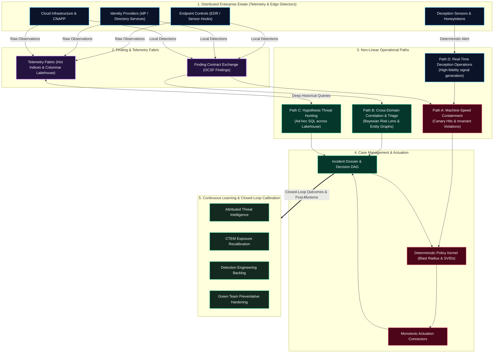
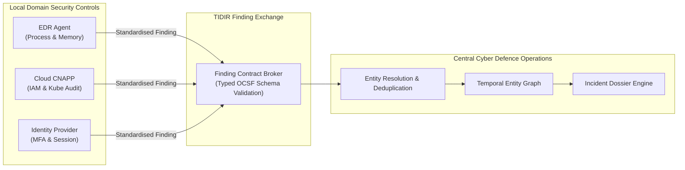
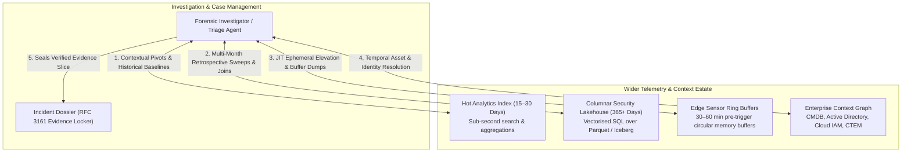
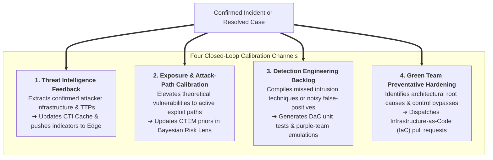

# Cyber Defence Operations: Target Operational Reference Architecture

> **Tier 2: Operational Architecture** · **Audience**: SOC Leads, Incident Commanders, Principal Detection Engineers · **Normative Status**: Normative Architecture  
> **Prerequisites**: [System Overview & 4-Plane Model](/architecture/01-system-overview) · [Conceptual Information Architecture](/architecture/03-information-architecture) · **Next Step**: [Detection Engineering Lifecycle](/architecture/detection-engineering-lifecycle)

---

The **Cyber Defence Operations Reference Architecture** defines how operational capabilities are coordinated across distributed, heterogeneous environments to anticipate, detect, triage, investigate, contain, and learn from security threats.

Traditional security architectures frequently depict operations as a single, rigid linear pipeline:

$$\text{Ingest} \longrightarrow \text{Detect} \longrightarrow \text{Alert} \longrightarrow \text{Triage} \longrightarrow \text{Respond}$$

In modern enterprise reality, this purist pipeline collapses. Attackers operate across multiple surfaces, native controls detect threats locally, triage agents query wide historical data estates on demand, and response actions vary from automated machine-speed containment to complex human-ratified disaster containment.

TIDIR models cyber defence operations as an interconnected **Control System** supporting four distinct operational paths, integrated feedback loops, and direct analytical access across the data estate.

---

## 1. The Four Operational Paths

Modern security operations must handle fundamentally different categories of events with different latency, confidence, and authority requirements. TIDIR formalises four operational paths:

### Path A: Machine-Speed Containment (Deterministic Invariants)
* **Trigger**: Interaction with high-fidelity canary tokens, unauthorized kernel driver modifications, or cryptographically verified ransomware loop executions.
* **Characteristics**: Near-zero false-positive probability ($P(\text{Malicious} \mid E) \approx 1.0$). Bypasses prolonged investigative triaging.
* **Execution Flow**:
  1. The detector or canary fabric emits an urgent finding.
  2. The orchestrator immediately queries the **Defence Control Plane** with a typed Response Intent (e.g. `CONTAIN_HOST`).
  3. The policy engine runs an automated **pre-execution blast-radius simulation**.
  4. If the target is not designated as Tier 0 Critical Infrastructure, containment executes within seconds via task-scoped SPIFFE SVID credentials.
  5. The action and immutable evidence links are written to the Incident Decision DAG.

### Path B: Cross-Domain Correlation & Agentic Triage (Probabilistic Findings)
* **Trigger**: Weak or noisy signals emitted across independent domain security controls (e.g. an unusual IdP login, followed by a PowerShell process download, followed by an egress network connection).
* **Characteristics**: Individually benign or low-confidence; collectively indicative of multi-stage intrusion.
* **Execution Flow**:
  1. Domain security tools detect local anomalies and publish standardized **Finding Contracts**.
  2. The central correlation engine evaluates findings across the **Temporal Entity Graph**, clustering observations sharing entity identities.
  3. The **Bayesian Multi-Signal Risk Lens** compounds orthogonal evidence vectors, discounting co-derived signals sharing identical raw observation parents (**Invariant 3**).
  4. Once composite risk exceeds the operational threshold, an **Incident Dossier** is created.
  5. The **Hierarchical Agent Mesh** (Lead Triage Orchestrator + specialist subagents) gathers context, forms hypotheses, and submits them to the Adversarial Challenger model.
  6. The completed dossier is presented to the human investigator with progressive disclosure, staging candidate response actions for ratification.

### Path C: Hypothesis-Driven Proactive & Retrospective Hunting
* **Trigger**: Proactive hunting campaigns, new zero-day intelligence disclosures, or security researcher advisories.
* **Characteristics**: Investigator-led or scheduled analytics exploring un-alerted historical telemetry.
* **Execution Flow**:
  1. Threat Hunter formulates a hypothesis (e.g. *"Adversary is abusing a newly disclosed RPC interface across Windows member servers"*).
  2. The hunter executes ad-hoc analytical queries across the **Security Data Lakehouse** (Iceberg/Parquet), scanning 30 to 365+ days of historical observations without impacting real-time streaming pipelines.
  3. Discovered malicious activity is elevated directly into a new **Case Dossier**.
  4. The successful hunting query is packaged as a **Detection Opportunity** and handed off to Detection Engineering via GitOps.

### Path D: Real-Time Deception Operations
* **Trigger**: Unauthorized reconnaissance, enumeration, or credential access targeting decoy assets.
* **Characteristics**: Decoys and honeytokens possess zero legitimate operational purpose. Any interaction is high-confidence evidence of adversarial presence.
* **Execution Flow**:
  1. Adversary touches decoy resource (e.g. attempts authentication with a canary AWS access key or accesses a decoy SMB share).
  2. Deception sensor immediately emits a deterministic finding and triggers a **Just-in-Time (JIT) Telemetry Elevation Order**.
  3. Telemetry collectors on adjacent hosts temporarily increase logging fidelity (e.g. capturing full memory pages, eBPF system call traces, and wire PCAP) to observe the attacker's full toolchain.
  4. The intrusion is routed into Path A for machine-speed containment or Path B for supervised observation depending on the threat engagement objective.

---

## 2. Distributed Detection & The Finding Contract Exchange

A foundational principle of TIDIR operations is:

> **"Detect locally where the signal is born; publish standardised findings; correlate centrally across domains."**

### Operational Rules of Distributed Handoff
1. **No Monolithic Telemetry Funnel**: Security operations does not require every byte of raw endpoint or network telemetry to traverse a single central streaming bus. Specialized controls detect domain threats internally.
2. **Schema Invariance**: Every finding entering central operations must comply with the normative **Finding Contract** (`03-information-architecture.md`), including detector version, entity references, MITRE ATT&CK tags, and pointers to raw evidence.
3. **Lineage-Aware Correlation**: When evaluating multiple findings from different domain controls, the correlation engine inspects `source_observation_ids`. If an EDR finding and a Sysmon finding stem from the same underlying Windows event, the central risk lens treats them as a single corroborated observation, preventing false P1 alert floods.

---

## 3. Direct Analytical Access Across the Data Estate

TIDIR operations strictly rejects the anti-pattern where an investigation is restricted solely to the data snippet attached to an incoming alert. 

Triage analysts, forensic investigators, and authorized autonomous subagents maintain first-class, bidirectional analytical access back into the wider enterprise data fabric:

### Forensic Access Modalities
1. **Near-Line Querying (Hot Index)**: Low-latency search across recent operational telemetry (15–30 days) to reconstruct the immediate 2-hour timeline before and after the alert trigger.
2. **Deep Retrospective Analysis (Columnar Lakehouse)**: Distributed, vectorized SQL queries executed against long-term historical partitions (365+ days) to establish whether suspect persistence mechanisms, domains, or hashes appeared in the environment weeks or months earlier.
3. **Pre-Trigger Forensic Retrieval (Edge Ring Buffers)**: When a high-impact finding occurs, the investigator queries the host's rolling in-memory circular buffer to retrieve raw system telemetry from the 30 minutes *preceding* the detection, ensuring initial exploit delivery is preserved.
4. **Temporal Context Traversal**: Queries the enterprise identity and asset graph to reconstruct who owned the device, what permissions the account held, and what network microsegment existed at the exact microsecond of the event.

---

## 4. Closed-Loop Continuous Learning & Calibration

TIDIR operations is designed as a learning system. Every confirmed incident, false-positive triage, threat hunt, and post-mortem review generates structured feedback that recalibrates the defensive posture:

1. **Threat Intelligence Recalibration**: Attribution details, newly discovered command-and-control (C2) domains, and file hashes are ingested into the CTI repository (`CTI-01`), immediately updating the high-speed indicator cache at the network edge.
2. **Exposure & Prior Recalibration**: Active exploit techniques observed in production are fed back into Continuous Threat Exposure Management (CTEM). Theoretical vulnerabilities on affected hosts are promoted to *realized threats*, dynamically lowering detection thresholds for related behaviours.
3. **Detection Engineering & Evals Loop**: Evasion techniques observed during the incident are compiled into new synthetic test cases and purple team mutation suites. Rules that generated excessive false-positive noise during the event burn their error budgets and are automatically routed for tuning.
4. **Green Team Preventative Hardening**: Rather than merely responding to recurring incidents, operations triggers root-cause remediations—submitting pull requests against Terraform/CloudFormation code or Active Directory Group Policies to permanently close security gaps.

---

## 5. Operational Roles & Human-Machine Collaboration

TIDIR establishes a balanced operational division of labour between human operators, autonomous agentic meshes, and deterministic control systems:

| Operational Role | Primary Focus | Operational Touchpoints | Governing Invariants |
| :--- | :--- | :--- | :--- |
| **Triage Analyst** | Supervises incoming dossiers, reviews challenger consensus, and validates candidate findings. | AG-UI Progressive Disclosure Workbench (`INV-06`). | Invariant 2 (Traceability), Invariant 4 (No Self-Granting Authority). |
| **Forensic Investigator** | Conducts deep-dive root-cause analysis, tests hypotheses, and executes ad-hoc lakehouse hunts. | Hot Index, Historical Lakehouse, and JIT Telemetry Elevation. | Invariant 1 (Telemetry Preservation), Invariant 10 (Reconstructability). |
| **Incident Commander** | Evaluates blast-radius impact simulations and authorizes disruptive containment actions. | Pre-Execution Blast-Radius Modal, Break-Glass Console (`RESP-04`). | Invariant 6 (Bounded Autonomy), Invariant 9 (Human Recoverability). |
| **Autonomous Agent Mesh** | Gathers context across distributed APIs, generates hypotheses, and prepares containment proposals. | Read-only MCP tool servers, Adversarial Challenger model. | Invariant 4 (Agents Propose), Invariant 5 (Least Capability / SVIDs). |
| **Platform / SecOps SRE** | Monitors pipeline lag, consumer health, error budgets, and system degradation. | Observability dashboards, Circuit breaker controls (`RESIL-01`–`05`). | Invariant 7 (Fail-Secure), Invariant 8 (Degraded Defence). |
