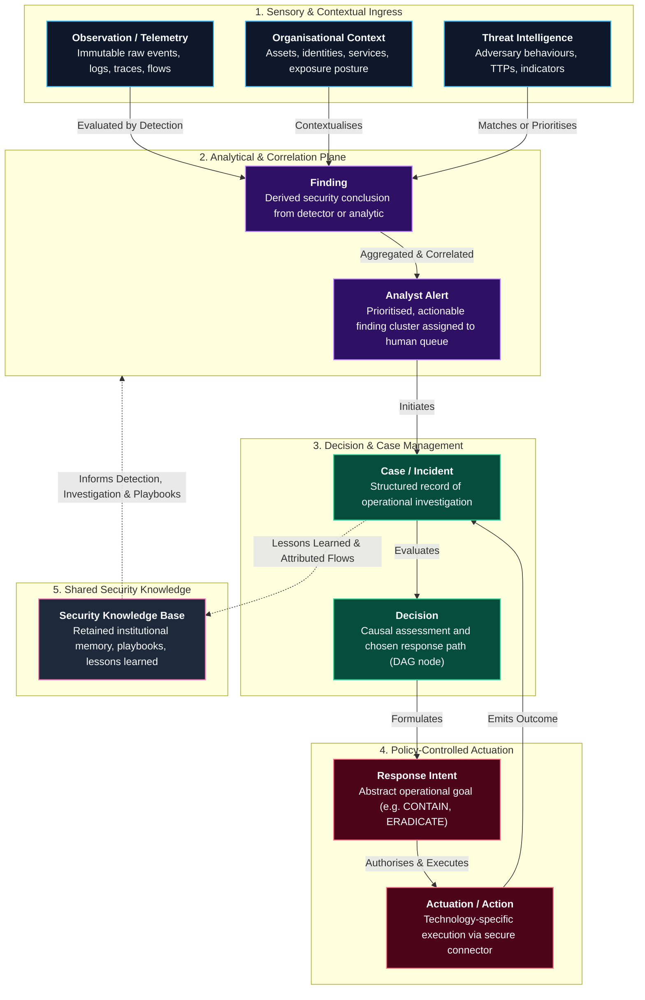
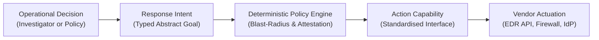
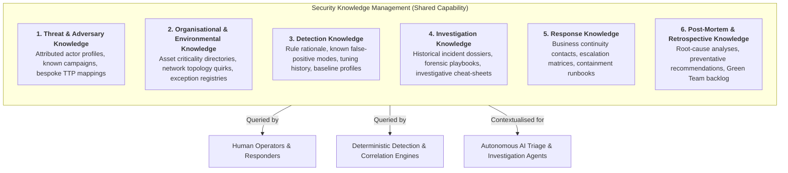

# Cyber Defence Information Architecture: Conceptual Information Model & Finding Contracts

> **Tier 2: Information Architecture** · **Audience**: Enterprise Security Architects, Data Engineers, SecOps Leads · **Normative Status**: Normative Architecture  
> **Prerequisites**: [System Overview & 4-Plane Model](/architecture/01-system-overview) · **Next Step**: [Detection Engineering Lifecycle](/architecture/detection-engineering-lifecycle)

---

The **TIDIR Information Architecture** defines the conceptual information model governing modern cyber defence operations. It establishes vendor-neutral semantic definitions for the core information objects that security operations create, transform, and consume.

By standardising the meaning and relationships of security information independently of underlying physical storage engines or proprietary transport protocols, this architecture prevents operational silos and ensures end-to-end auditability.



---

## 1. Conceptual Information Taxonomy

Security data must not be treated as a single undifferentiated data lake. In TIDIR, information is classified into distinct categories with explicit semantics, lifecycles, and retention requirements:

### 1.1 Observation (Telemetry)
* **Definition**: An immutable record of an event or state observed within the digital or physical environment at a specific instant in time.
* **Characteristics**: Machine-generated, high-volume, append-only, and objectively factual regarding what was recorded. Examples include kernel process spawns, network connection flows, authentication records, cloud control-plane audit events, and distributed application traces.
* **Governance**: Governed by **Invariant 1 (Telemetry Preservation)**. Ingested observations are stored in open formats (e.g. Parquet on object storage) with schema mapping to open standards (such as OCSF).

### 1.2 Organisational Context
* **Definition**: Information describing the enterprise environment, operational topology, business criticality, and ownership required to interpret observations.
* **Characteristics**: Entity state data representing users, accounts, compute assets, software inventories, cloud tenants, network segments, business processes, and operational owners.
* **Temporal Semantics**: Requires point-in-time temporal validity. When investigating an event that occurred fourteen days ago, the system must evaluate the identity and asset context as it existed at that exact timestamp, rather than current state.

### 1.3 Threat Intelligence
* **Definition**: Attributed knowledge, threat-actor profiles, tactical indicator lists, and behavioural patterns (TTPs) describing malicious actors and capabilities.
* **Characteristics**: Ingested via open formats (such as STIX 2.1 / TAXII 2.1) or curated internally. Carries subjective confidence, source reliability ratings, and time-based confidence decay curves.

### 1.4 Finding
* **Definition**: A derived security conclusion or observation of interest produced by an analytical detector, heuristic model, or domain security control.
* **Characteristics**: Carries explicit provenance linking back to contributing observations. A finding is **not** an alert; it represents an analytical observation that an entity has exhibited behaviour matching a detection condition.

### 1.5 Analyst-Facing Alert
* **Definition**: A synthesised, prioritised, and actionable notification presented to human triage analysts or autonomous case orchestrators.
* **Separation Principle**: *A detector finding is not necessarily an analyst-ready alert.* In a distributed enterprise producing thousands of edge findings daily, findings must undergo normalisation, enrichment, entity resolution, deduplication, and dependency-aware risk aggregation before an analyst-facing alert is created.

### 1.6 Case and Incident
* **Definition**: A governed system-of-record container encapsulating all observations, findings, hypotheses, agent activities, analyst notes, and decisions concerning a potential security compromise.
* **Integrity**: Cases are append-only and cryptographically sealed upon closure (RFC 3161 timestamps) to ensure evidentiary integrity for legal and regulatory review.

### 1.7 Decision
* **Definition**: An explicit operational choice made during triage, investigation, or containment.
* **Structure**: Captured as nodes within the **Incident Decision Directed Acyclic Graph (DAG)** (Invariant 10), recording the authorising actor, the specific hypothesis evaluated, the supporting evidence IDs, and the chosen course of action.

### 1.8 Response Intent and Action
* **Definition**: A **Response Intent** is an abstract, technology-agnostic declaration of operational containment or remediation (e.g. `CONTAIN_HOST`, `REVOKE_CREDENTIALS`). An **Action** is the vendor-specific execution executed via an actuation connector.

### 1.9 Security Knowledge
* **Definition**: Structured, reusable enterprise knowledge derived from historical incidents, threat research, and operational tuning. Enables institutional learning without trapping knowledge in disparate ticketing systems.

---

## 2. Common Metadata Attributes

Every primary information object in TIDIR must encapsulate five standard metadata dimensions:

| Dimension | Mandatory Attributes | Purpose & Architectural Invariant |
| :--- | :--- | :--- |
| **1. Identity** | `id` (UUIDv4/ULID), `type` (Schema classification), `source_system` | Uniquely identifies the object and its origin across federated architectures. |
| **2. Temporal** | `time_observed`, `time_generated`, `time_ingested`, `time_modified` | Preserves temporal causality and distinguishes event time from ingestion latency. |
| **3. Provenance** | `originating_engine`, `detector_id`, `detector_version`, `parent_ids`, `source_observation_ids` | Enforces **Invariant 2 (Evidence Traceability)** and **Invariant 3 (Evidential Independence)**. |
| **4. Semantics** | `entity_refs` (Asset/Identity), `threat_mappings` (ATT&CK), `severity`, `confidence_score` (0.0–1.0) | Standardises classification for cross-domain graph correlation and risk ranking. |
| **5. Lifecycle** | `status` (`new`, `enriched`, `correlated`, `closed`), `disposition`, `owner` | Tracks operational handling, noise budgets, and remediation state. |

---

## 3. The Logical Finding Contract

To enable distributed detection without locking the enterprise into a specific commercial SIEM or messaging bus, TIDIR defines a technology-agnostic **Finding Contract**. 

Any security control (EDR, NDR, CNAPP, cloud posture engine, or central analytics worker) participating in the TIDIR ecosystem must publish findings complying with this logical contract:

```yaml
# TIDIR Logical Finding Contract (Technology-Agnostic Envelope)
finding_id: "urn:tidir:finding:01J8X4M6A9Z8B2C4D6E8F0"
schema_version: "1.0.0"
timestamp_observed: "2026-09-27T10:14:02.124Z"
timestamp_emitted: "2026-09-27T10:14:02.350Z"

detector:
  system_name: "endpoint-protection-edge"
  rule_id: "TIDIR-DET-W0412"
  rule_version: "2.3.1"
  rule_type: "streaming_symbolic"

affected_entities:
  - entity_type: "device"
    identifier: "workstation-corp-8492"
    criticality_tier: "tier_2_standard"
  - entity_type: "user"
    identifier: "alice.smith@enterprise.corp"
    role: "financial_analyst"

threat_classification:
  framework: "MITRE_ATTACK_V15"
  tactics: ["TA0006_CREDENTIAL_ACCESS"]
  techniques: ["T1003.001_OS_CREDENTIAL_DUMPING"]

evidence_lineage:
  source_observation_ids:
    - "urn:tidir:obs:edr:20260927:9481928"
    - "urn:tidir:obs:auditd:20260927:1049281"
  root_evidence_queries:
    - store: "columnar_lakehouse"
      query: "SELECT * FROM process_activity WHERE process_guid = 'abc-123-def'"
  parent_finding_ids: [] # Populated if derived from upstream sub-findings

assessment:
  severity: "high"
  confidence: 0.94
  operational_intent: "finding" # finding | risk_increment | signal | telemetry_trigger

disposition:
  status: "new"
  deduplication_key: "host:workstation-corp-8492:technique:T1003.001"
```

### Finding Contract vs. Physical Finding Bus
* **The Finding Contract (Normative)**: The semantic requirement. Any subsystem emitting or consuming security conclusions must support the attributes above.
* **The Finding Bus (Implementation Pattern)**: A specific deployment pattern using distributed message brokers (e.g. Apache Kafka, Redpanda) or event streams to transport finding contracts across distributed networks.

---

## 4. Response Intents & Actuation Abstraction

To prevent automated workflows and agentic assistants from binding directly to vendor-specific APIs (which causes brittle scripts and security drift), TIDIR separates **Operational Decisions** from **Vendor Actuation**:

$$\text{Operational Decision} \longrightarrow \text{Response Intent} \longrightarrow \text{Policy Gate} \longrightarrow \text{Capability} \longrightarrow \text{Vendor Execution}$$



### Canonical Response Intents
Response intents are high-level, declarative containment and recovery goals:

1. **`CONTAIN_HOST`**: Restrict network connectivity of an endpoint to authorized security management infrastructure, preserving live volatile memory for forensic acquisition.
2. **`QUARANTINE_IDENTITY`**: Invalidate active authentication sessions (OAuth tokens, Kerberos tickets), enforce credential reset, and require step-up authentication.
3. **`ISOLATE_NETWORK_SEGMENT`**: Apply dynamic microsegmentation rules at firewalls or software-defined overlays to prevent lateral network traversal.
4. **`EXPEL_APPLICATION`**: Terminate untrusted cloud container pods or revoke third-party SaaS OAuth integrations.
5. **`RESTORE_SERVICE`**: Restore benign access and network connectivity following verified eradication, upholding Security-State Monotonicity ($R(s_{\text{post}}) \subseteq R(s_{\text{pre}})$).

Every action dispatched from a response intent must be **typed**, **least-privilege**, **cryptographically auditable**, **policy-controlled**, **observable**, and **verifiable**.

---

## 5. Automation Artefact Decomposition

Modern security automation fails when a single monolithic script attempts to handle workflow orchestration, data enrichment, authorisation policy, and external API execution simultaneously. 

TIDIR standardises the separation of concerns across six distinct automation artefacts:

| Artefact | Primary Responsibility | Examples |
| :--- | :--- | :--- |
| **1. Workflow** | Sequences operational activities, manages state, branches, retries, and escalations. Holds zero direct execution keys. | Declarative DAG specifications, Temporal workflows, or step-function state machines. |
| **2. Capability (Action)** | Performs a single, atomic, idempotent security operation (e.g. query IP reputation, snapshot disk, isolate NIC). | Containerised micro-actions, hardened Python/TypeScript modules, or MCP server tools. |
| **3. Policy** | Deterministically evaluates whether a requested action is permitted based on identity, asset tier, and blast radius. | OPA (Open Policy Agent) Rego policies, Cedar schemas, or cryptographic SVID scope validators. |
| **4. Tool Contract** | Formally defines the input/output schemas, parameter types, error formats, and safety boundaries for AI and automated tools. | JSON Schema tool definitions, OpenAPI specifications, or Model Context Protocol (MCP) schemas. |
| **5. Tests & Assurance** | Continuous test suites verifying that automation logic operates correctly and safely across edge conditions. | Synthetic regression replays, chaos mock harnesses, and pre-production purple team emulations. |
| **6. Case System-of-Record** | The durable, tamper-evident log capturing the causal history of evidence, decisions, human approvals, and actions. | Append-only incident dossier, cryptographic decision DAG, and RFC 3161 audit logs. |

---

## 6. Security Knowledge Management (SKM)

TIDIR treats operational security knowledge as an enterprise asset rather than tribal memory. The **Security Knowledge Management** capability aggregates, maintains, and provides programmatic access to institutional knowledge across six domains:



### Knowledge Reusability Principle
Security knowledge must be stored in structured, queryable formats (such as version-controlled Markdown, graph models, or structured documents) rather than locked inside proprietary ticketing comments. 

Both human engineers and automated agents retrieve and contribute to the same canonical knowledge base, ensuring that lessons learned during an incident immediately improve future detection, investigation, and response.
