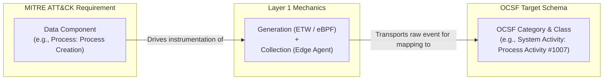
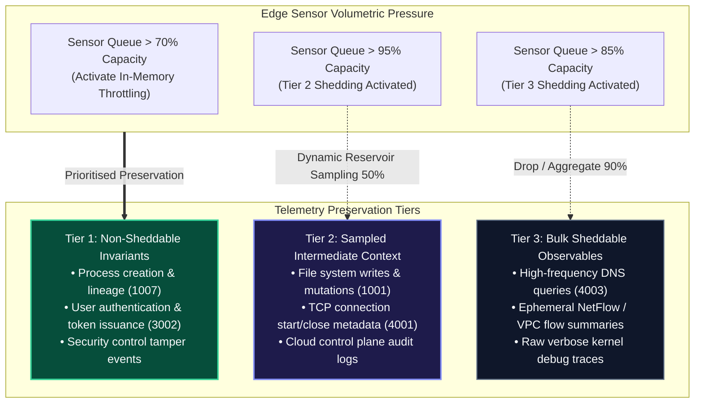

# Layer 1: Data Sources & Environmental Inputs

> **Tier 3: Technical Specifications** · **Audience**: Data Engineers, SecOps Infrastructure Leads · **Normative Status**: Normative Architecture  
> **Prerequisites**: [Layer 2: Pipeline & Storage](04-layer-2-pipeline-storage-query.md) · **Next Step**: [Layer 2: Pipeline, Storage & Query](04-layer-2-pipeline-storage-query.md)

---

**Layer 1 represents the total sensory boundary of the TIDIR architecture.** It encompasses all information producers feeding into the security operations ecosystem.

A modern detection and response architecture fails when it treats security as a simple "log ingestion" problem. Effective detection and triage require evaluating **runtime operational telemetry** against **organizational reality**, **external adversary behaviour**, **attack surface exposure**, and **control efficacy**.

---

## 2. The Data Lifecycle in Layer 1: Generation, Collection & Transport

Before telemetry can be normalized or queried in Layer 2, it must travel through three foundational stages within Layer 1. The transition from Layer 1 to Layer 2 occurs precisely when transported data crosses into the pipeline ingestion gateway.

```mermaid
flowchart LR
  subgraph L1 ["Layer 1: Source Domain"]
    direction TB
    subgraph Gen ["1. Generation Stage"]
      G_KERN["Kernel / System Hooks\n(eBPF, Windows ETW, auditd)"]
      G_API["Control Plane Events\n(Cloud audit APIs, SaaS webhooks)"]
      G_NET["Network Flow & Packet Taps\n(SPAN ports, mirror sessions)"]
      G_EXT["External Feeds\n(TAXII, vulnerability advisories)"]
    end

    subgraph Col ["2. Collection Stage"]
      C_AGENT["Local Edge Agents\n(In-memory ring buffer)"]
      C_PULL["API Scrapers / Pollers\n(Stateful checkpoint cursors)"]
      C_LISTEN["Network Syslog / Webhook Listeners\n(Load-balanced receivers)"]
    end

    subgraph Trans ["3. Transport & Egress Stage"]
      T_SPOOL["Local Disk Spooling & Queuing\n(Backpressure & disconnect safety)"]
      T_PROTO["Secure Transport Protocols\n(mTLS, gRPC, HTTP/2, Protobuf)"]
    end

    Gen --> Col
    Col --> Trans
  end

  subgraph L2 ["Layer 2: Pipeline Boundary"]
    P_GATE["Pipeline Ingestion Gateway\n(Distributed Streaming Bus)"]
  end

  Trans ==>|Egress across network boundary| P_GATE
```

### Stage 1: Generation (Event Emission Primitives)
Data generation occurs where software, hardware, or external actors execute actions. Telemetry must be captured as close to the point of origin as possible to guarantee forensic integrity and prevent evasion:
- **Standard Machine-Readable Logging**: The operational baseline of enterprise security observability:
  - *Structured JSON / NDJSON*: Line-delimited JSON emitted directly by modern microservices, container runtimes, API gateways, and web application servers.
  - *Operating System Event Subsystems*: Structured OS event pipelines, including Windows Event Logs (EVTX channels: Security, System, PowerShell Script Block Logging, TaskScheduler) and Linux `systemd-journald` / `auditd` event streams.
  - *Network Appliance & System Syslog*: RFC 5424 / RFC 3164 formatted logs emitted by perimeter firewalls, VPN concentrators, load balancers, DNS resolvers, and network switches.
  - *Cloud Management & Data Plane Audit Logs*: Immutable audit trails emitted by cloud provider control planes (management API transactions, identity role assumptions, storage bucket access logs).
- **Kernel-Level Observability**: Intercepts low-level system calls, process fork/exec chains, module loads, and memory manipulations via kernel instrumentation (Linux eBPF, Windows Event Tracing / ETW, macOS Endpoint Security framework) to catch evasive tradecraft that bypasses user-space loggers.
- **Service & Identity Eventing**: Authentication challenge evaluations, MFA token issuance, administrative role escalations, and directory service synchronisation events.
- **Network Interface Taps**: Hardware and virtual taps mirror wire traffic to generate connection state flows and application-layer metadata records without relying on host software.
- **External Intelligence Publishing**: Third-party providers publish adversary campaigns, vulnerability weaponization telemetry, and active indicators over authenticated feeds.

### Stage 2: Collection (Edge Gathering & Buffering)
Collection mechanisms gather emitted raw events on or near the emitter:
- **File & Tail Collectors**: Lightweight daemons monitoring on-disk log files (`/var/log/*`, rotated application logs, Windows EVTX channels) with persistent file offset watermarking to guarantee zero missed lines across log rotations.
- **Agent-Based Kernel Collectors**: Lightweight user-space daemons subscribe to local OS event rings (eBPF ring buffers, ETW sessions). They must enforce strict CPU/memory throttling and handle kernel buffer overflows gracefully.
- **Pull-Based API Ingestion**: Distributed schedulers poll third-party cloud and SaaS endpoints, maintaining watermarked checkpoint cursors to guarantee at-least-once collection without duplicates.
- **Network Ingestion Listeners**: Horizontally scalable listeners accept push-based streaming formats (Syslog RFC 5424 over TCP/TLS, NetFlow v9 / IPFIX, direct HTTPS webhooks).

### Stage 3: Transport & Egress (The L1 ➔ L2 Handoff)
Transport is responsible for moving collected events reliably across network boundaries into Layer 2's ingestion streaming bus:
- **Local Spooling & Backpressure**: If downstream pipeline targets slow down or network partitions occur, collectors spool to bounded local disk queues to prevent data loss.
- **Dead-Letter Queue (DLQ) & Malformed Buffering**: Payloads rejected due to corruption, unparseable wire formats, or transient network timeouts are diverted to an encrypted local/staging DLQ. This guarantees zero silent event drops and enables deterministic offline replay once connectivity or parser rules are restored.
- **Raw Payload Envelope Preservation**: The transport envelope preserves an unmutated copy of the original raw event (`raw_payload`) alongside collector-attached origin metadata (collector version, ingestion timestamp, cryptographic agent hash). This ensures forensic non-repudiation before any downstream normalization begins.
- **Transport Security**: All transport mandates mutual TLS (mTLS) with cryptographically validated client and server identities.
- **Efficient Wire Formats**: Payloads are batched and compressed (Zstandard / Snappy) over HTTP/2, gRPC, or native streaming producer protocols to minimize bandwidth utilisation.
- **Handoff Contract**: The boundary between Layer 1 and Layer 2 is the ingress port of Layer 2's streaming message bus (e.g. distributed streaming log or HTTP ingestion gateway). Once acknowledged by Layer 2, Layer 1 considers the event delivered.

---

## 3. Schema & Framework Alignment: ATT&CK Data Components to OCSF

To ensure detection engineering (Layer 3) can express vendor-neutral logic, Layer 1 telemetry must be categorized using standardised security frameworks:
- **MITRE ATT&CK Data Sources & Data Components**: Define *what adversary activity must be observed* to detect specific techniques.
- **Open Cybersecurity Schema Framework (OCSF)**: Defines *how that activity is formally structured* into normalized categories and classes.

### Telemetry Mapping Matrix

| MITRE ATT&CK Data Source | MITRE ATT&CK Data Component | Target OCSF Category & Class | Primary Generation Mechanism | Collection & Transport Profile |
| :--- | :--- | :--- | :--- | :--- |
| [**Process**](https://attack.mitre.org/datasources/DS0009/) | Process Creation | [`System Activity` (1007: Process Activity)](https://schema.ocsf.io/1.1.0/classes/process_activity) | OS Kernel Hooks / eBPF / ETW Event ID 4688 | High-volume streaming; sub-second delivery |
| [**Process**](https://attack.mitre.org/datasources/DS0009/) | OS API Execution | [`System Activity` (1007: Process Activity)](https://schema.ocsf.io/1.1.0/classes/process_activity) | User-space hooks / Syscall monitors / eBPF | Selective filter-streaming; high noise potential |
| [**File**](https://attack.mitre.org/datasources/DS0022/) | File Modification / Creation | [`System Activity` (1001: File System Activity)](https://schema.ocsf.io/1.1.0/classes/file_system_activity) | Kernel Minifilters / fanotify / FSEvents | Streaming; rate-limited and filtered by extension/path |
| [**Network Traffic**](https://attack.mitre.org/datasources/DS0029/) | Network Connection Creation | [`Network Activity` (4001: Network Activity)](https://schema.ocsf.io/1.1.0/classes/network_activity) | Socket monitors / eBPF sockops / NetFlow | Streaming summary flows; connection start/end pairs |
| [**Network Traffic**](https://attack.mitre.org/datasources/DS0029/) | DNS Resolution | [`Network Activity` (4003: DNS Activity)](https://schema.ocsf.io/1.1.0/classes/dns_activity) | DNS proxy / Wire packet parser / OS resolver | Streaming event pairs (Query + Answer records) |
| [**User Account**](https://attack.mitre.org/datasources/DS0002/) | User Account Authentication | [`Identity & Access` (3002: Authentication)](https://schema.ocsf.io/1.1.0/classes/authentication) | IdP session logs / Kerberos KDC / PAM audit | Streaming event batches; critical priority |
| [**User Account**](https://attack.mitre.org/datasources/DS0002/) | User Account Modification | [`Identity & Access` (3005: Entity Management)](https://schema.ocsf.io/1.1.0/classes/entity_management) | Active Directory replication / SaaS Directory API | Webhook push or low-frequency scheduled poll |
| [**Cloud Storage**](https://attack.mitre.org/datasources/DS0010/) | Storage Object Access | [`Cloud / Account` (1001: Object Storage Activity)](https://schema.ocsf.io/1.1.0/classes/file_system_activity) | Cloud provider control plane S3/Blob audit trail | Stream-forwarded cloud delivery (S3 notification/PubSub) |
| **Vulnerability** | Software Vulnerability State | [`Findings / Discovery` (2002: Vulnerability Finding)](https://schema.ocsf.io/1.1.0/classes/vulnerability_finding) | Host/network vulnerability scanner engine | Scheduled batch snapshot; periodic diff sync |
| **Cloud Security Posture** | Misconfiguration / IAM Drift (CSPM/CNAPP) | [`Findings / Discovery` (2001: Security Finding)](https://schema.ocsf.io/1.1.0/classes/security_finding) | Cloud security posture scanner (Wiz, Prisma, Orca) | Webhook push or API sync; high fidelity |
| **Application Trace & Audit** | Service Mesh / HTTP / DB Traces | `Application Activity` (Class 1003 / 4002 / 6001) | OpenTelemetry (OTLP gRPC/HTTP :4317/:4318) | Streaming JSON/Protobuf batches; line-rate OCSF transform |
| **Ambient Deception** | Honeytoken / Canary Interaction | Any Target Class + `metadata.is_canary: true` | Decoy AWS keys, canary files, Kerberos SPN lures | Instantaneous priority stream; zero base rate |
| **Threat Intelligence** | Indicator Observable | `Threat Intelligence` (5001: Threat Intelligence) | STIX/TAXII 2.1 repository / Threat Feed API | Polled incremental batch / Change-data-capture |

---

## 4. Source Domain Taxonomy & Functional Capabilities

Layer 1 encompasses six distinct input domains that converge into the ingestion fabric:

### Domain 1: Runtime Operational Telemetry (Activity Streams)
Ephemeral, high-volume event streams generated continuously as infrastructure and users operate.

- **Host & Workload Telemetry**: Complete process lineage trees (parent/child/grandchild tracking), dynamic module loading, thread injection, file creations/overwrites, kernel driver loads, container namespaces, and cgroup anomalies.
- **Identity & Access Telemetry**: Interactive and machine-to-machine authentication transactions, MFA challenge evaluations, session token issuance/refresh/revocation, administrative role escalations, and directory object changes.
- **Network & Perimeter Telemetry**: Transport flow summaries (NetFlow/IPFIX/VPC Flow), application-layer protocol metadata (DNS queries/responses, HTTP transactions), TLS handshake attributes (cipher suites, SNI, JA3/JA4 fingerprints), and edge firewall state changes.
- **Cloud Control Plane Telemetry**: Cloud administrative console logins, CLI/API management calls, cross-account trust alterations, IAM policy definitions, and public storage access toggles.
- **Application Logic Telemetry**: Business-critical application events (e.g. wire transfer authorisations, bulk data exports, privileged policy bypasses), service mesh traces, and API gateway access records.

---

### Domain 2: Threat Intelligence Inputs (CTI)
External and internally curated adversary knowledge that gives operational telemetry meaning.

- **Tactical & Technical Observables**: Structured indicators (IP addresses, domain names, file hashes, URLs, SSL certificate serials) enriched with confidence scores, source fidelity ratings, and decay functions.
- **Operational & Adversary Context**: Threat actor profiles, operational motivations, target industry/geographic focus, and campaign waves mapped to MITRE ATT&CK matrices.
- **Vulnerability & Exploitation Intelligence**: Weaponized proof-of-concept availability, active zero-day exploitation reports, exploit broker disclosures, and dynamic EPSS (Exploit Prediction Scoring System) values.

---

### Domain 3: Organizational & Environmental Context
The authoritative operational baseline against which anomalies and threat severity are evaluated.

- **Asset Inventory & Compute Registry**: Physical machines, virtual instances, container clusters, and serverless functions; static/DHCP IP history; operating system builds; and environment tiering (Production vs. Staging vs. Dev sandbox).
- **Identity Directory & Role Hierarchy**: Authoritative corporate directory metadata (job function, reporting line, executive status, baseline location, working hours) and privileged access groupings (Domain Admins, Cloud Owners).
- **Business Process & Service Mapping**: Relational mapping connecting technical infrastructure components to revenue-generating workflows, customer data stores, and regulatory boundaries (Tier 0 asset criticality scoring).

---

### Domain 4: Attack Surface & External Exposure Inputs
The external perspective representing the enterprise as seen from an adversary's vantage point.

- **External Attack Surface (EASM)**: Discovered public IP blocks, authoritative DNS zones, discovered subdomains, publicly reachable ports, service banners, and SSL/TLS certificate expirations.
- **Cloud Perimeter & Shadow Infrastructure**: Dangling DNS records vulnerable to takeover, unmanaged SaaS tenants, and publicly accessible storage buckets or database endpoints.
- **Software Supply Chain & Dependencies**: Software Bill of Materials (SBOM) for internal applications, third-party library dependencies, and third-party SaaS OAuth integrations.

---

### Domain 5: Security Control Posture & Health State
Telemetry describing the status, fidelity, and coverage of defensive controls.

- **Sensor & Agent Health**: Agent deployment coverage percentages, sensor process heartbeats, signature/engine update freshness, and tamper prevention alerts (pinpointing instrumentation blind spots).
- **Configuration & Hardening Posture**: Operating system hardening benchmarks (e.g. CIS), endpoint isolation policy states, disk encryption status, and firewall rule configurations.
- **Vulnerability Posture & Patch State**: Identified CVEs across software installations, exposure reachability metrics, and patch remediation timelines.

---

### Domain 6: External Security Tool Findings (XDR, CNAPP, CSPM & Vulnerability)
High-level analytical assertions, detections, and posture evaluations emitted by external commercial and cloud-native security systems:

- **Endpoint & Identity XDR Detections**: Pre-computed detection findings from commercial EDR/XDR suites (CrowdStrike Falcon, Microsoft Defender for Endpoint/Identity, SentinelOne), including process trees, memory injection alerts, and identity risk evaluations.
- **Cloud-Native Application Protection (CNAPP / CSPM / CWPP)**: Misconfiguration findings, public storage exposure alerts, over-privileged IAM entitlements (CIEM), and container runtime deviations emitted by platforms like Wiz, Orca, or Prisma Cloud.
- **Perimeter & Edge Defenses**: WAF blocks, rate-limiting triggers, and automated bot mitigation events emitted by edge platforms (Cloudflare, Fastly, AWS WAF).
- **Application Security & Vulnerability Scanners**: Static/dynamic analysis findings (SAST/DAST) and host/container CVE catalogs (Snyk, Veracode, Qualys, Tenable).

---

## 5. Architectural Contracts for the L1 ➔ L2 Boundary

To preserve loose coupling between source emitters and the processing platform, Layer 1 adheres to four boundary contracts:

1. **Producer Neutrality**: Data sources emit facts about what occurred, not security judgments. Normalization and enrichment belong exclusively to Layer 2 and Layer 3.
2. **Authoritative Timestamping**: Every emitted payload must include an RFC 3339 UTC origin timestamp captured at generation, distinct from collection or ingestion timestamps.
3. **Identity & Origin Provenance**: Events must carry immutable source provenance tags (tenant ID, host identifier, sensor ID, collector version) to ensure traceability and tamper detection.
4. **Transport Resilience Invariant**: Transport clients enforce durable at-least-once delivery into Layer 2 through bounded local spooling and acknowledgement handshakes, tracking and alerting on any buffer drop via `TelemetryDropCount`.

---

## 6. Edge Resilience, Backpressure & Adaptive Priority Shedding

Under volumetric stress (e.g. host DDoS flood, compilation storms, or kernel ring buffer saturation), collectors must never fail silently or destabilize host workloads. Layer 1 implements an **Adaptive 3-Tier Priority Shedding Hierarchy**:

### Deterministic Shedding & Ring Buffer Drop Policies
1. **Ring Buffer Watermarks**: eBPF and ETW kernel buffer pollers trigger user-space backpressure signals when consumer lag crosses 75%.
2. **Shedding Accounting & Drop Metrics**: Whenever Tier 2 or Tier 3 events are sampled or shed, the collector emits an immutable `TelemetryDropCount` metric specifying the exact timestamp window, shedded class, and dropped record volume. Downstream detection engines (Layer 3) use this signal to compute visibility uncertainty bounds.
3. **Local Spool Bounding**: On-disk edge spools are capped at a hard disk budget (e.g. 2GB or 5% free disk). When disk budgets exhaust, FIFO eviction applies strictly across Tier 3 first, then Tier 2. Tier 1 events are never evicted without an operator-audited emergency alarm.

---

## 7. Point-of-Capture Event Attestation & Tamper Sealing

To defend against advanced adversaries attempting to truncate, wipe, or tamper with event logs prior to egress:

- **RFC 3161 Cryptographic Timestamp Tokens**: Critical audit trails obtain trusted time-stamping authority tokens at the collection boundary.
- **Hardware-Backed Origin Identity**: Collectors use TPM 2.0 or secure enclave certificates for mTLS client authentication, ensuring rogue machines cannot spoof legitimate sensor identifiers.
- **Local Tamper-Evident Append-Only Ring**: Pre-egress spool files are structured as cryptographic hash chains (each log block incorporates the HMAC-SHA256 of the preceding block). Any tampering or excision of un-egressed logs breaks the chain and alerts Layer 2 upon reconnection.

---

## 8. Autonomous AI Roles & Ingestion Capabilities

While the data plane transport remains strictly deterministic and high-performance, autonomous AI harnesses provide two distinct capabilities in the Layer 1 engineering lifecycle:

1. **Automated Log Parser Synthesis (OCSF CodeGen)**:
   - *Problem*: Integrating proprietary enterprise applications or legacy network appliances often stalls for weeks while data engineers manually write regex grok patterns or extraction scripts.
   - *AI Role*: Tier 0/1 language models consume raw, unstructured sample logs alongside target OCSF JSON schemas to automatically synthesize high-performance parser definitions (e.g. Vector VRL expressions or Logstash configs).
   - *Deterministic Safety Gate*: Synthesized parsers must compile without warnings and pass automated unit test suites against golden log corpora before merging into the Schema Registry.
   
2. **Synthetic Adversarial Telemetry Generation**:
   - *Problem*: Testing detection coverage for catastrophic techniques (e.g. ransomware volume shadow copy deletion or DCShadow attacks) on live production systems is hazardous and rarely permitted.
   - *AI Role*: Generative agent harnesses synthesize high-fidelity, schema-valid synthetic OCSF telemetry representing multi-stage intrusions.
   - *Deterministic Safety Gate*: Synthetic telemetry is tagged with `is_synthetic: true` and routed exclusively to `test` and `dev` pipeline topics, completely isolated from production alerting queues.

