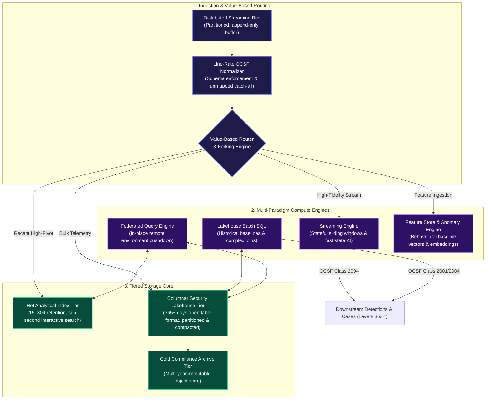
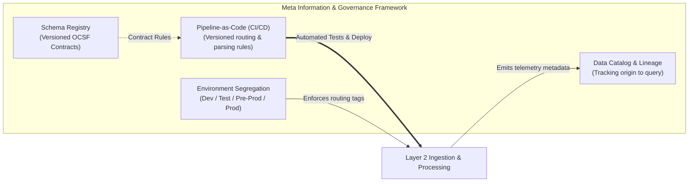
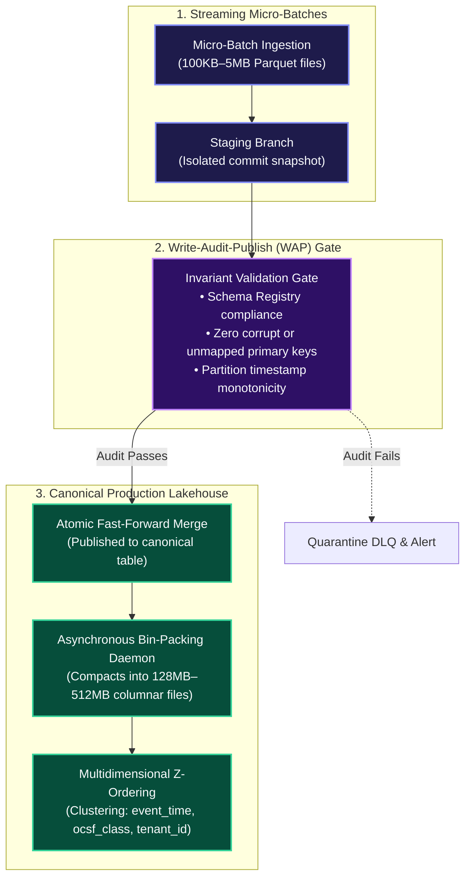

# Layer 2: Pipeline, Storage & Query Capabilities

> **Tier 3: Technical Specifications** · **Audience**: Data Architects, SecOps Data Engineers · **Normative Status**: Normative Architecture  
> **Prerequisites**: [Layer 1: Data Sources & Ingress](03-layer-1-data-sources.md) · **Next Step**: [Layer 3: Intel & Detection Engineering](06-layer-3-threat-intel-detection.md)

---

**Layer 2 represents the data fabric and computational core of the TIDIR architecture.** It bridges the sensory boundary of Layer 1 (Data Sources) with the decision intelligence of Layer 3 (Threat Intelligence & Detection) and Layer 4 (Incident Response).

Its architectural mission is to provide an elastic, multi-paradigm processing and query platform. Layer 2 ingests transported telemetry, enforces canonical normalization against open schemas, routes data dynamically based on operational value, orchestrates tiered persistence across storage media, and exposes high-performance query interfaces spanning real-time streaming, scheduled batch execution, federated analytics, and machine learning.



---

## 2. Ingestion, Line-Rate Normalization & Value-Based Routing

### Line-Rate Normalization & Contract Enforcement
Raw payloads arrive in heterogeneous formats from varied sensors, clouds, and services. Layer 2 standardises events at line rate before long-term persistence:
- **Canonical Schema Coercion**: Events are transformed into Open Cybersecurity Schema Framework (OCSF) objects. Fields are mapped into strongly typed attributes (e.g., process execution commands, user identifiers, network endpoints).
- **The `unmapped_data` Forensic Catch-All (Zero Schema Truncation)**: Because vendor logs and proprietary sensors frequently emit non-standard attributes that do not map directly to canonical OCSF classes, normalizers must never silently drop unmapped attributes. Any field not covered by the target OCSF class definition is preserved in a structured `unmapped_data` JSON key-value dictionary within the event envelope. This prevents schema normalisation from silently discarding unmapped source attributes while maintaining strict typing across the primary schema fields.
- **Schema Validation Gate & Dead-Letter Queue (DLQ)**: Inbound payloads are validated against an authoritative, versioned **Schema Registry**. Events with irrecoverable corruption or breaking schema violations are diverted to an encrypted Dead-Letter Queue (DLQ) with audit metadata (error reason, offending payload offset, source identifier). SRE and data engineering pipelines can inspect, repair, and replay DLQ payloads without loss.
- **In-Flight Context Enrichment**: During normalization, stream workers perform sub-millisecond lookups against cached organizational context from Layer 1, decorating raw events with asset criticality, physical location, and user role classifications.

### Value-Based Routing & Data Forking
Not all telemetry possesses equal analytical value. Storing petabytes of high-volume, low-density telemetry in expensive search indices creates unsustainable operational and financial strain. Layer 2 routes and shapes data based on **threat detection value vs. long-term forensic utility**:

```
                                  ┌───────────────────────────────┐
                                  │ Value-Based Routing Matrix    │
                                  └───────────────┬───────────────┘
                                                  │
                 ┌────────────────────────────────┼────────────────────────────────┐
                 ▼                                ▼                                ▼
       [Tier A: High Value]             [Tier B: Forensic Bulk]          [Tier C: Low Value / Noise]
       • Authentication anomalies       • Network flow summaries         • Sensor heartbeats
       • Process & execution trees      • Network perimeter flow logs    • Health check pings
       • Identity & API mutations       • Routine permitted traffic      • Verbose debug traces
                 │                                │                                │
                 ▼                                ▼                                ▼
      Hot Index + Stream Engine           Columnar Lakehouse Storage       Summarize / Prune at Ingress
```

1. **Tier A (High Security Value)**: Ingested into the streaming detection engine for sub-second rule evaluation and written concurrently to the **Hot Analytical Index** for rapid analyst investigation.
2. **Tier B (Forensic / Compliance Bulk)**: Bypasses the indexing tier entirely. Batched directly into open columnar files in object storage for cost-effective retention and scheduled batch query.
3. **Tier C (Governed Data Compaction & Noise Pruning)**: Operational chatter (e.g., sensor heartbeats, health-check pings, unmutated status polling) is aggregated into rolling statistical metrics or deduplicated at ingress according to explicit evidence-retention policies.
4. **Data Redaction & Tokenization**: Sensitive fields (PII, tokens, or credentials captured in command lines) are tokenized or masked prior to persistence.
5. **Agentic Telemetry Ingress & Trace Forking (The $10\times$ Agent Volume Multiplier)**:
   - Autonomous security agents and multi-agent meshes generate approximately $10\times$ more telemetry than traditional human or static service workloads. Every task produces distributed reasoning traces, Model Context Protocol (MCP) tool execution logs, in-memory blackboard checkpoints, and model prompt-response pairs.
   - Ingesting this flood directly into the Hot Analytical Index tier would cause unsustainable indexing cost escalation and disk I/O contention.
   - Layer 2 enforces **Agent Trace Forking**:
     - *Trace Lineage Separation*: Raw agent reasoning envelopes, OpenTelemetry (OTel) spans, and complete tool-call payloads bypass the hot inverted-index tier entirely.
     - *Columnar Lakehouse Streaming Ingress*: Traces stream directly into an append-only Parquet or Iceberg table in the Security Lakehouse tier, partitioned by investigation identifier and timestamp.
     - *Forensic Traceability*: Only high-level agent lifecycle events (task creation, hypothesis completion, and proposed containment actions) write to the Hot Analytical Index for operational dashboarding. Full agent execution lineage remains queryable on demand from the lakehouse.

> [!IMPORTANT]
> **Constitutional Preservation Boundary (Invariant 1 Compliance)**  
> To uphold Invariant 1 (*Telemetry Preservation*), Layer 2 strictly enforces a formal boundary between:
> - **Semantic Telemetry Rejection (Strictly Prohibited)**: Discarding or filtering security event streams merely because no active detection rule or query currently consumes them.
> - **Governed Evidence Compaction (Permitted)**: Applying explicit, auditable retention policies that summarize non-security operational chatter or compact high-volume streams into cold lakehouse formats without compromising post-incident forensic reconstructability.

---

## 3. Tiered Storage Architecture

Layer 2 decouples storage into three cost- and performance-optimised tiers:

| Storage Tier | Functional Characteristics | Retention Window | Primary Workload / Consumer |
| :--- | :--- | :--- | :--- |
| **Hot Analytical Index** | Inverted-index & columnar search store; low-latency field filtering and text matching. | 15–30 days | Interactive analyst investigations, alert triage, and visual dashboards. |
| **Security Data Lakehouse** | Open table format backed by object storage; columnar compression; partition-pruned by timestamp and schema class. | 365+ days | Scheduled batch analytics, complex cross-dataset joins, long-window baselining, and ML training. |
| **Cold Compliance Archive** | Immutable, write-once object storage; asynchronous retrieval lifecycle. | 3–7+ years | Regulatory compliance, legal hold, and catastrophic retroactive historical analysis. |

### Lakehouse Open Table Architecture & Commit Boundaries
The security data lakehouse uses an open table format to guarantee performance, vendor neutrality, and durability:
- **Hidden Partitioning**: Partitioned by event timestamp (`dt=YYYY-MM-DD/hh=HH`) and schema class identifier, preventing analytical query engines from performing expensive full-table scans.
- **Snapshot Isolation & ACID Semantics**: Supports concurrent streaming writes from ingestion workers alongside heavy analytical batch queries without file locking or read-skew anomalies.
- **Schema Evolution**: Allows attributes to be added, renamed, or deprecated over multi-year spans without corrupting historic data archives.
- **Micro-Batch Commit Latency Boundary**: Open table formats require batching parquet file writes and manifest commits (typically every 1 to 15 minutes) to avoid file fragmentation. Consequently, detection workloads requiring cross-event correlation within windows of less than 15 minutes cannot rely on Lakehouse table queries alone.

---

## 4. Multi-Paradigm Processing & Query Capabilities

Layer 2 provides four computational engines designed for distinct temporal and analytical workloads:

```
┌────────────────────────────────────────────────────────────────────────────────────────┐
│ Multi-Paradigm Computational Engines                                                   │
├────────────────────────────┬────────────────────────────┬──────────────────────────────┤
│ 1. Real-Time Stream Engine │ 2. Scheduled Batch Engine  │ 3. Federated Query Engine    │
│ • Sliding time windows     │ • Historical baselining    │ • Query-in-place execution   │
│ • Hybrid State Store       │ • Multi-table joins        │ • Remote data plane querying │
│ • Latency: < 5 seconds     │ • Latency: Minutes/Hours   │ • Zero data duplication      │
├────────────────────────────┴────────────────────────────┴──────────────────────────────┤
│ 4. Machine Learning & Feature Store Engine                                             │
│ • Continuous entity feature vectors (User/Host baseline distributions)                 │
│ • Vector embeddings for semantic search & process graph anomaly models                 │
└────────────────────────────────────────────────────────────────────────────────────────┘
```

1. **Real-Time Stream Processing & Two-Tier Temporal State Store**:
   - Evaluates stateful sliding windows (e.g., matching a sequence of failed authentications followed by a successful privileged session within a tight time threshold).
   - **Two-Tier Temporal State Store Architecture**:
     - *Tier $\Delta t_1$ (High-Fidelity Event Window: $\le 5\text{ minutes}$)*: Retains raw, uncompressed OCSF event records in-memory for tight sliding-window sequence detections.
     - *Tier $\Delta t_2$ (Probabilistic Baseline Window: $5\text{m} \dots 2\text{h}$)*: To prevent embedded state store memory exhaustion and checkpoint stalls during high-volume telemetry spikes ($\gt 10^6$ EPS), raw event records are evicted to object storage. The in-memory state retains strictly **compact probabilistic sketches and bitsets**:
       - *HyperLogLog (HLL)*: For tracking high-cardinality distinct counts (e.g. distinct destination IPs per host or unique user authentication attempts).
       - *Sliding-Window Bloom Filters*: For fast, sub-microsecond set-membership queries across recent entities.
       - *Dynamic Entity Counters & Half-Life Decays*: Memory-bounded sliding counters for frequency anomaly thresholds.
   - Caps stream processor memory consumption to fixed sub-gigabyte ceilings, eliminating checkpoint barriers and consumer rebalance storms under crisis loads.
   - Enriches events in flight against cached Layer 1 threat intelligence indicators.

2. **Scheduled Batch Analytics**:
   - Executes long-window queries (7–90 days) over the Lakehouse tier.
   - Calculates statistical baselines and identifies rare outliers across large historical corpora.
   - Performs complex multi-table joins across disparate telemetry domains.

3. **Federated Query Engine**:
   - Reaches across remote network boundaries (e.g., separate cloud accounts, sovereign regions, or partner environments) to execute queries in place.
   - Pushes down filter predicates to remote data stores to return only matching records, avoiding costly cross-region bandwidth egress and compliance friction.

4. **Machine Learning & Feature Store Engine**:
   - Computes rolling statistical entity features (e.g., mean outbound transfer volume per workload, user typical access windows).
   - Generates and persists vector embeddings for similarity clustering across security events and execution graphs.

### Selective Context Retrieval & Analytical Pushdown for AI Workloads

Feeding raw, unbounded telemetry logs into Large Language Model (LLM) or Small Language Model (SLM) context windows creates severe operational bottlenecks: excessive token costs, increased inference latency, and cognitive attention degradation across long context windows.

Layer 2 resolves this by enforcing **Selective Context Retrieval** across the data fabric:

1. **In-Storage Analytical Pushdown**:
   - AI agents never scan or ingest raw event streams directly.
   - When an autonomous specialist agent investigates a hypothesis (such as calculating connection frequency or identifying rare parent processes), the agent issues an Abstract Syntax Tree (AST)-validated query to Layer 2 compute engines (Lakehouse SQL or streaming state stores).
   - The query executes in-place at the storage layer, performing aggregation, filtering, and set projection close to the data.

2. **Compacted Evidence Dossiers**:
   - Layer 2 returns strictly structured, minimal summary payloads: unique entity counts, distinct IP lists, or compressed graph edges rather than thousands of raw log lines.
   - This keeps agent prompts within optimal attention budgets (under $10\text{k}$ tokens), slashes cloud inference costs, and ensures decisions are grounded in mathematically verified aggregates rather than probabilistic model-side approximations.

---

## 5. Meta Information Framework & Platform Governance

To guarantee consistency regardless of query dialect, processing language, or detection tooling, Layer 2 enforces a **Meta Information Framework**:



### Schema Registry & Language-Agnostic Abstraction
- **Contract Enforcement**: Data models are defined declaratively in a centralised registry.
- **Decoupled Interfaces**: Upstream detection engines (Layer 3) and investigation tools (Layer 4) interact with standardised OCSF query abstractions rather than physical column mappings, insulating detection logic from underlying storage changes.

### Environment Tiering & Ingestion Segregation
Layer 2 provides native support for multiple deployment tiers:
- **Environment Tagging**: Inbound telemetry is stamped at ingress with its operational source tier (`production`, `pre-production`, `test`, `development`).
- **Routing Isolation**: Non-production telemetry can be diverted to separate lakehouse prefixes or temporary indices to allow realistic security testing without polluting production alert queues.
- **Simulation & Replay Sandboxes**: Enables engineers to replay historical production data against candidate detection rules in isolated test environments.

### Pipeline-as-Code & CI/CD Deployment
All Layer 2 configurations are managed through GitOps workflows:
- **Declarative Parsers**: Normalization mappings and enrichment rules are maintained in version control.
- **Automated Validation**: Automated test suites pass synthetic data through candidate pipelines to verify schema compliance and prevent regressions before production deployment.

---

## 6. Lakehouse SRE, Compaction & Write-Audit-Publish (WAP) Lifecycle

In high-throughput security data fabrics, streaming ingestion produces hundreds of small files per minute. Without proactive storage engineering, this triggers query metadata thrashing, slow predicate scans, and lakehouse commit bottlenecks. Layer 2 formalizes an **SRE Storage Management Lifecycle**:



### 6.1 The Write-Audit-Publish (WAP) Pattern
To ensure erroneous schema migrations or corrupted ingestion batches never pollute the canonical queryable lakehouse:
1. **Write**: Ingestion workers write new micro-batches to an isolated staging snapshot or branch.
2. **Audit**: Automated validation verifies schema conformity, partition constraints, and null-check invariants against the Schema Registry.
3. **Publish**: Upon audit verification, the staging snapshot is atomically fast-forward merged into the production table manifest. If the audit fails, the commit aborts and the payload routes to the Dead-Letter Queue (DLQ).

### 6.2 Asynchronous Compaction & Bin-Packing
A background compaction daemon continuously monitors small file proliferation:
- **Compaction Interval**: Compacts files `< 32MB` into optimised `128MB–512MB` Parquet row groups every 60 minutes.
- **Snapshot Expiration & Vacuum**: Cleans up orphan files and expires snapshots beyond the 30-day hot retention window to reclaim object storage capacity.
- **Z-Ordering & Clustering**: Restructures physical files along the primary query predicates (`event_time`, `ocsf_class`, `tenant_id`), enabling query engines to skip up to 90% of data files via file-level min/max statistics.

### 6.3 Dead-Letter Queue (DLQ) Governance & Replay Contract
- **Quarantine Envelope**: Payloads that fail parsing or OCSF validation are written to an encrypted DLQ topic with failure diagnostics (e.g. `error_type`, `parser_version`, `raw_bytes_ref`).
- **Replay Handshake**: Once a schema definition or parser bug is resolved in GitOps, an idempotent replay tool consumes the DLQ topic and re-injects events through the normalization pipeline without creating duplicate entries.

---

## 7. Downstream Contract: OCSF Findings & Alerts

When computation engines in Layer 2 or Layer 3 identify suspicious activity or threshold violations, they emit standardised **OCSF Finding Objects** rather than ad-hoc alerts.

### OCSF Class 2001: Security Finding
Used when a security control or automated engine identifies a confirmed vulnerability, policy violation, or baseline anomaly:
- `finding_info`: Title, description, unique identifier, creation/update timestamps, and source tool metadata.
- `severity_id`: Standardised 0–5 scale (Unknown, Informational, Low, Medium, High, Critical).
- `risk_score`: Normalized 0–100 integer reflecting asset criticality and threat context.
- `resources`: Array of affected target resources (hosts, users, databases, cloud resources).

### OCSF Class 2004: Detection Finding
Used when real-time streaming or lakehouse analytics match an active attack technique:
- `attacks`: Array of mapped MITRE ATT&CK techniques (Tactic, Technique ID, Sub-technique).
- `evidences`: The raw operational events (e.g., process execution record, DNS resolution) that triggered the detection.
- `actor`: Entity attributing the action (user identity, process lineage, session token).
- `disposition_id`: Detection disposition (e.g., Detected, Blocked, Quarantined, Suppressed).

By standardising all findings into OCSF classes, Layer 3 and Layer 4 consume a single unified format regardless of whether the finding was generated by a real-time stream rule, a batch lakehouse query, or a machine learning anomaly model.

---

## 8. Architectural Axiom: Rejection of "Output-Driven Ingestion"

Industry commentary frequently advocates for an **"Output-Driven SIEM Model"**, stipulating that data should only enter security storage if it is tied to an active, pre-existing detection rule, dashboard, or compliance report. While intended to alleviate legacy SIEM per-gigabyte licensing costs, **TIDIR categorically rejects this approach as a critical architectural anti-pattern**.

### Why Output-Driven Ingestion Fails Modern Cyber Defence
1. **Blindness to Novel Zero-Days**: Adversaries frequently exploit techniques for which no pre-existing detection rule exists. If telemetry is discarded at ingress because no current rule demands it, retrospective threat hunting (`CTI-05`) becomes impossible when a zero-day is disclosed weeks or months later.
2. **Detection Engineering Pre-Requisite Paradox**: Detection engineers cannot backtest candidate rules against historical baseline telemetry if the required data was never collected in the first place.
3. **Forensic Integrity Failure**: During post-incident review (PIR), investigating analysts require surrounding ambient telemetry (DNS lookups, transient network sockets, benign process lineages) to establish true root cause and full intrusion blast radius.

### The Decoupled Lakehouse Solution
TIDIR resolves the underlying economic driver of the output-driven model without starving the enterprise of visibility:
- **Broad Lakehouse Ingestion**: All normalized security telemetry flows at line rate into open columnar lakehouse storage (Parquet/Iceberg on commodity object storage), where storage costs are sub-linear and orders of magnitude lower than traditional hot analytics engines.
- **Value-Based Selective Hot Indexing**: Only high-value operational streams and high-fidelity detection candidates are routed into the expensive 15–30 day hot analytical search index.
- **Result**: Comprehensive 365+ day retrospective visibility and robust historical backtesting with zero SIEM licensing penalties.

---

## 9. Autonomous AI & Query Fabric Leverage

Layer 2 provides the foundational data substrate consumed by AI models and agentic workflows. To democratize data access while preventing compute exhaustion and hallucinated queries:

1. **Natural Language to OCSF SQL/Streaming Translation**:
   - *Problem*: Tier-1 SOC analysts and incident commanders often lack deep SQL/streaming query syntax expertise across complex, nested OCSF schemas.
   - *AI Leverage*: Tier 1 cloud models translate conversational investigator prompts (e.g. *"Show all SMB sessions from ws-finance-02 to production databases in the last 4 hours"*) into optimized, partition-pruned SQL queries targeting the lakehouse.
   - *Deterministic Safety Gate*: Synthesized queries must pass a deterministic Abstract Syntax Tree (AST) validator. The validator rejects any query containing mutating keywords (`DROP`, `DELETE`, `UPDATE`, `INSERT`), mandates temporal bounds (`event_time >= NOW() - INTERVAL`), and enforces tenant boundary predicates before execution.

2. **Semantic & Vector Embeddings on Threat Artifacts**:
   - *Problem*: Traditional lexical search (keyword matching) misses subtle variations in command-line obfuscation, novel script block patterns, and semantic campaign parallels.
   - *AI Leverage*: Embedding models compute dense vector representations for PowerShell script blocks, process execution arguments, and STIX threat actor reports, storing embeddings alongside columnar Parquet files.
   - *Deterministic Safety Gate*: Vector distance similarity scores are utilized strictly as enrichment features and contextual hints, never as sole triggers for automated disruption.


