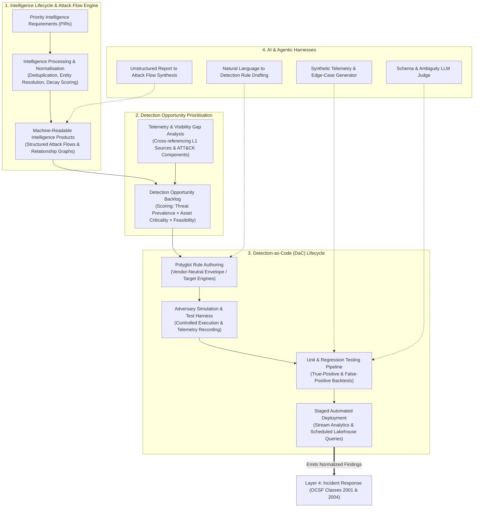
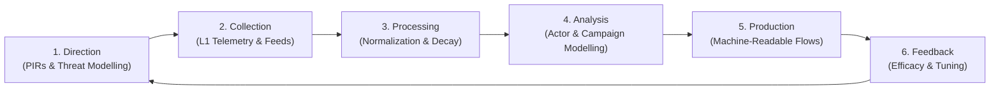
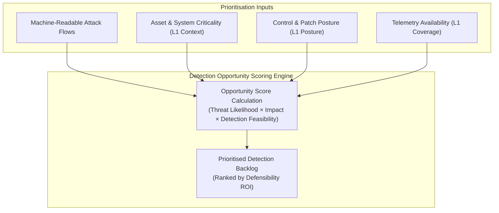
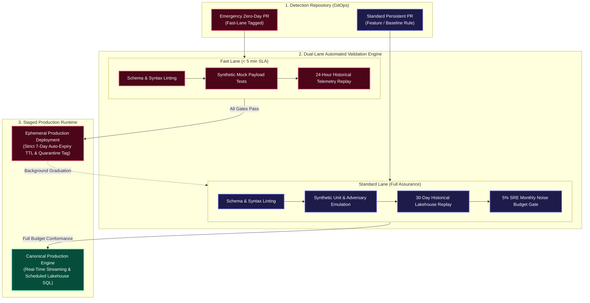
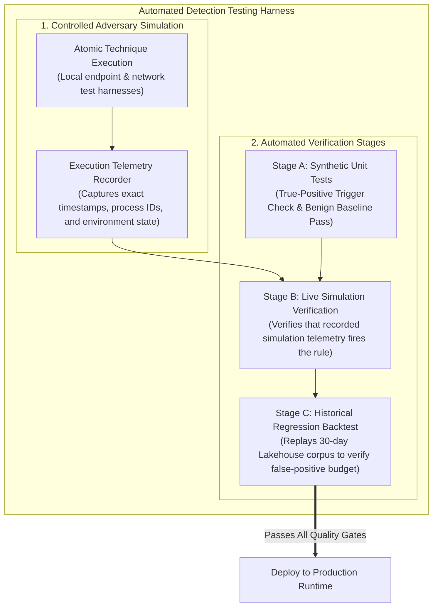
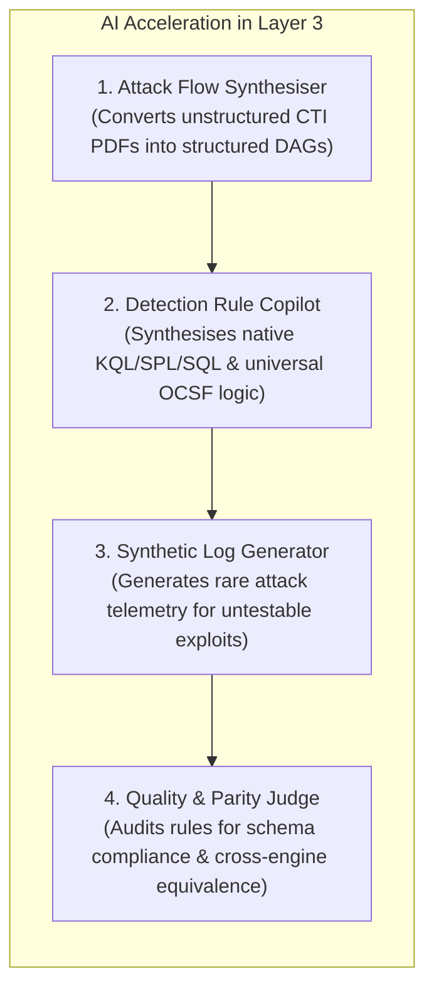
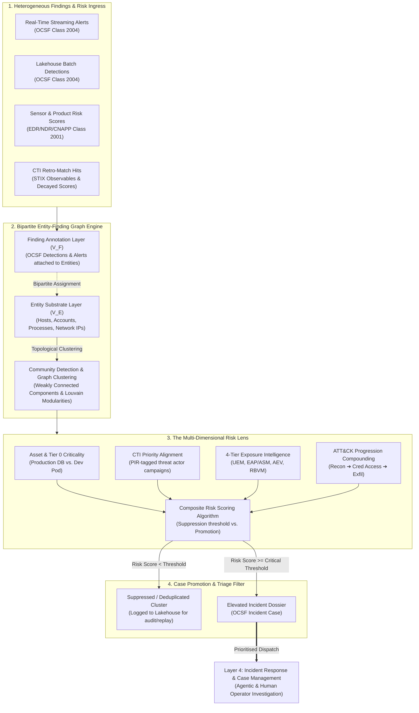

# Layer 3: Threat Intelligence & Detection Engineering

> **Tier 3: Technical Specifications** · **Audience**: Detection Engineers, Threat Intel Analysts · **Normative Status**: Normative Architecture  
> **Prerequisites**: [Layer 2: Pipeline, Storage & Query](04-layer-2-pipeline-storage-query.md) · **Next Step**: [Layer 4: Incident Response](07-layer-4-incident-response.md)

---

**Layer 3 represents the cognitive and analytical core of the TIDIR architecture.** It synthesises raw, normalised telemetry from Layer 2 with operational adversary context to identify active attacks, policy violations, and anomalous behaviours.

Rather than treating threat intelligence as a passive repository of static indicators and detection as an unmanaged collection of ad-hoc alerts, Layer 3 formalises an **intelligence-driven, code-first engineering lifecycle**. Threat intelligence directly produces **machine-readable attack flows** that illuminate detection opportunities, which in turn drive test-driven **Detection-as-Code (DaC)** pipelines validated through automated adversary simulation and CI/CD regression suites.



---

## 2. The Intelligence Lifecycle & Machine-Readable Intel Products

Threat intelligence in Layer 3 operates as a structured, closed-loop discipline rather than a passive feed consumer.



### The Six Operational Intelligence Phases
1. **Direction & Planning**: Establishes Priority Intelligence Requirements (PIRs) aligned with business risks, executive threat models, and Tier 0 mission-critical assets.
2. **Collection**: Ingests raw threat data from Layer 1 (technical observables, vulnerability advisories, community disclosures, internal case discoveries).
3. **Processing & Normalization**: Deduplicates overlapping claims, extracts technical observables into structured entities, applies mathematical decay curves, and resolves multi-source contradictions.
4. **Analysis**: Correlates technical observables with tactical adversary behaviours, campaign waves, and threat actor profiles.
5. **Production (Machine-Readable Attack Flows)**: Generates structured, consumable intelligence products designed for direct ingestion by automated detection pipelines.
6. **Feedback & Evaluation**: Measures whether produced intelligence successfully enabled detection, prevented compromise, or produced excessive noise, refining PIRs accordingly.

### Machine-Readable Intelligence Products (MRIPs)
Traditional threat intelligence produces static PDF reports that require human interpretation. Layer 3 mandates the production of **Machine-Readable Intelligence Products**:
- **Structured Attack Flow Definitions**: Codifies multi-step adversary attack paths into directed acyclic graphs (DAGs) representing sequential and concurrent attacker steps (e.g., *Phishing Attachment $\rightarrow$ Script Execution $\rightarrow$ Process Injection $\rightarrow$ LSASS Memory Dump $\rightarrow$ SMB Lateral Movement*).
- **Contextual Relationship Schemas**: Expresses explicit relationship edges: `ThreatActor` $\xrightarrow{\text{uses}}$ `Tool` $\xrightarrow{\text{implements}}$ `AttackPattern` $\xrightarrow{\text{targets}}$ `Vulnerability` $\xrightarrow{\text{generates}}$ `TelemetryObservable`.
- **Actionable Emulation Plans**: Machine-executable step sequences detailing specific command lines, APIs, and network behaviours required to simulate the adversary during detection validation.

---

## 3. Intel-Driven Detection Opportunity Prioritisation

Rather than authoring rules reactively or attempting exhaustive coverage of hundreds of generic techniques, Layer 3 uses a deterministic **Detection Opportunity Engine** to prioritise engineering effort.



### Detection Opportunity Scoring Algorithm
Each candidate detection opportunity is prioritised using a composite scoring model:

$$\text{Priority Score} = \frac{\text{Threat Likelihood} \times \text{Asset Exposure} \times \text{Impact Severity}}{\text{Engineering Complexity} \times \text{Noise Risk}}$$

- **Threat Likelihood**: Derived from active campaign tracking, exploit weaponization telemetry, and prevalence within targeted industry sectors.
- **Asset Exposure & Impact**: Evaluated against Layer 1 organisational context (e.g., whether vulnerable systems are public-facing or hold sensitive regulatory data).
- **Detection Feasibility & Telemetry Coverage**: Audits whether Layer 1 emits the required MITRE ATT&CK Data Components (e.g., process creation command lines, network flow summaries). If telemetry is absent, the system generates an upstream **Telemetry Engineering Request** for Layer 1.

---

## 4. Detection-as-Code (DaC) Lifecycle & Dual-Lane CI/CD Architecture

All detection logic in Layer 3 is developed, versioned, tested, and deployed according to strict software engineering principles: **Detection-as-Code (DaC)**. 

To eliminate the operational conflict between rigorous 30-day noise budget validation and urgent zero-day containment velocity, TIDIR implements a **Dual-Lane Staged CI/CD Pipeline**:



### 4.1 Fast-Lane vs. Standard-Lane Operational Contract
1. **Fast Lane (Emergency TTP / Active Outbreak Response)**:
   - **Trigger**: Active zero-day exploitation, CISA emergency directives, or high-velocity ransomware variants requiring sub-minute detection authoring.
   - **Verification Gates**: Schema registry compiler linting, synthetic unit assertions, and a rapid 24-hour historical lakehouse replay (SLA: $\lt 5$ minutes).
   - **Fail-Safe Constraint**: Fast-lane rules deploy as **ephemeral detections** carrying an enforced **7-day auto-expiry TTL** and quarantine tag. They alert on-duty analysts but automatically expire unless graduated through the Standard Lane.
2. **Standard Lane (Persistent Detection Corpus)**:
   - **Trigger**: Permanent enterprise detection coverage, behavioral baselines, and complex multi-event heuristics.
   - **Verification Gates**: Schema validation, continuous purple-team adversary emulation, full 30-day historical lakehouse backtesting, and strict compliance with the **5% monthly SRE noise budget**.
   - **Result**: Ensures zero-day defense is never paralyzed by batch lakehouse latency, while permanently preventing un-backtested rules from rotting production alert queues.

### Declarative Detection Specification: Polyglot Detection-as-Code

To avoid the **Lowest Common Denominator Trap** while retaining enterprise-wide governance, TIDIR enforces **Polyglot Detection-as-Code (Hybrid DaC)** (formalised in [ADR-0019](../adr/0019-polyglot-detection-as-code-and-native-engine-adaptation.md)). 

Every detection rule is maintained as a structured code artifact decoupling a **100% vendor-neutral declarative metadata envelope** from **target-optimised query execution blocks**:

1. **Vendor-Neutral Metadata Envelope**:
   - **Identification & Lifecycle**: UUID, semantic rule version, author, and maturity status (`experimental`, `shadow`, `production`, `deprecated`).
   - **Threat Framework & Defensive Countermeasure Mapping**: Mapped MITRE ATT&CK Tactics/Techniques, MITRE D3FEND defensive countermeasures (e.g. `D3-PSA`, `D3-EOP`), and referenced Attack Flow DAGs.
   - **Data Requirements**: Target OCSF schema classes (e.g. Class 1007 Process Activity) and required attributes.
   - **Operational Guidance & SRE Budgets**: Severity, false-positive baselines, quiet windows, triage playbooks, and maximum SRE False Positive Rate (FPR $\le 0.05$).
2. **Detection Logic Execution Blocks**:
   - **`detection_universal` (Portable Predicate)**: Optional declarative AST or Sigma-style key-value filter for simple, single-event streaming assertions that transpile cleanly across all engines.
   - **`detection_implementations` (Target-Optimised Dialects)**: Native query blocks (KQL, SPL, ClickHouse/Snowflake SQL, Flink SQL) that exploit underlying runtime primitives: windowed aggregations, graph joins, timeseries anomaly algorithms (`make-series`, `streamstats`), and table clustering indexes.
3. **Deterministic Test Fixtures**:
   - Explicit true-positive and false-positive OCSF JSON payloads executed in CI/CD across all declared query implementations to assert semantic parity.

#### Polyglot DaC Rule Schema Example

```yaml
id: "8e7c156a-2d44-48e2-b7e1-8899fa1b0201"
name: "Process Masquerading via Unsigned System Binary Hollow"
version: 2
status: "production"
author: "Detection Engineering"
date: "2026-09-17"

# 1. 100% Vendor-Neutral Governance & Taxonomy
threat_intel:
  mitre_attack:
    tactics: ["TA0005"]
    techniques: ["T1055.012", "T1036.005"]
  mitre_d3fend:
    countermeasures: ["D3-PSA", "D3-EOP"]
  attack_flow_ref: "af-2026-proc-hollow-v1"

data_requirements:
  ocsf_version: "1.1.0"
  target_classes: [1007] # Process Activity
  mandatory_attributes:
    - "process.file.name"
    - "process.file.signature.is_signed"
    - "process.parent_process.file.name"

operational:
  severity: "high"
  noise_budget_fpr: 0.02
  quiet_window: "15m"
  triage_playbook: "docs/playbooks/pb-t1055-investigation.md"

# 2. Portable Predicates (For Simple Stream Event Filters)
detection_universal:
  selection:
    process.file.name|endswith: ".exe"
    process.file.signature.is_signed: false
    process.parent_process.file.name: "svchost.exe"

# 3. Target-Optimised Native Implementation Blocks
detection_implementations:
  sentinel_kql: |
    SecurityEvent
    | where EventID == 4688
    | where ProcessName endswith ".exe" and SignatureStatus != "Valid"
    | where ParentProcessName has "svchost.exe"
    | summarize FirstSeen=min(TimeGenerated), LastSeen=max(TimeGenerated) by Computer, Account, ProcessCommandLine
  splunk_spl: |
    index=edr event_id=4688 is_signed=false process_name="*.exe" parent_process_name="*svchost.exe"
    | streamstats count by host, user, process_name window=5m
    | where count > 1
  lakehouse_sql: |
    SELECT 
      actor.user.name,
      device.hostname,
      process.cmd_line,
      count(*) OVER (PARTITION BY device.hostname, actor.user.name ORDER BY time RANGE BETWEEN INTERVAL 10 MINUTE PRECEDING AND CURRENT ROW) as frequency
    FROM ocsf_process_activity
    WHERE process.file.signature.is_signed = false
      AND lower(process.parent_process.file.name) = 'svchost.exe'
    QUALIFY frequency > 1;

# 4. Deterministic Verification Fixtures
tests:
  unit_fixtures:
    - name: "Valid unsigned hollowing attempt"
      expected_result: true
      event:
        class_uid: 1007
        process:
          file: { name: "svchost.exe", signature: { is_signed: false } }
          parent_process: { file: { name: "svchost.exe" } }
    - name: "Benign signed Windows binary"
      expected_result: false
      event:
        class_uid: 1007
        process:
          file: { name: "svchost.exe", signature: { is_signed: true } }
          parent_process: { file: { name: "services.exe" } }
```

---

## 5. Testing Environments, Adversary Simulation & Verification

Detection rules cannot be trusted without empirical verification. Layer 3 defines an automated test harness combining synthetic validation with controlled adversary simulation.



### 1. Controlled Adversary Simulation
- **Atomic Execution Engines**: Automated agents execute specific, self-contained attacker techniques in isolated testing environments (`dev` and `test` tiers).
- **Strict Execution Boundaries**: Simulations run only within designated test namespaces, sandbox workloads, and non-production accounts.
- **Execution Telemetry Recording**: The test runner logs precise execution metadata: start timestamp, end timestamp, executing user context, process ID, parent process ID, and generated network connections. This serves as the ground-truth benchmark for rule verification.

### 2. Multi-Stage Testing Pipeline
- **Unit Testing (Synthetic Assertions)**: Tests the raw query logic against mock OCSF JSON fixtures across all declared dialect implementations (`sentinel_kql`, `splunk_spl`, `lakehouse_sql`). Validates that true-positive payloads trigger the rule with expected field bindings and benign edge-case payloads pass without firing.
- **Simulation Verification**: Ingests the recorded telemetry from live adversary simulations through the pipeline. Asserts that the rule successfully matches the generated telemetry within the defined SLA window (< 5 seconds for streaming rules).
- **Historical Regression Backtesting**: Replays the candidate rule against a 30-day historical lakehouse telemetry sample in the `pre-prod` environment. The pipeline calculates the **Expected Alert Volume (EAV)** and flags rules that exceed the acceptable noise threshold before deployment.

---

## 6. AI & Agentic Harnesses in Layer 3

Artificial intelligence is integrated into Layer 3 not as an unconstrained decision-maker, but as an engineering accelerator governed by deterministic evaluation gates:



1. **Attack Flow Synthesis**: Natural language processing models ingest unstructured threat intelligence publications (threat reports, blogs, advisories) and extract structured Attack Flow definitions, mapping entity relationships and temporal sequences.
2. **Detection Logic Drafting & Dialect Synthesis**: Converts Attack Flow requirements into initial Polyglot Detection-as-Code drafts, populating the vendor-neutral metadata envelope and synthesizing target-optimized native query blocks (KQL, SPL, Lakehouse SQL) that exploit platform-specific indexes and functions for human review.
3. **Synthetic Telemetry Generation**: For high-risk attack techniques that cannot be safely simulated in live test environments (e.g., ransomware encryption routines, hypervisor escape mechanisms), generative models synthesize forensically accurate OCSF event streams to validate rule logic.
4. **Automated LLM Judge & Parity Evaluator**: Evaluates proposed detection rules against strict architectural standards: checking for regex performance traps, schema field deprecations, ambiguous logic boundaries, and asserting semantic parity across heterogeneous query blocks (`sentinel_kql`, `splunk_spl`, `lakehouse_sql`) using synthetic test fixtures.

---

## 7. Finding Consolidation, Graph Clustering & The Risk Lens

In modern enterprise environments, a single cyber operation triggers dozens or hundreds of disparate, low-level alerts across siloed detection engines (streaming host sensor rules, cloud audit logs, web application firewalls, network anomaly engines, scheduled lakehouse queries). Treating each alert as an independent ticket causes catastrophic alert fatigue, fragmented investigative context, and slow containment.

Layer 3 culminates in an **Alert-to-Incident Synthesis Engine** that projects a bipartite graph correlation model and composite risk lens across all inbound findings before elevating them to Layer 4. For architectural rationale, trade-off analysis, and formal justification against direct alert-to-alert graphs, see [ADR-0011: Bipartite Entity-Finding Graph Architecture for Finding Consolidation](/adr/0011-bipartite-entity-finding-graph-consolidation).



### 1. Bipartite Entity-Finding Graph Clustering & Supernode Dampening
Direct "alert-to-alert" linking is an architectural anti-pattern: alerts are sparse epiphenomena, whereas adversary operations occur primarily within undetected telemetry and living-off-the-land executions. Missing an intermediate alert would fracture a direct alert-to-alert chain.

TIDIR implements a **Bipartite Entity-Finding Graph Model**:
- **Entity Substrate (Layer $V_E$)**: Physical and logical actors—such as identities (`actor.user.name`, `iam.role_arn`), host endpoints (`device.hostname`, `device.uid`), processes (`process.entity_id`, `process.parent_process.guid`), and network endpoints (`src_endpoint.ip`, `dst_endpoint.ip`)—form the structural topology linked by causal interaction edges (`AUTHENTICATED_TO`, `SPAWNED`, `CONNECTED_TO`).
- **Finding Annotations (Layer $V_F$)**: Detection findings and alerts attach to one or more entity vertices via bipartite assignment edges ($e = (f, v)$ where $f \in V_F, v \in V_E$), serving as contextual risk annotations rather than primary graph nodes.
- **External Multi-Tool Finding Attachment (XDR, CNAPP, CSPM)**: Pre-computed findings emitted by external commercial tools (e.g. CrowdStrike/Defender EDR detections, Wiz/Orca cloud posture misconfigurations, Cloudflare WAF blocks) attach directly to their corresponding entity vertices (`host.id`, `iam.role_arn`, `ip.address`). This eliminates disconnected vendor console silos: an external CNAPP alert and an internal kernel eBPF detection automatically coalesce into a single unified attack graph.
- **Multi-Source Signal Ingress & Invariant 3 Co-Derivation Discounting**: Inbound risk evaluations derive from diverse internal and external sources—including raw telemetry threshold anomalies (`DET-01`), decayed CTI indicator matches (`CTI-02`), product-native risk scores (EDR, NDR, CNAPP), and external third-party benchmarks ([ADR-0009](/adr/0009-bayesian-multi-signal-risk-scoring)). Invariant 3 dictates that product-native scores serve as *upstream probabilistic evidence*, not unquestioned truth. When an upstream commercial EDR alert and a custom streaming SQL rule fire on the identical underlying OS process event (`source_observation_ids`), the engine evaluates their derivation lineage and discounts the secondary signal to its residual marginal gain, preventing co-derived signals from artificially compounding into an erroneous Sev-1 emergency.
- **Community Detection**: Weakly connected components and modularity-based community detection algorithms (such as Louvain or label propagation) cluster densely connected subgraphs across sliding temporal windows ($\Delta t = 15\text{m} \dots 2\text{h}$) into cohesive incident candidates.

#### Mathematical Supernode Centrality Dampening
In enterprise environments, shared infrastructure nodes—such as outbound egress NAT gateways, VPN concentrators, recursive DNS resolvers, and generic deployment service accounts—frequently connect to thousands of benign events. Uncontrolled graph linking on these high-degree pivots causes catastrophic combinatorial explosion, collapsing unrelated user incidents into single monstrous clusters. Layer 3 enforces **Centrality Dampening**:

$$\Omega(v) = \frac{1}{1 + \alpha \cdot \max\left(0, \deg(v) - \theta_{\text{deg}}\right)}$$

Where:
- $\deg(v)$ is the node degree (unique entity connections within sliding window $\Delta t$).
- $\theta_{\text{deg}}$ is the degree threshold cap (e.g. $\theta_{\text{deg}} = 50$).
- $\alpha$ is the dampening decay rate ($\alpha = 0.15$).

Edges propagating through node $v$ are scaled by $\Omega(v)$. If $\deg(v) \gg \theta_{\text{deg}}$, $\Omega(v) \to 0$, neutralising the supernode from triggering cluster fusion unless accompanied by strong unshared secondary pivots (e.g. identical process GUID or matching user session token).

#### Exponential Edge Decay Half-Life
Relationships between entities are not static. The edge weight $W_e(t)$ between two connected entities decays exponentially with elapsed time $\Delta t$ since the last corroborating event:

$$W_e(t) = W_0 \cdot \exp\left( -\frac{\ln(2)}{t_{1/2}} \cdot \Delta t \right)$$

Where $t_{1/2}$ represents the configured half-life (e.g. $t_{1/2} = 45\text{ minutes}$). Once $W_e(t)$ drops below an operational severance threshold $\tau_{\text{edge}}$, the edge is pruned from memory, preventing stale activity from falsely compounding with fresh telemetry.

### 2. The Composite Risk Lens Algorithm
Static alert severities (e.g., standard "Medium" or "High" labels) are fundamentally inadequate for prioritisation. Layer 3 evaluates each clustered graph through a composite mathematical risk function:

$$\text{Cluster Risk} = \left[ \sum_{i \in \text{Findings}} \Big( C_i \times (1 - \text{FPR}_{30d, i})^\beta \times \Phi(\text{Technique}_i) \Big) \right] \times \Psi_{\text{progression}} \times M_{\text{asset}} \times P_{\text{PIR}} \times P_{\text{expo}}$$

Where:
- $C_i$: Base confidence score ($0.0 \dots 1.0$) of finding $i$.
- $\text{FPR}_{30d, i}$: Historical 30-day false-positive rate of rule $i$, penalising historically noisy detections via sensitivity exponent $\beta = 1.5$.
- $\Phi(\text{Technique}_i)$: Technique severity weight derived from MITRE ATT&CK objective impact (e.g. credential dumping vs discovery).
- $\Psi_{\text{progression}}$: Compounding ATT&CK Progression Multiplier ($\Psi = 1.0 + 0.5 \cdot (k_{\text{tactics}} - 1)^{1.2}$), exponentially rewarding findings that advance across sequential kill-chain phases (Initial Access $\to$ Credential Access $\to$ Exfiltration).
- $M_{\text{asset}}$: Asset Criticality Multiplier ($1.0 \dots 5.0$) extracted from Layer 1 CMDB posture (Domain Controllers, production databases, executive credentials).
- $P_{\text{PIR}}$: Priority Intelligence Requirement Priority Factor ($1.0 \dots 2.5$) for active threat actor campaigns targeting the organisation's specific sector.
- $P_{\text{expo}}$: Exposure Prior Multiplier ($1.0 \dots 3.0$), parameterized dynamically by the 4-tier exposure ingress taxonomy ([ADR-0022](/adr/0022-exposure-management-and-continuous-threat-exposure-integration)):
  - *Unified Exposure Management (UEM)*: Systemic attack path centrality and crown-jewel reachability.
  - *Exposure Assessment Platforms (EAP / ASM / CAASM)*: External perimeter exposure, open ports/services, and unmanaged shadow IT discovery.
  - *Adversarial Exposure Validation (AEV / BAS)*: Empirically validated exploitability paths and defense bypass evidence.
  - *Risk-Based Vulnerability Management (RBVM)*: CVE severity calibrated by CISA Known Exploited Vulnerabilities (KEV) and EPSS exploit probability scores.
  - *Non-Zero Exposure Floor*: Evaluated with $P(\text{Breach}) \ge \epsilon \gt 0$ to prevent novel zero-day attacks against air-gapped or unmapped assets from being silenced by missing exposure records.

### 3. Noise Suppression, Intelligent De-duplication & Deterministic Overrides
- **Volumetric Consolidation**: Hundreds of individual endpoint or network flow events triggered during a port sweep, password spray, or port scan are collapsed into a single multi-event finding cluster.
- **Benign Baseline Suppression**: Graph clusters whose total risk score falls below the operational activation threshold are suppressed from real-time alert queues, preventing analyst burnout while preserving the complete graph record in the Layer 2 lakehouse for retrospective auditing.
- **Dual-Path Ingress Architecture (Probabilistic vs. Deterministic Fast-Path)**:
  - *The Probabilistic Lane (Weak Signals)*: Heuristics, statistical baselines, and multi-event anomalies accumulate across sliding temporal windows, undergoing bipartite community detection and Bayesian compounding before alert promotion.
  - *The Deterministic Fast-Path (Invariants & Canaries)*: Zero-tolerance, high-consequence indicators—such as canary honeytoken access ([ADR-0013](/adr/0013-ambient-deception-fabric-and-canary-anchors)), blocklisted vulnerable kernel driver loads (BYOVD), or mass cryptographic file renaming—**bypass graph compounding entirely**. These events instantly emit emergency OCSF Class 2004 findings with maximum risk priority ($S = 100$) directly into Layer 4 without correlation delay.
  - *Operational Rate Guardrails*: As codified in [ADR-0009](/adr/0009-bayesian-multi-signal-risk-scoring), deterministic bypass lanes enforce control-plane rate limits to prevent adversaries from weaponizing high-fidelity signatures into operational denial-of-service alerts.

### 4. Handoff to Layer 4: The Elevated Incident Dossier
When a cluster crosses the critical composite risk threshold—or when a Deterministic Override Circuit trips—Layer 3 does not forward a raw list of alert notifications. It compiles a rich **Incident Dossier**:
- **Consolidated Entity Graph**: Pre-mapped relationships between users, assets, processes, and remote IPs.
- **Chronological Attack Timeline**: Formatted sequence of observed attacker milestones tagged with MITRE ATT&CK techniques.
- **Automated Triage Summary**: Pre-computed blast-radius assessment and recommended response playbooks.
- **Actionable Assignment**: Dispatched directly to Layer 4 investigation workbenches for coordinated **human and agentic operator execution**.

---

## 8. Autonomous AI Roles & Detection Engineering Capabilities

In Layer 3, autonomous AI and agentic harnesses transform how threat intelligence is ingested and how detection logic is tested and validated:

1. **Threat Advisory to Machine-Readable ATT&CK Flow Synthesis**:
   - *Problem*: Vulnerability disclosures, CISA alerts, and commercial threat bulletins are published in unstructured prose, requiring hours of manual analyst decomposition to extract actionable indicators and behavioral logic.
   - *AI Role*: Tier 1/2 reasoning models ingest unstructured advisories, identify prerequisite attack sequences, and output machine-readable ATT&CK DAG flows specifying exact OCSF schema classes (`1007: Process Activity`, `3002: Authentication`).
   - *Deterministic Safety Gate*: Extracted attack flows must undergo human CTI analyst peer review and schema compiler validation before triggering detection engineering backlogs.

2. **Continuous Evals-as-Code & DaC Quality Judges**:
   - *Problem*: Brittle detection rules written without broad test coverage cause alert fatigue or severe performance degradation on production streaming buses.
   - *AI Role*: Multi-model agent judges audit Detection-as-Code (DaC) pull requests, scoring candidate Sigma/SQL rules for schema deprecation, logic ambiguities, and triage documentation completeness.
   - *Deterministic Safety Gate*: Rules cannot deploy to production without passing automated 30-day historical lakehouse backtests and synthetic unit test suites in CI/CD, guaranteeing zero syntax errors and meeting the pre-deployment CI hard gate of peak $\text{FPR} \lt 1\%$ (against historical replay corpus), before being governed by the operational rolling 30-day production error budget ($\text{FPR} \le 5\%$).
