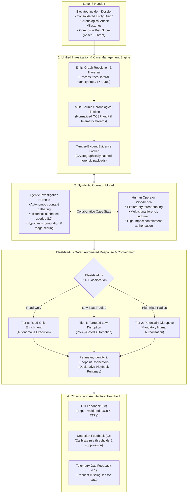
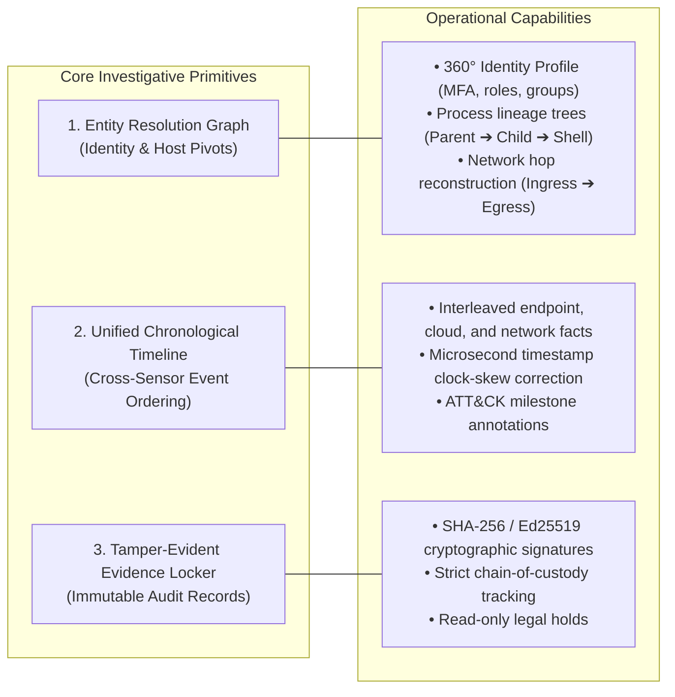
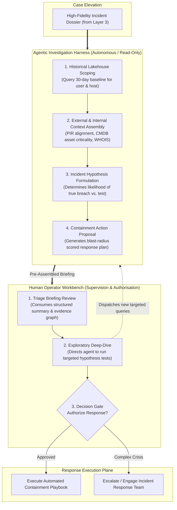
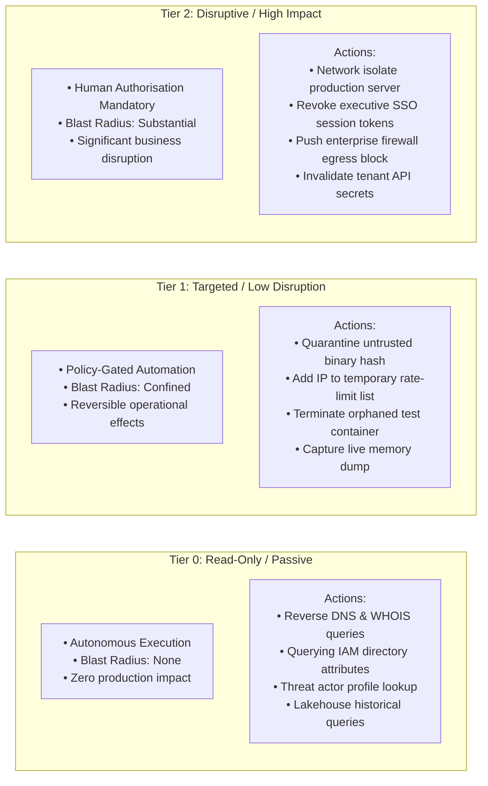
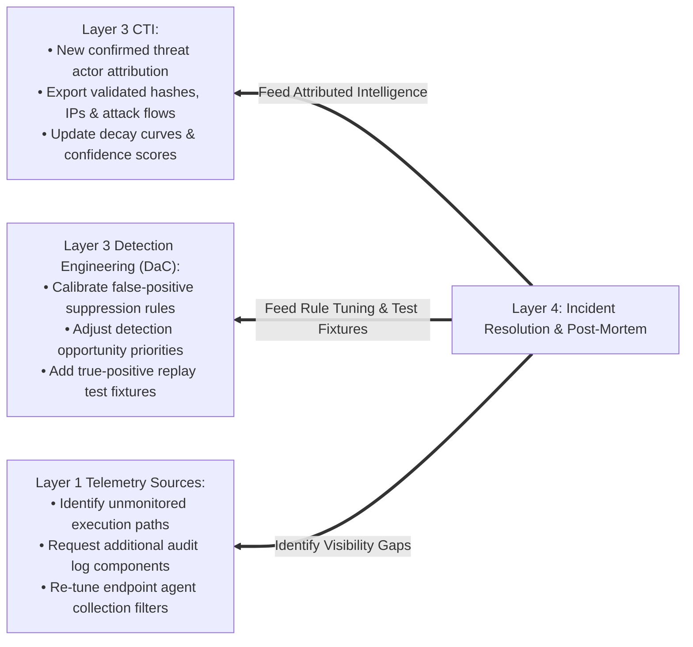

# Layer 4: Investigation, Case Management & Automated Response

> **Tier 3: Technical Specifications** · **Audience**: Incident Responders, SecOps Automation Leads · **Normative Status**: Normative Architecture  
> **Prerequisites**: [Layer 3: Intel & Detection Engineering](06-layer-3-threat-intel-detection.md) · **Next Step**: [Cross-Cutting Disciplines](05-cross-cutting-engineering-disciplines.md)

---

**Layer 4 represents the decisive resolution plane of the TIDIR architecture.** While Layer 1 emits telemetry, Layer 2 transports and stores data, and Layer 3 synthesizes detections and risk-scored incident dossiers, Layer 4 executes the critical operational workflows: **investigating root causes, validating attack scope, containing adversary momentum, and restoring trusted operations.**

Rather than treating case management as a static ticketing queue and automation as brittle, unconstrained scripts, Layer 4 establishes a **symbiotic operating model between agentic harnesses and human operators**, governed by an immutable **Blast-Radius Risk Tiering framework**.

---

## 2. Investigation & Case Management Architecture

Effective incident investigation requires rapid contextualization across disparate event streams without manual pivot fatigue. Layer 4 provides three core investigative primitives:

### 1. Entity Graph Resolution & Traversal
- **Graph Data Structure**: Incoming findings are projected into an interconnected graph model where nodes represent resolved entities (`Actor`, `User`, `Credential`, `Process`, `Host`, `IP`, `Domain`, `Cloud Resource`) and edges represent verified actions (`AUTHENTICATED_TO`, `SPAWNED`, `CONNECTED_OUTBOUND`, `ASSUMED_ROLE`, `ENCRYPTED_FILE`).
- **Parent-Child Process Reconstruction**: Endpoint execution paths are mapped back to root processes, distinguishing benign system utilities from anomalous command interpreters (e.g. tracking an unexpected shell spawn from an unmanaged web service worker).
- **Identity Traversal**: Reconstructs complete multi-cloud identity journeys, tracking an external VPN authentication to a session token issue, role assumption, and administrative policy edit.

### 2. Unified Chronological Timeline Reconstruction
- **Multi-Source Interleaving**: Reassembles events across multiple layers—correlating Layer 1 perimeter logs, Layer 2 lakehouse historical queries, and Layer 3 alert triggers into a single continuous temporal stream.
- **Clock-Skew Normalization**: Re-indexes events using coordinated time horizons to eliminate discrepancies across distributed cloud provider regions and on-premises physical clocks.
- **Milestone Extraction**: Automatically tags key attacker actions (Initial Access, Defense Evasion, Persistence, Exfiltration) directly onto the timeline to accelerate cognitive intake for responding analysts.

### 3. Tamper-Evident Evidence Locker
- **Cryptographic Hashing**: All forensic artifacts (packet captures, memory triage excerpts, disk image snapshots, script payloads) collected during an investigation are sealed with SHA-256 content hashes.
- **Immutable Chain-of-Custody**: Every access, analysis, or export operation is immutably logged to an append-only audit register, ensuring admissible legal integrity for regulatory reporting and post-incident disclosures.

---

## 3. Symbiotic Operator Model: Agentic & Human Collaboration

Modern high-velocity security operations cannot rely exclusively on human triage (which cannot scale to enterprise alert volumes) nor unconstrained autonomous agents (which lack business context and risk tolerance). Layer 4 pairs **Agentic AI Harnesses** with **Human SecOps Operators** in a continuous collaborative loop:

### 1. The Hierarchical Agentic Investigation Mesh (The Analytical Multiplier)
- **Specialist Subagent Mesh**: Rather than relying on a monolithic prompt, the Lead Triage Orchestrator dispatches parallel, domain-specialized subagents:
  - *Host Forensic Agent*: Recursively reconstructs parent-child process execution trees, inspects loaded DLL modules, and isolates local script blocks.
  - *Identity & Auth Agent*: Resolves cross-cloud identity tokens, IAM role escalation chains, and anomalous geolocation hops.
  - *Network & Cloud Agent*: Correlates VPC flow records, egress proxy connections, and external IP reputation scores.
- **Model Context Protocol (MCP) Tool Calling**: Subagents interact with enterprise telemetry exclusively through strongly-typed MCP servers (`mcp-lakehouse-query`, `mcp-process-lineage`, `mcp-threat-graph`, `mcp-blast-radius`). This guarantees parameter validation via JSON Schema and prohibits arbitrary command execution.
- **Agent Trust Boundary (Dual-Plane Data Isolation)**: Untrusted telemetry strings (command lines, URLs, payload snippets) reside strictly within the data plane and are parsed into typed parameters before model exposure. Prompt injection is assumed possible; system safety relies on deterministic tool boundaries and schema validation to prevent untrusted inputs from escalating into execution authority.
- **Autonomous Scoping Queries**: The agentic mesh immediately dispatches federated queries to the Layer 2 lakehouse without human prompting—determining whether a suspicious indicator has appeared elsewhere in the last 90 days, checking authentication baselines, and enumerating sibling assets.
- **Hypothesis Formulation**: Evaluates the evidence against established attack patterns and outputs a plain-language hypothesis detailing: *What happened, how access was gained, what assets are affected, and what the attacker is attempting next.*
- **Adversarial Dual-Model Consensus (Asymmetric Consensus Pattern)**:
  - *Out-of-Band Decoupling & Tiered Timeout Budgets*: High-velocity streaming containment never blocks on multi-model consensus. The deterministic safety kernel and symbolic AST verifier evaluate containment boundaries within strict hard budgets ($\le 500\,\text{ms}$). Asynchronous, multi-model arbitration (Proposer vs Challenger) operates out-of-band for deep investigative case framing, bounded by a $\le 3\,\text{s}$ SLA.
  - *Elimination of Shared Mode Collapse*: The Challenger couples an architecturally distinct model family (e.g. local SLM judge, [ADR-0014](../adr/0014-ai-observability-self-learning-and-slm-judges.md)) with **deterministic symbolic validation** (asserting chronological event monotonicity, verifying graph edge existence via SQL/Cypher, and validating OCSF schema type contracts).
  - *Asymmetric Arbitration Policy*: 
    - For **Triage and Hypothesis Escalation**, a *pessimistic quorum* applies: if either engine identifies elevated threat confidence, the dossier elevates for analyst awareness.
    - For **Automated Destructive Containment**, *unanimous agreement* between neural and symbolic verifiers is strictly mandatory. Any semantic divergence automatically diverts the action to the human operator workbench, preventing both runaway automation and arbitration thrashing.
- **Action Plan Drafting**: Proposes an exact sequence of remediation steps, complete with estimated downtime, user impact, and blast-radius scores.

### 2. The Human Operator Workbench (The Judgment Anchor)
- **Cognitive Primacy**: The human operator is never forced to start from scratch. They review a pre-triaged case dossier with full evidence citations.
- **Exploratory Steering**: Analysts can command the agentic harness using natural language or structured queries (`"Check if any other host received this PowerShell payload in the last 48 hours"`).
- **Exclusive Authority Over Disruptive Actions**: Human operators retain sole execution authority for any action classified as potentially disruptive to business operations.

---

## 4. Blast-Radius Gated Automated Response & Containment

To eliminate operational risk while maximizing response velocity, automated actions are strictly compartmentalized into three **Blast-Radius Risk Tiers**:

### Blast-Radius Risk Tier Matrix

| Risk Tier | Authorisation Policy | Permitted Actions | Forward Compensation & Recovery Constraint |
| :--- | :--- | :--- | :--- |
| **Tier 0: Passive Enrichment** | Fully Autonomous | Read-only threat intel queries, directory lookups, telemetry scoping, lakehouse scans. | Not applicable (no environmental state mutation). |
| **Tier 1: Targeted Containment** | Autonomous for High-Confidence / Low-Criticality Assets | Host-level process termination, untrusted file quarantine, temporary IP rate-limiting, user session lock. | Verified 1-click forward compensation procedure (restores benign services; strictly preserves reachability invariant $R(s_{\text{post}}) \subseteq R(s_{\text{pre}})$). |
| **Tier 2: Disruptive Containment** | Mandatory Dual-Operator or Senior SecOps Approval | Production database network isolation, global firewall rules, tenant-wide account locks, certificate revocation. | Step-by-step verified forward compensation procedure (human attestation mandatory to dismantle containment barriers). |

### Pre-Execution Blast-Radius Impact Simulator (Anti-Rubber-Stamping Gate)
In high-stress security incidents, human operators suffer cognitive exhaustion. If an agentic harness presents a compelling narrative recommending host isolation or credential revocation, analysts risk default "rubber-stamping" without verifying topological ramifications.

To prevent inadvertent business disruption from false-positive agent recommendations, Layer 4 mandates a **Deterministic Pre-Execution Impact Simulator**:
- **Live Dependency Evaluation**: Before presenting an authorisation modal to the human operator, the response orchestrator queries Layer 1 CMDB relationships and Layer 2 network flow records to compute active blast radius metrics:
  - *Active Connection Count*: (e.g. `1,420 client TCP sessions currently routed to this workload`).
  - *Downstream Service Dependencies*: (e.g. `Host app-worker-04 is a member of the primary payment processing pool`).
  - *Data Volume in Flight*: (e.g. `Active database read-replica synchronisation in progress`).
- **Explicit Impact Card Rendering**: Authorisation interfaces present the simulation summary alongside the agentic recommendation:
  > **⚠️ Pre-Execution Blast-Radius Preview:**
  > Authorising isolation on `srv-payment-api-01` will immediately sever **42 active microservice communication channels** and degrade **Checkout Gateway Availability**. Estimated operational recovery time: **12 minutes**.

### Dual-Authorisation Consensus Engine (Two-Person Rule)
For Tier 2 actions whose blast-radius score exceeds an enterprise criticality threshold $\theta_{\text{critical}}$ (e.g. actions affecting Domain Controllers, core transactional databases, or executive access keys), a single analyst signature is architecturally insufficient:
1. **Multi-Signature Handshake**: The response orchestrator holds the containment transaction in an unexecuted staged queue and dispatches an out-of-band cryptographic challenge to a secondary designated authoriser (Incident Commander, SecOps Lead, or System Owner).
2. **Time-To-Live Expiration**: If the secondary signature is not cryptographically ratified within the configured TTL (e.g. 15 minutes), the staged action safely expires, preventing stale authorisations from executing against an altered operational topology.
3. **Emergency Break-Glass Override**: For active ransomware encryption in flight, a single authenticated commander can trigger a break-glass override. This executes containment immediately while generating an immutable, priority-1 audit event forwarded to executive stakeholders.

### Security-State Monotonicity & Fail-Closed Containment

Security containment workflows interact with heterogeneous APIs across host agents, identity providers, and network firewalls. In traditional commercial microservices, distributed workflows execute compensating rollbacks if a subsequent step fails. 

**In cybersecurity, rolling back containment is fundamentally anti-defence.** (Formalised in [ADR-0005](../adr/0005-saga-pattern-containment-and-break-glass-protocol.md)). If an identity revocation step fails after isolating a host and blocking a C2 IP, reversing those actions actively restores adversary footholds and weaponizes transient network faults against the enterprise.

To govern distributed containment workflows, Layer 4 establishes **Security-State Monotonicity**:
- **Governing Invariant**: *No automated compensation may increase attacker reachability beyond the last verified-safe security state.*
- **Action Monotonicity vs. Security-State Monotonicity**: We distinguish between reversing individual API actions and regressing the security perimeter. Automated compensation is permitted exclusively for *forward-security actions* (e.g. restoring benign services, routing traffic through isolated inspection enclaves) but is strictly prohibited from dismantling established security barriers ($T_1 \dots T_{k-1}$) without explicit, authenticated human attestation.
- **Fail-Secure Boundary Freezes**: On partial failure or API timeouts, the orchestrator freezes the existing perimeter in place and executes forward escalation (e.g. applying upstream network-tier isolation) rather than reopening endpoints.
- **Lease-Gated Deadlock Prevention**: As codified in [ADR-0005](../adr/0005-saga-pattern-containment-and-break-glass-protocol.md), partial containment locks are bound to ephemeral isolation leases with bounded TTLs (e.g. 45 minutes), ensuring that network partitions or stalled workflows fail safely to higher-order supervisory alerts without distributed deadlock.

### Operator Skill Retention & Incident Replay Flight Deck

To permanently eliminate cognitive and forensic atrophy induced by autonomous agent triage (formalised in [ADR-0020](../adr/0020-operator-skill-retention-and-incident-replay-simulators.md)), Layer 4 institutionalises commercial aviation's flight-currency mandates and emergency check-ride models:

1. **Forensic Currency Quotas ("Flight Hours")**:
   - Responders maintain an active forensic currency profile requiring a monthly quota of unassisted manual investigations across system execution, cloud IAM, and identity domains.
   - When an operator's currency metric decays, the allocation engine throttles autonomous delegation, routing eligible medium-severity live findings or synthetic canary alerts directly to the **Manual Flight Deck** (with agent copilots placed in passive observation mode).
2. **The Incident Replay Simulator**:
   - Uses Layer 2 lakehouse time-travel partition snapshots to hydrate exact historical incident telemetry into an ephemeral sandbox workbench.
   - Operators execute blind investigations against historical outbreaks and purple-team attack simulations without knowing whether the scenario is live or synthetic until the dossier is sealed.
3. **Dual-Blind Mutual Calibration**:
   - The autonomous agent mesh executes concurrently in a shadow runtime against the same incident.
   - Post-investigation diff analysis identifies operator blind spots (training opportunities) and surfaces model drift or hallucinations in the agent mesh, using human expert findings as golden ground-truth benchmarks.

---

## 5. Closed-Loop Architectural Feedback

A healthy security architecture is an adaptive, learning feedback loop. Every incident investigated and closed in Layer 4 generates continuous improvements across the entire platform:

1. **Feedback to Layer 3 Cyber Threat Intelligence (CTI)**: Confirmed attack indicators, C2 infrastructure, and campaign identifiers uncovered during forensics are automatically packaged into STIX 2.1 entities, enriching the internal CTI repository and initiating automated retro-hunts across Layer 2.
2. **Feedback to Layer 3 Detection Engineering (DaC)**: Benign activities that triggered false alarms produce automated exclusion pull requests in the Detection-as-Code repository, while true attacks generate new synthetic regression test cases to prevent future detection drift.
3. **Feedback to Layer 1 Data Sources**: If an investigation identifies forensic blindspots (e.g., missing command-line arguments, unlogged cloud API actions, unmonitored DNS requests), Layer 4 logs a **Telemetry Visibility Gap** to prompt configuration updates in Layer 1 collection agents.
