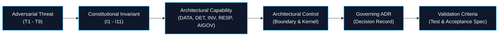

# The TIDIR Assurance Case Map & Architecture Graph

> **Tier 1: Strategic Architecture** · **Audience**: Security Architects, Regulators, Researchers · **Normative Status**: Normative Reference  
> **Purpose**: Provides full bi-directional traceability from adversarial threats to constitutional invariants, capabilities, and prescribed validation criteria.

---

## Architecture as a Connected Graph

In modern security architecture, declaring principles is insufficient without demonstrating how those principles resist active adversary subversion. The **TIDIR Assurance Case** establishes an explicit, machine-traceable relationship between identified threats against the defence system itself and the deterministic controls that preserve system integrity:

$$\text{Adversarial Threat} \longrightarrow \text{Invariant} \longrightarrow \text{Capability} \longrightarrow \text{Architectural Control} \longrightarrow \text{ADR} \longrightarrow \text{Validation Criteria}$$

---

## Bi-Directional Assurance Matrix

The table below maps each adversarial threat to its governing invariant, underpinning capabilities, deterministic control mechanism, and prescribed validation method and acceptance criteria:

| Threat ID & Name | Governing Invariant | Underpinning Capabilities | Architectural Control Mechanism | Governing ADR | Primary Scientific Literature | Validation Method & Acceptance Criteria |
| :--- | :--- | :--- | :--- | :--- | :--- | :--- |
| **[THR-T1](/architecture/09-threat-model#threat-vectors)**: Sensor Evasion / Log Blinding | **[INV-01](/architecture/00-architectural-invariants#i1--telemetry-preservation)** (Telemetry Preservation) **[INV-08](/architecture/00-architectural-invariants#i8--graceful-defensive-degradation)** (Degraded Defence) | `CAP-DATA-01` `RESIL-01` `RESIL-02` | Local NVMe ring buffering, direct-to-object lakehouse bypass, out-of-band audit beats. | [ADR-0021](/adr/0021-graceful-degradation-automated-fallback-and-continuity-plan-b) | [FND-19: CrowdStrike & Mandiant 2024–2026 Telemetry](/architecture/foundational-research#fnd-19) [FND-03: NIST SP 800-207 Zero Trust](/architecture/foundational-research#fnd-03) | Bus partition chaos test: zero dropped records during 24h simulated network isolation. |
| **[THR-T2](/architecture/09-threat-model#threat-vectors)**: Schema Poisoning / DoS Inundation | **[INV-01](/architecture/00-architectural-invariants#i1--telemetry-preservation)** (Telemetry Preservation) **[INV-11](/architecture/00-architectural-invariants#i11--operational-portability--non-lock-in)** (Operational Portability) | `CAP-DATA-02` `CAP-DATA-03` | Line-rate OCSF compiler validation, structured `unmapped_data` catch-all, isolated DLQ quarantine. | [ADR-0002](/adr/0002-preserve-unmapped-telemetry-in-ocsf) | [FND-04: OCSF Specification 2023](/architecture/foundational-research#fnd-04) [FND-16: Apache Iceberg Open Table](/architecture/foundational-research#fnd-16) | Synthetic fuzzing suite: malformed JSON and corrupted payloads diverted to DLQ with zero parser crashes. |
| **[THR-T3](/architecture/09-threat-model#threat-vectors)**: Evidence Tampering / Audit Destruction | **[INV-02](/architecture/00-architectural-invariants#i2--evidence-provenance--traceability)** (Evidence Traceability) **[INV-10](/architecture/00-architectural-invariants#i10--reconstructability-the-incident-decision-dag)** (Reconstructability) | `CAP-INV-04` `RESIL-05` | Immutable WORM object storage, RFC 3161 cryptographic timestamps, append-only Incident Decision DAG. | [ADR-0001](/adr/0001-record-architecture-decisions) [ADR-0010](/adr/0010-sabsa-business-architecture-and-attribute-profiling) | [FND-14: Lamport 1978 Distributed Clocks](/architecture/foundational-research#fnd-14) [FND-15: RFC 3161 Time-Stamp Protocol](/architecture/foundational-research#fnd-15) | Cryptographic verification audit: cryptographic tamper evidence and Merkle root verification over sealed dossiers. |
| **[THR-T4](/architecture/09-threat-model#threat-vectors)**: Indirect Prompt Injection & Instruction Manipulation | **[INV-04](/architecture/00-architectural-invariants#i4--authority-separation-trust-doctrine-maxim)** (Authority Separation) **[INV-05](/architecture/00-architectural-invariants#i5--least-capability--ephemeral-identity)** (Least Capability) | `CAP-INV-05` `CAP-AIGOV-02` `CAP-AIGOV-06` | Agent Trust Boundary (dual-plane data/control isolator), read-only tools, ephemeral SPIFFE SVIDs ($\le 15\text{m}$, max 15 minutes). | [ADR-0004](/adr/0004-defensive-ai-runtime-and-prompt-injection-firewall) [ADR-0015](/adr/0015-sandboxed-agent-execution-otlp-convergence-and-ephemeral-identity) | [FND-10: Greshake et al. 2023 Prompt Injection](/architecture/foundational-research#fnd-10) [FND-11: Willison 2023 Dual LLM](/architecture/foundational-research#fnd-11) [FND-17: NCSC 2024; Anthropic 2026; UK AISI 2026; Hugging Face 2026](/architecture/foundational-research#fnd-17) | Continuous Evals-as-Code: prompt injection benchmark achieving zero unauthorised tool invocations across test corpus. |
| **[THR-T5](/architecture/09-threat-model#threat-vectors)**: Alert Storm Denial of Service / Desensitisation | **[INV-03](/architecture/00-architectural-invariants#i3--evidential-independence-anti-shared-ancestry)** (Evidential Independence) **[INV-06](/architecture/00-architectural-invariants#i6--bounded-autonomy--blast-radius)** (Bounded Autonomy) | `CAP-DET-04` `CAP-DET-05` `CAP-DET-06` | Dependency-aware risk compounding, supernode graph dampening, monthly SRE Alert Noise Error Budgets. | [ADR-0003](/adr/0003-graph-supernode-pruning-and-clustering-boundaries) [ADR-0008](/adr/0008-secops-error-budgets-and-chaos-security-engineering) [ADR-0009](/adr/0009-bayesian-multi-signal-risk-scoring) | [FND-01: Axelsson 2000 Base-Rate Fallacy](/architecture/foundational-research#fnd-01) | Historical lakehouse backtesting: $\ge 75\%$ reduction in alert volume with noise budget false-positive rate $\le 5\%$. |
| **[THR-T6](/architecture/09-threat-model#threat-vectors)**: Automated Response Sabotage / Outage Trigger | **[INV-07](/architecture/00-architectural-invariants#i7--fail-secure-containment--reachability-monotonicity)** (Security-State Monotonicity) **[INV-09](/architecture/00-architectural-invariants#i9--human-recoverability--break-glass-flight-decks)** (Human Recoverability) | `CAP-RESP-01` `CAP-RESP-02` `CAP-RESP-04` `RESIL-05` | Monotonic state machine ($s_{n+1} \preceq s_n$, where post-transition reachability is a subset of pre-transition reachability), pre-execution blast-radius scoring, master cryptographic E-Stop. | [ADR-0005](/adr/0005-saga-pattern-containment-and-break-glass-protocol) | [FND-08: Garcia-Molina & Salem 1987 Sagas](/architecture/foundational-research#fnd-08) [FND-09: Nygard 2007 Circuit Breakers](/architecture/foundational-research#fnd-09) | Containment failure fault injection: verified forward perimeter escalation with zero security-state rollback. |
| **[THR-T7](/architecture/09-threat-model#threat-vectors)**: Machine Token / SVID Hijacking | **[INV-04](/architecture/00-architectural-invariants#i4--authority-separation-trust-doctrine-maxim)** (Authority Separation) **[INV-05](/architecture/00-architectural-invariants#i5--least-capability--ephemeral-identity)** (Least Capability) | `CAP-AIGOV-06` `CAP-AIGOV-07` | SPIFFE/SPIRE dynamic task-scoped SVIDs ($\le 15\text{m}$), line-rate NHI behavioral profiling, zero ambient credentials. | [ADR-0015](/adr/0015-sandboxed-agent-execution-otlp-convergence-and-ephemeral-identity) [ADR-0018](/adr/0018-non-human-identity-lifecycle-and-machine-attestation) | [FND-02: Saltzer & Schroeder 1975](/architecture/foundational-research#fnd-02) [FND-06: CNCF SPIFFE Specification](/architecture/foundational-research#fnd-06) [FND-17: Hugging Face 2026 Ambient Credential Incident](/architecture/foundational-research#fnd-17) | Token replay test: simulated out-of-VPC token re-use triggers immediate alert and auto-revocation in $\lt 5$ seconds. |
| **[THR-T8](/architecture/09-threat-model#threat-vectors)**: Model & Knowledge Base Poisoning | **[INV-02](/architecture/00-architectural-invariants#i2--evidence-provenance--traceability)** (Evidence Traceability) **[INV-10](/architecture/00-architectural-invariants#i10--reconstructability-the-incident-decision-dag)** (Reconstructability) | `CAP-DET-05` `CAP-DET-07` `CAP-AIGOV-01` | WORM-sealed RAG context, parent-hash DAG verification, SLM grounding judges ($\ge 95\%$), ambient canary anchors. | [ADR-0010](/adr/0010-sabsa-business-architecture-and-attribute-profiling) [ADR-0013](/adr/0013-ambient-deception-fabric-and-canary-anchors) [ADR-0014](/adr/0014-ai-observability-self-learning-and-slm-judges) | [FND-18: Carlini et al. 2023 Data Poisoning](/architecture/foundational-research#fnd-18) [FND-17: Fang 2024; Anthropic 2026; Hugging Face 2026](/architecture/foundational-research#fnd-17) | Grounding benchmark: corrupted context injection stripped by AST/DAG kernel; SLM judge maintains $\ge 95\%$ grounding accuracy. |
| **[THR-T9](/architecture/09-threat-model#threat-vectors)**: Excessive Agency & Output Leakage | **[INV-05](/architecture/00-architectural-invariants#i5--least-capability--ephemeral-identity)** (Least Capability) **[INV-06](/architecture/00-architectural-invariants#i6--bounded-autonomy--blast-radius)** (Bounded Autonomy) | `CAP-INV-05` `CAP-AIGOV-02` `CAP-AIGOV-03` `CAP-AIGOV-05` | Deterministic AST query validation, semantic query loop breakers (max 8 hops), strict financial cost ceiling (\$2.50). | [ADR-0004](/adr/0004-defensive-ai-runtime-and-prompt-injection-firewall) [ADR-0012](/adr/0012-ai-orchestration-runtime-mcp-and-mvp-roadmap) [ADR-0017](/adr/0017-agent-fleet-control-plane-and-runtime-observability) | [FND-12: Endsley 1995 Situation Awareness](/architecture/foundational-research#fnd-12) [FND-13: Bainbridge 1983 Automation Ironies](/architecture/foundational-research#fnd-13) [FND-17: UK AISI 2026 Agent Execution Bounds](/architecture/foundational-research#fnd-17) | Autonomous loop injection test: recursive query oscillation terminates in $\le 3$ cycles and freezes execution under budget cap. |

---

## 3. Structured Assurance Cases (GSN: Claim · Argument · Evidence · Assumptions · Defeaters)

Traceability demonstrates design intent; genuine assurance requires structured argument. Following Goal Structuring Notation (GSN) principles, TIDIR articulates its core safety properties across five explicit dimensions:

### Case 1: Prompt Injection Immunity from Unauthorized Actuation
* **Claim**: Indirect prompt injection payloads embedded in untrusted telemetry cannot induce unauthorized environmental mutations or policy bypasses.
* **Argument & Mechanism**: Untrusted telemetry is isolated in the Data Plane; AI reasoning models operate strictly in an advisory, read-only capacity with task-scoped ephemeral SVIDs ($\le 15\text{m}$); proposed mutations must pass across the Agent Trust Boundary to the deterministic policy kernel and blast-radius simulator.
* **Assurance Evidence**: Continuous Evals-as-Code test suites ([ADR-0006](/adr/0006-agent-evaluation-harness-evals-as-code)), automated adversarial prompt fuzzing, and kernel verification proving analytical SVIDs possess zero mutating infrastructure permissions.
* **Environmental Assumptions**: SPIFFE/SPIRE workload attestation authority remains uncompromised; Defence Control Plane network boundary is isolated from direct untrusted ingress; connector proxies enforce cryptographic bearer token scopes.
* **Defeaters & Falsifiers**:
  1. *Stolen Control-Plane Key*: Adversary acquires private signing keys for the declarative policy compiler.
  2. *Confused-Deputy Connector*: Infrastructure connector contains an injection vulnerability in its parameter serialization logic, executing commands outside the validated schema.
  3. *Supply Chain Subversion*: Compromised CI/CD pipeline injects a backdoor into the policy compiler binary.

### Case 2: Model-Bounded Containment Monotonicity ($\hat{\mathcal{R}}_A(s', \mathcal{M}_t) \subseteq \hat{\mathcal{R}}_A(s, \mathcal{M}_t)$)
* **Claim**: Downstream API timeouts or connector failures during automated containment cannot restore adversary reachability relative to the validated environmental model $\mathcal{M}_t$.
* **Argument & Mechanism**: Containment state machines execute asymmetric forward Sagas; reverse compensation on established perimeters is strictly forbidden; partial failures freeze existing barriers and escalate forward to outer network perimeters.
* **Assurance Evidence**: Chaos engineering fault injection ([ADR-0008](/adr/0008-secops-error-budgets-and-chaos-security-engineering)), simulated API partition tests, and programmatic model-checking of state transition tables.
* **Environmental Assumptions**: The environmental topology and identity model $\mathcal{M}_t$ accurately captures current network routes, trust domains, and fallback authentication pathways; target infrastructure APIs support idempotent retry.
* **Defeaters & Falsifiers**:
  1. *Unmodelled Fallback Pathways*: Isolating an IdP session causes an application to fall back to unmanaged local credentials unknown to model $\mathcal{M}_t$.
  2. *Asymmetric Network Routing*: Host isolation severs defensive telemetry streams before confirming network-layer egress shutdown, blinding the control plane to lateral movement.
  3. *Isolation Lease Deadlock*: An unratified isolation lease expires during a prolonged operator outage without successfully triggering forward boundary escalation.

### Case 3: Evidential Independence & Non-Inflated Risk Compounding
* **Claim**: Co-derived detection alerts sharing common raw observation lineage cannot masquerade as independent corroborating evidence or artificially trigger automated containment.
* **Argument & Mechanism**: The canonical finding contract mandates explicit citation of `source_observation_ids` and `derivation_chain`; the Risk Lens applies ancestral discounting, penalizing co-derived signals to their residual information gain.
* **Assurance Evidence**: Historical lakehouse backtesting demonstrating $\ge 75\%$ reduction in alert noise; unit test fixtures verifying that duplicate detections from a single parent event yield a single evidence increment.
* **Environmental Assumptions**: Upstream sensors and parsers faithfully generate and preserve unique, immutable observation identifiers; the in-memory graph correlation window is sufficiently sized to link causally related events.
* **Defeaters & Falsifiers**:
  1. *Identifier Collision or Stripping*: A buggy collector generates duplicate or random observation IDs, masking shared ancestry from the graph correlator.
  2. *Uncalibrated Overlap Heuristic*: The overlap discounting parameter $\text{Overlap}(e_1, e_2)$ underestimates cross-domain correlation, allowing closely coupled sensors (e.g. host network connections vs firewall flows) to inflate posterior risk.

### Case 4: Deterministic Reconstructability of Defensive Lineage
* **Claim**: Any consequential defensive finding, analytical hypothesis, policy evaluation, or response mutation can be deterministically reconstructed after the fact from immutable records.
* **Argument & Mechanism**: Every event, proposal, and authorization decision is committed as a cryptographically linked node in the Incident Decision DAG, sealed with RFC 3161 timestamps and persisted to WORM object storage.
* **Assurance Evidence**: Cryptographic Merkle tree verification audits over archived dossiers, tamper-detection canary assertions, and full post-incident deterministic replay simulations.
* **Environmental Assumptions**: RFC 3161 Time-Stamp Authorities (TSAs) remain cryptographically trustworthy; object storage WORM retention policies cannot be administratively shortened.
* **Defeaters & Falsifiers**:
  1. *Pre-Ingestion Log Modification*: An attacker with root kernel access tampers with memory before raw events are committed to the local NVMe spool.
  2. *Time-Stamp Authority Compromise*: Rogue or compromised TSA certificate authorities issuing backdated or forged timestamp tokens.

---

## Machine-Readable Model Access

The complete relationship graph is compiled deterministically during documentation build and exposed as standard JSON for automated agent retrieval and CI conformance testing:

* 📡 **Machine-Readable Graph Endpoint**: [`/architecture.json`](/architecture.json)
* 📄 **Complete LLM Corpus**: [`/llms-full.txt`](/llms-full.txt)
* 📋 **Curated LLM Summary**: [`/llms.txt`](/llms.txt)
