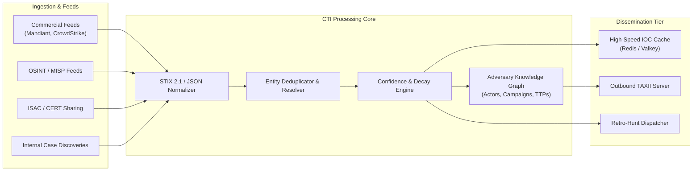

# Component Specification: Cyber Threat Intelligence (CTI)

> **Tier 3: Technical Specifications** · **Audience**: Threat Intelligence Leads, Detection Engineers · **Normative Status**: Reference Component  
> **Prerequisites**: [Capability Model](/architecture/02-capability-model) · **Next Step**: [Telemetry & Data Fabric](02-data-fabric-telemetry.md)

---

The Cyber Threat Intelligence (CTI) subsystem in TIDIR aggregates, curates, contextualizes, and disseminates actionable adversary intelligence. Rather than acting as a passive knowledge repository, the CTI component functions as an active participant in detection enrichment, retroactive hunting, and automated case context.

---

## 2. Core Functional Requirements

1. **Multi-Source Ingestion**:
   - Native support for STIX 2.1 over TAXII 2.1 protocol.
   - Webhook & REST API ingestion for custom threat feeds and community repositories (MISP, AlienVault OTX).
   - Internal ingestion pipeline consuming IOCs discovered during incident response investigations.

2. **Deduplication & Disambiguation**:
   - Indicator hashing and normalization (canonical domain lowercasing, IP CIDR collapse, SHA256 mapping).
   - Provenance tracking (retaining source attribution and observed timestamp per indicator).

3. **Confidence Scoring & Temporal Decay**:
   - Composite scoring algorithm based on feed reliability, corroborating sources, and indicator age.
   - Dynamic decay function:
     $$\text{Score}(t) = \text{InitialScore} \times e^{-\lambda t}$$
     where $\lambda$ varies by indicator type (e.g., dynamic IP addresses decay rapidly with high $\lambda$; actor-controlled command-and-control domains or binary hashes decay slowly).

4. **Integration Interfaces**:
   - **Streaming Detection**: In-memory key-value lookup cache updated via change-data-capture (CDC) for sub-millisecond matching in stream detection pipelines.
   - **Retroactive Hunting**: Automated triggering of historical lakehouse scans when high-severity zero-day indicators are ingested.
   - **Analyst Investigation Workbench**: GraphQL / REST endpoints for pulling full threat actor profiles, associated campaigns, and MITRE ATT&CK techniques.

5. **Threat-Led Prioritisation & Technique Frequency Weighting**:
   - **Empirical Power-Law Distribution**: Acknowledges that adversary tradecraft follows a steep empirical power-law curve: a compact core of 15 to 20 MITRE ATT&CK techniques accounts for more than 80% of observed enterprise intrusions (e.g., credential dumping, process masquerading, remote service traversal, and living-off-the-land utilities).
   - **Prevalence-Weighted Guidance**: Rather than treating framework coverage as a uniform checklist ("ATT&CK Bingo"), the CTI subsystem continuously computes an **Adversary Technique Prevalence Weighting** derived from internal case discoveries, ISAC intelligence, and empirical industry sightings.
   - **Bi-Directional Driver for Detection & Data Fabrics**:
     - *Detection Engineering Backlog (`DET-03`)*: Mandates that detection engineers prioritise depth, stateful correlation, and mutation resilience across high-prevalence techniques before addressing hypothetical long-tail attacks.
     - *Telemetry Collection Audits (`DATA-01`)*: Continuously audits sensor telemetry ingestion to assert that the mandatory OCSF classes required to detect high-frequency techniques are actively collected and preserved before expending ingestion budget on peripheral edge sources.

6. **Continuous Threat Exposure Management (CTEM) & Exploit Weaponization Convergence**:
   - Integrates with the Exposure Intelligence fabric ([ADR-0022](../../adr/0022-exposure-management-and-continuous-threat-exposure-integration.md)) by correlating tactical CTI threat feeds with active vulnerability exposure catalogs across the 4-tier exposure ingress taxonomy (Unified Exposure Management, Exposure Assessment Platforms, Adversarial Exposure Validation, and Risk-Based Vulnerability Management).
   - Ingests exploitability metrics including CISA Known Exploited Vulnerabilities (KEV), Exploit Prediction Scoring System (EPSS) probabilities, and proof-of-concept (PoC) weaponization chatter.
   - Computes an **Exploit Weaponization Status**: when external CTI detects active in-the-wild exploitation of a CVE present in the enterprise's attack surface graph, the CTI subsystem emits an immediate exposure priority escalation, raising the Bayesian prior probability $P(\text{Breach})$ across matching assets.

---

## 3. Data Model & Schemas

The CTI subsystem uses the **STIX 2.1** standard:
- **Indicator**: Patterns representing observable artefacts (IPs, hashes, domains, file paths).
- **Threat Actor**: Profiles of organised cybercrime groups or state-sponsored advanced persistent threats.
- **Attack Pattern**: MITRE ATT&CK techniques associated with actor behaviour.
- **Relationship**: Directed edges representing `indicates`, `targets`, `uses`, and `attributed-to`.

---

## 4. Architectural Capability Archetypes & Protocol Standards

| Subsystem Component | Functional Capability Pattern | Data Model & Protocol Standards |
| :--- | :--- | :--- |
| **Intelligence Ingestion Engine** | Automated polling, validation, and normalization of structured feeds. | TAXII 2.1 client bindings; STIX 2.1 JSON schemas. |
| **Low-Latency Indicator Cache** | In-memory distributed key-value store optimised for constant-time $O(1)$ lookups. | Binary key-value protocol; CDC replication streams. |
| **Threat Knowledge Graph** | Property graph database modelling relationships between indicators, actors, and campaigns. | Labeled property graph models; Cypher/openCypher query interfaces. |
| **Retroactive Hunting Dispatcher** | Asynchronous lakehouse query orchestrator evaluating historical event tables against newly ingested indicators. | Distributed SQL query interfaces; open columnar Parquet partitions. |
