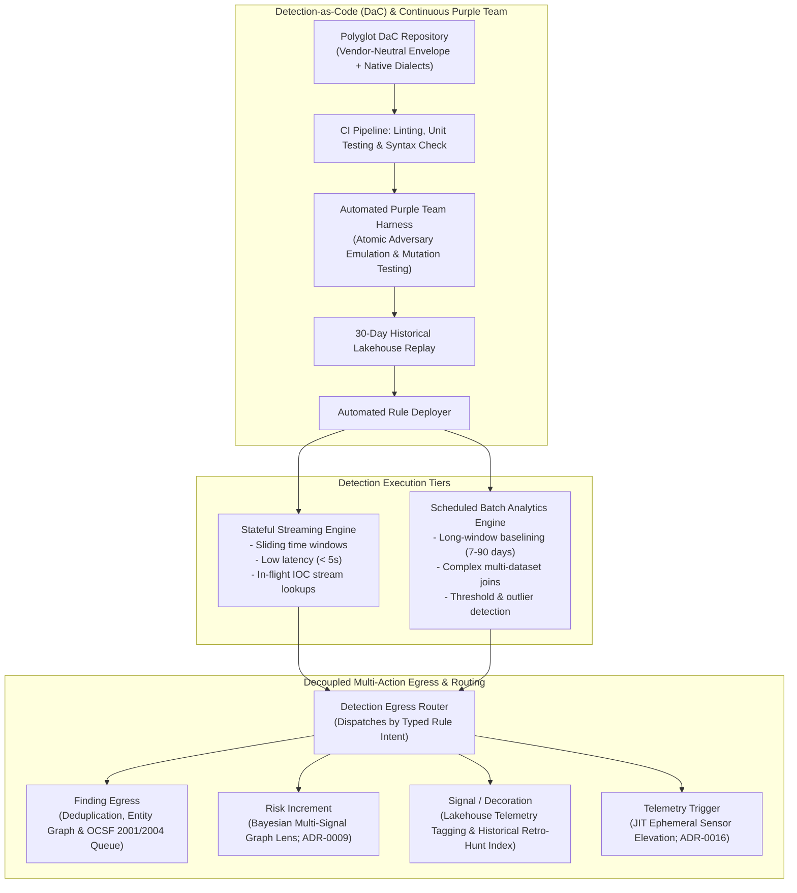

# Component Specification: Detection Engine

> **Tier 3: Technical Specifications** · **Audience**: Detection Engineers, SecOps Leads · **Normative Status**: Reference Component  
> **Prerequisites**: [Telemetry & Data Fabric](02-data-fabric-telemetry.md) · **Next Step**: [Investigation & Cases](04-investigation-cases.md)

---

The Detection Engine applies threat logic against both streaming and historical telemetry. It couples near-real-time streaming pattern recognition with scheduled analytical lakehouse queries, adopting a **Detection-as-Code (DaC)** lifecycle to ensure that detection logic is versioned, unit-tested, and maintainable.

---

## 2. Core Functional Requirements

1. **Dual Detection Paradigms**:
   - **Streaming Detection**:
     - Sub-second evaluation of incoming normalised OCSF events.
     - Sliding time-window correlations (e.g., 5 failed logins followed by a success within 2 minutes).
     - In-flight enrichment against the CTI in-memory IOC cache.
   - **Scheduled Lakehouse Detection**:
     - Periodic analytical queries executed against columnar lakehouse partitions.
     - Aggregations and statistical baselines (e.g., user authenticating from a new geographic ASN not observed in the past 60 days).
     - Low-frequency, high-compute analytics unsuitable for stream processing.

2. **Detection-as-Code (DaC) & Continuous Purple Teaming**:
   - Rules maintained as declarative code (Polyglot DaC: vendor-neutral YAML metadata envelopes with target-optimized query blocks; see [ADR-0019](../../adr/0019-polyglot-detection-as-code-and-native-engine-adaptation.md)).
   - Pre-deployment CI checks:
     - Rule syntax validation against canonical OCSF schema registries.
     - Synthetic unit testing (verifying true positives trigger and benign data passes across all target engine implementations).
     - **Continuous Automated Purple Teaming & Mutation Testing**: Executes non-destructive atomic adversary emulation payloads in an isolated staging environment. The test harness applies automated syntactic and procedural mutations (CLI flag permutations, environment indirection, alternate system call bindings) to measure **Evasion Resilience** and empirically distinguish brittle tactical matches from evasion-resilient functional primitive detections ([ADR-0007](../../adr/0007-continuous-automated-purple-teaming-and-multi-model-consensus.md)).
     - **Historical Lakehouse Backtesting**: Replays candidate rules across 30 days of historical data in pre-prod to calculate Expected Alert Volume (EAV) and reject rules exceeding noise budgets.
   - Immutable version tagging and GitOps rollbacks.

3. **Decoupled Multi-Action Detection Egress**:
   - **Matching Decoupled from Alerting**: Rule execution is separated from incident generation. Detections do not assume that every match warrants human paging. Every rule in the Polyglot DaC envelope explicitly declares its operational `intent`:
     - `finding`: High-confidence, high-impact security observations that route to deduplication, entity graph clustering, and OCSF 2001/2004 Security Finding queues for triage.
     - `risk_increment`: Evidential observations (such as noisy Living-off-the-Land administrative executions) that increment an entity's risk state in the Bayesian Multi-Signal Risk Lens ([ADR-0009](../../adr/0009-bayesian-multi-signal-risk-scoring.md)) without waking an analyst.
     - `signal`: Contextual decoration that tags raw events in the streaming bus and lakehouse partitions, accelerating retro-hunting and exploratory graph traversal without affecting risk scores.
     - `telemetry_elevation_trigger`: Precursor operational indicators that emit a control directive to the telemetry plane, initiating Just-in-Time ephemeral sensor elevation ([ADR-0016](../../adr/0016-just-in-time-telemetry-elevation-and-ephemeral-forensics.md)).

4. **Alert Correlation & Entity Scoring**:
   - Deduplication engine suppressing identical alerts within a configurable quiet window.
   - Entity-centric graph correlation: links alerts sharing an entity ID (e.g., `user_id`, `hostname`, `ip_address`) within an active time window into a single compound finding.
   - Dynamic Risk Scoring: composite score evaluating alert severity, asset criticality, and threat actor confidence. Solves the operational challenge of noisy behavioral analytics by requiring multiple orthogonal signals before escalating to human review.

5. **Distributed Detection, Multi-Source Ingress & Finding Federation**:
   - **Detect Locally, Correlate Centrally**: Follows the architectural principle established in [ADR-0023](../../adr/0023-distributed-detection-and-edge-to-center-correlation.md): commodity domain detections (known malware hashes, local privilege escalations, suspicious parent-child process anomalies, impossible travel) are executed natively at the edge by domain security controls (EDR, NDR, CNAPP, IdP).
   - **Line-Rate Standardized Finding Ingestion**: Native controls emit standardized OCSF Findings (Class 2001: Security Finding, Class 2004: Detection Finding). The central detection engine ingests these findings alongside raw streaming threshold violations, decayed CTI signals, and external benchmarks as multi-source risk inputs ([ADR-0009](../../adr/0009-bayesian-multi-signal-risk-scoring.md)).
   - **Shared Ancestry Discounting (Invariant 3)**: Product-native risk scores are ingested as upstream probabilistic evidence rather than ground truth; when edge detections and central rules share identical raw observation ancestry (`obs-*`), the engine discounts secondary signals to prevent artificial P1 alarm cascades.
   - **Central Engine Specialisation**: Reserves central streaming and batch compute resources for cross-domain correlations (e.g. joining an IdP MFA spray with an AWS IAM role assumption and an endpoint curl execution), multi-hop entity graphs, and bespoke enterprise business logic.
   - **On-Demand Contextual Safeguard & Pre-Trigger Buffering**: Prevents degrading into an "alerts-only" silo by coupling Just-in-Time (JIT) telemetry elevation ([ADR-0016](../../adr/0016-just-in-time-telemetry-elevation-and-ephemeral-forensics.md)) with rolling 30–60 minute pre-trigger local ring buffers, ensuring the inception of an intrusion is never lost to post-trigger activation delays.

6. **Exposure-Aware Prior Probability Estimation & Exposure Floor**:
   - Ingests exposure context from the Exposure Intelligence fabric ([ADR-0022](../../adr/0022-exposure-management-and-continuous-threat-exposure-integration.md)) across the 4-tier exposure taxonomy: Unified Exposure Management (UEM attack paths), Exposure Assessment Platforms (EAP / ASM perimeter discovery), Adversarial Exposure Validation (AEV empirical exploitability verification), and Risk-Based Vulnerability Management (RBVM prioritized CVEs).
   - Dynamically parameterizes the Bayesian Multi-Signal Risk Lens prior probability $P(\text{Breach})$. High-exposure choke points dramatically lower the threshold for elevating weak behavioral signals.
   - **Non-Zero Exposure Floor & Invariant Bypass**: Enforces $P(\text{Breach}) \ge \epsilon \gt 0$ to guarantee that unexpected attacks against supposedly isolated assets are never suppressed by stale asset graphs, while deterministic invariant violations (canary tokens, driver tampering) bypass prior weighting entirely.

7. **Threat-Led Backlog Prioritisation**:
   - Detection engineering backlogs and automated purple team emulation suites are explicitly weighted by the empirical technique frequency curve established by CTI ([`CTI-03`](01-threat-intelligence.md)).
   - Prioritises achieving layered, mutation-resilient coverage across the top 20 high-prevalence techniques (accounting for over 80% of observed intrusion activity) before investing engineering velocity in peripheral or theoretical edge cases.

---

## 3. Architectural Capability Archetypes & Protocol Standards

| Sub-component | Functional Architecture Pattern | Data Model & Protocol Standards | Framework & ACF Archetype |
| :--- | :--- | :--- | :--- |
| **Stream Detection** | Distributed event-driven stream processor with sliding-window state storage and microsecond event-time watermarking. | Declarative stream predicates; in-memory state snapshots. | **D3FEND ACF:** Symbolic Logic [`d3f:ProcessSpawnAnalysis`](https://d3fend.mitre.org/technique/d3f:ProcessSpawnAnalysis/) |
| **Batch Analytics Engine** | Distributed SQL query engine supporting columnar object storage pruning and vectorized query execution. | SQL:2016 standard queries; columnar open table format manifests. | **D3FEND ACF:** Statistical Analysis [MITRE CAR Analytic Models](https://car.mitre.org/) |
| **Rule Specification** | Polyglot declarative detection specification (vendor-neutral YAML metadata envelope with target-optimized execution blocks; [ADR-0019](../../adr/0019-polyglot-detection-as-code-and-native-engine-adaptation.md)). | YAML schema mapping to OCSF Class attributes; native KQL, SPL, and SQL query blocks. | [MITRE CAR](https://car.mitre.org/) Data Models & ATT&CK Mappings |
| **Detection Egress Router** | Intent-based event dispatcher routing rule outputs to finding queues, risk accumulators, telemetry tags, or JIT elevation triggers. | OCSF Finding Class 2001/2004; typed egress control messages. | **D3FEND ACF:** Symbolic Logic [`d3f:IdentifierAnalysis`](https://d3fend.mitre.org/technique/d3f:IdentifierAnalysis/) |
| **Adversary Emulation Runner** | Automated test harness executing atomic adversary techniques and procedural mutations against staging sensors. | MITRE ATT&CK technique IDs; non-destructive atomic execution manifests. | MITRE ATT&CK & [ADR-0007](../../adr/0007-continuous-automated-purple-teaming-and-multi-model-consensus.md) |
| **Bayesian Multi-Signal Risk Lens** | Dependency-aware evidence compounding mitigating the Base Rate Fallacy across orthogonal telemetry vectors. | Composite probability vector $(P(\text{Breach} \mid E_1, \dots, E_n))$; OCSF finding metadata. | **D3FEND ACF:** Statistical Analysis [`d3f:UserBehaviorAnalysis`](https://d3fend.mitre.org/technique/d3f:UserBehaviorAnalysis/) |
