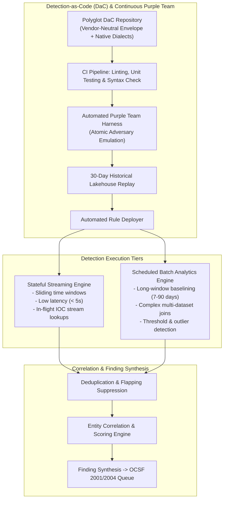

# Component Specification: Detection Engine

> **Tier 3: Technical Specifications** · **Audience**: Detection Engineers, SecOps Leads · **Normative Status**: Reference Component  
> **Prerequisites**: [Telemetry & Data Fabric](02-data-fabric-telemetry.md) · **Next Step**: [Investigation & Cases](04-investigation-cases.md)

---

The Detection Engine applies threat logic against both streaming and historical telemetry. It couples near-real-time streaming pattern recognition with scheduled analytical lakehouse queries, adopting a **Detection-as-Code (DaC)** lifecycle to ensure that detection logic is versioned, unit-tested, and maintainable.

---

## 2. Core Functional Requirements

1. **Dual Detection Paradigms**:
   - **Streaming Detection**:
     - Sub-second evaluation of incoming normalised OCSF events.
     - Sliding time-window correlations (e.g., 5 failed logins followed by a success within 2 minutes).
     - In-flight enrichment against the CTI in-memory IOC cache.
   - **Scheduled Lakehouse Detection**:
     - Periodic analytical queries executed against columnar lakehouse partitions.
     - Aggregations and statistical baselines (e.g., user authenticating from a new geographic ASN not observed in the past 60 days).
     - Low-frequency, high-compute analytics unsuitable for stream processing.

2. **Detection-as-Code (DaC) & Continuous Purple Teaming**:
   - Rules maintained as declarative code (Polyglot DaC: vendor-neutral YAML metadata envelopes with target-optimized query blocks; see [ADR-0019](../../adr/0019-polyglot-detection-as-code-and-native-engine-adaptation.md)).
   - Pre-deployment CI checks:
     - Rule syntax validation against canonical OCSF schema registries.
     - Synthetic unit testing (verifying true positives trigger and benign data passes across all target engine implementations).
     - **Continuous Automated Purple Teaming**: Executes non-destructive atomic adversary emulation payloads in an isolated staging environment to verify end-to-end detection latency and telemetry capture.
     - **Historical Lakehouse Backtesting**: Replays candidate rules across 30 days of historical data in pre-prod to calculate Expected Alert Volume (EAV) and reject rules exceeding noise budgets.
   - Immutable version tagging and GitOps rollbacks.

3. **Alert Correlation & Entity Scoring**:
   - Deduplication engine suppressing identical alerts within a configurable quiet window.
   - Entity-centric graph correlation: links alerts sharing an entity ID (e.g., `user_id`, `hostname`, `ip_address`) within an active time window into a single compound finding.
   - Dynamic Risk Scoring: composite score evaluating alert severity, asset criticality, and threat actor confidence.

---

## 3. Architectural Capability Archetypes & Protocol Standards

| Sub-component | Functional Architecture Pattern | Data Model & Protocol Standards | Framework & ACF Archetype |
| :--- | :--- | :--- | :--- |
| **Stream Detection** | Distributed event-driven stream processor with sliding-window state storage and microsecond event-time watermarking. | Declarative stream predicates; in-memory state snapshots. | **D3FEND ACF:** Symbolic Logic [`d3f:ProcessSpawnAnalysis`](https://d3fend.mitre.org/technique/d3f:ProcessSpawnAnalysis/) |
| **Batch Analytics Engine** | Distributed SQL query engine supporting columnar object storage pruning and vectorized query execution. | SQL:2016 standard queries; columnar open table format manifests. | **D3FEND ACF:** Statistical Analysis [MITRE CAR Analytic Models](https://car.mitre.org/) |
| **Rule Specification** | Polyglot declarative detection specification (vendor-neutral YAML metadata envelope with target-optimized execution blocks; [ADR-0019](../../adr/0019-polyglot-detection-as-code-and-native-engine-adaptation.md)). | YAML schema mapping to OCSF Class attributes; native KQL, SPL, and SQL query blocks. | [MITRE CAR](https://car.mitre.org/) Data Models & ATT&CK Mappings |
| **Adversary Emulation Runner** | Automated test harness executing atomic adversary techniques against staging sensors. | MITRE ATT&CK technique IDs; non-destructive atomic execution manifests. | MITRE ATT&CK & [ADR-0007](../../adr/0007-continuous-automated-purple-teaming-and-multi-model-consensus.md) |
| **Bayesian Multi-Signal Risk Lens** | Dependency-aware evidence compounding mitigating the Base Rate Fallacy across orthogonal telemetry vectors. | Composite probability vector $(P(\text{Breach} \mid E_1, \dots, E_n))$; OCSF finding metadata. | **D3FEND ACF:** Statistical Analysis [`d3f:UserBehaviorAnalysis`](https://d3fend.mitre.org/technique/d3f:UserBehaviorAnalysis/) |
