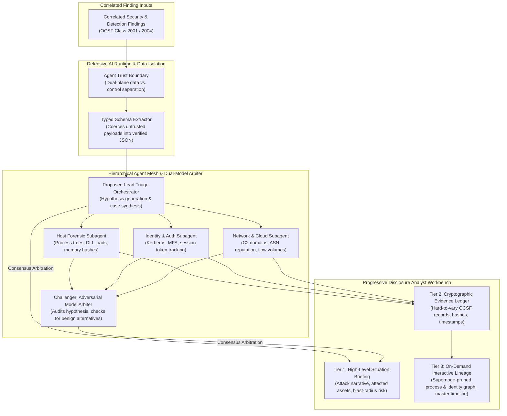

# Component Specification: Investigation & Case Management

> **Tier 3: Technical Specifications** · **Audience**: SOC Analysts, Incident Responders · **Normative Status**: Reference Component  
> **Prerequisites**: [Detection Engine](03-detection-engine.md) · **Next Step**: [Response & Automation](05-response-automation.md)

---

The Investigation & Case Management subsystem empowers security analysts and incident responders to rapidly triage, scope, and document security incidents. It combines automated entity resolution, process and network graph visualisation, unified chronological timeline reconstruction, and tamper-evident case evidence tracking.

---

## 2. Core Functional Requirements

1. **Defensive AI Runtime, Agent Mesh & Dual-Model Consensus**:
   - **Dual-Plane Data Isolation**: Untrusted event payloads (e.g. process command-line arguments, user-agent strings, HTTP bodies) are treated strictly as data-plane entities and parsed into validated JSON schemas. System instructions and control-plane reasoning remain physically separated to eliminate indirect prompt injection vulnerabilities.
   - **Hierarchical Delegation**: A Lead Triage Orchestrator ingests elevated findings, formulates investigative hypotheses, and delegates concurrent tasks to specialized, read-only subagents (Host Forensic, Identity & Auth, Network & Cloud).
   - **Adversarial Dual-Model Consensus**:
     - *The Proposer*: Synthesizes the primary intrusion hypothesis and attributes suspect TTPs.
     - *The Challenger*: An independent reasoning model that evaluates the evidence ledger against alternative benign hypotheses (e.g. administrative script, backup software).
     - *Arbitration Gate*: Hypotheses with $\ge 80\%$ inter-model consensus are promoted to the Situation Briefing; diverging cases are flagged with an explicit comparative dissent summary for human review.

2. **Progressive Disclosure Analyst Workbench**:
   - Designed to eliminate cognitive fatigue and enable sub-60-second operational triage through three structured visual layers:
     - **Tier 1 (Situation Briefing)**: A concise, plain-language executive and technical summary describing what occurred, the verified root cause, affected crown jewels, and current blast radius.
     - **Tier 2 (Cryptographic Evidence Ledger)**: Tabular presentation of verified OCSF facts (exact process GUIDs, SHA-256 hashes, network sockets, microsecond UTC timestamps) with deterministic verification links.
     - **Tier 3 (On-Demand Interactive Graph & Timeline)**: Collapsed by default; dynamically renders process execution trees and identity bipartite graphs with supernode dampening and multi-source chronological event alignment when requested by the investigator.

3. **Entity Resolution & Cryptographic Evidence Locker**:
   - **Temporal Entity Resolution**: Maintains historical identity-to-asset bindings across ephemeral networks (binding DHCP IP leases at timestamp $T$ to device GUIDs, MAC addresses, and authenticated Kerberos/OAuth sessions).
   - **Tamper-Evident Evidence Locker**: Captures raw query snapshots, PCAP extracts, and analyst annotations with RFC 3161 cryptographic timestamps and immutable checksums for post-incident review (PIR) and legal defensibility.

4. **Just-in-Time (JIT) Telemetry Elevation & Ephemeral Deep Context**:
   - **Programmatic Forensic Elevation**: When an investigator or autonomous specialist subagent identifies a hypothesis gap that cannot be resolved via existing baseline telemetry, the orchestrator issues a signed **JIT Telemetry Elevation Order**.
   - **Time-Bounded Edge Re-Instrumentation**: Commands edge sensors (Host eBPF, network taps, cloud control planes) to temporarily elevate logging fidelity (e.g. enabling full Script Block Logging, process memory page string dumps, or rolling wire-level PCAP) for a surgical time window ($\text{TTL} \le 30\text{ minutes}$).
   - **Ephemeral Sinks & Auto-Eviction**: Deep forensic data streams into an isolated object storage bucket configured with a 48-hour auto-eviction policy. If confirmed as a true-positive incident, the specific evidence slice is promoted to the permanent Evidence Locker; otherwise, it expires with zero storage waste.

5. **Operator Skill Retention & Manual Flight Deck**:
   - **Forensic Currency Quotas**: Dynamically tracks operator recency and diverts eligible incidents to the unassisted Manual Flight Deck when currency decays, permanently preventing operator skill atrophy ([ADR-0020](../../adr/0020-operator-skill-retention-and-incident-replay-simulators.md)).
   - **Incident Replay Simulator**: Hydrates historical lakehouse telemetry partitions and purple-team attack injections into an isolated sandbox for blind operator check-rides.
   - **Dual-Blind Mutual Calibration**: Benchmarks human dossiers against shadow agent findings, simultaneously surfacing analyst blind spots and generating golden ground truth to prevent AI model drift.

6. **Agentic User Interface (AG-UI) Supervisory Model & Agent-to-Agent (A2A) Protocols**:
   - **Agent-to-Agent (A2A) Communication Protocol**: Inter-agent collaboration between the Lead Triage Orchestrator, specialist subagents (Host, Identity, Network), and the Adversarial Challenger is mediated through structured, machine-readable communication contracts rather than free-form natural language prompting. Agents coordinate tasks, request contextual enrichments, and negotiate hypothesis evaluations using strongly typed schemas (JSON-RPC over internal message buses) authenticated by ephemeral workload identities (SPIFFE Verifiable Identity Documents - SVIDs).
   - **Agentic UI (AG-UI) Supervisory Workbench**: Rather than treating Artificial Intelligence (AI) as an uninspectable black box or a superficial chat assistant, the workbench implements an **Agentic User Interface (AG-UI)** designed for human supervisory steering, transparency, and calibrated trust:
     - *Causal Hypothesis Visualisation*: Exposes agent hypotheses as inspectable Directed Acyclic Graphs (DAGs) linking premises, cited raw OCSF observation identifiers, confidence levels, and dissenting challenger opinions.
     - *Bi-Directional Supervisory Steering*: Operators can actively steer ongoing agent investigations using structured control inputs (e.g. expanding timeline scope, adjusting evidential threshold bounds, or instructing subagents to pursue alternative pivot paths).
     - *Deterministic Execution Gates*: In strict accordance with the TIDIR Trust Doctrine, agents are architecturally prohibited from self-authorizing state mutations or containment actions; all recommended interventions are presented through structured AG-UI consensus action cards requiring explicit cryptographic human approval.

---

## 3. Architectural Capability Archetypes & Protocol Standards

| Architectural Subsystem | Functional Capability Pattern | Data Model & Protocol Standards |
| :--- | :--- | :--- |
| **Case & Hypothesis Store** | Distributed transactional document store with optimistic locking and event audit logs. | JSON schema-validated case dossiers with temporal state tracking. |
| **Relational Execution Graph** | In-memory property graph engine with supernode pruning and degree-constrained breadth-first search. | Directed Acyclic Graph (DAG) format; OCSF entity relationship schemas. |
| **Tamper-Evident Evidence Locker** | Immutable object storage with Object Lock (WORM) and cryptographic checksum validation. | RFC 3161 cryptographic timestamps; SHA-256 evidence integrity manifests. |
| **Analyst Workbench Interface** | Component-driven reactive micro-frontend architecture supporting progressive disclosure and canvas-based graph rendering. | WebSocket bi-directional state synchronisation; microsecond UTC temporal streams. |
| **Agent Collaboration & Supervision** | Standardized inter-agent messaging and human supervisory steering cockpit. | Agent-to-Agent (A2A) JSON-RPC over mTLS/SPIFFE; Agentic UI (AG-UI) streaming state contracts. |
