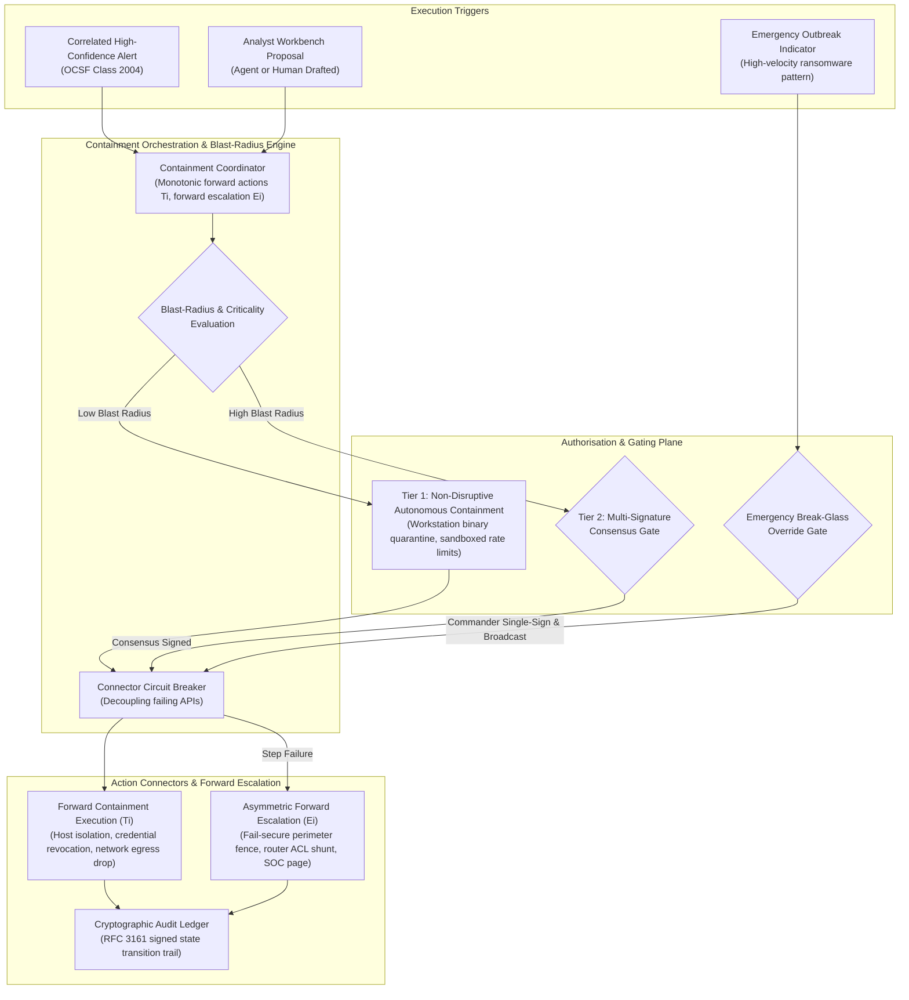

# Component Specification: Automated Response & Containment

> **Tier 3: Technical Specifications** · **Audience**: Automation Engineers, Incident Commanders · **Normative Status**: Reference Component  
> **Prerequisites**: [Investigation & Cases](04-investigation-cases.md) · **Next Step**: [AI & Agent Orchestration](06-ai-orchestration.md)

---

The Automated Response & Containment capability executes codified playbooks to accelerate incident triage, enrich investigations, and contain active security threats. To protect business operations while achieving high containment velocity, the architecture enforces a **Blast-Radius Risk Tiering** model that cleanly separates automated, low-risk operational steps from disruptive actions requiring human-in-the-loop authorisation.

---

## 2. Core Functional Requirements

1. **Security-State Monotonicity & Asymmetric Fail-Secure State Machine**:
   - Multi-step containment and mitigation workflows are executed as distributed state machines structured under **Security-State Monotonicity**:
     $$\forall s \in \mathcal{S}, \quad R(s_{\text{post}}) \subseteq R(s_{\text{pre}})$$
     *No automated compensation or error recovery may expand attacker reachability beyond the current verified-safe security posture.*
   - **Action Monotonicity vs. Security-State Monotonicity**: Individual operational actions need not be monotonic (e.g. an egress firewall shunt might be replaced by a switch-port isolation, or a lease may be renewed). However, the *security posture* is strictly monotonic: the system never symmetrically unrolls containment controls upon partial failure. Reversing containment (e.g. un-quarantining a host or un-blocking an IP because a downstream token API timed out) actively restores attacker access.
   - If any downstream API fails during a containment sequence after exponential retries are exhausted, the orchestrator freezes the existing containment boundary and executes **Forward Containment Escalation**: applying broader out-of-band perimeter network fences (e.g. upstream firewall route drops) and triggering high-priority incident commander paging.
   - Every containment and remediation action is bound to the immutable **Incident Decision DAG** ([ADR-0005](../../adr/0005-saga-pattern-containment-and-break-glass-protocol.md) and [Layer 4](../../architecture/07-layer-4-incident-response.md)), recording the exact causal lineage from Evidence through Authorisation to Action and Outcome.

2. **Blast-Radius Risk Tiering & Emergency Protocols**:
   - **Tier 0 (Passive Enrichment & Querying)**:
     - Fully autonomous execution.
     - Actions: Reverse DNS, external threat reputation queries, asset dependency tree lookups, directory metadata extraction.
   - **Tier 1 (Targeted Low-Disruption Containment)**:
     - Autonomous execution for verified high-confidence detections on non-critical assets (e.g. standard user endpoints).
     - Actions: Quarantining an untrusted binary, terminating an isolated user-space process, adding an external IP to a temporary ingress throttle list.
   - **Tier 2 (High-Impact / Disruptive Operations)**:
     - Enforces dual-authorisation consensus (Incident Commander + Asset Owner / SecOps Lead).
     - Actions: Isolating production database hosts or domain controllers, enterprise-wide session token invalidation, perimeter BGP or boundary firewall route modifications.
   - **Emergency Break-Glass Protocol**:
     - For catastrophic, high-velocity outbreaks (e.g. active automated ransomware propagation across multiple subnets), an authenticated on-duty Incident Commander can activate a **Break-Glass Override**.
     - Bypasses multi-signature queues for pre-compiled critical containment playbooks.
     - Emits instantaneous out-of-band cryptographic audit notifications to executive communication channels and permanently commits the action with non-repudiation metadata to the evidence ledger.

3. **Connector Resilience & Circuit Breaking**:
   - Downstream integration connectors enforce strict rate limits, exponential backoff, and stateful circuit breakers.
   - If a third-party control plane experiences elevated error rates ($\gt 5\%$ 5xx responses or timeouts), the connector trips open, diverting automated actions to an operator escalation queue rather than stalling the pipeline.

4. **Declarative Action Intent Abstraction Layer**:
   - To preserve operational portability and prevent vendor lock-in, the Policy Kernel and the Incident Decision DAG decouple response intent from concrete vendor APIs:
     - **Canonical Action Intents**: Workflows emit standardized, vendor-neutral intent declarations: `ISOLATE_HOST`, `REVOKE_SESSION`, `BLOCK_INDICATOR`, `QUARANTINE_WORKLOAD`, and `RESTRICT_ROLE`.
     - **Actuation Adapters**: Domain-specific adapters translate canonical intents into native execution commands (e.g. mapping `ISOLATE_HOST` to Microsoft Defender for Endpoint `POST /api/machines/{id}/isolate`, CrowdStrike Falcon `POST /devices/entities/devices-actions/v2`, AWS VPC Security Group shunts, or Kubernetes NetworkPolicy quarantine labels).
     - **Intent-Level Lineage**: The Incident Decision DAG records the authorized *intent* and its safety constraints rather than proprietary API parameters, ensuring evidence and audit trails remain valid across infrastructure migrations.

5. **Closed-Loop Intelligence, DaC Tuning & Green Team Prevention**:
   - While TIDIR intentionally focuses on Threat Intelligence, Detection, Investigation & Response (and deliberately avoids duplicating inline prevention appliances), it completes the closed loop by programmatically bridging into **Green Teams** (platform, infrastructure, and cloud security engineering):
     - **Attributed Threat Feedback**: Verified indicators (hashes, C2 domains) and campaign flows are immediately exported back into the Layer 1/3 Threat Intelligence fabric for retroactive sweeps and edge cache matching.
     - **DaC Quality & Noise Tuning**: Case classifications automatically trigger rule calibration pull requests in the Detection-as-Code repository, pruning false-positive noise or adjusting sensitivity thresholds.
     - **Green Team Preventative Hardening**: When an investigation exposes an exploited misconfiguration or architectural gap (e.g. over-privileged cloud IAM roles, exposed ingress routes, unpatched CVEs, or unsegmented lateral movement paths), TIDIR synthesises actionable remediation tickets and triggers **automated Infrastructure-as-Code (IaC) hardening pull requests** (Terraform, OpenTofu, Kubernetes network policies) for Green Teams to eliminate root vulnerabilities and deepen enterprise defense-in-depth.

---

## 3. Architectural Capability Archetypes & Protocol Standards

| Subsystem Component | Functional Architecture Pattern | Data Model & Protocol Standards | Framework Alignment |
| :--- | :--- | :--- | :--- |
| **Containment Orchestrator** | Monotonic state machine with forward recovery, fail-closed escalation, and idempotent retry semantics. | Declarative workflow DAG (JSON/YAML specification); stateful execution tokens. | **CIS v8:** Control 17.6, 17.7 [`d3f:ProcessTermination`](https://d3fend.mitre.org/technique/d3f:ProcessTermination/) |
| **Connector Integration Bus** | Asynchronous message bus with circuit breaker patterns, backpressure management, and dead-letter routing. | CloudEvents specification; REST/gRPC bi-directional streaming interfaces. | **OWASP API:** `API10:2023` [`d3f:NetworkIsolation`](https://d3fend.mitre.org/technique/d3f:NetworkIsolation/) |
| **Consensus & Gating Engine** | Cryptographic multi-signature consensus workflow with timeout escalations and webhook-based interactive authorisation. | Public key signatures; out-of-band push notifications with ephemeral verification tokens. | **CIS v8:** Control 17.8 [`d3f:AccessPolicyAdministration`](https://d3fend.mitre.org/technique/d3f:AccessPolicyAdministration/) |
| **Execution Audit Ledger** | Append-only event stream with tamper-evident cryptographic sealing for every forward containment and escalation mutation. | RFC 3161 timestamps; immutable signed transaction log. | **CIS v8:** Control 17.9, 8.12 [`d3f:FileHashing`](https://d3fend.mitre.org/technique/d3f:FileHashing/) |
