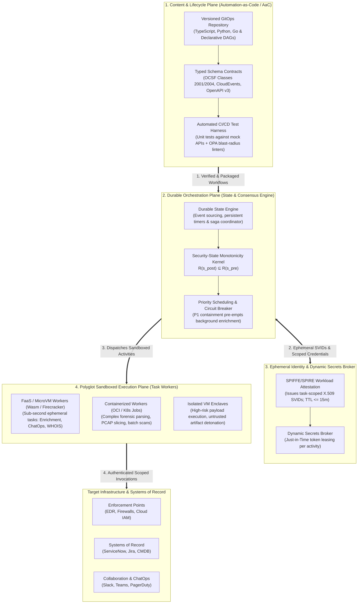

# Component Specification: Workflow Automation, Containment & Systems Integration

> **Tier 3: Technical Specifications** · **Audience**: Automation Engineers, Incident Commanders, Platform Engineers · **Normative Status**: Reference Component  
> **Prerequisites**: [Investigation & Cases](04-investigation-cases.md) · **Next Step**: [AI & Agent Orchestration](06-ai-orchestration.md)

---

The Workflow Automation, Containment & Systems Integration capability provides the operational fabric for executing codified playbooks, orchestrating resilient investigations, enforcing blast-radius-bounded containment, and synchronizing state across enterprise systems of record.

Historically, security operations relegated automation to commercial **Security Orchestration, Automation, and Response (SOAR)** platforms. As established in [ADR-0027](../../adr/0027-first-principles-workflow-orchestration-and-automation-as-code.md), TIDIR rejects the monolithic SOAR model (with its proprietary drag-and-drop canvases, shared execution runtimes, and static ambient credentials). Instead, the architecture establishes workflow and automation as a first-principles software engineering discipline—**Automation-as-Code (AaC)**—built on decoupled durable state orchestration, polyglot sandboxed execution substrates, and ephemeral workload identities.

---

## 1. Architectural Topology & The 4-Plane Model

To decouple business logic, state management, compute execution, and credential authority, TIDIR decomposes workflow automation into four distinct planes:

### The Four Decoupled Planes

1. **Content & Lifecycle Plane (Automation-as-Code / AaC)**:
   - Workflows are written as first-class software code in standard languages (TypeScript, Python, Go) or declarative typed specifications.
   - All workflow code resides in Git repositories with branch protection, mandatory peer review, semantic versioning, and continuous integration testing.
   - Payloads adhere to standardized, open schemas: findings follow the **Open Cybersecurity Schema Framework (OCSF)**, and operational mutations follow **CloudEvents** envelopes.
2. **Durable Orchestration Plane**:
   - Manages state-machine transitions, persistent timers, retry policies with jitter, and distributed saga coordination.
   - Enforces **Security-State Monotonicity**: failing downstream steps trigger forward escalation and alerting, never backward rollbacks that reopen attacker reachability.
   - Completely decoupled from task compute; the orchestrator never executes untrusted customer or community code within its core memory space.
3. **Ephemeral Identity & Dynamic Secrets Broker**:
   - Eliminates the static "SOAR credential vault" anti-pattern.
   - Leverages **SPIFFE/SPIRE** ([AIGOV-06](file:///Users/harrymclaren/Projects/TIDIR/docs/architecture/02-capability-model.md#L143)) to issue task-scoped, short-lived X.509 certificates ($\text{TTL} \le 15\text{m}$).
   - Dynamically leases task-specific credentials Just-in-Time (JIT). An enrichment task querying an IP reputation API receives only read-only network tokens; it never sees host containment or administrative keys.
4. **Polyglot Sandboxed Execution Plane**:
   - Compute substrates are dynamically matched to activity performance and isolation requirements:
     - *Function-as-a-Service (FaaS) / MicroVMs (Firecracker, WebAssembly)*: Ephemeral, millisecond cold-start runtimes for low-latency enrichments, ChatOps broadcasts, and ticket updates.
     - *Containers (OCI / Kubernetes / Nomad)*: Standard execution environments for forensic artifact collection, large packet capture slicing, and memory dump parsing.
     - *Isolated Virtual Machines*: Air-gapped hypervisor enclaves for executing untrusted scripts, detonating suspicious payloads, or inspecting malware samples.

---

## 2. Continuous Operational Automation Spectrum

Rather than treating automation as a terminal webhook after an alert triggers, TIDIR distributes workflow automation across six operational phases:

```mermaid
flowchart LR
  subgraph Phase1 ["1. Line-Rate Ingest"]
    direction TB
    A1["OCSF Normalization"]
    A2["IOC Bloom Filter Matches"]
  end

  subgraph Phase2 ["2. Context & JIT"]
    direction TB
    B1["Entity & CMDB Resolution"]
    B2["JIT Telemetry Elevation"]
  end

  subgraph Phase3 ["3. Investigation"]
    direction TB
    C1["Timeline Reconstruction"]
    C2["ChatOps Room Sync"]
  end

  subgraph Phase4 ["4. Containment"]
    direction TB
    D1["Tier 1 Auto-Quarantine"]
    D2["Tier 2 Consensus Gates"]
  end

  subgraph Phase5 ["5. Recovery & ITSM"]
    direction TB
    E1["Workload Repaving (IaC)"]
    E2["CMDB & Ticket Sync"]
  end

  subgraph Phase6 ["6. Feedback"]
    direction TB
    F1["DaC Calibration PRs"]
    F2["IaC Defense Hardening"]
  end

  Phase1 ==> Phase2 ==> Phase3 ==> Phase4 ==> Phase5 ==> Phase6
```

1. **Line-Rate & Ingestion**: Stream-time telemetry normalization, dead-letter queue routing, and real-time matching against edge threat intelligence bloom filters.
2. **Contextualization & JIT Elevation (Tier 0 - Read-Only)**: Autonomous entity resolution, Configuration Management Database (CMDB) asset criticality queries, and dynamic **Just-in-Time (JIT) Telemetry Elevation** orders ([ADR-0016](../../adr/0016-just-in-time-telemetry-elevation-and-ephemeral-forensics.md)) instructing endpoint sensors to capture volatile process memory before evasion occurs.
3. **Investigation & Collaboration**: Multi-source chronological timeline synthesis, Model Context Protocol (MCP) query dispatch, and automated ChatOps incident room hydration (Slack, Microsoft Teams, PagerDuty).
4. **Responsive Containment (Tier 1 & Tier 2 Sagas)**: Monotonic execution of targeted process termination, host quarantine, credential revocation, and perimeter firewall shunting governed by blast-radius gating.
5. **Eradication, Recovery & Systems of Record**: Automated GitOps workload repaving, credential rotation, and bidirectional synchronization with enterprise ticketing (ServiceNow, Jira) and CMDB systems to preserve single-source-of-truth accuracy.
6. **Closed-Loop Feedback**: Automated pull requests to calibrate Detection-as-Code (DaC) rules, synthesis of Infrastructure-as-Code (IaC) security patches for platform teams, and redeployment of ambient deception honeytokens ([ADR-0013](../../adr/0013-ambient-deception-fabric-and-canary-anchors.md)).

---

## 3. Core Functional Requirements

### 1. Security-State Monotonicity & Asymmetric Containment
- Multi-step containment and mitigation workflows are executed as distributed state machines structured under **Security-State Monotonicity**:
  $$\forall s \in \mathcal{S}, \quad R(s_{\text{post}}) \subseteq R(s_{\text{pre}})$$
  *No automated compensation or error recovery may expand attacker reachability beyond the current verified-safe security posture.*
- **Action Monotonicity vs. Security-State Monotonicity**: Individual operational actions need not be monotonic (e.g. an egress firewall shunt might be replaced by a switch-port isolation, or a lease may be renewed). However, the *security posture* is strictly monotonic: the system never symmetrically unrolls containment controls upon partial failure. Reversing containment (e.g. un-quarantining a host or un-blocking an IP because a downstream token API timed out) actively restores attacker access.
- If any downstream API fails during a containment sequence after exponential retries are exhausted, the orchestrator freezes the existing containment boundary and executes **Forward Containment Escalation**: applying broader out-of-band perimeter network fences (e.g. upstream firewall route drops) and triggering high-priority incident commander paging.
- Every containment and remediation action is bound to the immutable **Incident Decision Directed Acyclic Graph (DAG)** ([ADR-0005](../../adr/0005-saga-pattern-containment-and-break-glass-protocol.md) and [Layer 4](../../architecture/07-layer-4-incident-response.md)), recording the exact causal lineage from Evidence through Authorisation to Action and Outcome.

### 2. Blast-Radius Risk Tiering & Emergency Protocols
- **Tier 0 (Passive Enrichment & Querying)**:
  - Fully autonomous execution.
  - Actions: Reverse DNS, external threat reputation queries, asset dependency tree lookups, directory metadata extraction.
- **Tier 1 (Targeted Low-Disruption Containment)**:
  - Autonomous execution for verified high-confidence detections on non-critical assets (e.g. standard user endpoints).
  - Actions: Quarantining an untrusted binary, terminating an isolated user-space process, adding an external IP to a temporary ingress throttle list.
- **Tier 2 (High-Impact / Disruptive Operations)**:
  - Enforces dual-authorisation consensus (Incident Commander + Asset Owner / SecOps Lead).
  - Actions: Isolating production database hosts or domain controllers, enterprise-wide session token invalidation, perimeter BGP or boundary firewall route modifications.
- **Emergency Break-Glass Protocol**:
  - For high-velocity outbreaks (e.g. active automated ransomware propagation across multiple subnets), an authenticated on-duty Incident Commander can activate a **Break-Glass Override**.
  - Bypasses multi-signature queues for pre-compiled critical containment playbooks.
  - Emits instantaneous out-of-band cryptographic audit notifications to executive communication channels and permanently commits the action with non-repudiation metadata to the evidence ledger.

### 3. Connector Resilience & Circuit Breaking
- Downstream integration connectors enforce strict rate limits, exponential backoff with jitter, and stateful circuit breakers.
- If a third-party control plane experiences elevated error rates ($\gt 5\%$ 5xx responses or timeouts), the connector trips open, diverting automated actions to an operator escalation queue rather than stalling the pipeline.

### 4. Declarative Action Intent Abstraction Layer
- To preserve operational portability and prevent vendor lock-in, the Policy Kernel and the Incident Decision DAG decouple response intent from concrete vendor APIs:
  - **Canonical Action Intents**: Workflows emit standardized, vendor-neutral intent declarations: `ISOLATE_HOST`, `REVOKE_SESSION`, `BLOCK_INDICATOR`, `QUARANTINE_WORKLOAD`, and `RESTRICT_ROLE`.
  - **Identity Actuation via OpenID Shared Signals (CAEP / RISC)**:
    For identity and credential containment (`REVOKE_SESSION`, `RESTRICT_ROLE`), rather than maintaining brittle, proprietary API scripts across dozens of SaaS and cloud platforms, actuation adapters standardize on the **OpenID Shared Signals and Events (SSE)** framework utilizing **IETF Security Event Tokens (SETs; RFC 8417)**:
    - *Continuous Access Evaluation Profile (CAEP)*: Dispatches instantaneous session revocation events (`session-revoked`, `token-claims-change`, `assurance-level-change`) across Identity Providers (IdPs) and Zero Trust policy enforcement points, terminating active OAuth/OIDC tokens without waiting for periodic expiration.
    - *Risk and Incident Sharing and Collaboration (RISC)*: Propagates confirmed account compromise signals (`account-credential-compromised`, `account-disabled`) across enterprise federated relying parties.
    - *SCIM Security Event Profile (RFC 8935 / RFC 8936)*: Streams account suspension and privilege revocation events to enterprise identity governance systems of record.
    - *Adapter Fallbacks*: For downstream SaaS providers lacking native SSE receiver endpoints, actuation adapters maintain deterministic fallbacks to direct REST APIs (e.g. Microsoft Graph `revokeSignInSessions`, Okta `clearUserSessions`).
  - **Endpoint & Network Actuation Adapters**: Domain-specific adapters translate canonical intents into native infrastructure commands (e.g. mapping `ISOLATE_HOST` to Microsoft Defender for Endpoint `POST /api/machines/{id}/isolate`, CrowdStrike Falcon `POST /devices/entities/devices-actions/v2`, AWS VPC Security Group shunts, or Kubernetes NetworkPolicy quarantine labels).
  - **Intent-Level Lineage**: The Incident Decision DAG records the authorized *intent* and its safety constraints rather than proprietary API parameters, ensuring evidence and audit trails remain valid across infrastructure migrations.

### 5. Bidirectional Systems of Record & Collaboration Synchronization
- **Single Source of Truth Consistency**: Workflows automatically synchronize state between the security incident workbench, enterprise ITSM platforms (ServiceNow, Jira Service Management), and the CMDB.
- **ChatOps Lifecycle Management**: Automatically creates, populates, and archives dedicated incident response channels (Slack, Microsoft Teams) during P1/P2 crises, streaming real-time timeline milestones and containment state cards directly to responding personnel.
- **Asset Posture Annotation**: When an investigation reveals compromised status, misconfigured security posture, or unpatched vulnerabilities on an asset, the workflow automatically annotates the asset record in the CMDB with realized risk indicators.

### 6. Closed-Loop Intelligence, DaC Tuning & Green Team Prevention
- While TIDIR intentionally focuses on Threat Intelligence, Detection, Investigation & Response (and deliberately avoids duplicating inline prevention appliances), it completes the closed loop by programmatically bridging into **Green Teams** (platform, infrastructure, and cloud security engineering):
  - **Attributed Threat Feedback**: Verified indicators (hashes, C2 domains) and campaign flows are immediately exported back into the Layer 1/3 Threat Intelligence fabric for retroactive sweeps and edge cache matching.
  - **DaC Quality & Noise Tuning**: Case classifications automatically trigger rule calibration pull requests in the Detection-as-Code repository, pruning false-positive noise or adjusting sensitivity thresholds.
  - **Green Team Preventative Hardening**: When an investigation exposes an exploited misconfiguration or architectural gap (e.g. over-privileged cloud IAM roles, exposed ingress routes, unpatched CVEs, or unsegmented lateral movement paths), TIDIR synthesises actionable remediation tickets and triggers **automated Infrastructure-as-Code (IaC) hardening pull requests** (Terraform, OpenTofu, Kubernetes network policies) for Green Teams to eliminate root vulnerabilities and deepen enterprise defense-in-depth.

---

## 4. Architectural Capability Archetypes & Protocol Standards

| Subsystem Component | Functional Architecture Pattern | Data Model & Protocol Standards | Framework Alignment |
| :--- | :--- | :--- | :--- |
| **Workflow State Orchestrator** | Monotonic state machine with event sourcing, persistent timers, and idempotent retry semantics. | Declarative workflow DAG (JSON/YAML specification); stateful execution tokens. | **CIS v8:** Control 17.6, 17.7 [`d3f:ProcessTermination`](https://d3fend.mitre.org/technique/d3f:ProcessTermination/) |
| **Polyglot Execution Workers** | Ephemeral multi-substrate compute (MicroVMs, containers, isolated VMs) with zero ambient trust. | OCI container specifications; WebAssembly runtime; Firecracker microVMs. | **CIS v8:** Control 17.1, 17.3 [`d3f:ExecutionIsolation`](https://d3fend.mitre.org/technique/d3f:ExecutionIsolation/) |
| **Dynamic Secrets & Identity Broker** | Cryptographic workload attestation issuing short-lived, task-scoped credentials ($\text{TTL} \le 15\text{m}$). | SPIFFE X.509 SVIDs; OIDC identity federation; short-lived STS tokens. | **CIS v8:** Control 6.1, 17.8 [`d3f:Token-basedAuthentication`](https://d3fend.mitre.org/technique/d3f:Token-basedAuthentication/) |
| **Identity & Session Actuation Bus** | Out-of-band cross-SaaS session termination and account risk broadcasting with REST API fallback. | OpenID Shared Signals and Events (SSE); CAEP; RISC; IETF RFC 8417 Security Event Tokens (SETs); RFC 8935/8936 SCIM events. | **CIS v8:** Control 6.2, 17.7 [`d3f:CredentialRevocation`](https://d3fend.mitre.org/technique/d3f:CredentialRevocation/) |
| **Connector Integration Bus** | Asynchronous message bus with circuit breaker patterns, backpressure management, and dead-letter routing. | CloudEvents specification; REST/gRPC bi-directional streaming interfaces. | **OWASP API:** `API10:2023` [`d3f:NetworkIsolation`](https://d3fend.mitre.org/technique/d3f:NetworkIsolation/) |
| **Systems of Record Gateway** | Bidirectional state synchronization between incident cases, ITSM tickets, and CMDB asset postures. | REST / GraphQL webhooks; OpenAPI v3 schemas; JSON:API specifications. | **CIS v8:** Control 1.1, 17.2 [`d3f:HardwareComponentInventory`](https://d3fend.mitre.org/technique/d3f:HardwareComponentInventory/) |
| **Consensus & Gating Engine** | Cryptographic multi-signature consensus workflow with timeout escalations and webhook-based interactive authorisation. | Public key signatures; out-of-band push notifications with ephemeral verification tokens. | **CIS v8:** Control 17.8 [`d3f:AccessPolicyAdministration`](https://d3fend.mitre.org/technique/d3f:AccessPolicyAdministration/) |
| **Execution Audit Ledger** | Append-only event stream with tamper-evident cryptographic sealing for every forward containment and escalation mutation. | RFC 3161 timestamps; immutable signed transaction log. | **CIS v8:** Control 17.9, 8.12 [`d3f:FileHashing`](https://d3fend.mitre.org/technique/d3f:FileHashing/) |
