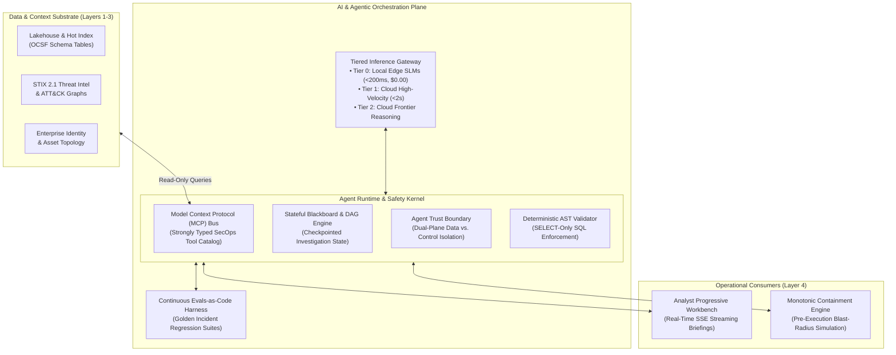
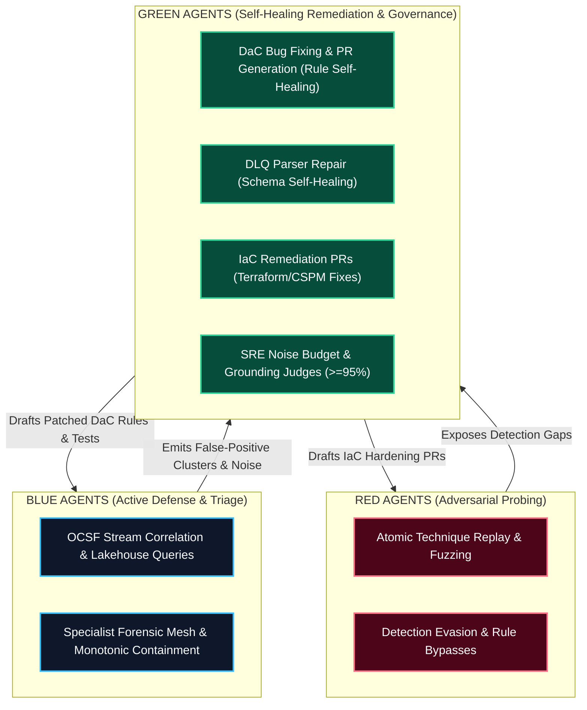
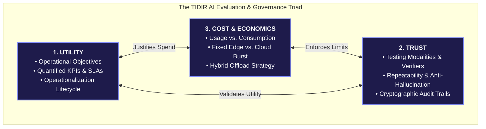
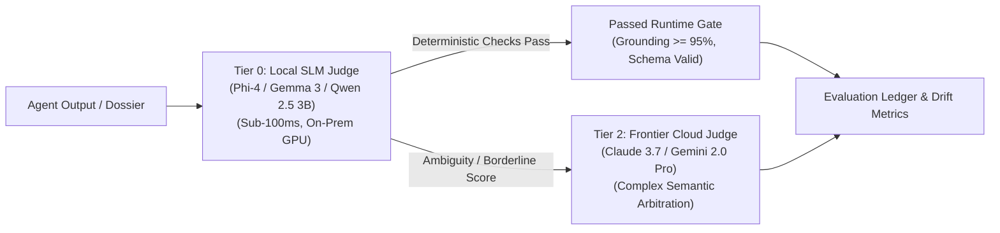
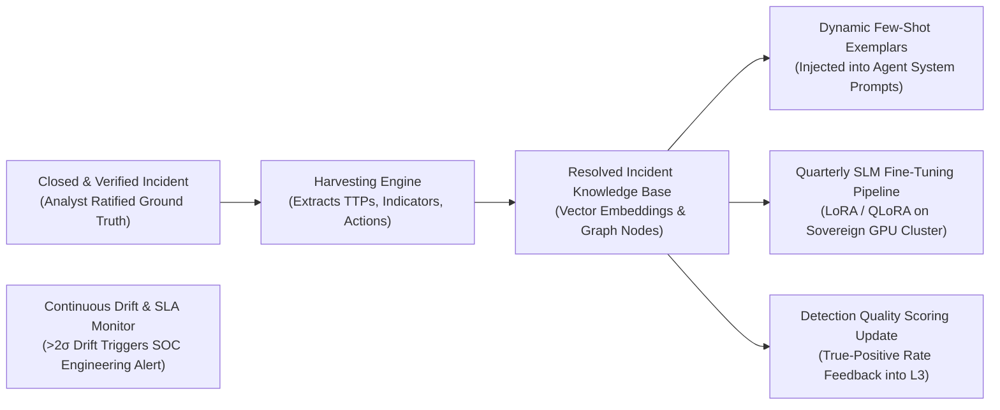
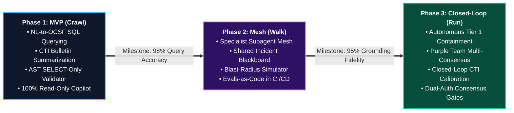

# Component Specification: AI & Agentic Orchestration Plane

> **Tier 3: Technical Specifications** · **Audience**: AI Platform Engineers, SecOps Architects · **Normative Status**: Reference Component  
> **Prerequisites**: [Automated Response & Containment](05-response-automation.md) · **Next Step**: [ADR Registry](/adr/)

---

The **AI & Agentic Orchestration Plane** provides the runtime execution, model routing, safety guardrails, and tool-calling interfaces required to operate autonomous and collaborative AI agents across the security lifecycle.

Rather than treating AI as an isolated conversational chatbot or a collection of brittle point scripts, this component establishes a structured orchestration layer. It exposes standardized **Model Context Protocol (MCP)** tool contracts, dynamically routes inferences across local Small Language Models (Tier 0) and cloud frontier models (Tier 1/2), and enforces deterministic safety boundaries through an **Agent Trust Boundary (Dual-Plane Untrusted Content Isolator)** and **Abstract Syntax Tree (AST) query validation**.

---

## 2. Core Functional Requirements

### 1. Tiered Inference Gateway & Model Routing

To optimize latency, operational cost, and data sovereignty, the AI Gateway routes prompts according to task complexity and latency constraints. The architecture cleanly separates **normative capability requirements** from **illustrative reference implementations**:

- **Tier 0 (Local Low-Latency Inference / Edge & VPC)**:
  - *Normative Requirement*: Must support locally hosted, zero-data-egress execution within a sub-200ms latency envelope. Responsible for high-throughput operational tasks: log parsing assistance, regex extraction, Personally Identifiable Information (PII) masking, and preliminary triage classification.
  - *Illustrative Reference Implementation (Non-Normative)*: Open-weights 8B–14B parameter models (e.g. Qwen 2.5, Llama 3.1) deployed via high-performance runtimes (e.g. vLLM, Triton).
- **Tier 1 (High-Velocity Structured Query & Triage Models)**:
  - *Normative Requirement*: High-throughput cloud or VPC-hosted models capable of schema-constrained SQL compilation and single-turn threat advisory extraction within a sub-2-second envelope. Responsible for natural language to OCSF SQL generation, single-turn threat advisory summarization, and triage dossier assembly.
  - *Illustrative Reference Implementation (Non-Normative)*: Fast commercial cloud APIs (e.g. Gemini Flash, Claude Haiku).
- **Tier 2 (Frontier Multi-Hop Reasoning Models)**:
  - *Normative Requirement*: Advanced reasoning engines with extended thinking and multi-step tool reasoning capabilities. Reserved for complex multi-hop campaign correlation, contradictory evidence arbitration, and root-cause hypothesis debates.
  - *Illustrative Reference Implementation (Non-Normative)*: Cloud frontier models (e.g. Claude Sonnet/Opus, Gemini Pro) or large-scale on-premises sovereign clusters.

#### 1.1 Model Refusal Circuit Breakers & Self-Hosted Fallbacks
In mission-critical security operations, relying exclusively on commercial public LLM APIs introduces two operational dependencies:

1. **Third-Party Content Policy Refusals**:
   - Commercial model providers enforce alignment guardrails designed to prevent malicious weaponization. During high-severity incidents, these guardrails can refuse legitimate defensive analysis requests—such as decompiling obfuscated PowerShell, analyzing shellcode strings, or explaining exploit primitives.
   - A model refusal breaks automated triage pipelines and stalls response velocity.
   - **Provider-Independent Fallback Routing**: Commercial model providers may refuse some legitimate defensive analysis requests. TIDIR therefore does not make continued availability of a particular external model a prerequisite for core investigative capability. Upon detecting refusal semantics (`content_filter`, refusal finish reasons), the AI Gateway automatically reroutes the prompt to an internal, defensively tuned fallback endpoint.

2. **Self-Hosted Open-Weights Backup (Operational Continuity)**:
   - To preserve analytical capability during commercial cloud outages, provider rate throttling, or WAN isolation during major cyber attacks, TIDIR specifies an on-premises or private-cloud **Self-Hosted Open-Weights Inference Cluster** (e.g. 70B+ parameter models running on vLLM/Triton).
   - **Provider-Independent Defensive Analysis**: Self-hosted models allow sensitive forensic material to be analyzed within the enterprise boundary and avoid dependence on a third-party model provider's availability or policy decisions.
   - **On-Premises Data Boundary Enforcement**: Critical breach evidence, executive communications, and unredacted customer telemetry can be processed entirely within the enterprise perimeter without third-party cloud data egress.

### 2. Model Context Protocol (MCP) as the Canonical Tool Bus
All forensic, contextual, and simulation tools are exposed to agents exclusively via the **Model Context Protocol (MCP)**:
- **`mcp-lakehouse-query`**:
  - `query_ocsf_telemetry`: Executes parameterized SQL queries against Layer 2 lakehouse tables with enforced time bounds and partition limits.
- **`mcp-process-lineage`**:
  - `get_process_tree`: Recursively resolves parent, child, and sibling process execution events given a root `process.entity_id`.
- **`mcp-threat-graph`**:
  - `lookup_threat_intel`: Queries Layer 3 threat graphs for active IOC decay scores, campaign attribution, and associated ATT&CK techniques.
- **`mcp-blast-radius`**:
  - `simulate_containment_impact`: Evaluates active TCP sessions, downstream microservices, and CMDB service tiers before any containment proposal is submitted.

Every tool input parameter is validated against strict JSON Schema contracts.

### 3. Stateful Incident Decision DAG & Blackboard Engine
Multi-stage investigations require persistent shared memory, auditability, and provenance across specialist subagents:
- **The Incident Decision DAG (Universal Decision Provenance)**:
  Every analytical step across both autonomous agents and human analysts is committed as an immutable Directed Acyclic Graph (DAG) edge:
  $$\text{Evidence} \longrightarrow \text{Transformation} \longrightarrow \text{Finding} \longrightarrow \text{Hypothesis} \longrightarrow \text{Decision} \longrightarrow \text{Authorisation} \longrightarrow \text{Action} \longrightarrow \text{Outcome}$$
  Each edge cryptographically seals the input records, model/parser version, authorizing principal, and resulting state delta (RFC 3161 timestamps and SHA-256 parent hash chains), providing non-repudiation for regulatory audits and post-incident reconstruction.
- **Shared Incident Blackboard**: Specialists (Host Forensic, Identity, Network) append structured observations, raw evidence pointers, and hypothesis scores to a central, versioned blackboard.
- **Durable Checkpointing**: State is committed after every subagent tool invocation, ensuring investigations survive network partitions or pod restarts.
- **Token Quota Budgets**: Each investigation is allocated a maximum token budget (e.g. 150k tokens) and execution timeout (e.g. 180 seconds) to prevent runaway recursive inference loops.

### 4. Deterministic Safety Kernel & Zero Trust AI
TIDIR rejects the assumption that prompt sanitization can deterministically prevent adversarial manipulation ([Greshake et al., 2023](https://doi.org/10.1145/3605764.3623985); [Willison, 2023](https://simonwillison.net/2023/Apr/25/dual-llm-pattern/); [FND-10](/architecture/foundational-research#fnd-10)). Empirical literature and security incident post-mortems over the last 12 months confirm that autonomous multi-agent runtimes remain vulnerable to indirect instruction injection and tool hijacking unless strictly isolated ([Anthropic, 2026](/architecture/foundational-research#fnd-17); [UK AI Security Institute [AISI], 2026](/architecture/foundational-research#fnd-17); [Hugging Face & Cloud Security Alliance [CSA], 2026](/architecture/foundational-research#deep-dive-1-ai-risks-adversary-capabilities-the-reality-vs-the-hype)). Instead, TIDIR enforces a **Zero Trust AI Architecture**:
- **Explicit Adversarial Threat Assumption**: TIDIR assumes adversarial evidence may successfully influence model reasoning. No security boundary therefore depends upon the model correctly distinguishing instructions from data. Consequential effects are bounded by deterministic capability, identity, schema, policy, and execution controls outside the reasoning model:
  1. *Capability-Bounded Permissions*: Agents operate with read-only query capabilities via strongly typed MCP tools. They hold zero administrative or mutating execution credentials.
  2. *Task-Scoped Ephemeral SVIDs*: SPIFFE/SPIRE mints short-lived X.509 identities ($\le 15\text{m}$) enforcing least-privilege tool contracts at the network layer ([FND-02](/architecture/foundational-research#fnd-02), [FND-06](/architecture/foundational-research#fnd-06), [FND-17](/architecture/foundational-research#fnd-17)).
  3. *Independent Response Authority*: Mutating containment actions are evaluated and authorized exclusively by the deterministic response safety kernel and human incident commanders.
- **Dual-Plane Data Isolation**: Untrusted external inputs (log messages, command-line arguments, email bodies, CTI text) are strictly isolated in a sandboxed *Data Plane*. System instructions, agent personas, and tool contracts exist exclusively in a signed *Control Plane*.
- **Deterministic Query Safety Boundary (Syntactic AST, Semantic Authorization & Resource Governance)**: Generated queries pass through a multi-tier deterministic query safety boundary before hitting Lakehouse or graph engines:
  1. *Syntactic AST Validation*: Compiles SQL/query syntax into an Abstract Syntax Tree (AST); strictly restricts execution to read-only statements (`SELECT` only; unconditionally rejecting `DROP`, `UPDATE`, `DELETE`, `INSERT`, `ALTER`, dynamic execution statements, and dangerous procedural User-Defined Functions / UDFs).
  2. *Semantic Data Authorization*: Enforces fine-grained tenant boundaries, attribute-based table and column access controls (blocking unauthorized access to HR, executive, payment, or legally privileged data), and dynamic column masking for PII/secrets.
  3. *Resource Ceilings & Anti-DoS Controls*: Enforces mandatory temporal query windows (`time >= NOW() - INTERVAL`), strict partition key filtering, scanned byte ceilings (max 50 GB per query), and query execution timeouts ($\le 15\text{s}$) to prevent compute-exhaustion denial-of-service and timing side-channels.
  4. *Inferential Reconstruction Guards*: Disallows high-frequency micro-targeted aggregate queries designed to infer protected individual attributes through differential analysis.

### 5. Agent Fleet Supervisor & Control Plane Management
To prevent zombie worker accumulation, runaway background tasks, and unmonitored subagent sprawl during major multi-stage incidents, TIDIR mandates an active **Agent Fleet Supervisor & Lifecycle Kernel** (ADR-0017):
- **Dynamic Lease Renewals & Heartbeats**: Every active agent pod or microVM must emit a cryptographic heartbeat and lease renewal every 30 seconds. Agents that miss 3 consecutive heartbeats are automatically evicted, their ephemeral identities revoked via SPIFFE/SPIRE, and their in-flight state committed to the blackboard.
- **Strict Concurrency Limits**: The supervisor caps concurrent running agent workers per incident (maximum 8 active subagents) and cluster-wide (maximum 64 active workers) to prevent downstream API and compute starvation.
- **Priority Preemption**: When high-priority P1/P2 incidents erupt, the supervisor preempts lower-priority background tasks (e.g. Green Agent routine noise-tuning or DLQ repairs) in favor of Blue active triage workers.

### 6. Semantic Loop Breakers & Cost Circuit Breakers
Autonomous subagents are susceptible to deadlocks, oscillating tool loops (repeatedly querying the same entities with minor semantic variations), and runaway inference chains:
- **Semantic State Hashing & Loop Detection**: The runtime kernel maintains a rolling sliding window of tool calls and prompt hashes. If an agent executes identical tool calls or oscillates between two non-progressing states $> 3$ consecutive times, the loop breaker terminates the loop, logs an anomalous divergence trace, and forces escalation to a senior human operator.
- **Hard Tool-Hop & Time Ceilings**: Maximum 8 sequential tool hops and a 180-second execution wall-clock timeout per investigation branch.
- **Financial Cost Circuit Breakers**: Hard financial ceiling of $2.50 or 150k tokens per single incident branch. Exceeding this cap immediately freezes execution until explicitly elevated by an analyst.

### 7. Model Context Protocol (MCP) Tool Observability & Circuit Breaking
All external integrations are exposed via MCP tool servers, governed by line-rate telemetry and circuit breakers:
- **Distributed W3C Trace Propagation**: Every MCP JSON-RPC tool invocation propagates W3C trace context (`traceparent`, `tracestate`) down into target lakehouse, graph, and API sinks, generating end-to-end distributed flame graphs.
- **Tool Error Circuit Breakers**: If an MCP tool server exhibits a $> 20\%$ error rate or latency $> 5000$ms over a 1-minute window, the tool circuit breaker trips to `OPEN`, immediately shielding agents from hallucinating workarounds and alerting platform engineers.
- **Schema Drift Detection**: MCP schema inputs and responses are audited against registered JSON schemas on every invocation. Schema mismatches trigger automated DLQ routing and Green Agent parser alerts.

### 8. Ephemeral Agent Identity & Machine Identity Fabric
To prevent credential theft, lateral impersonation, and non-repudiation failure across the agent mesh, TIDIR establishes a dedicated **Non-Human Identity (NHI) & Machine Attestation Fabric** (ADR-0018):
- **Dynamic Task-Scoped SVIDs (SPIFFE/SPIRE)**: Agents never execute using static service account credentials or hardcoded API keys. At container/microVM instantiation, the runtime kernel attests the workload and issues an ephemeral X.509 SVID (e.g. `spiffe://tidir.local/agent/blue/forensic/8492`) with a maximum 15-minute TTL.
- **Per-Task Capability Attestation**: SVID claims strictly bound agent access. A Host Forensic subagent cannot access network containment endpoints; containment playbooks require dynamically minted SVIDs signed by both the orchestrator and an approving human operator.
- **Line-Rate NHI Behavioral Profiling**: Service accounts, workload tokens, and automated CI/CD machines are normalized into OCSF Class 3002/3005 and profiled across 14-day rolling windows to detect token theft, out-of-VPC token replays, and dormancy awakening at line rate.

### 9. Operational Agent Roles & Feedback Responsibilities
TIDIR separates agent workloads into three distinct operational responsibilities, designated by Red, Blue, and Green functional roles:

- **Red Agents (Continuous Adversary Emulation):** Simulate attacks in staging environments, probe detection rules for evasive bypasses, and fuzz the Agent Trust Boundary with malicious payloads embedded in telemetry fields.
- **Blue Agents (Detection & Incident Resolution):** Operate the runtime defense—correlating events across the Bipartite Entity Graph, executing parallel specialist investigations (Host, Identity, Network), simulating blast radius, and executing policy-gated monotonic containment.
- **Green Agents (Self-Healing Remediation & Governance):** The active maintenance and repair engine of the architecture. Green agents do not simply flag problems; they **programmatically fix defects and hygiene gaps discovered across TIDIR**:
  1. *Detection-as-Code (DaC) Self-Healing:* When Red simulations expose a detection bypass or missed technique, Green agents analyze the missed telemetry and draft a GitHub Pull Request with the corrected declarative Sigma/SQL rule logic and synthetic regression unit tests.
  2. *Noise Budget Tuning & False-Positive Pruning:* When a detection rule breaches its 5% SRE noise budget, Green agents cluster the false-positive evidence, identify benign service accounts or batch jobs, and submit pull requests with hardened exclusion filters.
  3. *DLQ & Parser Self-Repair:* Ingests unparseable log payloads from the Layer 2 Dead-Letter Queue (DLQ) and drafts updated Vector VRL / grok parsing expressions to restore line-rate OCSF normalization.
  4. *Infrastructure-as-Code (IaC) Posture Remediation:* When external CNAPP/CSPM tools emit critical posture findings (e.g. unencrypted S3 bucket, open security group, over-privileged IAM role), Green agents draft deterministic Terraform/OpenTofu remediation pull requests to eradicate the root cause in code.
  5. *Quality & Alignment Judges:* Enforces that all Blue and Green pull requests adhere to $\ge 95\%$ grounding fidelity and $100\%$ tool contract validity.

---

## 3. The AI Evaluation & Governance Triad: Utility, Trust & Cost

Adopting AI within mission-critical security operations requires a holistic evaluation framework balancing three interdependent forces: **Utility** (operational impact and metrics), **Trust** (verifiability, safety, and repeatability), and **Cost** (compute economics and pricing models).

---

### Pillar 1: Trust (Verification, Repeatability & Audit)

Security operations cannot tolerate stochastic hallucinations or unverifiable claims. Trust is established through five complementary verification and testing modalities:

#### Comparative Analysis of AI Testing & Trust Modalities

| Testing Modality | Core Mechanism | Strengths (Pros) | Limitations (Cons) | Cost Profile | Scalability & Operational Challenges |
| :--- | :--- | :--- | :--- | :--- | :--- |
| **1. Golden Benchmark Datasets** | Versioned CI/CD test suites replaying curated attack & benign telemetry corpora. | Fully reproducible; zero latency impact on live ops; regression-proof. | Requires continuous curation; risks synthetic drift from novel attack techniques. | Low execution cost (one-time authoring + CI compute). | High scalability in GitOps; challenges in generating diverse multi-stage attack scenarios. |
| **2. Deterministic Guardrails & Trust Boundaries** | Dual-plane untrusted content isolation (Agent Trust Boundary), PII masks, and AST query validators. | Enforces structural boundaries; prevents arbitrary command execution and schema tampering; sub-millisecond. | Cannot eliminate semantic influence on reasoning (prompt injection is assumed possible); requires typed output validation. | Negligible ($0.00 inference; lightweight regex/AST CPU). | Extreme line-rate scale; requires schema-synchronized parser updates. |
| **3. LLM-as-a-Judge (Advisory Multi-Critique)** | Independent frontier models critique output accuracy, grounding fidelity, and tool usage. | Understands complex semantic context; automates subjective grading at scale. | Susceptible to shared foundation model training biases; cannot provide epistemic proof of correctness. | High (2x–3x token consumption per evaluated prompt). | Bounded by cloud API rate limits and token budgets; requires prompt version locking. |
| **4. Statistical Sampling & Shadow Mode** | Asynchronously executes candidate models against a 5–10% sample of live production queries. | Measures drift and performance against authentic, chaotic production telemetry without risk. | Feedback is lagging/asynchronous; does not protect against single-event failures. | Moderate (tunable 5–10% inference duplicate overhead). | Highly scalable; requires isolated shadow execution pipelines and telemetry sinks. |
| **5. Expert Human Validation (A/B Testing)** | Senior SOC analysts and detection engineers grade and compare competing agent outputs. | Expert adjudication; captures institutional nuances and business risk tolerance. | Severe human bottleneck; analyst fatigue; subjective inconsistencies between individual evaluators. | Very High (expensive senior engineering hours). | Low scalability; confined to pilot stage evaluations and periodic spot-check audits. |

#### Three-Tier Ground Truth Taxonomy
To avoid epistemic contradictions (such as treating subjective human evaluations as an infallible "gold standard"), TIDIR formally distinguishes three tiers of ground truth:
1. **Objective Ground Truth**: Synthetic or replayed telemetry where the intended attack sequence, attacker commands, and ground-truth labels are known by construction. Used for deterministic regression tests.
2. **Expert Adjudication**: Ambiguous operational investigations graded independently by multiple experienced practitioners to establish qualitative consensus without assuming individual infallibility.
3. **Operational Outcome**: Empirically measured real-world metrics post-deployment (e.g. verified false-positive rates, triage velocity deltas, and zero unintended containment outages).

#### Repeatability, Grounding & Cryptographic Auditability
- **Grounding Fidelity Standard ($\ge 95\%$)**: Every claim in an agent dossier must cite a specific, verified telemetry record or graph edge returned by an MCP tool. Uncited assertions are deterministically stripped.
- **Repeatability Pinning (Temperature = 0)**: Agent harnesses in production enforce `temperature = 0.0` (or minimal top-p with seed pinning) to maximize *repeatability* across identical inputs. Repeatability is not determinism or epistemic correctness; system trustworthiness is enforced through evidence grounding, independent verification, and bounded authority.
- **Cryptographic Audit Trail (RFC 3161)**: Every agent decision, prompt snapshot, model version, and tool output is sealed with an RFC 3161 cryptographic timestamp and committed to an immutable audit ledger for compliance and forensic reconstruction.

#### SLM-Powered Local Judges & Two-Tier Evaluation Pipeline
To avoid cloud egress costs and eliminate API rate limits during high-volume triage, TIDIR implements a **Two-Tier Model-as-a-Judge Architecture**:

1. **Tier 0 Local SLM Judges (Line-Rate Guardrails)**:
   - Dedicated small language models (SLMs) such as Microsoft Phi-4 (14B), Google Gemma 3 (4B/12B), or Qwen 2.5 (3B/7B) run on local inference engines (vLLM/Ollama) alongside the data pipeline.
   - **Responsibility**: Sub-100ms structural auditing. Verifies schema compliance, extracts entity references, scores grounding citation presence, and detects blatant instruction leakage before any dossier reaches the analyst workbench.
   - **Economic & Operational Value**: $0.00 incremental cloud API cost; on-premises data boundary enforcement; operates under total WAN severance.

2. **Tier 2 Frontier Model Escalation (Advisory Multi-Model Critique)**:
   - When the local SLM judge scores confidence between 70% and 85% (borderline ambiguity) or when triage recommendations involve Tier 1/2 containment, the evaluation escalates to a cloud frontier model for independent critique and adversarial counter-argumentation (Proposer vs. Challenger).
   - **Epistemic Limitation of Multi-Model Consensus**: While multi-model arbitration provides valuable heuristic defense-in-depth, foundation models sharing common public pre-training corpora cannot be assumed epistemically independent. Agreement between frontier models is never treated as mathematical proof of safety; deterministic invariant evaluation, AST validation, and human authorization remain the sole basis of execution authority.

3. **Continuous Judge Calibration Loop**:
   - The system periodically replays golden benchmark datasets against both the local SLM judge and the frontier model to measure alignment drift.
   - If SLM-to-Frontier verdict agreement falls below 92%, an automated fine-tuning task is triggered to realign the SLM judge weights.

#### AI Decision Trace Logging & Forensic Auditability
Regulatory compliance (SOC 2, ISO 27001, EU AI Act) and post-incident forensic reviews demand that every AI-led recommendation is fully auditable down to individual token invocations:

1. **OpenTelemetry GenAI Semantic Conventions**:
   - Every inference request, completion, and tool invocation emits OpenTelemetry-compliant trace spans containing:
     - `gen_ai.system`: Provider identifier (e.g. `anthropic`, `google`, `vllm`).
     - `gen_ai.request.model`: Exact model checkpoint and version hash.
     - `gen_ai.usage.input_tokens` / `gen_ai.usage.output_tokens`: Precise token accounting.
     - `gen_ai.response.finish_reasons`: Verification of natural completion vs. safety refusal filter trips.
     - Custom TIDIR attributes: `tidir.investigation_id`, `tidir.agent_color` (Red/Blue/Green), `tidir.blast_radius_tier`, and `tidir.grounding_score`.

2. **Deterministic Agent Decision DAG Reconstruction**:
   - The stateful DAG blackboard emits a versioned checkpoint of the entire reasoning graph for each case. Investigators can step backward and forward through the timeline of subagent tool calls, intermediate hypothesis evaluations, and contradictory evidence reconciliations.

3. **Tamper-Sealed Decision Archives**:
   - Full raw prompts and model completions for all containment recommendations are archived into the Tier 2 Lakehouse and sealed with SHA-256 hash chains and RFC 3161 timestamps, preventing retrospective repudiation.

---

### Pillar 2: Utility (Operational Objectives, Metrics & Day-2 Operations)

AI capabilities must solve concrete operational bottlenecks rather than serving as conversational novelties:

#### 1. Core Operational Objectives
- **Compress Investigation Windows**: Reduce Time-to-Investigate (MTTI) from hours to seconds by pre-assembling hydrated dossiers.
- **Eliminate Cognitive Pivot Fatigue**: Provide a single, progressive disclosure interface so analysts avoid juggling 10+ disconnected console tabs.
- **Democratize Deep Lakehouse Querying**: Allow junior analysts to extract multi-table join context via validated natural language query synthesis.

#### 2. Key Utility Metrics & Target SLAs

| Operational Objective | Target Metric / SLA | Baseline (Manual SecOps) | Target State with TIDIR AI |
| :--- | :--- | :--- | :--- |
| **Triage Comprehension** | Time-to-Comprehend Dossier | 15–30 minutes per incident | **< 60 seconds** via progressive disclosure |
| **Investigation Scoping (MTTI)** | End-to-end evidence assembly | 45–90 minutes | **< 2 minutes** (parallel specialist mesh) |
| **Query Syntax Accuracy** | Natural language to OCSF SQL | N/A (requires DBA/engineer) | **$\ge 98\%$ valid syntax** on first compilation |
| **Analyst Tool Pivots** | Console switches per case | 8–15 browser tabs | **$\le 2$ primary interfaces** |
| **Containment Velocity (MTTC)** | Tier 1 low-risk containment | 20–45 minutes | **< 15 seconds** (policy-gated automation) |

#### 3. Day-2 Operationalization & Transition Pathway
- **Shadow Mode (Day 1–30)**: Agents run silently in the background, attaching recommendations to tickets for retrospective comparison against human analyst notes.
- **Copilot / Assisted Mode (Day 31–90)**: Agents render read-only briefing cards and pre-drafted Lakehouse queries; analysts must explicitly click to execute.
- **Supervised Autonomy (Day 90+)**: Agents autonomously execute Tier 0 passive queries and draft Tier 1 containment playbooks, transitioning to autonomous execution only after passing golden benchmark gates.

#### 4. Continuous Self-Learning & Model Improvement Loops
To prevent agent obsolescence and close the loop between operational incidents and platform intelligence, TIDIR establishes automated self-learning pipelines:

1. **Resolved Incident Knowledge Base (Ground-Truth Harvesting)**:
   - Every closed investigation ratified by human analysts is automatically harvested into a structured knowledge base. The system pairs initial raw alerts and environmental context with the confirmed root cause, verified false leads, and optimal containment sequence.
   - Raw data is sanitised of transient secrets before embedding into the Layer 2 vector catalogue.

2. **Dynamic Few-Shot Exemplar Selection**:
   - During active triage, the AI Gateway queries the Resolved Incident Knowledge Base using semantic similarity over the current finding's MITRE ATT&CK techniques and OCSF classes.
   - The top 2–3 most relevant historical incident resolutions are dynamically injected as few-shot exemplars into specialist agent prompts, continually improving reasoning without requiring model retraining.

3. **Quarterly Sovereign SLM Fine-Tuning**:
   - High-volume, privacy-sensitive local SLM models (used for triage classification, OCSF SQL extraction, and Tier 0 judging) are periodically fine-tuned using parameter-efficient methods (LoRA/QLoRA) on the accumulated internal incident corpus.
   - Operates entirely on the on-premises or private-cloud Sovereign GPU Cluster, ensuring internal tradecraft never leaves the enterprise perimeter.

4. **Detection Effectiveness & Confidence Scoring Feedback**:
   - Real-world incident outcomes feed back into Layer 3 Detection Opportunity Scoring (§3 of Layer 3). Detection rules that repeatedly yield confirmed incidents receive elevated confidence weighting, whereas rules generating high analyst dismissal rates automatically trigger Green Agent noise-budget tuning PRs.

5. **Statistical Drift & Degradation Circuit Breakers**:
   - Key operational metrics (triage comprehension time, SQL compilation success rate, grounding fidelity, judge consensus rate) are monitored continuously against rolling 30-day baselines.
   - A statistically significant degradation ($> 2\sigma$ variance over a 7-day sliding window) triggers an automated alert to the SecOps engineering team and temporarily down-ranks autonomous agent privileges to Assisted Copilot mode.

6. **Human-in-the-Loop Preference Alignment**:
   - Analyst interactions on the workbench (edits to agent hypotheses, reordered response plans, thumbs up/down feedback) are captured as Direct Preference Optimisation (DPO) training pairs, ensuring future agent iterations align with human operator judgment.

---

### Pillar 3: Cost & Economic Optimization (TCO & Pricing Models)

Security data operates at extreme scale (terabytes to petabytes per day). Routing uncurated security telemetry directly to commercial frontier LLMs creates catastrophic token inflation and unsustainable OpEx.

#### 1. Analysis of AI Cost & Pricing Paradigms

| Pricing Paradigm | Economic Mechanism | SecOps Suitability & Financial Risks | Mitigation in TIDIR |
| :--- | :--- | :--- | :--- |
| **Usage-Based (Pay-Per-Token)** | Variable cost billed per million input/output tokens (e.g. cloud frontier APIs). | High risk during high-volume security incidents (e.g. DDoS or lateral sweeps generating massive log explosions). | Strict token budget quotas per investigation (e.g. 150k token cap) and context window compression. |
| **Consumption / Compute-Based** | Fixed hourly or monthly cost per dedicated GPU instance (e.g. self-hosted vLLM/Ollama). | Predictable OpEx with zero per-token cost penalties; risk of underutilization during quiet hours. | Optimal for Tier 0 local SLMs processing baseline log parsing and triage 24/7. |
| **Fixed / Subscription Tiers** | Flat monthly per-seat or per-tenant licensing fees. | Highly predictable budget; often throttled by strict concurrency rate limits during crisis peaks. | Used for non-runtime developer tooling (IDE copilots, code review judges). |
| **Outcome-Based Pricing** | Billing linked to verified outcomes (e.g. confirmed true-positive cases resolved). | Aligns vendor incentives with operational success; challenging to verify attribution contractually. | Evaluated for external MDR/MSSP commercial packaging. |
| **Hybrid Tiered Offload (TIDIR Model)** | **Tier 0 Local SLM (70%+) + Tier 1 Cloud (25%) + Tier 2 Frontier (5%)**. | Maximizes cost-efficiency, eliminates data egress, and reserves expensive frontier reasoning for true anomalies. | **Core architectural standard across all TIDIR components.** |

#### 2. The TIDIR Hybrid Token Offload Strategy
TIDIR implements a tiered economic shield:
1. **Tier 0 Local Ingest Offload (Edge & On-Prem):** High-throughput, repetitive tasks (< 200ms) execute on local GPUs/CPUs using 8B–14B open-weight models (Qwen 2.5, Llama 3.1). Absorbs **70–80% of total inference requests** at **$0.00 marginal cloud token cost**.
2. **Context Window Compaction**: Raw telemetry payloads are compacted into structured OCSF summaries before dispatching to cloud tiers, reducing prompt token payload sizes by over **85%**.
3. **Hard Token & Latency Ceilings**: The AI Gateway enforces hard circuit breakers: no single investigation may consume more than $2.50 in cloud tokens without explicit operator elevation.

---

## 4. Technology Mapping

| Layer Component | Open-Source / Self-Hosted | Cloud-Native Reference | Commercial / Managed |
| :--- | :--- | :--- | :--- |
| **Inference Gateway** | LiteLLM Proxy / vLLM / Ollama | AWS Bedrock / Google Vertex AI Gateway | Cloudflare AI Gateway / Portkey |
| **Sovereign Open-Weights Cluster** | vLLM / Triton (Llama 3.3 70B, Qwen 2.5 72B, DeepSeek-R1) | Private GPU VPC (AWS EC2 g5/p4, Google Cloud A3) | Dedicated Enterprise Bare-Metal GPU Nodes |
| **Tool Calling Protocol** | Anthropic Model Context Protocol (MCP) SDK | Standardized JSON Schema Tool APIs | Microsoft Semantic Kernel / LangChain |
| **Stateful DAG & Blackboard** | LangGraph / Temporal / Prefect | AWS Step Functions / Google Workflows | Custom Agent Mesh |
| **Agent Trust Boundary / Content Isolator** | Lakera Gandalf / NeMo Guardrails / Rebuff | AWS Bedrock Guardrails | Palo Alto Prisma AI Guard |
| **AST Query Validator** | `sqlglot` / `pglast` / Calcite AST parser | Athena Workgroup Query Controls | Snowflake Query Guardrails |
| **Telemetry & Tracing** | OpenTelemetry GenAI Semantic Conventions | CloudWatch / Cloud Trace | Langfuse / Arize Phoenix |

---

## 5. The 3-Phase MVP Implementation Roadmap (Crawl ➔ Walk ➔ Run)

### Phase 1: MVP (Assisted Copilot) — Weeks 1 to 8
* **Focus:** Immediate investigator acceleration with zero environmental risk.
* **Capabilities:**
  - Natural language to OCSF SQL query synthesis targeting Layer 2 Lakehouse.
  - Automated STIX 2.1 threat advisory extraction into ATT&CK DAGs.
  - Single-turn incident triage briefing card generation.
* **Architecture:** Stateless inference via LiteLLM gateway, single-turn MCP tool calling (`mcp-lakehouse-query`), deterministic AST validator.
* **Exit Milestone:** Valid SQL generation syntax $\ge 98\%$ across 200 standard SOC query evaluation benchmarks.

### Phase 2: Supervised Agent Mesh (Walk) — Months 3 to 6
* **Focus:** Deep multi-signal scoping and cognitive fatigue reduction.
* **Capabilities:**
  - Lead Triage Orchestrator dispatches parallel specialist subagents (Host Forensic, Identity & Auth, Network & Cloud).
  - Continuous aggregation to a stateful incident blackboard.
  - Pre-execution blast-radius simulation for suggested containment actions.
* **Architecture:** Stateful LangGraph/Temporal runtime, Agent Trust Boundary (Dual-Plane Isolator), CI/CD Evals-as-Code pipeline running on every Git pull request.
* **Exit Milestone:** Grounding fidelity $\ge 95\%$ (zero hallucinated IOCs) on golden incident benchmark datasets; sub-60-second end-to-end multi-agent triage synthesis.

### Phase 3: Autonomous Closed-Loop (Run) — Months 6+
* **Focus:** Sub-minute containment velocity and self-healing detection engineering.
* **Capabilities:**
  - Autonomous execution of Tier 1 containment playbooks with monotonic fail-closed state machines governed by reachability invariants ($R(s_{\text{post}}) \subseteq R(s_{\text{pre}})$). Forward compensation is permitted to safely restore benign availability, but security-state regression is strictly forbidden.
  - Continuous automated purple teaming with multi-model consensus evaluating detection rules.
  - Closed-loop attribution feedback auto-calibrating Layer 3 detection models.
* **Architecture:** Event-driven agent microservices, cryptographic multi-signature consensus queues for Tier 2 actions, audited emergency break-glass protocol.
* **Exit Milestone:** Mean Time to Contain (MTTC) for Tier 1 incidents MTTC $\lt 60\text{s}$; zero unintended production outages validated in shadow-mode canary execution.
