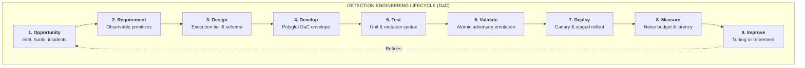
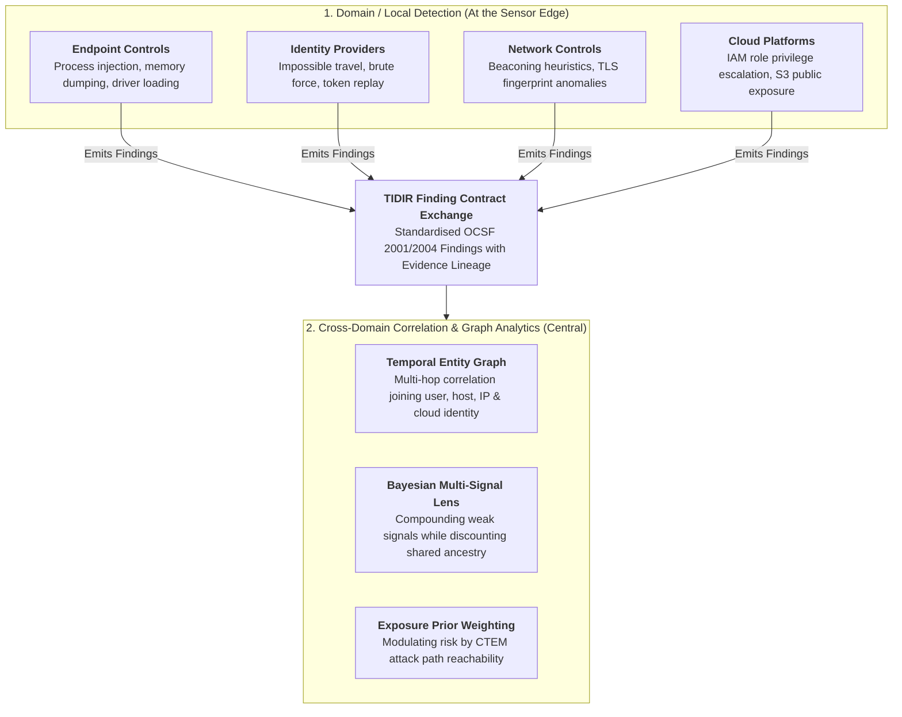
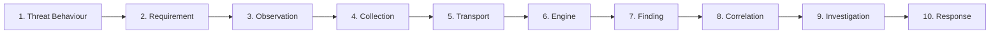

# Cyber Defence Engineering: Detection Engineering Lifecycle & Coverage Assurance

> **Tier 2: Engineering Architecture** · **Audience**: Principal Detection Engineers, SecOps SREs, Purple Teamers · **Normative Status**: Normative Architecture  
> **Prerequisites**: [Information Architecture](/architecture/03-information-architecture) · **Next Step**: [Component Deep Dive: Detection Engine](/architecture/components/03-detection-engine)

---

This document establishes the **Detection Engineering Lifecycle** and the **End-to-End Coverage Assurance** model for TIDIR. It defines the technology-independent engineering practices required to design, develop, test, assure, deploy, and continuously improve threat detections.

In alignment with **TIDIR Core Principles**, detection engineering is treated with the same rigour as production software engineering: rules are written as declarative code (Detection-as-Code), validated in continuous automated test harnesses, and monitored against operational error budgets.

---

## 1. The Detection Engineering Lifecycle

Detection engineering follows a nine-stage, closed-loop development lifecycle:

### Stage 1: Opportunity Identification
Detections originate from diverse operational triggers rather than arbitrary rule checklists:
* **Cyber Threat Intelligence (CTI)**: Novel adversary campaigns, newly observed TTPs, or high-prevalence technique shifts.
* **Incident Retrospectives**: Post-incident root-cause analyses identifying detection gaps during confirmed compromises.
* **Proactive Threat Hunting**: Discoveries of suspicious anomalies or unmonitored execution vectors identified during manual lakehouse sweeps.
* **Deception Interactions**: Unauthorised interactions with honeypots, canary tokens, or decoy service accounts.
* **Adversary Emulation & Red Teaming**: Empirical validation demonstrating evasion of existing security controls.
* **Environmental & Architecture Change**: Introduction of new cloud providers, identity providers, or enterprise SaaS applications.

### Stage 2: Requirement Specification
Translates the conceptual detection opportunity into an engineering requirement:
* Identifies the core behavioural invariant (e.g. *"Identify when LSASS process memory is dumped via unauthenticated Win32 API calls"*).
* Defines the necessary telemetry observations and attributes required (e.g. `process.name`, `target_process.name`, `granted_access_mask`).
* Explicitly distinguishes **Domain/Local Detection** (feasible at the sensor edge) from **Cross-Domain Correlation** (requiring central data joining).

### Stage 3: Architecture & Tier Design
Selects the appropriate analytical engine and execution topology:
* **Edge / Local Execution**: High-throughput, domain-specific matching executed directly within endpoint sensors, cloud firewalls, or identity providers to minimise egress bandwidth and latency.
* **Streaming Windowing Engine**: In-flight temporal correlations evaluated over rolling sub-minute time horizons.
* **Columnar Lakehouse SQL**: Long-term behavioural baselining, outlier detection, and complex multi-dataset joins evaluated over multi-day or multi-week historical datasets.

### Stage 4: Rule Development (Polyglot DaC)
Authored in the canonical **Polyglot Detection-as-Code** format (ADR-0019):
* Enforces a vendor-neutral YAML metadata envelope containing author, version, ATT&CK classification, target intent (`finding`, `risk_increment`, `signal`, `telemetry_elevation_trigger`), and expected true/false positive scenarios.
* Encapsulates native, target-optimised query blocks (e.g. KQL, SPL, SQL, or streaming SQL) to eliminate translation abstraction penalties.

### Stage 5: Synthetic Unit Testing
Automated pre-commit and CI verification:
* Asserts rule syntax validity against the canonical OCSF schema registry.
* Injects synthetic unit-test events to verify that benign samples do not trigger false matches and true-positive samples reliably fire.

### Stage 6: Validation via Continuous Purple Teaming
Executes non-destructive atomic adversary emulation payloads in an isolated staging environment (ADR-0007):
* Tests resilience against syntactic and procedural mutations (CLI flag permutations, environment variable indirection, alternate system call bindings).
* Empirically distinguishes brittle string matches from evasion-resilient behavioural primitives.
* Performs **Historical Lakehouse Backtesting** across 30 days of production telemetry to calculate Expected Alert Volume (EAV) and evaluate noise characteristics before deployment.

### Stage 7: Staged Deployment
Rollout into production via automated GitOps pipelines:
* **Canary Phase**: Deployed in "silent" mode (emitting `signal` or shadow findings) across a representative fraction of endpoints or accounts to verify compute overhead and real-world noise.
* **Production Activation**: Promoted to active finding generation upon passing canary verification.

### Stage 8: Operational Measurement & Noise Budgeting
Monitors the live operational health of the detection:
* Tracks the **False Positive Rate (FPR)** and alert noise budget (ADR-0008). If a detection burns through its noise budget ($\text{FPR} \gt 5\%$), it automatically triggers an automated circuit breaker, demoting the rule back to engineering review.
* Measures operational lag and detection latency against defined SLOs.

### Stage 9: Continuous Improvement & Retirement
Detections are treated as living software artefacts:
* Regularly tuned to incorporate new environmental baselines.
* Formally retired when underlying technologies are decommissioned or when the threat vector is rendered impossible by architectural hardening.

---

## 2. Domain / Local vs. Cross-Domain Detection

A scalable reference architecture must avoid the fallacy that all security detections must execute centrally. TIDIR enforces a strict division of labour between domain-level security controls and central correlation engines:

### The "Detect Locally, Correlate Centrally" Axiom
1. **Domain / Local Detection**:
   - Executes where the telemetry is born.
   - Evaluates high-frequency, commodity patterns (e.g. known malware signatures, suspicious child processes, local privilege escalation).
   - Emits structured, standardised **Findings** rather than streaming petabytes of raw high-noise telemetry across wide-area networks.
2. **Cross-Domain Correlation & Central Detection**:
   - Ingests standardised findings from diverse domain controls.
   - Executes multi-hop entity resolution (e.g. linking an endpoint curl process to a cloud IAM role assumption and a SaaS data export).
   - Manages enterprise-wide risk compounding while enforcing **Invariant 3 (Evidential Independence)**: discounting findings that share common underlying observation parents.

---

## 3. End-to-End Coverage Assurance

A detection rule being committed to Git or marked "enabled" in a console does not prove that an enterprise can detect and defend against an attack. A failure anywhere along the telemetry and processing pipeline renders the rule inoperative.

TIDIR defines **End-to-End Coverage Assurance** across ten continuous, verifiable links:

$$\text{Threat Behaviour} \longrightarrow \text{Requirement} \longrightarrow \text{Observation} \longrightarrow \text{Collection} \longrightarrow \text{Transport} \longrightarrow \text{Engine} \longrightarrow \text{Finding} \longrightarrow \text{Correlation} \longrightarrow \text{Investigation} \longrightarrow \text{Response}$$

| Assurance Link | Failure Mode | How TIDIR Verifies Continuous Health |
| :--- | :--- | :--- |
| **1. Threat Behaviour** | Adversary mutates command syntax or uses alternate API. | Continuous purple team mutation testing (ADR-0007). |
| **2. Requirement** | Inaccurate translation of threat behaviour into logic. | Peer review and multi-model consensus validation. |
| **3. Observation** | Kernel audit subsystem or logging daemon disabled. | Periodic synthetic telemetry canaries and heartbeat verification. |
| **4. Collection** | Local sensor agent uninstalled, crashed, or resource-throttled. | Fleet-wide agent health telemetry and dead-man monitors. |
| **5. Transport** | Network partition, proxy drop, or ingestion backpressure. | End-to-end W3C trace IDs and streaming consumer lag metrics (ADR-0025). |
| **6. Engine** | Detection rule disabled, crashed, or query syntax corrupted. | Automated synthetic event injection validating active rule execution. |
| **7. Finding** | Finding drop, malformed schema rejection, or dead-letter queue. | Schema Registry validation and DLQ observability (ADR-0024). |
| **8. Correlation** | Graph clustering timeout, entity ID mismatch, or stale cache. | Graph consolidation integration tests and entity resolution SLAs. |
| **9. Investigation** | Missing historical context, query timeout, or agent stall. | Continuous synthetic case triage and Agent Evals-as-Code (ADR-0012). |
| **10. Response** | Stale API credentials, firewall timeout, or unmapped asset. | Periodic non-destructive containment capability attestation (ADR-0027). |

If any single link in this chain breaks, the overall defensive capability is compromised. TIDIR treating coverage as an end-to-end property ensures that detection health dashboards accurately reflect operational reality rather than theoretical rule inventory.

---

## 4. Deception: Operations & Engineering

Deception provides the highest signal-to-noise ratio in modern cyber defence. Rather than treating Deception as an isolated silo or a separate top-level operational stage, TIDIR embeds deception across the operational and engineering planes:

### 4.1 Deception Operations (Operational Plane)
Deception Operations deploys and monitors deceptive surfaces within the operational environment:
* **Decoys & Deceptive Services**: Lightweight network listeners, simulated web services, and fake exposed database endpoints.
* **Lures & Honeytokens**: Fictitious credentials, Kerberos Service Principal Names (SPNs), AWS IAM keys, and seed documents placed within legitimate filesystems and code repositories.
* **Deterministic Signal Generation**: Because deceptive assets have zero legitimate operational use, any interaction represents high-confidence anomalous behaviour ($P(\text{Malicious} \mid \text{Interaction}) \approx 1.0$), bypassing probabilistic Bayesian weighting and triggering immediate investigation.

### 4.2 Deception Engineering (Engineering Plane)
Deception Engineering designs, automates, and maintains the deceptive fabric:
* **Scenario & Threat Alignment**: Crafts deceptive assets matching active threat campaigns identified by CTI (e.g. creating fake developer credentials when targeted phishing is observed).
* **Automated Asset Rotation**: Periodically rotates honeytokens, passwords, and decoy IP addresses to prevent stale or publicly fingerprinted deceptive surfaces.
* **Adversary Emulation Testing**: Uses purple team tools to verify that deceptive lures remain discoverable by common adversary enumeration scripts without breaking legitimate enterprise workflows.
* **Effectiveness & Exposure Auditing**: Verifies that decoys remain isolated and cannot be leveraged as pivot points by an adversary.
