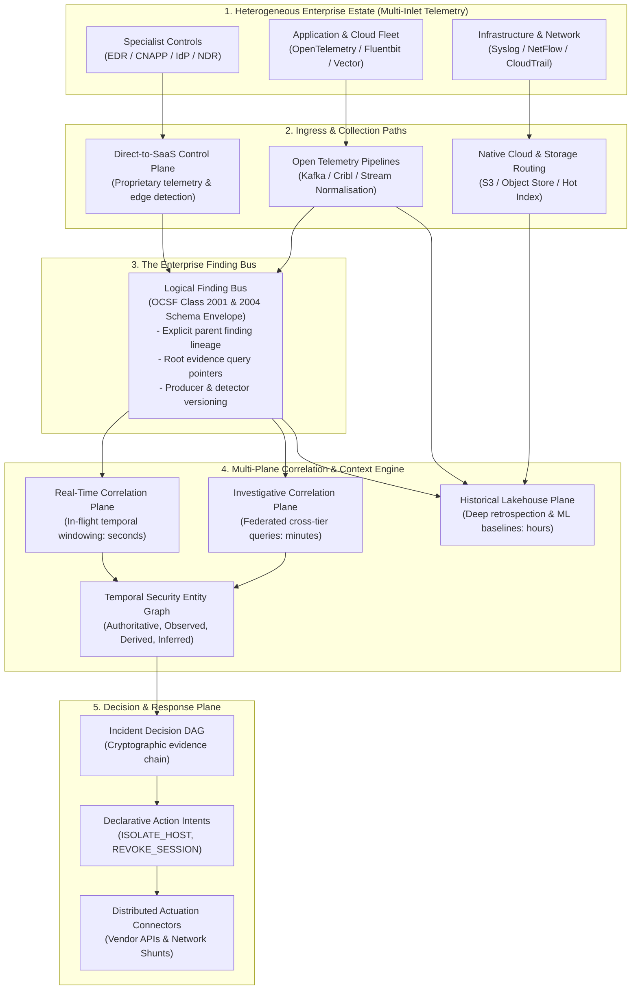
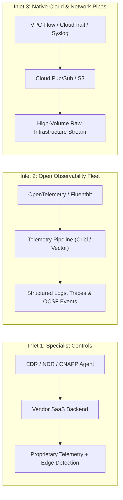
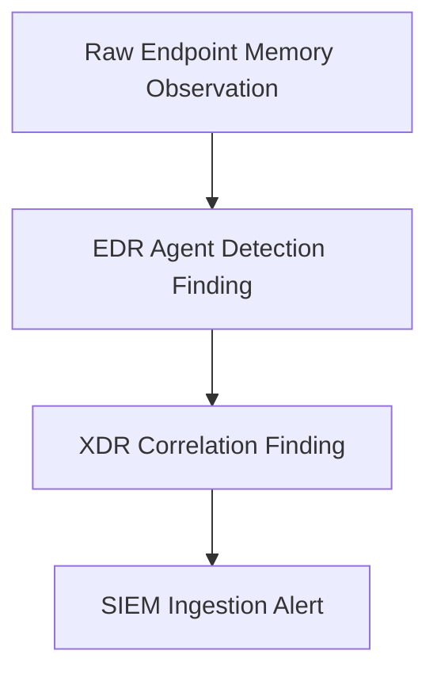
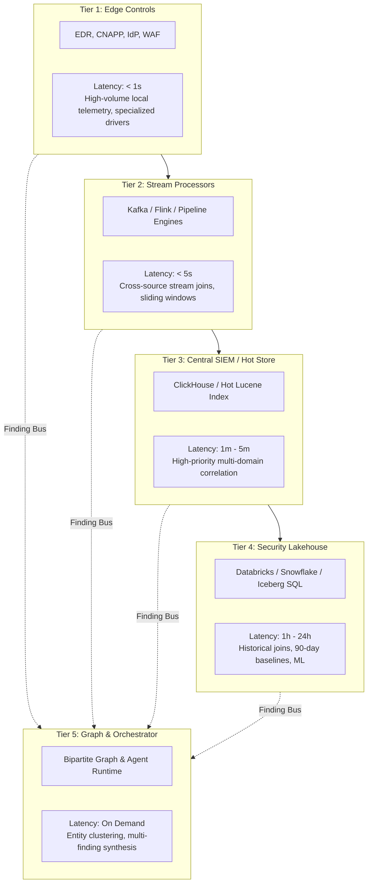

# Distributed Detection & the Finding Bus: Architecture Considerations for the Blended Enterprise

**Status:** Informational / Strategic Position Paper  
**Author:** TIDIR Working Group  
**Target Audience:** Enterprise Security Architects, Principal Detection Engineers, Security Operations Leadership  

---

## 🧭 Executive Summary & Core Thesis

Modern enterprise security architectures do not fail because they lack detection rules, data storage, or specialised security tools. They fail because they attempt to treat a distributed, heterogeneous estate as if it were a single centralised system.



The overarching architectural observation emerging from enterprise implementations is straightforward:

> **A modern Threat Intelligence, Detection, Investigation and Response (TIDIR) architecture is unlikely to have one collection system, one datastore, or one detection engine. Detection, data, and response are inherently distributed.**

The architectural challenge is therefore not how to centralise every byte of raw enterprise telemetry into a single repository. The challenge is establishing the **governing contracts, boundary principles, and correlation mechanisms** that allow distributed, multi-vendor capabilities to operate as a coherent defence system.

TIDIR does not aim to build a monolithic Security Information and Event Management (SIEM) replacement. It provides the **control system and contract layer above a distributed security estate**:

> *Observe widely. Detect where the signal is strongest. Publish findings consistently. Correlate across domains. Resolve against business and exposure context. Preserve the evidence behind every conclusion. Apply risk centrally. Reason probabilistically where useful. Authorise deterministically. Act through distributed controls. Feed outcomes back into detection and prevention.*

---

## 🏛️ The Fallacy of the Single Sensor & the Blended Enterprise

In theoretical architecture diagrams, ingestion is frequently drawn as a single neat box: an agent that collects all telemetry, normalises it immediately, and routes it to a central streaming pipe. In a live enterprise operating across multi-cloud environments, legacy data centres, and hybrid workforces, this purist model collapses.

### The Three Coexisting Telemetry Inlets

An enterprise inevitably operates three distinct, coexisting telemetry inlets:



1. **Inlet 1: Specialist Security Controls (Endpoint Detection and Response [EDR], Network Detection and Response [NDR], Cloud-Native Application Protection Platforms [CNAPP], Identity Providers [IdP]):**  
   These components rely on proprietary kernel drivers, deep operating-system hooks, and specialised sensor code. Attempting to replace an EDR agent with a generic log forwarder strips away behavioral heuristics, memory inspection, and tamper-resistance. Telemetry from these tools ships directly to their respective software-as-a-service (SaaS) cloud backends.
2. **Inlet 2: Open Observability Fleets (OpenTelemetry [OTel], Fluentbit, Vector, OSQuery):**  
   Deployed across container clusters, serverless environments, and internal microservices. These collectors excel at gathering distributed application traces, container lifecycle metrics, and structured application logs, piping them into streaming buses and data lakes.
3. **Inlet 3: Native Cloud & Infrastructure Ingress (Syslog, NetFlow, VPC Flow Logs, CloudTrail):**  
   High-volume, line-rate infrastructure telemetry captured natively by cloud providers or hardware forwarders, written directly to object storage or hot indexing tiers.

### Convergence at Contracts, Not Uniformity of Runtimes

TIDIR does not demand the replacement of existing agents with a single universal collector. Doing so is an anti-pattern. Instead, TIDIR establishes **convergence at boundaries**:

* **Finding Bus Convergence:** Specialised agents and analytics jobs publish evidence-backed conclusions using a common schema envelope.
* **Lakehouse Schema Convergence:** Raw telemetry from varied forwarders normalises to Open Cybersecurity Schema Framework (OCSF) Parquet or Iceberg tables.
* **Context Convergence:** Disparate identifiers (such as an EDR machine identifier, an AWS instance identifier, and a hostname) map to a shared temporal Entity Graph.
* **Action Intent Convergence:** Containment workflows express vendor-neutral intent (`ISOLATE_HOST`), while vendor adapters translate that intent into concrete application programming interface (API) calls.

---

## 🔄 1. The Vendor-Neutral Finding Bus

The primary architectural primitive required between distributed detection and enterprise correlation is the **Finding Bus**.

### The Distinction Between an Alert and a Finding

In many security operations centers, the terms *alert* and *finding* are conflated. TIDIR enforces a strict semantic distinction:

* **Alert:** A workflow object. An alert represents an operational demand for human or automated attention. It implies triage queues, ownership, service-level agreements (SLAs), and ticketing state.
* **Finding:** An evidence-backed assertion made by a detection capability. A finding states that a specific detector evaluated a specific set of observations at a specific time and concluded that an event of security interest occurred.

A finding does not mandate an immediate human page. Hundreds of findings may be emitted across an enterprise each hour; only when correlated against entity criticality, exposure paths, and corroborating signals do they coalesce into an actionable security incident.

### Standardized Finding Payload Schema

To avoid the trap of inventing competing proprietary data formats, the Finding Bus standardises strictly on **OCSF Category 2 (Findings)**, specifically **Class 2001 (Security Finding)** and **Class 2004 (Detection Finding)**:

```
Finding (OCSF Class 2004 Envelope)
├── finding_id: UUIDv4
├── producer: String (e.g. "crowdstrike-edr", "databricks-lakehouse", "custom-stream")
├── detector:
│   ├── id: String ("DET-0042")
│   ├── version: String ("1.4.0")
│   └── type: Enum ("STREAMING", "SCHEDULED_SQL", "EDGE_HEURISTIC", "ML_ANOMALY")
├── finding_type: String ("CREDENTIAL_ACCESS_LSASS_DUMP")
├── observed_entities: Array<EntityRef> (Host, User, Process, IP)
├── attack_tactics: Array<MITRE_Tactic>
├── attack_techniques: Array<MITRE_Technique>
├── confidence: Float (0.0 to 1.0)
├── severity_id: Integer (OCSF Severity: 1=Low, 2=Medium, 3=High, 4=Critical)
├── observed_time: RFC3339 Timestamp
├── evidence_references: Array<EvidencePointer>
│   ├── storage_tier: Enum ("HOT_INDEX", "LAKEHOUSE_ICEBERG", "VENDOR_API")
│   ├── query_uri: String (SQL or API filter retrieving raw events)
│   └── content_hash: SHA-256 (Hash of the underlying raw observation batch)
├── lineage:
│   ├── root_evidence_ids: Array<UUIDv4>
│   ├── parent_finding_ids: Array<UUIDv4>
│   └── trace_context: W3C Traceparent (trace_id, span_id)
└── lifecycle_state: Enum ("NEW", "CORRELATED", "SUPPRESSED", "RESOLVED")
```

### Lineage & The Prevention of Corroboration Inflation

A correlation engine must distinguish independent corroboration from derived duplication. Consider an adversary executing an in-memory injection attack:



These are not three independent pieces of evidence confirming an attack. They represent a single root observation processed sequentially through three vendor systems.

If an automated correlation engine treats these as three independent signals, its Bayesian probability calculation will artificially inflate the incident's confidence score. By enforcing that every finding on the bus records its `root_evidence_ids` and `parent_finding_ids`, downstream correlation models can trace common ancestry and discount co-derived signals, preserving **Invariant 3 (Dependency-Aware Confidence)**.

---

## 📊 2. The Information Hierarchy: Telemetry, Findings, and Cases

To manage high data volumes without drowning analysts, the architecture separates security data into four tiers:

```
TELEMETRY
"What happened?"
Line-rate raw events (Billions/day)
        │
        ▼
DISTRIBUTED DETECTION
        │
        ▼
FINDINGS
"What might matter?"
Evidence-backed assertions (Thousands/day)
        │
        ▼
CORRELATION + CONTEXT + RISK
        │
        ▼
CASES
"What security situation exists?"
Synthesised hypotheses (Tens/day)
        │
        ▼
INVESTIGATION / DECISION
```

1. **Telemetry:** Continuous, raw observations emitted by endpoints, networks, cloud runtimes, and applications.
2. **Findings:** Structured conclusions emitted by distributed detection mechanisms evaluating telemetry streams or historical tables.
3. **Cases:** Clustered, multi-finding security hypotheses managed by the investigation plane, linking related entities, threat intelligence, and attack techniques.
4. **Decisions & Actions:** Cryptographically recorded incident response conclusions executed through blast-radius-bounded playbooks.

---

## 🌐 3. The Three Correlation Planes

Distributed detection and multi-tier storage introduce a fundamental physical trade-off: two events may independently appear benign while indicating an attack when joined. Attempting to centralise all data into one database to enable joining creates massive operational and financial bottlenecks. Conversely, querying all data on demand across distributed systems can be too slow for active threats.

To resolve this, TIDIR establishes three distinct correlation planes based on temporal latency requirements:

| Correlation Plane | Latency Budget | Operational Purpose | Primary Data Source |
| :--- | :--- | :--- | :--- |
| **Real-Time Correlation Plane** | Seconds to Minutes ($\le 60\text{s}$) | Active attack containment, high-velocity ransomware detection, credential lockout. | The **Finding Bus** + in-flight streaming telemetry buffers. |
| **Investigative Correlation Plane** | Minutes to Hours ($1\text{m} - 2\text{h}$) | Incident scoping, blast-radius verification, lateral movement tracking. | **Federated Query Engine** spanning Hot Index, Lakehouse, and vendor APIs. |
| **Historical Correlation Plane** | Hours to Months ($1\text{d} - 365\text{d}+$) | Threat hunting, retrospective indicator searching, rule backtesting, baseline training. | **Security Lakehouse** (Apache Iceberg / Delta Lake on object storage). |

Treating correlation as three distinct planes allows the enterprise to provision fast, stateful memory where latency is critical, while relying on cost-effective, scalable lakehouse queries for deep investigation and threat hunting.

---

## 📍 4. Data & Detection Placement Principles

The architecture rejects two common extremes: "send every log to the central SIEM" and "leave every log in its original silo." Instead, it operates on a workload-driven placement principle:

> **Data Placement Rule:** Co-locate the minimum information required to satisfy a detection's latency and confidence requirements; federate or retrieve the remainder on demand.

### The Five-Tier Detection Placement Model

Detection rules are deployed across the enterprise according to where their required telemetry naturally resides:



---

## 📜 5. Inverted Telemetry Dependencies in Detection-as-Code

Detection rules should explicitly declare the telemetry and context feeds they require to function. This inverts the traditional relationship between data engineering and detection engineering: data pipelines are configured to support active detections, rather than detections hoping data arrives unannounced.

### Example Detection-as-Code Declaration

```yaml
id: DET-0042
name: Distributed Kerberoasting & Service Ticket Harvesting
version: 1.4.0
severity: medium
attack_technique: T1558.003

telemetry_dependencies:
  required:
    - class: 3002 # OCSF Authentication
      sources: ["microsoft-active-directory", "azure-entra-id"]
      max_delivery_latency_seconds: 30
    - class: 4001 # OCSF Network Activity
      sources: ["zeek", "palo-alto-firewall"]
      max_delivery_latency_seconds: 60
  optional:
    - class: 1007 # OCSF Process Activity
      sources: ["edr-agent"]

context_dependencies:
  required:
    - identity.privilege_tier
    - asset.business_criticality
  optional:
    - exposure.kerberos_delegation_path

execution_placement:
  primary: STREAMING_ENGINE
  fallback: SCHEDULED_LAKEHOUSE_QUERY
```

### Automated Operational Degradation

When an enterprise pipeline experiences an outage or telemetry drops below acceptable thresholds, the system automatically checks dependency declarations:

$$\text{Fidelity}(\text{DET-0042}) = \frac{\sum w_i \cdot \mathbb{I}(\text{Signal}_i \text{ healthy})}{\sum w_i}$$

If a required telemetry source fails, the system transitions the detection rule into a `DEGRADED` state and caps its maximum confidence score. The Security Operations Center (SOC) is alerted to the reduction in visibility immediately, rather than discovering a blind spot during an active breach (**Invariant 8: Degraded Defence**).

---

## 🎯 6. End-to-End Coverage Assurance

In traditional operations, an organization often assumes a threat technique is covered simply because a detection rule is marked as "enabled" in a SIEM. In reality, operational coverage requires an unbroken ten-step delivery chain:

```mermaid
flowchart LR
  THREAT["1. Threat"] --> TECH["2. Technique"]
  TECH --> DET["3. Rule Code"]
  DET --> SIG["4. Required Signals"]
  SIG --> GEN["5. Generation (Kernel/App)"]
  GEN --> COLL["6. Collection (Agent/OTel)"]
  COLL --> ROUTE["7. Routing & Pipeline"]
  ROUTE --> RUN["8. Engine Runtime"]
  RUN --> FIND["9. Finding Publication"]
  FIND --> RESP["10. Response Action"]
```



If any link in this chain breaks—whether an endpoint sensor drops, a pipeline drops an attribute during parsing, or an identity token for an automation tool expires—the organization is uncovered. TIDIR treats **Coverage Assurance** as an active, continuous testing problem governed by purple-team emulation and pipeline health monitoring.

---

## 🧩 7. Temporal Entity & Context Resolution

Raw security telemetry answers *what happened*. It does not answer *what it happened to*, *how that entity connects to surrounding systems*, or *how critical that asset is to the business*.

TIDIR maintains a **Temporal Security Entity Graph** separating entity relationships from the Evidence Directed Acyclic Graph (DAG):

* **Entity Graph:** Tracks what exists, who owns it, how it communicates, and how critical it is over time.
* **Evidence DAG:** Tracks why the system believes a specific security conclusion is true.

### The Four Epistemic Classes of Context

To prevent speculative analysis from distorting deterministic access controls, every relationship in the Entity Graph is tagged with an epistemic category:

| Epistemic Class | Definition & Source | Permitted Architectural Use |
| :--- | :--- | :--- |
| **Authoritative** | Asserted directly by a trusted system of record (e.g. Identity Provider, Enterprise CMDB). | Hard authorization gates, containment blast-radius calculations. |
| **Observed** | Directly recorded in raw telemetry (e.g. Host A opened a TCP connection to Host B). | Forensic reconstruction, graph correlation. |
| **Derived** | Established via deterministic join rules (e.g. resolving an IP to a Host via DHCP leases). | Correlation, entity clustering. |
| **Inferred** | Proposed by probabilistic models, clustering heuristics, or AI agents. | Advisory guidance, analyst triage notes. **Must never self-authorize actions.** |

> **The Epistemic Integrity Invariant:** An inferred relationship MUST NEVER silently escalate into an authoritative fact without human verification or deterministic cryptographic proof.

---

## 🔗 8. Pre-Detection Telemetry Provenance

The Evidence DAG must not begin when an incident is declared; it must track telemetry from its initial collection:

```
Source Observation (Kernel / App)
       ↓  (Collector timestamp & agent version)
Collection & Transport (OTel / Forwarder)
       ↓  (W3C Traceparent: trace_id, span_id)
Pipeline Processing (Filtering / Masking)
       ↓  (Transformation hash & schema version)
Normalization (OCSF Parquet / Iceberg)
       ↓  (Partition key & storage URI)
Detection Engine Evaluation
       ↓  (Rule ID & version)
Published Finding
```

Every transformation, enrichment, or sampling event in the pipeline records its execution metadata using the **W3C Trace Context** standard. This provides forensic examiners with full cryptographic lineage, proving that an event was not tampered with, truncated, or dropped in transit (**Invariant 2: Evidence Traceability**).

---

## ⚖️ 9. Risk Above Detector Severity

Individual detection mechanisms only possess local context. An EDR sensor may generate a `Medium` severity alert for a privilege escalation attempt because the underlying binary technique appears moderately suspicious.

The central correlation plane, however, integrates context across multiple domains:

$$\text{Enterprise Risk} = f(\text{Finding Confidence}, \text{Entity Criticality}, \text{Identity Privilege}, \text{Exposure Path}, \text{Threat Intel})$$

When the correlation engine evaluates the finding against the Entity Graph, it may discover that the affected host runs a critical transaction service, the associated account belongs to a domain administrator, and the host has an unpatched, internet-exposed vulnerability identified by exposure tooling.

The central system upgrades the incident's operational priority to `Critical`, independently of the upstream sensor's local severity rating. Upstream tools evaluate detection techniques; the TIDIR correlation plane determines business risk.

---

## 🎯 Summary: The Closed-Loop Control System

The architectural additions outlined in this paper do not replace the existing TIDIR design; they reinforce its underlying thesis. By decoupling detection from raw storage through the **Finding Bus**, enforcing **inverted data dependencies in DaC**, tracing **pre-detection provenance**, and structuring **context into strict epistemic tiers**, TIDIR provides an open, vendor-neutral operating model capable of governing modern, distributed enterprise security estates.
