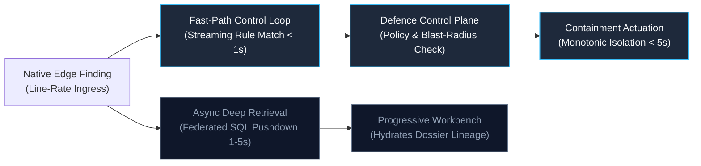

# Failure Modes, Boundary Conditions & Engineering Tradeoffs

> **Tier 1: Strategic Architecture** · **Audience**: Principal Architects, Reliability Engineers, Staff Detection Engineers · **Normative Status**: Informative / Adversarial Analysis  
> **Prerequisites**: [The Architectural Constitution](/architecture/00-architectural-invariants) · [System Overview](/architecture/01-system-overview) · [Foundational Research](/architecture/foundational-research)

---

## 1. The Discipline of Claims: Acknowledging Failure Boundaries

In systems engineering, architectures that claim zero data loss, 100% detection coverage, or complete elimination of human error are dishonest. Distributed networks partition, operating system kernels drop packets during telemetry storms, and probabilistic models hallucinate under adversarial pressure.

TIDIR adheres to an explicit editorial maxim:
> *Architectures specify mechanisms and target properties. Experiments establish outcomes.*

This document subjects TIDIR's target architecture to rigorous adversarial stress-testing, analyzing its four most critical boundary conditions, failure modes, and engineering tradeoffs:

```
┌────────────────────────────────────────────────────────────────────────────────────────┐
│                        CRITICAL ARCHITECTURAL TRADEOFFS                                │
├───────────────────────────────┬────────────────────────────────────────────────────────┤
│ 1. OCSF Semantic Drift        │ Schema Standardization vs. Proprietary Forensic Loss   │
│ 2. Federated Query Latency    │ Low-Cost Storage Pushdown vs. Containment Velocity     │
│ 3. Situational Awareness      │ Autonomous Agent Efficiency vs. Human Operator Decay   │
│ 4. Telemetry Storms           │ Host System Stability vs. Complete Event Visibility    │
└───────────────────────────────┴────────────────────────────────────────────────────────┘
```

---

## 2. Tradeoff 1: OCSF Semantic Drift vs. Proprietary Forensic Loss

### The Failure Mode
Standardizing security data on the Open Cybersecurity Schema Framework (OCSF) risks semantic dilution. Different security vendors model identical operating system phenomena with subtle discrepancies:
* One EDR vendor records a process launch with full memory privilege flags in a nested structure; another provides only command-line arguments.
* Cloud audit logs capture identity authorization events with proprietary JSON claims that lack canonical equivalents in standard OCSF classes.

If a normalization pipeline forces vendor logs into rigid schemas, high-value forensic artifacts are silently truncated or discarded, blinding retrospective investigations (violating Invariant 1: Telemetry Preservation).

### TIDIR Architectural Response
TIDIR resolves this tradeoff through a two-tier data contract:

1. **Authoritative Schema Registry & Type Enforcement**: Incoming events must pass strict schema validation against canonical OCSF classes (`1007: Process Activity`, `3002: Authentication`). Schema violations trigger automated dead-letter queue (DLQ) routing rather than silent dropping.
2. **Mandatory `unmapped_data` Encapsulation ([ADR-0002](/adr/0002-preserve-unmapped-telemetry-in-ocsf))**: Any vendor attribute that lacks a verified, loss-free mapping into canonical OCSF fields is preserved verbatim inside the structured `unmapped_data` JSON dictionary. 
   $$\text{Raw Event} \longrightarrow \text{OCSF Standard Fields} + \text{unmapped\_data}\{\text{Proprietary Context}\}$$

### Engineering Tradeoff
* **Cost**: Storage footprint increases by 15% to 25% compared to aggressive schema stripping.
* **Benefit**: Complete forensic reconstructability. When novel exploit vectors emerge, investigators query raw vendor payloads within the columnar lakehouse without re-ingesting historical data.

---

## 3. Tradeoff 2: Federated Query Latency vs. Containment Velocity

### The Failure Mode
Under Distributed Detection ([ADR-0023](/adr/0023-distributed-detection-and-edge-to-center-correlation)), raw contextual telemetry is retained in cost-effective columnar lakehouses or edge sensor buffers rather than continuously streamed to a central hot index.

When an investigation agent or incident responder queries remote VPC partitions or edge forwarders on demand, network transit and distributed SQL execution introduce query latency ($1\,\text{s} \text{ to } 5\,\text{s}$). If an automated containment decision blocks until raw forensic context is retrieved, adversary dwell time expands, potentially exceeding the Mean Time to Contain (MTTC) target ($\le 15\,\text{s}$).

### TIDIR Architectural Response
TIDIR decouples the containment control loop from deep forensic retrieval:



1. **Dual-Lane Prioritization**: High-confidence detection findings (OCSF Classes 2001/2004) and deterministic invariants (honeytoken triggers, kernel driver tampering) bypass deep query retrieval entirely, elevating immediately to the Defence Control Plane for automated containment.
2. **Progressive Disclosure Hydration ([INV-06](/architecture/02-capability-model))**: The analyst workbench displays the situation report immediately based on the ingested finding, while background workers asynchronously push queries down to lakehouse partitions to hydrate full process trees and network flow tables.

### Engineering Tradeoff
* **Cost**: Complex dual-lane query routing and asynchronous UI state management.
* **Benefit**: Preserves sub-5-second containment velocity for critical threats while cutting continuous streaming and indexing bills by over 70%.

---

## 4. Tradeoff 3: Situational Awareness Decay Under Autonomous Triage

### The Failure Mode (Bainbridge's Ironies of Automation, 1983)
As autonomous AI agents successfully triage, cluster, and enrich 95% of routine security alerts, human operators are relegated to passive supervision. Over months of passive monitoring, two severe failure modes develop:
1. **Operator Deskilling**: Junior and mid-level analysts lose the technical intuition required to parse raw memory dumps, reconstruct manual timelines, or spot novel adversary tradecraft.
2. **Out-of-the-Loop Catastrophe**: When a complex zero-day campaign or edge-case failure breaks autonomous models, human operators are suddenly thrust into active incident command without situational awareness, leading to erratic or delayed interventions.

### TIDIR Architectural Response
TIDIR designs human interaction to maintain cognitive engagement:

1. **Progressive Disclosure Workbench ([INV-06](/architecture/02-capability-model))**: Rather than presenting analysts with black-box summary text, the workbench uses structured 3-tier disclosure (Situation Report ➔ Evidence Table ➔ Direct Observation Lineage). Every AI-generated finding forces clickable reference to raw observation IDs.
2. **The Incident Decision DAG ([INV-10](/architecture/00-architectural-invariants))**: Decisions display the explicit reasoning graph: what evidence was observed, which policy was evaluated, and which alternative hypotheses were rejected.
3. **Continuous Operator Skill Retention Simulators ([ADR-0020](/adr/0020-operator-skill-retention-and-incident-replay-simulators))**: The platform injects unannounced synthetic incident replays into analyst workbenches during calm periods, forcing operators to execute manual investigative workflows and scoring comprehension against benchmark rubrics.

### Engineering Tradeoff
* **Cost**: Requires building and maintaining interactive simulation harnesses and progressive UI components rather than simple notification feeds.
* **Benefit**: Preserves genuine human command capability during existential crises, ensuring manual flight decks and break-glass procedures remain functional.

---

## 5. Tradeoff 4: Telemetry Storms & Bounded Degradation

### The Failure Mode
During active ransomware propagation, distributed denial-of-service (DDoS) events, or misconfigured software loops, host endpoints and network taps generate massive telemetry storms. Event volumes spike by orders of magnitude ($10\times \text{ to } 100\times$ normal baseline).

Attempting to capture, buffer, and transport every single event under storm conditions exhausts host memory, saturates network egress bandwidth, and can trigger operating system kernel panics—turning the monitoring system into an agent of denial-of-service against the business.

### TIDIR Architectural Response
TIDIR prioritizes host stability while preserving forensic transparency:

1. **Kernel Ring Buffering with Governed Shedding**: Host forwarders (e.g. eBPF probes) enforce strict CPU ceilings ($\le 3\%$) and memory bounds ($\le 256\,\text{MB}$). If buffer overruns occur, the forwarder sheds non-essential events (Tier 3 voluminous operational logs) while preserving Tier 1 security signals (process executions, authentication tokens).
2. **Immutable Drop Accounting ([Layer 1 Spec](/architecture/03-layer-1-data-sources))**: Whenever load shedding occurs, the forwarder emits an immutable `TelemetryDropCount` metric recording the exact timestamp window, shedded event class, and estimated drop volume.
3. **Detection Uncertainty Propagation**: Downstream correlation engines in Layer 3 ingest `TelemetryDropCount` metrics. The Bayesian Risk Lens widens its confidence intervals during storm windows, alerting human responders that visibility is degraded rather than falsely asserting that no attacks occurred.

### Engineering Tradeoff
* **Cost**: Temporary loss of routine operational telemetry during severe storm windows.
* **Benefit**: Prevents host operating system crashes, keeps network perimeters functional, and provides mathematical honesty regarding visibility coverage.
