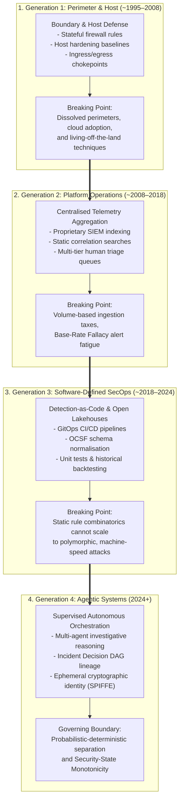
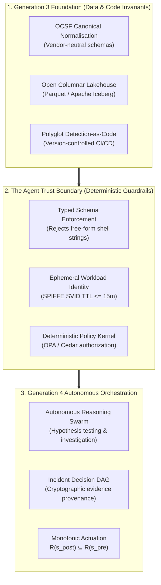

# The Four Generations of Security Engineering: From Perimeter Administration to Agentic Orchestration

> **Tier 1: Strategic Architecture** · **Audience**: Enterprise Security Architects, Principal Detection Engineers, Security Operations Leadership  
> **Normative Status**: Informational / Strategic Position Paper · **Next Step**: [Architectural Invariants & Constitution](/architecture/00-architectural-invariants)

---

## 🧭 Executive Summary & Core Thesis

The evolution of security operations is not a continuous, linear accumulation of incremental tooling. Over the past three decades, security engineering has passed through four distinct generational paradigms. Each generation altered the primary engineering abstraction, shifted the practitioner archetype, resolved one systemic bottleneck, and ultimately collided with a new operational boundary.

```
Generation 1 (Perimeter & Host)   ──► Abstraction: Network Boundary & Hardened Box
Generation 2 (Platform Operations) ──► Abstraction: Centralised Ingestion & Log Index
Generation 3 (Software-Defined)    ──► Abstraction: Detection-as-Code & Open Lakehouses
Generation 4 (Agentic Systems)     ──► Abstraction: Objectives, Invariants & Trust Boundaries
```

Many enterprise security transformation programmes stall or fail because of **generational mismatch**: attempting to resolve problems introduced in Generation $N$ using the mental models, architectural patterns, and tooling of Generation $N-1$ or $N-2$.

The Threat Intelligence, Detection, Investigation & Response (TIDIR) reference architecture is explicitly designed as the bridge between Generation 3 and Generation 4. It establishes the open data structures, declarative schemas, and deterministic safety invariants required to operate autonomous, agent-driven security workflows without compromising system integrity or operational stability.

---

## 1. The Generational Evolution Matrix

The table below contrasts the four generations across their technical and operational dimensions.

| Dimension | Generation 1: Perimeter & Host | Generation 2: Platform Operations | Generation 3: Software-Defined SecOps | Generation 4: Agentic Systems |
| :--- | :--- | :--- | :--- | :--- |
| **Approximate Era** | ~1995–2008 | ~2008–2018 | ~2018–2024 | 2024+ |
| **Practitioner Archetype** | Network / Systems Administrator | Security Information and Event Management (SIEM) Administrator / Security Operations Center (SOC) Analyst | Detection Engineer / Security Software Engineer (SecSRE) | Intent Architect / Agent Fleet Supervisor |
| **Primary Abstraction** | Network topology, ingress/egress chokepoints, hardened operating systems | Centralised log stream, index shards, correlation query | Version-controlled code, open schemas, automated deployment pipelines | Declarative objectives, state invariants, verifiable trust boundaries |
| **Core Artifacts** | Firewalls (Cisco PIX, Check Point), iptables, Network Intrusion Detection Systems (NIDS; Snort), bastion hosts | Commercial SIEM (Splunk, ArcSight, QRadar), early Endpoint Detection and Response (EDR), syslog relays | Detection-as-Code (DaC; Sigma, Panther), GitOps repositories, Open Cybersecurity Schema Framework (OCSF), columnar lakehouses (Apache Iceberg) | Multi-agent reasoning loops, Incident Decision Directed Acyclic Graphs (DAGs), Agent Trust Boundaries, SPIFFE Verifiable Identity Documents (SVIDs) |
| **Operational Bottleneck** | Physical boundary maintenance and port filtering | Ingestion licensing economics (the "logging tax") and human alert triage queues | Rule maintenance overhead and developer velocity against polymorphic attack patterns | Model trustworthiness, prompt injection defense, and probabilistic-deterministic boundary enforcement |
| **Failure Mechanism** | Dissolution of enterprise perimeters via cloud, remote work, and living-off-the-land techniques | Ingestion costs outgrew budgets; adversary breakout times dropped below human triage speed; alert fatigue | Static rules cannot keep pace with novel, machine-speed, multi-stage attack chains | Autonomous agents without strict boundary enforcement trigger uncoordinated or disruptive mutations |



---

## 2. Generation 1: Host & Perimeter Administration (~1995–2008)

### Foundational Thesis
Security is a direct function of network topology and host hardening. If the physical boundary is defended and untrusted ports are blocked, internal systems remain secure.

### The Engineering Reality
In the first generation, security was an operational sub-discipline of network and systems administration. Engineers managed physical cables, network routers, Demilitarized Zones (DMZs), and host configuration files.

Work focused on static rule authoring:
- Configuring packet filtering tables (`iptables`, Cisco PIX, Check Point Firewall-1).
- Hardening server templates against Center for Internet Security (CIS) benchmarks.
- Deploying signature-based network intrusion detection systems such as Snort.

Auditing relied on scheduled network scans (Nessus) and manual patch cycles.

### Breaking Point
The model collapsed when enterprise assets departed physical corporate facilities. The rise of cloud infrastructure, Software-as-a-Service (SaaS), mobile devices, and transport-layer encryption (TLS) dissolved the perimeter. Simultaneously, adversaries pivoted from noisy network-level exploits to living-off-the-land techniques, executing malicious actions through authorized applications and native system administrative tools.

---

## 3. Generation 2: Centralised Platform Operations (~2008–2018)

### Foundational Thesis
If an organisation aggregates and indexes all operational event logs into a centralised repository, security teams can detect adversary behavior via retrospective search and correlation queries.

### The Engineering Reality
Generation 2 introduced the dedicated Security Operations Center (SOC) and created the commercial SIEM industry. Security engineering transformed from managing network boundaries to managing large-scale data ingestion and storage platforms.

Practitioners focused on:
- Maintaining log forwarders, syslog collectors, and heavy indexing clusters (Splunk, ArcSight, QRadar).
- Building graphical dashboards and scheduled correlation searches across endpoint logs and authentication records.
- Organising operational personnel into tiered triage structures: Tier 1 (triage), Tier 2 (investigation), and Tier 3 (threat hunting and response).

Early Endpoint Detection and Response (EDR) tools emerged during this era, introducing kernel-level host visibility.

### Breaking Point
Generation 2 was defeated by data economics and human cognitive limits:
1. **The Logging Tax**: Commercial platforms charged by data volume (gigabytes ingested per day). High-volume forensic data (DNS records, NetFlow, process execution trees) became cost-prohibitive to ingest, forcing teams to discard valuable telemetry.
2. **The Base-Rate Fallacy**: Because malicious events are rare relative to legitimate enterprise transactions, even correlation rules with 99% accuracy generate overwhelming false-positive rates ([Axelsson 2000](https://doi.org/10.1145/357830.357849)).
3. **The Speed Gap**: While adversary breakout times collapsed to under 60 minutes, manual alert queues introduced hours or days of human triage latency.

---

## 4. Generation 3: Software-Defined SecOps & Detection-as-Code (~2018–2024)

### Foundational Thesis
Security operations is software engineering. Detection logic, telemetry pipelines, and infrastructure must be managed as version-controlled code, validated through continuous integration, and decoupled from proprietary storage backends.

### The Engineering Reality
Generation 3 broke the proprietary data monopoly. It adopted modern Site Reliability Engineering (SRE) and DevOps workflows, introducing Detection-as-Code (DaC):
- Detections written as structured code (YAML metadata envelopes paired with SQL, KQL, or Python query blocks; see [ADR-0019](/adr/0019-polyglot-detection-as-code-and-native-engine-adaptation)).
- Pull-request workflows enforcing peer review, automated syntax validation, and synthetic unit testing before production deployment.
- Storage decoupled from compute through cloud-native columnar lakehouses (Apache Iceberg, Parquet, ClickHouse, Snowflake, DuckDB) using open schemas such as the Open Cybersecurity Schema Framework (OCSF).
- Automated CI/CD pipelines calculating false-positive baselines against 30-day historical data partitions to enforce alert noise budgets ([ADR-0008](/adr/0008-secops-error-budgets-and-chaos-security-engineering)).

### Breaking Point
While Generation 3 resolved the ingestion cost crisis and modernized engineering hygiene, it exposed an intrinsic scalability limit: **human rule authoring is too slow for polymorphic attacks**. 

Security teams accumulated thousands of discrete DaC rules, creating massive maintenance burdens. Adversaries operating automated vulnerability scanners and Large Language Model (LLM)-assisted exploit tools generate novel variations faster than human engineers can draft, test, and merge new code.

---

## 5. Generation 4: Agentic Systems & Intent Architecture (2024+)

### Foundational Thesis
Human engineers cannot out-pace machine-speed threats by manually authoring static rules or reviewing alert queues. Engineers must define declarative intents, operational constraints, and mathematical invariants, while supervising autonomous agent systems that conduct investigation, hypothesis validation, and bounded response.

### The Engineering Reality
In Generation 4, the engineer shifts from a direct rule writer to an **Intent Architect and Fleet Supervisor**:
- **From Rules to Objectives**: The engineer defines the target outcome (for example: *"Verify whether credential use on cluster A represents session hijacking; correlate against VPC flow anomalies; produce an Incident Decision DAG"*), rather than hand-crafting a fragile regex rule.
- **Multi-Agent Investigative Systems**: Autonomous agent fleets coordinate across specialized tasks (telemetry retrieval, entity resolution, threat intelligence attribution, forensic hypothesis testing).
- **Cryptographic Decision Traceability**: Every analytical inference links to immutable raw telemetry, recorded in an append-only Incident Decision Directed Acyclic Graph (DAG; see [ADR-0006](/adr/0006-cryptographic-audit-lineage-and-decision-provenance)).
- **Monotonic Actuation**: Autonomous containment actions are bounded by deterministic safety kernels that enforce Security-State Monotonicity ($\mathcal{R}(s_{\text{post}}) \subseteq \mathcal{R}(s_{\text{pre}})$), ensuring automated responses never expand attacker reachability.

### The Core Frontier: The Trust Boundary
The central challenge of Generation 4 is cognitive trust and safety. Generative models and neural reasoning systems are probabilistic; they cannot be granted unconstrained API execution authority.

Generation 4 systems require an architectural separation:
```
┌─────────────────────────────────────────────────────────────────────────────────┐
│                           THE TIDIR OPERATING MAXIM                             │
│                                                                                 │
│         "Probabilistic components propose. Deterministic components authorise." │
└─────────────────────────────────────────────────────────────────────────────────┘
```

Probabilistic reasoning models propose actions within typed parameter schemas. Deterministic policy engines, short-lived SPIFFE SVIDs, and formal state machines evaluate, authorise, and execute changes in the real world.

---

## 6. The Generational Mismatch Law

Security architecture failures are rarely caused by insufficient tooling budgets. They are caused by **generational mismatch**:

$$\text{Failure Mode} = f(\text{Problem}_{\text{Gen } N}, \text{Tooling}_{\text{Gen } N-k}) \quad \text{where } k \ge 1$$

When an organization applies tooling or practices from an earlier generation to a subsequent operational domain, the mismatch generates severe systemic failure modes:

### Anti-Pattern 1: The Virtual Appliance Trap (Gen 1 Applied to Gen 3)
Attempting to secure elastic cloud workloads, Kubernetes clusters, and ephemeral serverless functions by routing traffic through centralized virtual firewall appliances. This recreates physical network bottlenecks, destroys cloud autoscaling, and blindfolds defenders to internal API traffic.

### Anti-Pattern 2: The Ingestion Tax Trap (Gen 2 Applied to Gen 3)
Attempting to monitor modern microservices and high-throughput cloud infrastructure by forwarding raw text logs into proprietary SIEM platforms. The organization faces crippling volume licensing fees, prompting management to filter out vital security logs to cut costs.

### Anti-Pattern 3: The Unbounded Agent Trap (Gen 4 Attempted Without Gen 3)
Attempting to deploy autonomous AI agents on top of legacy Generation 2 SIEM consoles or raw ticketing systems without open data normalization, structured schemas (OCSF), or deterministic policy boundaries. 

When probabilistic LLM agents are given unconstrained API access to enterprise infrastructure:
- Untrusted telemetry containing prompt injection strings can subvert the agent's reasoning.
- Probabilistic hallucinations cause self-inflicted business outages through incorrect containment commands.
- The absence of cryptographic decision DAGs makes post-incident forensic audits impossible.

---

## 7. How TIDIR Realises Generation 4 Safely

TIDIR provides the formal reference architecture that unites Generation 3 engineering rigor with Generation 4 autonomous capability.



TIDIR achieves this through its governing architectural principles:

1. **Foundational Decoupling (Gen 3 Base)**: Data collection and storage remain open and decoupled from proprietary analytics ([Invariant 1: Telemetry Preservation](/architecture/00-architectural-invariants#i1-telemetry-preservation-and-anti-lock-in-invariant)).
2. **Epistemic Traceability**: Every autonomous finding traces its lineage to immutable, raw observations ([Invariant 2: Evidence Traceability](/architecture/00-architectural-invariants#i2-evidence-traceability-and-chain-of-custody-invariant)).
3. **No Self-Granting Authority**: Machine learning models and autonomous agents operate strictly within the Agent Trust Boundary; deterministic components authorise all state changes ([Invariant 4: No Self-Granting Authority](/architecture/00-architectural-invariants#i4-no-self-granting-authority-invariant)).
4. **Least Capability & Ephemeral Identity**: Agents run with task-scoped, short-lived cryptographic identities ([Invariant 5: Least Capability](/architecture/00-architectural-invariants#i5-least-capability-and-ephemeral-authority-invariant)).
5. **Fail-Secure & Monotonic Response**: Autonomous response systems can never expand the attacker's reachability surface during partial network or API failures ([Invariant 7: Fail-Secure Posture](/architecture/00-architectural-invariants#i7-fail-secure-and-monotonic-containment-invariant)).

By establishing these invariants, TIDIR allows enterprise security teams to move confidently into Generation 4, moving beyond static rules without sacrificing predictability, auditability, or operational control.

---

## 8. Summary of Document Lineage & Next Steps

This strategic position paper forms the theoretical and historical foundation for the TIDIR architecture:

* ➡️ **Constitutional Foundations**: Review the [Architectural Invariants & Constitution](/architecture/00-architectural-invariants) to inspect the 11 non-negotiable engineering rules governing Generation 4 systems.
* ➡️ **System Topology**: Examine the [System Overview & The 4-Plane Model](/architecture/01-system-overview) to see how streaming buses, lakehouses, and agent runtimes connect.
* ➡️ **Migration Strategy**: Consult the [Enterprise Adoption Roadmap](/guide/adoption-roadmap) to see how brownfield estates transition incrementally from Generation 2 to Generation 4.
