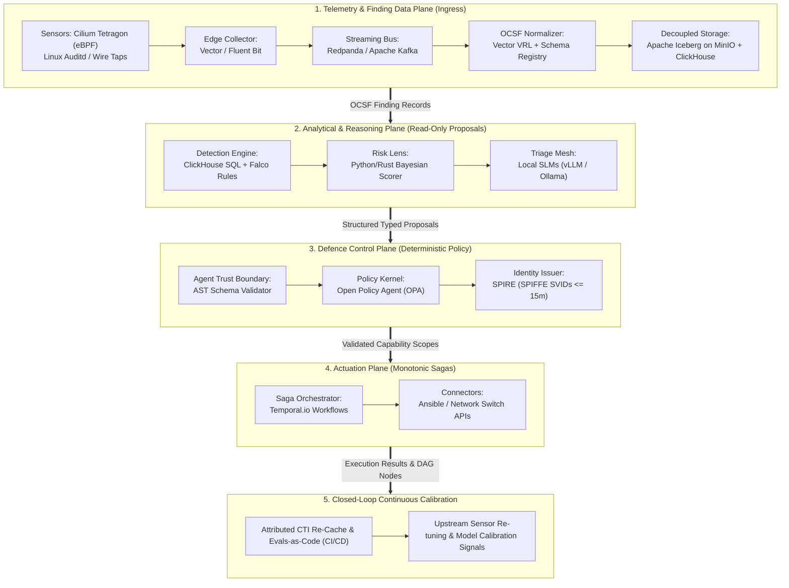
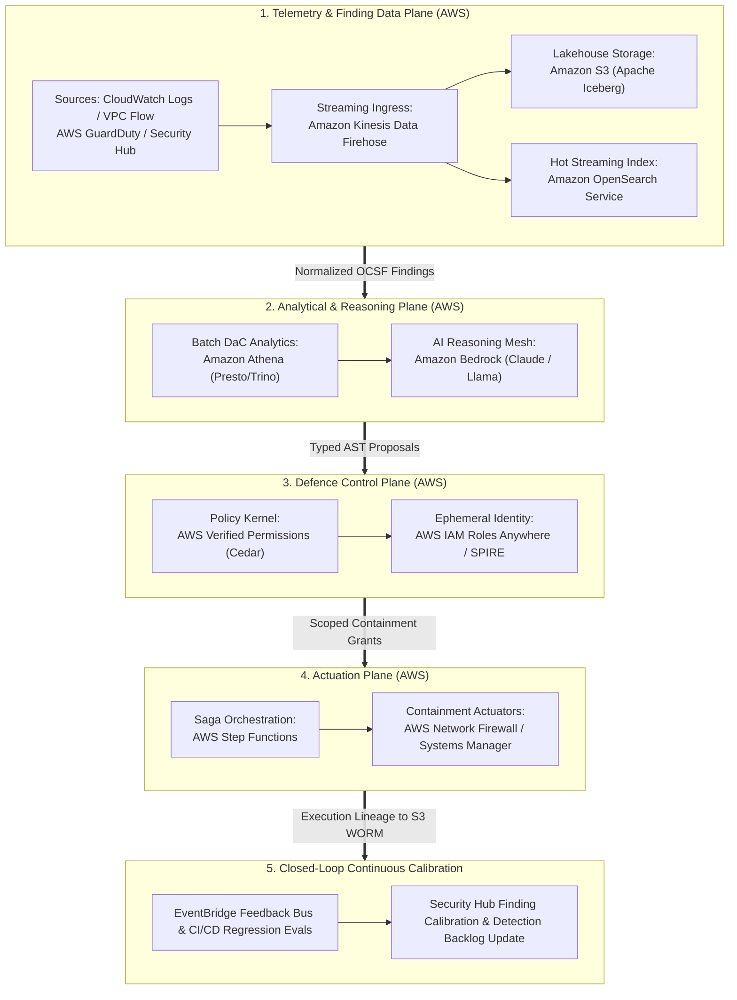
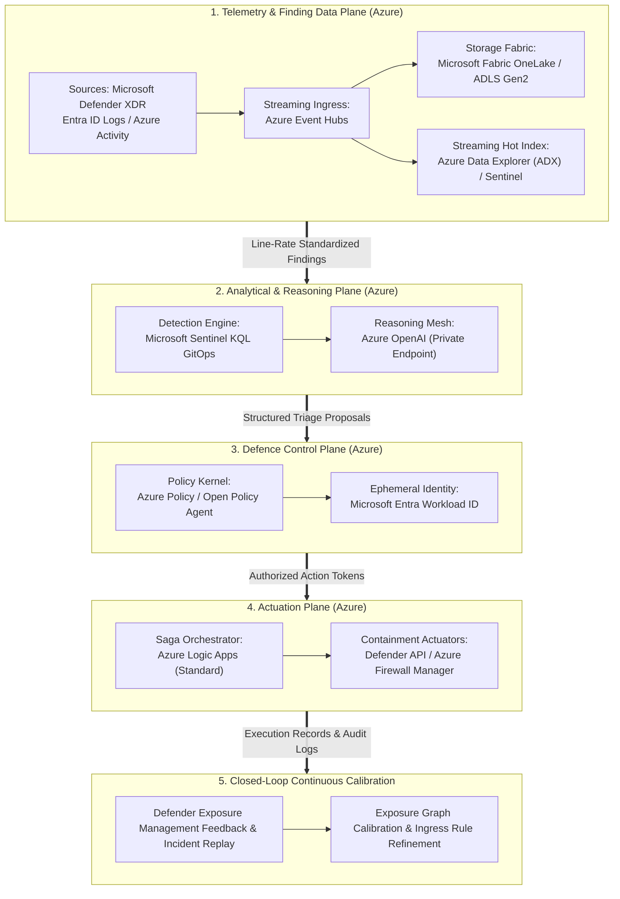

# Concrete Reference Technology Stacks & Blueprints

> **Tier 3: Technical Specifications** · **Audience**: Principal Engineers, DevOps/SecOps Architects, Platform Engineers · **Normative Status**: Informational / Illustrative Reference  
> **Prerequisites**: [System Overview & The 4-Plane Model](/architecture/01-system-overview) · [The Architectural Constitution](/architecture/00-architectural-invariants)

---

## 1. Bridging Normative Architecture to Production Engineering

TIDIR's core specifications are intentionally vendor-neutral. They define declarative schemas (OCSF, STIX 2.1), formal state-machine bounds ($s_{n+1} \preceq s_n$), and mathematical invariants using RFC 2119 keywords (`MUST`, `SHOULD`, `MAY`).

However, practicing engineers must build with concrete technologies. This document provides three reference technology blueprints mapping the **4-Plane Model** to proven production platforms:
1. **The CNCF / Open-Source Reference Stack**: Built entirely on cloud-native, open-source infrastructure.
2. **The AWS Cloud-Native Reference Stack**: Built on managed Amazon Web Services primitives.
3. **The Microsoft / Azure Hybrid Reference Stack**: Built on Microsoft 365, Azure, and Fabric infrastructure.

---

## 2. The CNCF / Open-Source Reference Stack

The open-source stack delivers strict on-premises data boundary enforcement via sovereign clusters, zero proprietary licensing fees, and full compliance with Invariant 11 (Operational Portability).

### Component Mapping: CNCF / Open-Source Stack

| TIDIR Architectural Layer | Logical Role | Open-Source / CNCF Reference Technology | Operational Rationale |
| :--- | :--- | :--- | :--- |
| **Layer 1: Ingress** | Kernel & Host Instrumentation | **Cilium Tetragon / Falco** | High-performance eBPF kernel event filtering with minimal CPU overhead. |
| **Layer 1: Edge Forwarding** | Buffer & Stream Routing | **Vector (Datadog open-source)** | Memory-safe Rust forwarder capable of high-throughput parsing and VRL transforms. |
| **Layer 2: Streaming Bus** | Distributed Event Log | **Redpanda / Apache Kafka** | Low-latency, partition-scalable streaming with Raft consensus. |
| **Layer 2: Lakehouse** | Decoupled Columnar Storage | **Apache Iceberg on MinIO/Ceph** | Open table format supporting partition evolution, time-travel, and zero-copy queries. |
| **Layer 2: Hot Index** | Fast Aggregation & Streaming Queries | **ClickHouse** | Sub-second analytical queries across billions of security events; vectorized execution. |
| **Layer 3: Detection Engine** | Polyglot DaC Execution | **Polyglot DaC (ClickHouse SQL + Falco)** | Versioned in Git; native target optimization without translation performance penalty. |
| **Layer 3: Risk Scoring** | Multi-Signal Evidence Compounding | **Rust / Python Microservice** | Implements the Bayesian Multi-Signal Risk Lens ([ADR-0009](/adr/0009-bayesian-multi-signal-risk-scoring)). |
| **Layer 4: Analytical Mesh** | Advisory Investigation Agents | **Local SLMs (Qwen/Llama) via vLLM** | Self-hosted inference eliminating cloud data leakage, running strictly read-only. |
| **Layer 4: Defence Control Plane** | Policy Enforcement & Authorization | **Open Policy Agent (OPA) / Gatekeeper** | Declarative Rego policies validating blast-radius limits and Tier 0 immunity. |
| **Layer 4: Workload Identity** | Machine Attestation & SVIDs | **SPIFFE / SPIRE** | Cryptographic task-scoped X.509 certificates with TTL $\le 15\text{m}$. |
| **Layer 4: Actuation Plane** | Fail-Secure Containment | **Temporal.io** | Distributed state machine enforcing monotonic saga execution and forward escalation. |

---

## 3. The AWS Cloud-Native Reference Stack

The AWS stack maximizes managed service scalability, native security finding aggregation, and serverless compute efficiency.

### Component Mapping: AWS Cloud-Native Stack

| TIDIR Architectural Layer | Logical Role | AWS Cloud-Native Technology | Operational Rationale |
| :--- | :--- | :--- | :--- |
| **Layer 1: Ingress** | Native Security Finding Federation | **AWS Security Hub / GuardDuty** | Normalizes AWS-native findings directly into OCSF Class 2001/2004 structures. |
| **Layer 1: Ingestion Stream** | Line-Rate Telemetry Ingress | **Amazon Kinesis Data Firehose** | Serverless streaming with dynamic partitioning directly into columnar formats. |
| **Layer 2: Lakehouse** | Decoupled Columnar Object Storage | **Amazon S3 (Apache Iceberg tables)** | High-durability object storage with S3 Object Lock for WORM compliance (INV-01). |
| **Layer 2: Hot Index** | Real-Time Triage & Full-Text Search | **Amazon OpenSearch Service** | Low-latency querying for active 14-day alert investigations and tabular dashboards. |
| **Layer 3: Detection Engine** | Scheduled Lakehouse Batch DaC | **Amazon Athena (Presto/Trino)** | Partition-pruned SQL sweeps executing historical anomaly detection across Iceberg tables. |
| **Layer 4: Analytical Mesh** | Advisory Triage Agents | **Amazon Bedrock (Claude / Llama 3)** | Enterprise VPC-isolated inference endpoints operating behind the Agent Trust Boundary. |
| **Layer 4: Control Plane** | Policy Kernel & Blast-Radius Gate | **AWS Verified Permissions (Cedar)** | Millisecond-latency authorization assertions evaluating Tier 0 asset immunity. |
| **Layer 4: Ephemeral Identity** | Workload Attestation | **AWS IAM Roles Anywhere / SPIRE** | Issues temporary session credentials constrained to task boundaries. |
| **Layer 4: Actuation Plane** | Fail-Secure Monotonic Containment | **AWS Step Functions** | Declarative state machine orchestration guaranteeing forward escalation upon step failure. |

---

## 4. The Microsoft / Azure Hybrid Reference Stack

The Microsoft / Azure stack aligns with enterprise Microsoft 365, Entra ID, and Azure Data Explorer deployments.

### Component Mapping: Microsoft / Azure Hybrid Stack

| TIDIR Architectural Layer | Logical Role | Microsoft / Azure Reference Technology | Operational Rationale |
| :--- | :--- | :--- | :--- |
| **Layer 1: Ingress** | Domain Security Findings | **Microsoft Defender XDR** | Emits high-fidelity native endpoint, identity, and cloud findings into Event Hubs. |
| **Layer 1: Ingestion Stream** | Enterprise Event Bus | **Azure Event Hubs (Kafka protocol)** | High-throughput streaming bus with native geo-redundancy. |
| **Layer 2: Lakehouse** | Decoupled Enterprise Lakehouse | **Azure Data Lake Storage Gen2 (ADLS)** | Scalable object storage structured via Delta Lake / Apache Iceberg formats. |
| **Layer 2: Hot Index** | Real-Time Log & Anomaly Engine | **Azure Data Explorer (ADX) / Sentinel** | Extremely fast KQL execution across billions of events with native hot caching. |
| **Layer 3: Detection Engine** | Detection-as-Code via GitOps | **Sentinel KQL Repositories (GitHub/Azure DevOps)** | Polyglot DaC rules authored in KQL, validated in automated PR workflows. |
| **Layer 4: Analytical Mesh** | Advisory Investigation Assistants | **Azure OpenAI Service (GPT-4o)** | Private Link enterprise model deployment with zero data retention for training. |
| **Layer 4: Control Plane** | Policy Kernel & Governance | **Azure Policy / OPA on AKS** | Deterministic authorization blocking disruptive actions on mission-critical resource groups. |
| **Layer 4: Ephemeral Identity** | Workload Identity Attestation | **Microsoft Entra Workload ID / SPIRE** | Federated token issuance without static client secrets. |
| **Layer 4: Actuation Plane** | Monotonic Containment Workflows | **Azure Logic Apps (Standard)** | Orchestrates containment steps with mandatory approval cards and forward compensation. |

---

## 5. Architectural Invariant Compliance Across Reference Stacks

Regardless of the technology stack selected, every production implementation MUST enforce the 11 constitutional invariants:

1. **Telemetry Preservation (`INV-01`)**: All three stacks store raw telemetry in open columnar formats (Parquet/Iceberg) with `unmapped_data` preserved, preventing vendor lock-in.
2. **Authority Separation (`INV-04`)**: In every stack, AI inference engines (vLLM, Bedrock, Azure OpenAI) operate in a read-only capacity behind the Agent Trust Boundary without direct mutation keys.
3. **Reachability Monotonicity (`INV-07`)**: All three orchestration engines (Temporal, Step Functions, Logic Apps) execute containment as forward-compensating state machines where partial errors escalate outwards rather than rolling back security barriers.
4. **Human Recoverability (`INV-09`)**: All three implementations retain independent, out-of-band manual flight decks and cryptographic master Emergency Stops (E-Stops).
