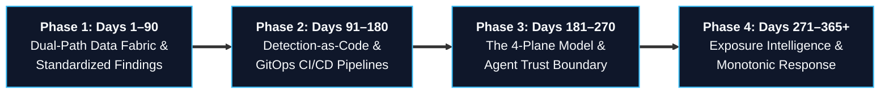

# Enterprise Adoption Roadmap & Maturity Model

> **Tier 1: Strategic Architecture** · **Audience**: CISOs, Security Directors, Principal Architects · **Normative Status**: Informational / Advisory  
> **Prerequisites**: [What is TIDIR?](/guide/what-is-tidir) · [System Overview & The 4-Plane Model](/architecture/01-system-overview) · **Next Step**: [Concrete Reference Stacks](/architecture/reference-stacks)

---

## 1. The Migration Challenge: Greenfield Architecture vs. Brownfield Reality

Security leadership rarely enjoys the luxury of building from a clean slate. Real-world enterprise environments operate with existing investments: legacy Security Information and Event Management (SIEM) platforms, specialized Endpoint Detection and Response (EDR) agents, disparate cloud security consoles, and established ticketing workflows.

Attempting a "rip-and-replace" migration creates severe operational hazards:
1. **Visibility Gaps**: Tearing down legacy pipelines before replacements reach parity leaves blind spots during adversary breakout windows.
2. **Operational Disruption**: Forcing tier-1 and tier-2 triage analysts to adopt unproven tooling overnight destroys muscle memory and spikes Mean Time to Detect (MTTD).
3. **Budgetary Gridlock**: Demanding massive capital expenditure to replace working contracts invites executive pushback.

TIDIR addresses this through **Incremental Architectural Convergence**. Organizations do not swap tools; they decouple the layers of their architecture in four sequential, risk-mitigated phases:



---

## 2. The 4-Phase Migration Roadmap

### Phase 1: Dual-Path Data Fabric & Finding Ingestion (Days 1–90)

**Core Objective**: Stop the growth of volume-based SIEM licensing costs without disrupting active SOC monitoring.

1. **Tap raw telemetry streams with edge forwarders**: Deploy lightweight forwarders (Vector, Fluent Bit) alongside existing collection agents. Divert high-volume forensic logs (DNS queries, VPC flows, and process starts) directly into columnar object storage (Apache Iceberg / Parquet on S3, ADLS Gen2, or MinIO).
2. **Federate native domain findings ([ADR-0023](/adr/0023-distributed-detection-and-edge-to-center-correlation))**: Configure existing EDR, NDR, and cloud posture tools to emit normalized Open Cybersecurity Schema Framework (OCSF) Class 2001 (Security Finding) and Class 2004 (Detection Finding) records to the central streaming bus.
3. **Keep legacy systems running**: Continue routing compliance logs and high-fidelity alerts to the existing SIEM. Do not decommission dashboards or alert queues during this phase.

```
Legacy Pipeline:     Raw High-Volume Events ──────────────────────────► Legacy SIEM (Volume Tax)
                                                                            │
TIDIR Transition:   Raw High-Volume Events ──► Edge Forwarder ───────► Parquet Lakehouse (Low Cost)
                                                     │
                                                     └──► OCSF Findings ──► Central Ingress
```

### Phase 2: Polyglot Detection-as-Code & GitOps CI/CD (Days 91–180)

**Core Objective**: Shift detection logic out of proprietary SIEM consoles into version-controlled, testable software artifacts.

1. **Establish the GitOps detection repository ([ADR-0019](/adr/0019-polyglot-detection-as-code-and-native-engine-adaptation))**: Codify every detection rule as a declarative YAML metadata envelope paired with target-optimized query blocks (ClickHouse SQL, Snowflake SQL, KQL, or Sigma).
2. **Add automated CI validation**: Run pull-request checks that validate schema syntax and execute synthetic attack scenarios against candidate rules before merging.
3. **Backtest against 30-day historical data**: Query candidate rules against lakehouse partitions to measure false-positive rates and enforce alert noise budgets ([ADR-0008](/adr/0008-secops-error-budgets-and-chaos-security-engineering)). Block rules that exceed noise thresholds.
4. **Declare inverted telemetry dependencies ([ADR-0019](/adr/0019-polyglot-detection-as-code-and-native-engine-adaptation))**: Enrich DaC rules with explicit required vs optional telemetry requirements, enabling automated alerting and graceful confidence discounting when upstream collection pipelines degrade.

### Phase 3: The 4-Plane Model & Agent Trust Boundary (Days 181–270)

**Core Objective**: Introduce AI-assisted triage and correlation safely without granting unchecked execution authority to models.

1. **Stand up read-only analytical models ([ADR-0004](/adr/0004-defensive-ai-runtime-and-prompt-injection-firewall))**: Deploy Large Language Models (LLMs) and Small Language Models (SLMs) dedicated to entity-finding graph correlation ([ADR-0011](/adr/0011-bipartite-entity-finding-graph-consolidation)) and investigative dossier compilation.
2. **Enforce the Agent Trust Boundary**: Restrict reasoning models to read-only analytical tasks. Treat all ingested logs, prompts, and attacker payloads as untrusted data. Require models to submit structured Abstract Syntax Tree (AST) proposals to independent policy engines rather than executing commands directly.
3. **Issue ephemeral workload identities ([ADR-0018](/adr/0018-non-human-identity-lifecycle-and-machine-attestation))**: Provision machine actors and background workers with short-lived SPIFFE Verifiable Identity Documents (SVIDs) with a maximum lifetime of 15 minutes ($\le 15\text{m}$).

### Phase 4: Closed-Loop Control & Monotonic Response (Days 271–365+)

**Core Objective**: Close the defensive loop by uniting Continuous Threat Exposure Management (CTEM) with fail-secure automated containment.

1. **Feed exposure context into detection priors ([ADR-0022](/adr/0022-exposure-management-and-continuous-threat-exposure-integration))**: Connect attack surface reachability, vulnerability exploitability (CISA KEV, EPSS), and identity choke points to the Bayesian Multi-Signal Risk Lens ([ADR-0009](/adr/0009-bayesian-multi-signal-risk-scoring)) as dynamic prior probabilities $P(\text{Breach})$.
2. **Execute playbooks as monotonic sagas ([ADR-0005](/adr/0005-saga-pattern-containment-and-break-glass-protocol))**: Structure response automation so partial failures escalate outward or freeze perimeters rather than rolling back defenses ($\hat{\mathcal{R}}_A(s_{\text{post}}) \subseteq \hat{\mathcal{R}}_A(s_{\text{pre}})$).
3. **Shield critical infrastructure and install the E-Stop**: Permanently protect Tier 0 infrastructure (domain controllers, core transaction switches) from automated destructive actions. Maintain an independent, cryptographically signed Emergency Stop (E-Stop) for human commanders.
4. **Decouple response intents from vendor APIs ([Component: Response Automation](/architecture/components/05-response-automation))**: Standardize automation on declarative Action Intents (`ISOLATE_HOST`, `REVOKE_SESSION`, `BLOCK_INDICATOR`), using adapters to execute across Defender, CrowdStrike, Entra, or firewalls, preserving evidence lineage across vendor migrations.

---

## 3. The TIDIR 5-Level Maturity Matrix

To assess progress, organizations evaluate their security operations across five operational tiers:

| Maturity Level | Telemetry & Data Fabric | Detection Engineering | Investigation & Triage | Response & Automation | Governance & Assurance |
| :--- | :--- | :--- | :--- | :--- | :--- |
| **Level 1: Ad-Hoc (Legacy)** | Siloed proprietary logs; volume-filtered at collection boundary; high SIEM ingest bills. | Static console-built rules; zero CI/CD testing; frequent false-positive storms. | Manual analyst swivel-chair across multiple vendor consoles; disconnected timelines. | Manual script execution or brittle linear SOAR playbooks that fail ungracefully. | Unversioned change logs; manual audit compliance; zero mathematical invariants. |
| **Level 2: Standardized** | Central syslog aggregation; basic schema parsing; retention constrained by license limits. | Detection rules tracked in Git; basic syntax linting; manual staging deployment. | Consolidated alert aggregation; basic entity tagging (IP, username, hostname). | Parameterized scripts; semi-automated ticketing dispatch; manual analyst approval. | Periodic compliance reviews; basic role-based access control (RBAC). |
| **Level 3: Decoupled & Tested** | Dual-tier storage: hot streaming index alongside open Parquet/Iceberg lakehouse partitions. | Polyglot DaC; automated CI unit tests; historical lakehouse backtesting against 30-day baselines. | Automated entity resolution; bipartite graph clustering; JIT telemetry elevation on demand. | Guardrailed playbooks with blast-radius ceilings; manual break-glass workflows. | Traceable observation IDs; automated eval harnesses against golden benchmarks. |
| **Level 4: Governed & Monotonic** | Line-rate OCSF normalization with `unmapped_data` catch-all; federated query pushdown. | Bayesian multi-signal risk compounding; SRE alert noise budgets with automated deployment freezes. | 4-Plane Model; Agent Trust Boundary separating reasoning from execution; read-only SVIDs. | Monotonic containment state machines ($s_{n+1} \preceq s_n$); Tier 0 critical asset immunity. | Immutable Incident Decision DAG; cryptographic RFC 3161 timestamps; master E-stop. |
| **Level 5: Closed-Loop Autonomous** | Self-healing edge buffers; dynamic sensor tuning; cross-cloud distributed finding federation. | Adversary technique prevalence weighting; automated purple teaming with multi-model consensus. | Multi-agent hierarchical investigation mesh; progressive disclosure analyst workbench. | Adaptive risk-tiered autonomous actuation; automated green-team IaC pull requests. | Full operational portability; zero vendor lock-in; automated continuous eval regressions. |

---

## 4. Key Transition Pitfalls & Antipatterns

1. **The "Big Bang" Cutover**: Attempting to switch analysts from legacy consoles to a new architecture in a single release creates operational paralysis. Always run Phase 1 and Phase 2 in parallel with legacy tools until the lakehouse and DaC pipelines achieve measurable fidelity superiority.
2. **Premature Containment Automation**: Enabling autonomous host isolation before establishing the Agent Trust Boundary and Tier 0 Critical Asset Immunity inevitably triggers self-inflicted business outages. Keep automated responses in advisory mode until Phase 4.
3. **Dropping Raw Telemetry for Cost Savings**: Discarding raw logs because "our EDR handles detection" destroys retrospective investigative capability (violating Invariant 1). Retain raw data cheaply in columnar lakehouse storage rather than dropping it at the sensor.
