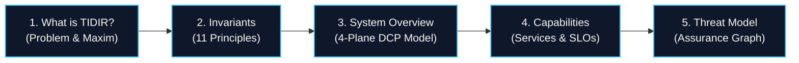

# The TIDIR Golden Path: 15-Minute Architectural Orientation

> **Tier 1: Strategic Architecture** · **Audience**: All Audiences · **Normative Status**: Informational / Guided Journey  
> **Purpose**: Provides a structured 5-step sequence to understand TIDIR from first principles to concrete threat assurance.

---

## How to Read TIDIR

TIDIR is designed to be understood at multiple depths:
* **The 60-Second View**: Available on the [Homepage](/) (Problem ➔ Operating Maxim ➔ Architecture-at-a-Glance ➔ 3 Tiers).
* **The 15-Minute Orientation (This Guide)**: A curated 5-step walkthrough establishing core architectural doctrine and system topology.
* **Role-Based Pathways**: Curated reading priorities for CISOs, Detection Engineers, Responders, and Architects in [Persona-Driven Journeys](/guide/persona-journeys).
* **Pragmatic Implementation**: A 4-phase brownfield migration strategy in the [Enterprise Adoption Roadmap](/guide/adoption-roadmap).
* **The Deep Reference & Interrogation**: Direct exploration of the [11 Invariants](/architecture/00-architectural-invariants), [4-Plane System Model](/architecture/01-system-overview), [Capability Model](/architecture/02-capability-model), [Foundational Research & Literature](/architecture/foundational-research), [Assurance Map](/architecture/assurance-map), and [23 ADRs](/adr/).

---

## The 5-Step Golden Path

### [Step 1: What is TIDIR?](/guide/what-is-tidir)
* **Core Takeaway**: SecOps is an asymmetric closed-loop control system. Probabilistic models propose; deterministic policy kernels authorize. Grounded in [Foundational Research](/architecture/foundational-research).
* **Reading Time**: 3 minutes.

### [Step 2: The Architectural Constitution & 11 Invariants](/architecture/00-architectural-invariants)
* **Core Takeaway**: Tenets of evidence preservation, evidential independence, least capability, and security-state monotonicity ($s_{n+1} \preceq s_n$).
* **Reading Time**: 4 minutes.

### [Step 3: System Overview & The 4-Plane Model](/architecture/01-system-overview)
* **Core Takeaway**: Clear operational separation between the Telemetry Data Plane, Analytical Plane, Defence Control Plane (DCP), and Actuation Plane. Minimises the Trusted Computing Base (TCB).
* **Reading Time**: 4 minutes.

### [Step 4: Capability & Enterprise Service Model](/architecture/02-capability-model)
* **Core Takeaway**: 41 atomic capabilities across 5 operational domains and 2 cross-cutting disciplines, backed by Reference Target SLOs.
* **Reading Time**: 3 minutes.

### [Step 5: Target Threat Model & Assurance Case](/architecture/09-threat-model)
* **Core Takeaway**: Threat modelling TIDIR itself (T1–T9) and tracing threats to invariants, capabilities, and prescribed validation criteria via the Assurance Case Map.
* **Reading Time**: 3 minutes.

---

## Begin the Tour

Start your journey with **[Step 1: What is TIDIR?](/guide/what-is-tidir)**.
