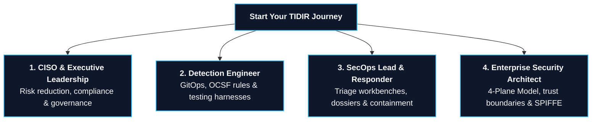

# Role-Based Reader Journeys & Persona Pathways

> **Tier 1: Strategic Architecture** · **Audience**: All Audiences · **Normative Status**: Informational / Navigation Guide  
> **Prerequisites**: [What is TIDIR?](/guide/what-is-tidir) · [15-Minute Golden Path](/guide/golden-path)

---

## 1. Navigating TIDIR by Organizational Role

TIDIR is an open target architecture spanning data pipelines, probability theory, software engineering, and operational governance. Because different security professionals approach the framework with distinct responsibilities and constraints, this guide maps targeted reading journeys for four primary roles:

---

## 2. The Four Persona Pathways

### 1. CISO & Security Executive Pathway

**Your Core Challenges**: Managing enterprise cyber risk, preventing catastrophic business outages caused by runaway automation, proving regulatory compliance to external auditors, and eliminating unsustainable vendor lock-in.

* **Key Architectural Answers in TIDIR**:
  * *How does TIDIR prevent automated outages?* **Invariant 6 (Bounded Autonomy)** and **Invariant 7 (Security-State Monotonicity)** guarantee that critical infrastructure is exempt from destructive isolation and that partial failures never regress security posture.
  * *How do we prove our defenses to regulators?* **Invariant 10 (Reconstructability)** requires that every consequential decision is recorded in an immutable, cryptographically sealed **Incident Decision DAG**.
  * *How do we prevent vendor lock-in?* **Invariant 11 (Operational Portability)** mandates vendor-neutral representations (OCSF, Apache Iceberg, Polyglot DaC, STIX 2.1).

* **Curated Reading Order (Total Time: ~20 minutes)**:
  1. [What is TIDIR?](/guide/what-is-tidir) (Understand the core operating maxim: *"Probabilistic components propose; deterministic components authorise"*)
  2. [The Architectural Constitution & 11 Invariants](/architecture/00-architectural-invariants) (Review the mandatory non-negotiable guarantees)
  3. [ADR-0010: SABSA Alignment & Attribute Profiling](/adr/0010-sabsa-business-architecture-and-attribute-profiling) (Translate technical SLOs into business risk language)
  4. [Enterprise Adoption Roadmap](/guide/adoption-roadmap) (Assess the 4-phase brownfield migration strategy)
  5. [Target Threat Model & Assurance Case Map](/architecture/09-threat-model) (Review the formal threat taxonomy and verification criteria)

---

### 2. Detection Engineer Pathway

**Your Core Challenges**: Eliminating alert fatigue caused by the Base-Rate Fallacy, testing detection rules before production deployment, escaping proprietary SIEM query languages, and correlating weak signals across disparate telemetry streams.

* **Key Architectural Answers in TIDIR**:
  * *How do we test rules without deploying to production?* **Detection-as-Code (DaC)** pairs vendor-neutral YAML metadata envelopes with target-optimized queries tested via automated CI/CD pipelines and 30-day historical lakehouse backtesting ([ADR-0019](/adr/0019-polyglot-detection-as-code-and-native-engine-adaptation)).
  * *How do we prevent upstream pipeline changes from silently breaking detections?* **Inverted Telemetry Dependencies** ([ADR-0019](/adr/0019-polyglot-detection-as-code-and-native-engine-adaptation)) allow rules to declare required vs optional signals, automatically flagging operational status as `DEGRADED` when pipeline feeds stall.
  * *How do we stop alert fatigue?* **SRE Alert Noise Budgets** ([ADR-0008](/adr/0008-secops-error-budgets-and-chaos-security-engineering)) enforce strict False Positive Rate (FPR) ceilings, automatically freezing deployments when a detection class burns its error budget.
  * *How do we correlate without streaming every raw log centrally?* **Distributed Detection & Finding Federation** ([ADR-0023](/adr/0023-distributed-detection-and-edge-to-center-correlation)) offloads commodity detections to edge domain controls while the central core executes cross-domain graph correlation.

* **Curated Reading Order (Total Time: ~25 minutes)**:
  1. [ADR-0019: Polyglot Detection-as-Code & Native Engine Adaptation](/adr/0019-polyglot-detection-as-code-and-native-engine-adaptation)
  2. [ADR-0023: Distributed Detection & Edge Correlation](/adr/0023-distributed-detection-and-edge-to-center-correlation)
  3. [ADR-0008: SecOps Error Budgets & Chaos Security Engineering](/adr/0008-secops-error-budgets-and-chaos-security-engineering)
  4. [ADR-0009: Bayesian Multi-Signal Risk Scoring](/adr/0009-bayesian-multi-signal-risk-scoring)
  5. [ADR-0011: Bipartite Entity-Finding Graph Consolidation](/adr/0011-bipartite-entity-finding-graph-consolidation)
  6. [Layer 3: Intel & Detection Engineering Specification](/architecture/06-layer-3-threat-intel-detection)

---

### 3. SecOps Lead & Incident Responder Pathway

**Your Core Challenges**: Triage overload, cognitive fragmentation across multiple consoles, understanding the root cause of automated actions, and ensuring manual break-glass controls remain accessible during crises.

* **Key Architectural Answers in TIDIR**:
  * *How do analysts avoid cognitive fatigue?* The **Progressive Disclosure Analyst Workbench** ([INV-06](/architecture/02-capability-model)) presents findings in a structured 3-tier hierarchy: Situation Report ➔ Evidence Summary ➔ On-Demand Graph Lineage.
  * *How do automated playbooks handle failures?* Automated containment runs as a **Forward-Compensating Saga** ([ADR-0005](/adr/0005-saga-pattern-containment-and-break-glass-protocol)); if an API fails mid-action, defenses freeze in place or escalate outward rather than rolling back.
  * *How do we avoid vendor lock-in when automating response?* **Declarative Action Intents** ([Component: Response Automation](/architecture/components/05-response-automation)) decouple response intent (e.g. `ISOLATE_HOST`, `REVOKE_SESSION`) from vendor-specific APIs, preserving evidence lineage across infrastructure migrations.
  * *How do we retain investigative intuition when AI automates routine triage?* **Continuous Operator Skill Retention Simulators** ([ADR-0020](/adr/0020-operator-skill-retention-and-incident-replay-simulators)) run regular unannounced synthetic incident drills to prevent deskilling.

* **Curated Reading Order (Total Time: ~20 minutes)**:
  1. [Layer 4: Investigation & Automated Response Specification](/architecture/07-layer-4-incident-response)
  2. [Component: Response Automation & Containment](/architecture/components/05-response-automation)
  3. [ADR-0005: Saga Pattern Containment & Break-Glass Protocol](/adr/0005-saga-pattern-containment-and-break-glass-protocol)
  4. [ADR-0016: Just-in-Time Telemetry Elevation & Ephemeral Forensics](/adr/0016-just-in-time-telemetry-elevation-and-ephemeral-forensics)
  5. [ADR-0020: Operator Skill Retention & Incident Replay Simulators](/adr/0020-operator-skill-retention-and-incident-replay-simulators)
  6. [ADR-0021: Graceful Degradation, Automated Fallback & Plan B](/adr/0021-graceful-degradation-automated-fallback-and-continuity-plan-b)

---

### 4. Enterprise Security Architect Pathway

**Your Core Challenges**: Establishing component boundaries, verifying cryptographic trust models, securing non-human identities, mitigating prompt injection risks in agentic workflows, and ensuring high-availability distributed systems resilience.

* **Key Architectural Answers in TIDIR**:
  * *How do we interface heterogeneous security products without copying all data centrally?* The **Three First-Class OCSF Interface Types** and **Detection Placement Policy Matrix** ([ADR-0023](/adr/0023-distributed-detection-and-edge-to-center-correlation), [System Overview](/architecture/01-system-overview)) formally separate raw Telemetry (Categories 1, 3, 4, 6), standardized Findings (Category 2: Classes 2001/2004), and Entity Context.
  * *Where is the trust boundary for AI agents?* The **Agent Trust Boundary** ([ADR-0004](/adr/0004-defensive-ai-runtime-and-prompt-injection-firewall)) isolates reasoning models into the untrusted Analytical Plane; execution authority is held exclusively by deterministic policy kernels in the Defence Control Plane.
  * *How are machine credentials secured?* **Non-Human Identity Attestation** ([ADR-0018](/adr/0018-non-human-identity-lifecycle-and-machine-attestation)) issues task-scoped, ephemeral SPIFFE SVIDs valid for $\le 15\text{ minutes}$.
  * *What happens during an outage?* **Graceful Degradation (Plan B)** ([ADR-0021](/adr/0021-graceful-degradation-automated-fallback-and-continuity-plan-b)) defines four explicit operational tiers, automatically dropping down to local edge spooling and tabular timelines upon upstream service failure.

* **Curated Reading Order (Total Time: ~30 minutes)**:
  1. [System Overview & The 4-Plane Model](/architecture/01-system-overview)
  2. [The Architectural Constitution & 11 Invariants](/architecture/00-architectural-invariants)
  3. [ADR-0023: Distributed Detection & Edge Correlation](/adr/0023-distributed-detection-and-edge-to-center-correlation)
  4. [Concrete Reference Stacks](/architecture/reference-stacks)
  5. [ADR-0004: Defensive AI Runtime & Agent Trust Boundary](/adr/0004-defensive-ai-runtime-and-prompt-injection-firewall)
  6. [ADR-0018: Non-Human Identity Lifecycle & Machine Attestation](/adr/0018-non-human-identity-lifecycle-and-machine-attestation)
  7. [ADR-0021: Graceful Degradation & Plan B](/adr/0021-graceful-degradation-automated-fallback-and-continuity-plan-b)
  8. [Failure Modes & Engineering Tradeoffs](/architecture/failure-modes-and-tradeoffs)

---

## 3. Quick Reference Matrix by Topic

| Technical Topic | Primary Invariant | Key Architectural Decision Record (ADR) | Core Specification Document |
| :--- | :--- | :--- | :--- |
| **Telemetry Preservation & OCSF** | `INV-01` | [ADR-0002: Preserve Unmapped OCSF](/adr/0002-preserve-unmapped-telemetry-in-ocsf) | [Layer 2: Storage & Query](/architecture/04-layer-2-pipeline-storage-query) |
| **Authority Separation & Dual-Plane** | `INV-04` | [ADR-0004: Defensive AI Runtime](/adr/0004-defensive-ai-runtime-and-prompt-injection-firewall) | [System Overview](/architecture/01-system-overview) |
| **Detection-as-Code & GitOps** | `INV-11` | [ADR-0019: Polyglot DaC](/adr/0019-polyglot-detection-as-code-and-native-engine-adaptation) | [Layer 3: Intel & Detection](/architecture/06-layer-3-threat-intel-detection) |
| **Distributed Finding Federation** | `INV-01`, `INV-03` | [ADR-0023: Distributed Detection](/adr/0023-distributed-detection-and-edge-to-center-correlation) | [Layer 1: Data Sources](/architecture/03-layer-1-data-sources) |
| **Exposure Management & CTEM** | `INV-03`, `INV-04` | [ADR-0022: Exposure Management](/adr/0022-exposure-management-and-continuous-threat-exposure-integration) | [Threat Intelligence](/architecture/components/01-threat-intelligence) |
| **Monotonic Automated Containment** | `INV-07` | [ADR-0005: Saga Containment](/adr/0005-saga-pattern-containment-and-break-glass-protocol) | [Layer 4: Incident Response](/architecture/07-layer-4-incident-response) |
| **Ephemeral Machine Identity** | `INV-05` | [ADR-0018: NHI & Attestation](/adr/0018-non-human-identity-lifecycle-and-machine-attestation) | [AI Orchestration](/architecture/components/06-ai-orchestration) |
| **Incident Lineage & DAG** | `INV-10` | [ADR-0006: Evals-as-Code](/adr/0006-agent-evaluation-harness-evals-as-code) | [Assurance Case Map](/architecture/assurance-map) |
