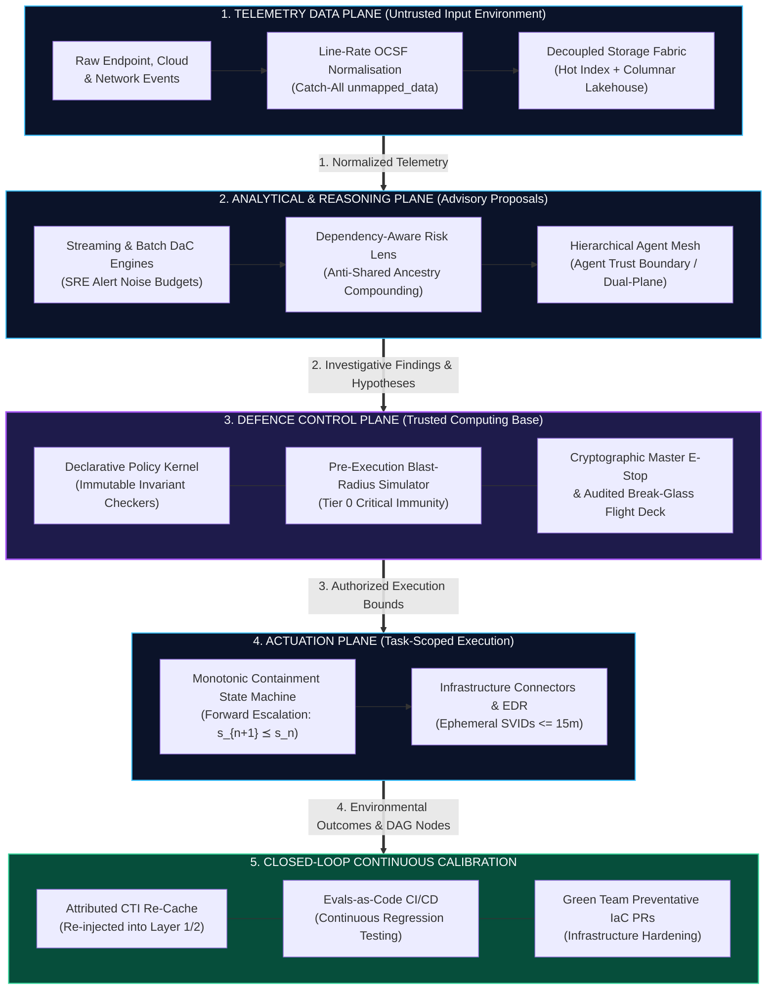
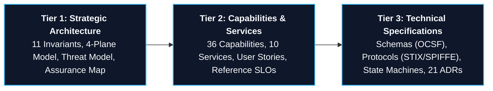

## 1. The Architecture at a Glance

TIDIR governs the operational progression from raw environmental observation to automated mitigation within a strict closed loop:

*The closed loop is completed as operational outcomes and incident graph nodes from Actuation (4) enter Continuous Calibration (5), which continuously re-keys threat caches, tunes detection noise budgets, and issues automated hardening pull requests back into the Telemetry Data Plane (1).*

---

## 2. Why TIDIR Exists: The Asymmetric Deficit in SecOps

Modern security operations struggle with three basic problems:

1. **The Ingestion Dilemma (We discard what we might need tomorrow)**: Traditional security monitoring tools charge by data volume. To manage costs, engineering teams discard high-volume logs at the network edge. Months later, when a new vulnerability is discovered, the historical records needed to investigate are gone.
2. **Low Base Rates & Alert Amplification (High accuracy still produces alert fatigue)**: In an enterprise generating a billion events each day, an analytical rule with 99.9% accuracy still creates thousands of false alarms because malicious events are exceedingly rare. Correlated alerts amplify this volume, causing analyst overload and degraded triage quality.
3. **The Unchecked Automation Hazard (Automated fixes can break production or reopen doors)**: Traditional response scripts either crash mid-execution or attempt database-style rollbacks that accidentally restore network access for an active attacker. Meanwhile, connecting generative AI directly to operational tools allows prompt injection attacks to trigger unauthorized actions.

**TIDIR addresses these problems by separating the architecture into four distinct planes**—isolating untrusted data and advisory AI models within an open analytical environment, while protecting critical systems behind a lean, deterministic defence control plane.

---

## 3. The Core Architectural Thesis

TIDIR is built on seven core ideas. Each idea pairs an intuitive rule with a technical safety mechanism:

| Principle | Plain-English Intuition | Technical Mechanism & Why It Matters |
| :--- | :--- | :--- |
| **Confidence $\neq$ Authority** | Being confident an attack is happening does not grant permission to disrupt critical servers. | **[Confidence–Authority Separation](/architecture/glossary#confidence-authority-separation)**: Epistemic scores confer zero execution privilege. All actions require independent policy approval. |
| **Evidence Lineage** | Every conclusion must show its work. | **Evidence Provenance (`INV-02`)**: Hypotheses and alerts must link directly to immutable raw observation IDs (`source_observation_ids`). |
| **Evidential Independence** | Don't count the same observation twice just because multiple tools alerted on it. | **[Evidential Independence](/architecture/glossary#evidential-independence)**: Traces alert ancestry back to parent events so duplicate signals do not artificially inflate confidence. |
| **Protected AI Boundary** | AI models analyze and suggest; they never hold direct execution keys. | **[Agent Trust Boundary](/architecture/glossary#agent-trust-boundary)**: Operates AI in read-only sandboxes with short-lived credentials ($\le 15\text{m}$); assumes untrusted evidence can influence reasoning, making that influence irrelevant to execution authority. |
| **Monotonic Safety** | If an automated response fails halfway through, never back out of security barriers. | **[Security-State Monotonicity](/architecture/glossary#security-state-monotonicity)**: Invariant $R(s_{\text{post}}) \subseteq R(s_{\text{pre}})$. Partial failures freeze in place or escalate forward; they never roll back. |
| **Graceful Degradation** | If advanced services go down, fallback to simpler methods rather than going blind. | **[Graceful Degradation](/architecture/glossary#graceful-degradation)**: Automatically steps down through 4 operational tiers to edge spooling and rule-based timelines if streaming or AI fails. |
| **Human Command** | Independent human override. | **Human Recoverability (`INV-09`)**: Independent out-of-band flight decks with cryptographically authenticated emergency stops and dual-authorisation bypass. |

---

## 4. What TIDIR Is (and Is NOT) Claiming

To maintain engineering clarity, TIDIR explicitly distinguishes between established industry patterns and its own architectural contributions:

::: tip WHAT TIDIR DOES NOT CLAIM TO HAVE INVENTED
TIDIR does **not** claim to have invented data lakes, columnar storage, distributed message buses, graph analytics, probabilistic inference, cryptographic workload identities (SPIFFE), Detection-as-Code (DaC), circuit breakers, or the principle of least privilege.
:::

**TIDIR's contribution is the specific architectural synthesis and governing safety invariants under which these established techniques interact.** 

By wrapping untrusted telemetry and probabilistic AI agents within deterministic policy gates and monotonic state machines, TIDIR enables modern security operations to automate investigations and containment safely—while reducing the risk of runaway automation, self-granting authority, and loss of defensive visibility.

For detailed definitions of established, adapted, and TIDIR-specific concepts, explore the **[Architectural Glossary & Concept Taxonomy](/architecture/glossary)**.

---

## 5. The 3-Tier Architectural Model

To serve executive leaders, enterprise architects, and engineering practitioners simultaneously, TIDIR organizes its specifications across three increasing levels of technical specificity:

* **[Tier 1: Strategic Architecture](/architecture/00-architectural-invariants)**: System topology, the 11 constitutional invariants, and the formal threat model. Target audience: CISOs, Heads of SecOps, Lead Enterprise Architects.
* **[Tier 2: Capabilities & Taxonomy](/architecture/02-capability-model)**: Functional capability taxonomy, enterprise service catalogue, and operational user stories. Target audience: Security Managers, Detection Leads, SecOps SREs.
* **[Tier 3: Technical Specifications](/architecture/components/01-threat-intelligence)**: Concrete data schemas (OCSF), workload identity contracts (SPIFFE), monotonic state machines, and the [ADR Registry](/adr/). Target audience: Detection Engineers, Automation Engineers, SecOps Architects.

---

## 6. Open Security Frameworks Alignment

TIDIR synthesizes defensive strategy, analytic taxonomy, API safety, and operational controls into a unified multi-framework alignment:

* **Adversary Tactics & Attack Patterns**: [MITRE ATT&CK](https://attack.mitre.org/) (Enterprise TTPs), [MITRE ATLAS](https://atlas.mitre.org/) (AI/ML Threats), [MITRE CAPEC](https://capec.mitre.org/) (Attack Patterns).
* **Defensive Countermeasures & Analytics**: [MITRE D3FEND](https://d3fend.mitre.org/) (Defensive Techniques), [D3FEND ACF](https://d3fend.mitre.org/) (Analytic Characterization Framework), [MITRE CAR](https://car.mitre.org/) (Cyber Analytics Repository).
* **Active Defense & Deception Operations**: [MITRE ENGAGE](https://engage.mitre.org/) (Expose, Affect, Elicit, Understand).
* **AI & API Tool Safety**: [OWASP Top 10 for LLMs](https://owasp.org/www-project-top-10-for-large-language-model-applications/) (Prompt Injection & Agency), [OWASP API Security Top 10](https://owasp.org/API-Security/) (BOLA, Broken Auth, Tool Boundaries).
* **Enterprise Assurance & Data Schemas**: [CIS Controls v8](https://www.cisecurity.org/controls/v8) (Controls 5, 6, 8, 13, 17), [OCSF](https://ocsf.io/) (Open Cybersecurity Schema Framework), [STIX 2.1 / TAXII](https://oasis-open.github.io/cti-documentation/).

---

## 7. Explore by Role & Architectural Intent

Select an entry point tailored to your focus:

<h3 style="margin-top: 0; color: #38bdf8;">👔 Security Leaders (CISO / SecOps Heads)</h3>

Understand the strategic business defensibility, operational cost reduction, and executive risk governance of TIDIR.

<ul style="padding-left: 1.25rem; font-size: 0.9rem;">
  <li><a href="/guide/what-is-tidir">What is TIDIR? (Executive Summary)</a></li>
  <li><a href="/architecture/10-macro-capabilities-and-services">Enterprise Service Delivery Model</a></li>
  <li><a href="/architecture/00-architectural-invariants">The Architectural Constitution</a></li>
</ul>

<h3 style="margin-top: 0; color: #a855f7;">📐 Enterprise Security Architects</h3>

Examine the 4-plane control model, trusted computing base boundaries, and vendor-neutral open standards.

<ul style="padding-left: 1.25rem; font-size: 0.9rem;">
  <li><a href="/architecture/01-system-overview">System Overview & 4-Plane Model</a></li>
  <li><a href="/architecture/assurance-map">The Assurance Case Map</a></li>
  <li><a href="/architecture/09-threat-model">Target Architecture Threat Model</a></li>
</ul>

<h3 style="margin-top: 0; color: #34d399;">⚡ Detection & SecOps Engineers</h3>

Dive into Polyglot Detection-as-Code, SRE noise budgeting, OCSF schema normalisation, and incident playbooks.

<ul style="padding-left: 1.25rem; font-size: 0.9rem;">
  <li><a href="/architecture/02-capability-model">Capability Taxonomy</a></li>
  <li><a href="/architecture/components/03-detection-engine">Detection Engine Architecture</a></li>
  <li><a href="/adr/0019-polyglot-detection-as-code-and-native-engine-adaptation">ADR-0019: Polyglot Detection-as-Code</a></li>
</ul>

<h3 style="margin-top: 0; color: #f59e0b;">🤖 AI & Automation Researchers</h3>

Interrogate the Agent Trust Boundary, ephemeral SPIFFE SVIDs, SLM judges, and continuous Evals-as-Code.

<ul style="padding-left: 1.25rem; font-size: 0.9rem;">
  <li><a href="/architecture/components/06-ai-orchestration">AI & Agent Orchestration Plane</a></li>
  <li><a href="/adr/0004-defensive-ai-runtime-and-prompt-injection-firewall">ADR-0004: Agent Trust Boundary</a></li>
  <li><a href="/adr/0015-sandboxed-agent-execution-otlp-convergence-and-ephemeral-identity">ADR-0015: Sandboxed Agent Execution</a></li>
</ul>

---

## 8. Open Source & Machine Access

TIDIR is published as an open-source reference standard under the **Apache 2.0 License**:

* 💻 **GitHub Repository**: [github.com/Haribu/TIDIR](https://github.com/Haribu/TIDIR)
* 📡 **Machine-Readable Graph**: [`/architecture.json`](/architecture.json)
* 🤖 **AI / LLM Ingestion Summary**: [`/llms.txt`](/llms.txt)
* 📚 **Complete Single-File Corpus**: [`/llms-full.txt`](/llms-full.txt)
* 🗺️ **Sitemap**: [`/sitemap.xml`](/sitemap.xml)

